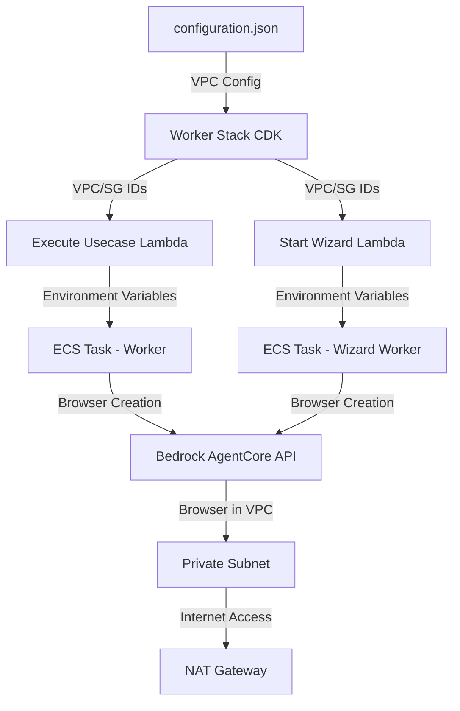

# Design Document

## Overview

This design implements VPC support for the Bedrock AgentCore browser tool, enabling browsers to run within a Virtual Private Cloud for enhanced security and network isolation. The implementation modifies the browser creation flow to pass VPC configuration (subnets and security groups) from the CDK infrastructure through Lambda functions to the Python worker code, which then creates browsers with VPC network mode.

The design leverages existing VPC infrastructure that is either provided via configuration.json or created during deployment in the worker stack. Browsers will be placed in private subnets with NAT Gateway access for internet connectivity, while maintaining the ability to access private resources within the VPC.

## Architecture

### High-Level Flow

```
Configuration.json → Worker Stack (CDK) → Execute Usecase Lambda → ECS Task (Worker) → Browser Creation
```

1. **Configuration Layer**: VPC ID and Security Group ID are optionally specified in configuration.json
2. **Infrastructure Layer**: Worker Stack creates or imports VPC and security groups
3. **Lambda Layer**: Execute Usecase Lambda passes VPC configuration as environment variables to ECS tasks
4. **Worker Layer**: Python worker reads VPC configuration and creates browsers with VPC network mode

### Component Interaction



## Components and Interfaces

### 1. Worker Stack (CDK) - `lib/worker-stack.ts`

**Responsibilities:**
- Create or import VPC infrastructure
- Create or import security groups for browser tool
- Pass VPC configuration to Lambda functions via environment variables
- Ensure Browser Execution Role has necessary permissions

**Key Changes:**
- Add new environment variables to `executeUsecaseLambda`:
  - `VPC_PRIVATE_SUBNET_IDS`: Comma-separated list of private subnet IDs
  - `BROWSER_SECURITY_GROUP_ID`: Security group ID for browser instances
- Add new environment variables to `startWizardLambda`:
  - `VPC_PRIVATE_SUBNET_IDS`: Comma-separated list of private subnet IDs
  - `BROWSER_SECURITY_GROUP_ID`: Security group ID for browser instances
- Ensure `agentCoreExecutionRole` has CloudWatch Logs permissions

**Interface:**
```typescript
// Environment variables passed to Lambda functions
{
  VPC_PRIVATE_SUBNET_IDS: string,        // e.g., "subnet-abc123,subnet-def456"
  BROWSER_SECURITY_GROUP_ID: string,     // e.g., "sg-xyz789"
  BEDROCK_EXECUTION_ROLE: string         // ARN of Browser Execution Role
}
```


### 2. Execute Usecase Lambda - `lambda/cmd/execute_usecase/main.go`

**Responsibilities:**
- Retrieve VPC configuration from environment variables
- Pass VPC configuration to ECS tasks as environment variables
- Handle missing VPC configuration gracefully

**Key Changes:**
- Read `VPC_PRIVATE_SUBNET_IDS` and `BROWSER_SECURITY_GROUP_ID` from environment
- Add new environment variables to ECS task overrides:
  - `VPC_PRIVATE_SUBNET_IDS`
  - `BROWSER_SECURITY_GROUP_ID`

**Interface:**
```go
// Environment variables passed to ECS tasks
Environment: []ecsTypes.KeyValuePair{
    {
        Name:  aws.String("VPC_PRIVATE_SUBNET_IDS"),
        Value: aws.String(os.Getenv("VPC_PRIVATE_SUBNET_IDS")),
    },
    {
        Name:  aws.String("BROWSER_SECURITY_GROUP_ID"),
        Value: aws.String(os.Getenv("BROWSER_SECURITY_GROUP_ID")),
    },
    // ... existing environment variables
}
```

### 3. Start Wizard Lambda - `lambda/cmd/start_wizard_session/main.go`

**Responsibilities:**
- Retrieve VPC configuration from environment variables
- Pass VPC configuration to wizard ECS tasks as environment variables

**Key Changes:**
- Same as Execute Usecase Lambda - add VPC environment variables to ECS task overrides

### 4. Browser Module - `worker/browser.py`

**Responsibilities:**
- Create browsers with VPC network configuration
- Handle both VPC and PUBLIC network modes
- Provide clear error messages for missing configuration

**Key Changes:**
- Modify `create_browser()` function to accept VPC configuration parameters
- Change `networkMode` from "PUBLIC" to "VPC" when VPC config is provided
- Add `networkModeConfig` with subnets and security groups

**Interface:**
```python
def create_browser(
    unique_id: str,
    execution_id: str,
    artefact_bucket: str,
    artefact_prefix: str,
    region: str,
    vpc_subnet_ids: list[str] = None,
    security_group_ids: list[str] = None
) -> str:
    """
    Create a browser instance with optional VPC configuration.
    
    Args:
        unique_id: Unique identifier for browser naming
        execution_id: Execution ID for tracking
        artefact_bucket: S3 bucket for recordings
        artefact_prefix: S3 prefix for recordings
        region: AWS region
        vpc_subnet_ids: List of VPC subnet IDs (optional)
        security_group_ids: List of security group IDs (optional)
    
    Returns:
        Browser ID
    """
```

**Network Configuration Logic:**
```python
# Determine network mode based on VPC configuration
if vpc_subnet_ids and security_group_ids:
    network_config = {
        "networkMode": "VPC",
        "networkModeConfig": {
            "subnets": vpc_subnet_ids,
            "securityGroups": security_group_ids
        }
    }
else:
    # Fallback to PUBLIC mode for backward compatibility
    network_config = {
        "networkMode": "PUBLIC"
    }
```


### 5. Worker Module - `worker/worker.py`

**Responsibilities:**
- Read VPC configuration from environment variables
- Parse comma-separated subnet and security group IDs
- Pass VPC configuration to browser creation

**Key Changes:**
- Read and parse `VPC_PRIVATE_SUBNET_IDS` environment variable
- Read `BROWSER_SECURITY_GROUP_ID` environment variable
- Pass parsed values to `create_browser()` function

**Implementation:**
```python
# Read VPC configuration from environment
vpc_subnet_ids_str = os.getenv('VPC_PRIVATE_SUBNET_IDS', '')
browser_sg_id = os.getenv('BROWSER_SECURITY_GROUP_ID', '')

# Parse subnet IDs (comma-separated)
vpc_subnet_ids = [s.strip() for s in vpc_subnet_ids_str.split(',') if s.strip()]
security_group_ids = [browser_sg_id] if browser_sg_id else []

# Create browser with VPC configuration
browser_id = create_browser(
    template_parser.get_all_variables()['UniqueID'],
    execution_id,
    s3_bucket_name,
    f"{usecase_id}/{execution_id}/recording/",
    execution.region,
    vpc_subnet_ids=vpc_subnet_ids if vpc_subnet_ids else None,
    security_group_ids=security_group_ids if security_group_ids else None
)
```

### 6. Wizard Worker Module - `worker/wizard_worker.py`

**Responsibilities:**
- Same as Worker Module but for wizard mode execution

**Key Changes:**
- Identical VPC configuration reading and parsing logic as worker.py
- Pass VPC configuration to browser creation in wizard mode

## Data Models

### VPC Configuration

```typescript
interface VPCConfiguration {
  vpcId: string | null;                    // VPC ID from configuration.json
  workerSecurityGroupId: string | null;    // Security group for ECS tasks
  createVpcEndpoints: boolean;             // Whether to create VPC endpoints
}
```

### Browser Network Configuration

```python
# VPC Mode
{
    "networkMode": "VPC",
    "networkModeConfig": {
        "subnets": ["subnet-abc123", "subnet-def456"],
        "securityGroups": ["sg-xyz789"]
    }
}

# PUBLIC Mode (fallback)
{
    "networkMode": "PUBLIC"
}
```

### Environment Variables

**Lambda Functions:**
```
VPC_PRIVATE_SUBNET_IDS=subnet-abc123,subnet-def456
BROWSER_SECURITY_GROUP_ID=sg-xyz789
BEDROCK_EXECUTION_ROLE=arn:aws:iam::123456789012:role/BrowserExecutionRole
```

**ECS Tasks (Worker):**
```
VPC_PRIVATE_SUBNET_IDS=subnet-abc123,subnet-def456
BROWSER_SECURITY_GROUP_ID=sg-xyz789
BEDROCK_EXECUTION_ROLE=arn:aws:iam::123456789012:role/BrowserExecutionRole
```


## Correctness Properties

*A property is a characteristic or behavior that should hold true across all valid executions of a system-essentially, a formal statement about what the system should do. Properties serve as the bridge between human-readable specifications and machine-verifiable correctness guarantees.*

### Property 1: VPC Configuration Propagation
*For any* browser creation request with VPC configuration, the browser SHALL be created with networkMode set to "VPC" and networkModeConfig containing the provided subnets and security groups.
**Validates: Requirements 1.1, 2.3**

### Property 2: Subnet Selection
*For any* VPC with multiple private subnets, the browser creation SHALL include at least 2 private subnet IDs in the networkModeConfig.
**Validates: Requirements 1.4, 8.4**

### Property 3: Security Group Assignment
*For any* browser instance created in VPC mode, the browser SHALL be assigned the security group specified in the configuration.
**Validates: Requirements 3.4, 3.5**

### Property 4: Execution Role Permissions
*For any* browser execution role, the role SHALL have permissions to write to all regional S3 artifact buckets.
**Validates: Requirements 4.1, 4.2, 4.3**

### Property 5: Environment Variable Propagation
*For any* ECS task execution, the VPC configuration environment variables passed to the Lambda SHALL be propagated to the ECS task container.
**Validates: Requirements 5.1, 5.2, 5.3**

### Property 6: Backward Compatibility
*For any* browser creation request without VPC configuration, the browser SHALL be created with networkMode set to "PUBLIC".
**Validates: Requirements 9.1, 9.4**

### Property 7: Error Handling
*For any* browser creation request with missing VPC subnets, the system SHALL log an error message and fail the browser creation.
**Validates: Requirements 7.1, 7.4**

### Property 8: Wizard Mode Consistency
*For any* wizard session, the VPC configuration SHALL be identical to regular execution mode for the same usecase.
**Validates: Requirements 6.1, 6.2**

## Error Handling

### Missing VPC Configuration

**Scenario:** VPC subnet IDs or security group ID are not provided in environment variables.

**Handling:**
1. Log warning message: "VPC configuration not found, falling back to PUBLIC network mode"
2. Create browser with `networkMode: "PUBLIC"`
3. Continue execution (backward compatible)

**Code:**
```python
if not vpc_subnet_ids or not security_group_ids:
    logger.warning("VPC configuration incomplete, using PUBLIC network mode")
    logger.warning(f"VPC Subnets: {vpc_subnet_ids}, Security Groups: {security_group_ids}")
    vpc_subnet_ids = None
    security_group_ids = None
```

### Invalid VPC Configuration

**Scenario:** VPC subnet IDs are invalid or security group doesn't exist.

**Handling:**
1. Bedrock AgentCore API will return error
2. Log error with full context: "Browser creation failed: {error_message}"
3. Include VPC configuration in error log for debugging
4. Update execution status to "failed"
5. Propagate error to user

**Code:**
```python
try:
    response = cp_client.create_browser(...)
except Exception as e:
    logger.error(f"Browser creation failed: {str(e)}")
    logger.error(f"VPC Config - Subnets: {vpc_subnet_ids}, SGs: {security_group_ids}")
    raise
```


### Missing Execution Role

**Scenario:** Browser Execution Role ARN is not provided or role doesn't exist.

**Handling:**
1. Log error: "BEDROCK_EXECUTION_ROLE environment variable not set"
2. Fail browser creation immediately
3. Update execution status to "failed"
4. Return clear error message to user

### VPC Subnet Not Found

**Scenario:** Specified subnet IDs don't exist in the VPC.

**Handling:**
1. Bedrock AgentCore API returns error
2. Log error with subnet IDs: "Invalid subnet IDs: {subnet_ids}"
3. Update execution status to "failed"
4. Suggest checking VPC configuration

### Security Group Not Found

**Scenario:** Specified security group ID doesn't exist.

**Handling:**
1. Bedrock AgentCore API returns error
2. Log error with security group ID: "Invalid security group: {sg_id}"
3. Update execution status to "failed"
4. Suggest checking security group configuration

## Testing Strategy

### Unit Tests

**Worker Stack Tests:**
- Test VPC creation with default configuration
- Test VPC import with existing VPC ID
- Test security group creation
- Test security group import
- Test environment variable configuration for Lambda functions
- Test Browser Execution Role permissions

**Browser Module Tests:**
- Test browser creation with VPC configuration
- Test browser creation without VPC configuration (PUBLIC mode)
- Test browser creation with partial VPC configuration
- Test error handling for invalid VPC configuration

**Worker Module Tests:**
- Test VPC configuration parsing from environment variables
- Test comma-separated subnet ID parsing
- Test browser creation with parsed VPC configuration
- Test fallback to PUBLIC mode when VPC config is missing

### Integration Tests

**End-to-End VPC Browser Creation:**
1. Deploy stack with VPC configuration
2. Create usecase execution
3. Verify browser is created in VPC mode
4. Verify browser can access internet through NAT Gateway
5. Verify browser recording is saved to S3

**Wizard Mode VPC Browser Creation:**
1. Start wizard session
2. Verify browser is created in VPC mode
3. Execute wizard steps
4. Verify browser functionality in VPC

**Backward Compatibility:**
1. Deploy stack without VPC configuration
2. Create usecase execution
3. Verify browser is created in PUBLIC mode
4. Verify execution completes successfully

### Manual Testing

**VPC Configuration Validation:**
- Verify private subnets are used (not public subnets)
- Verify security group allows HTTP/HTTPS outbound traffic
- Verify NAT Gateway provides internet access
- Verify browser can access private resources in VPC

**Error Scenarios:**
- Test with invalid subnet IDs
- Test with invalid security group ID
- Test with missing execution role
- Verify error messages are clear and actionable


## Security Considerations

### Network Isolation

- Browsers run in private subnets with no direct internet access
- All internet traffic routes through NAT Gateway
- Security groups control inbound/outbound traffic
- No inbound traffic allowed to browser instances

### IAM Permissions

- Browser Execution Role has minimal required permissions
- S3 permissions scoped to artifact buckets only
- CloudWatch Logs permissions for browser logging
- No permissions for other AWS services

### VPC Endpoints

- Optional VPC endpoints for AWS services (S3, ECR, CloudWatch Logs)
- Reduces data transfer costs
- Improves security by keeping traffic within AWS network
- Required if VPC has no internet access

### Security Group Rules

**Outbound Rules:**
- HTTPS (443) to 0.0.0.0/0 - Required for web browsing
- HTTP (80) to 0.0.0.0/0 - Required for web browsing

**Inbound Rules:**
- None - Browsers don't accept inbound connections

## Performance Considerations

### Subnet Selection

- Use multiple availability zones for high availability
- Distribute browser instances across subnets
- Prefer private subnets with NAT Gateway

### NAT Gateway

- NAT Gateway provides high bandwidth for internet access
- Multiple NAT Gateways for high availability
- Consider costs for data transfer through NAT Gateway

### VPC Endpoints

- Use VPC endpoints to reduce NAT Gateway data transfer
- S3 Gateway Endpoint for artifact uploads
- Interface endpoints for ECR and CloudWatch Logs

## Deployment Considerations

### New Deployments

- VPC is created automatically with default configuration
- Private subnets in 2 availability zones
- NAT Gateways for internet access
- Security group with HTTP/HTTPS outbound rules
- VPC endpoints for AWS services

### Existing Deployments

- Specify `vpcId` in configuration.json to use existing VPC
- Optionally specify `workerSecurityGroupId` for existing security group
- Set `createVpcEndpoints: true` if VPC endpoints are needed
- Ensure existing VPC has private subnets and NAT Gateway

### Migration Path

1. Deploy new version with VPC support
2. Existing executions continue to use PUBLIC mode (backward compatible)
3. New executions automatically use VPC mode
4. No manual intervention required

## Backward Compatibility

### Fallback to PUBLIC Mode

- If VPC configuration is not provided, browsers use PUBLIC network mode
- Existing deployments without VPC configuration continue to work
- No breaking changes to existing functionality

### Configuration Migration

- `vpcId` and `workerSecurityGroupId` are optional in configuration.json
- Default values ensure backward compatibility
- Gradual migration path for existing deployments
