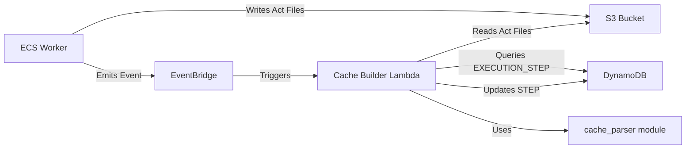

# Design Document: Cache Builder Lambda

## Overview

The Cache Builder Lambda is an event-driven AWS Lambda function that automatically builds step caches from Nova Act responses after successful test executions. When a test execution completes successfully and caching is enabled, this Lambda processes the Nova Act response files stored in S3, extracts cacheable actions (click, hover, scroll, type, navigate), and updates the corresponding STEP records in DynamoDB with the parsed cache data.

This system enables subsequent test executions to replay cached steps directly via Playwright API instead of calling Nova Act, reducing execution time by 40-60%. The Lambda follows a fire-and-forget pattern where failures are logged but do not raise exceptions, ensuring cache building never impacts test execution reliability.

### Key Design Principles

- **Event-Driven Architecture**: Triggered automatically by EventBridge events from the worker
- **Fire-and-Forget Pattern**: All errors are caught and logged; no exceptions propagate to Lambda runtime
- **Resilient Processing**: Individual step failures do not prevent processing of remaining steps
- **Efficient Batch Updates**: Uses DynamoDB batch_writer for optimal performance
- **Comprehensive Observability**: Detailed logging at all stages for monitoring and troubleshooting

## Architecture

### System Context



### Event Flow

1. **Worker Execution**: ECS worker executes test steps and stores Nova Act responses in S3
2. **Event Emission**: Worker emits `usecase.execution.completed` event to EventBridge
3. **Lambda Trigger**: EventBridge rule triggers Cache Builder Lambda
4. **Cache Eligibility Check**: Lambda verifies execution status and enable_cache flag
5. **S3 Discovery**: Lambda lists and maps act files in S3
6. **Step Retrieval**: Lambda queries EXECUTION_STEP records from DynamoDB
7. **Cache Building**: For each navigation step with act file:
   - Fetch Nova Act response from S3
   - Parse response using cache_parser module
   - Update original STEP record with cached_steps
8. **Completion**: Lambda logs summary statistics and returns success

### Integration Points

| Component | Integration Type | Purpose |
|-----------|-----------------|---------|
| EventBridge | Event Source | Receives execution completion events |
| S3 | Read | Fetches Nova Act response files |
| DynamoDB | Read/Write | Queries EXECUTION_STEP, updates STEP records |
| cache_parser | Module Import | Parses Nova Act responses |
| Worker | Event Producer | Emits completion events, writes S3 files |

## Components and Interfaces

### Lambda Handler

**Function Signature:**
```python
def lambda_handler(event: dict, context: Any) -> dict
```

**Input Event Structure:**
```json
{
  "source": "qa-studio.worker",
  "detail-type": "usecase.execution.completed",
  "detail": {
    "usecase_id": "string",
    "execution_id": "string",
    "execution_status": "success" | "failed",
    "timestamp": "2024-01-01T12:00:00.000Z"
  }
}
```

**Return Value:**
```python
{
    "statusCode": 200,
    "body": json.dumps({
        "message": "Cache building completed",
        "stats": {
            "steps_processed": int,
            "successful_updates": int,
            "failed_updates": int
        }
    })
}
```

### Core Functions

#### 1. `check_cache_eligibility(table, usecase_id: str) -> bool`

Verifies if caching is enabled for the usecase.

**Parameters:**
- `table`: DynamoDB table resource
- `usecase_id`: Usecase identifier

**Returns:**
- `True` if enable_cache is True, `False` otherwise

**DynamoDB Query:**
```python
response = table.get_item(
    Key={
        'pk': 'USECASES',
        'sk': f'USECASE#{usecase_id}'
    }
)
```

#### 2. `discover_act_files(s3_client, bucket: str, execution_id: str) -> dict[str, str]`

Lists S3 act files and builds act_id to s3_key mapping.

**Parameters:**
- `s3_client`: boto3 S3 client
- `bucket`: S3 bucket name
- `execution_id`: Execution identifier

**Returns:**
- Dictionary mapping `{act_id: s3_key}`

**S3 List Operation:**
```python
response = s3_client.list_objects_v2(
    Bucket=bucket,
    Prefix=f'executions/{execution_id}/act_'
)
```

**Key Parsing:**
```python
# Extract act_id from key: executions/{execution_id}/act_{act_id}.json
match = re.match(r'.*/act_(.+)\.json$', key)
act_id = match.group(1)
```

#### 3. `get_execution_steps(table, execution_id: str) -> list[dict]`

Queries EXECUTION_STEP records for the execution.

**Parameters:**
- `table`: DynamoDB table resource
- `execution_id`: Execution identifier

**Returns:**
- List of EXECUTION_STEP records

**DynamoDB Query:**
```python
response = table.query(
    KeyConditionExpression=Key('pk').eq(f'EXECUTION#{execution_id}') & 
                          Key('sk').begins_with('EXECUTION_STEP#')
)
```

#### 4. `filter_navigation_steps(steps: list[dict], act_mapping: dict[str, str]) -> list[dict]`

Filters steps to only navigation steps with matching act files.

**Parameters:**
- `steps`: List of EXECUTION_STEP records
- `act_mapping`: Dictionary mapping act_id to s3_key

**Returns:**
- Filtered list of navigation steps with act files

**Filter Logic:**
```python
filtered = [
    step for step in steps
    if step.get('step_type') == 'navigation'
    and step.get('act_id')
    and step.get('act_id') in act_mapping
]
```

#### 5. `fetch_and_parse_act_response(s3_client, bucket: str, s3_key: str) -> Optional[list[dict]]`

Fetches Nova Act response from S3 and parses it.

**Parameters:**
- `s3_client`: boto3 S3 client
- `bucket`: S3 bucket name
- `s3_key`: S3 object key

**Returns:**
- Parsed cached steps or None if parsing fails

**Implementation:**
```python
try:
    response = s3_client.get_object(Bucket=bucket, Key=s3_key)
    act_response = json.loads(response['Body'].read())
    cached_steps = parse_nova_act_steps(act_response)
    return cached_steps
except Exception as e:
    logger.error(f"Failed to fetch/parse act file {s3_key}: {e}")
    return None
```

#### 6. `update_step_caches(table, usecase_id: str, step_updates: list[dict], timestamp: str) -> tuple[int, int]`

Updates STEP records with cached steps using batch_writer.

**Parameters:**
- `table`: DynamoDB table resource
- `usecase_id`: Usecase identifier
- `step_updates`: List of dicts with step_id and cached_steps
- `timestamp`: Cache update timestamp

**Returns:**
- Tuple of (successful_updates, failed_updates)

**Batch Update:**
```python
with table.batch_writer() as batch:
    for update in step_updates:
        try:
            batch.put_item(Item={
                'pk': f'USECASE#{usecase_id}',
                'sk': f'STEP#{update["step_id"]}',
                'cached_steps': json.dumps(update['cached_steps']),
                'cache_last_updated': timestamp
            })
            successful += 1
        except Exception as e:
            logger.error(f"Failed to update step {update['step_id']}: {e}")
            failed += 1
```

## Data Models

### EventBridge Event Detail

| Field | Type | Required | Description |
|-------|------|----------|-------------|
| usecase_id | string | Yes | Usecase identifier |
| execution_id | string | Yes | Execution identifier |
| execution_status | string | Yes | "success" or "failed" |
| timestamp | string | Yes | ISO 8601 timestamp |

### USECASE Record

| Field | Type | Description |
|-------|------|-------------|
| pk | string | "USECASES" |
| sk | string | "USECASE#{usecase_id}" |
| enable_cache | boolean | Whether caching is enabled |
| ... | ... | Other usecase fields |

### EXECUTION_STEP Record

| Field | Type | Description |
|-------|------|-------------|
| pk | string | "EXECUTION#{execution_id}" |
| sk | string | "EXECUTION_STEP#{execution_step_id}" |
| step_id | string | Original STEP record identifier |
| step_type | string | "navigation", "assertion", etc. |
| act_id | string | Nova Act response identifier |
| ... | ... | Other execution step fields |

### STEP Record (Updated)

| Field | Type | Description |
|-------|------|-------------|
| pk | string | "USECASE#{usecase_id}" |
| sk | string | "STEP#{step_id}" |
| cached_steps | string | JSON-serialized list of cached actions |
| cache_last_updated | string | ISO 8601 timestamp of last cache update |
| ... | ... | Other step fields |

### Cached Steps Format

```json
[
  {
    "type": "click",
    "bbox": {"x1": 100, "y1": 200, "x2": 300, "y2": 400}
  },
  {
    "type": "type",
    "text": "example",
    "bbox": {"x1": 100, "y1": 200, "x2": 300, "y2": 400},
    "press_enter": false
  },
  {
    "type": "navigate",
    "url": "https://example.com"
  }
]
```

## Correctness Properties

*A property is a characteristic or behavior that should hold true across all valid executions of a system-essentially, a formal statement about what the system should do. Properties serve as the bridge between human-readable specifications and machine-verifiable correctness guarantees.*

### Property 1: Event Field Extraction

*For any* valid EventBridge event with detail fields, the Lambda should successfully extract usecase_id, execution_id, execution_status, and timestamp without errors.

**Validates: Requirements 1.3**

### Property 2: Fire-and-Forget Error Handling

*For any* error condition (S3, DynamoDB, parsing), the Lambda should never raise exceptions to the Lambda runtime and should always return a 200 status code.

**Validates: Requirements 1.5, 9.3, 9.4**

### Property 3: S3 Act File Mapping

*For any* set of S3 objects with keys matching `executions/{execution_id}/act_{act_id}.json`, the Lambda should correctly extract act_id and build a mapping dictionary where each act_id maps to its corresponding s3_key.

**Validates: Requirements 3.2, 3.3**

### Property 4: Navigation Step Filtering

*For any* list of EXECUTION_STEP records with mixed step_types, the Lambda should only process steps where step_type equals "navigation" and act_id exists in the act_mapping.

**Validates: Requirements 4.2, 4.4**

### Property 5: Parsing Error Resilience

*For any* Nova Act response that causes parse_nova_act_steps to raise an exception, the Lambda should catch the exception, log it, and continue processing remaining steps.

**Validates: Requirements 5.4**

### Property 6: S3 Fetch Error Resilience

*For any* S3 get_object call that raises an exception, the Lambda should catch the exception, log it, and continue processing remaining steps.

**Validates: Requirements 5.5**

### Property 7: Cache Serialization Round-Trip

*For any* parsed cached steps list, serializing to JSON and storing in cached_steps field should preserve the structure such that deserializing returns equivalent data.

**Validates: Requirements 6.2**

### Property 8: DynamoDB Update Error Resilience

*For any* DynamoDB batch_writer operation that fails for a specific step, the Lambda should log the error and continue processing remaining steps in the batch.

**Validates: Requirements 6.5**

### Property 9: STEP Record Identification

*For any* EXECUTION_STEP record with a step_id field, the Lambda should construct the STEP record key as pk: USECASE#{usecase_id}, sk: STEP#{step_id} (using step_id field, not the execution_step_id from sk).

**Validates: Requirements 7.2, 7.4**

### Property 10: Missing STEP Record Resilience

*For any* STEP record that no longer exists in DynamoDB, the Lambda should handle the update failure gracefully by logging and continuing to process remaining steps.

**Validates: Requirements 7.5**

### Property 11: Individual Step Failure Isolation

*For any* execution with multiple steps, if processing one step fails (S3, parsing, or DynamoDB error), the Lambda should continue processing all remaining steps.

**Validates: Requirements 9.2**

### Property 12: Update Statistics Tracking

*For any* batch of step updates, the Lambda should accurately track and log the count of successful updates and failed updates.

**Validates: Requirements 9.5**

## Error Handling

### Error Handling Strategy

The Cache Builder Lambda implements a comprehensive fire-and-forget error handling strategy:

1. **Top-Level Exception Handler**: Wraps entire lambda_handler to catch any unexpected errors
2. **Service-Level Handlers**: Try-except blocks around all AWS service calls (S3, DynamoDB)
3. **Step-Level Handlers**: Individual step processing wrapped in try-except to isolate failures
4. **Graceful Degradation**: Failures logged but processing continues for remaining steps

### Error Categories and Responses

| Error Category | Example | Response |
|----------------|---------|----------|
| Invalid Event | Missing detail fields | Log error, return 200 |
| Non-Success Execution | execution_status != "success" | Log skip reason, return 200 |
| Cache Disabled | enable_cache = False | Log skip reason, return 200 |
| Missing USECASE | Record not found | Log error, return 200 |
| Empty S3 Results | No act files found | Log warning, return 200 |
| S3 Access Error | Permission denied | Log error, skip step, continue |
| S3 Fetch Error | Object not found | Log error, skip step, continue |
| Parse Error | Invalid JSON | Log error, skip step, continue |
| Parse Returns None | No cacheable actions | Log warning, skip step, continue |
| DynamoDB Error | Throttling | Log error, skip step, continue |
| Missing step_id | Field not in record | Log error, skip step, continue |

### Logging Levels

| Level | Usage |
|-------|-------|
| INFO | Processing start/end, eligibility decisions, counts, summary |
| WARNING | Skipped steps, empty parse results, missing act files |
| ERROR | AWS service errors, missing required fields, parse exceptions |
| DEBUG | Detailed step processing, intermediate values |

## Testing Strategy

### Unit Testing Approach

The testing strategy follows a dual approach combining unit tests for specific scenarios and property-based tests for universal properties.

#### Unit Test Coverage

Unit tests focus on:
- **Specific Examples**: Successful cache building with valid inputs
- **Edge Cases**: Empty results, missing fields, disabled cache
- **Error Conditions**: S3 errors, DynamoDB errors, parsing failures
- **Integration Points**: Event structure, module imports, environment variables

**Target Coverage**: Minimum 70% code coverage

#### Property-Based Testing

Property tests verify universal properties across randomized inputs:
- **Minimum 100 iterations** per property test
- Each test tagged with: `Feature: cache-builder-lambda, Property {number}: {property_text}`
- Uses pytest with hypothesis library for Python

### Test Structure

```
web-app/lambdas/endpoints/
├── build_cache.py                    # Lambda handler
└── test_build_cache.py               # Unit tests
    ├── test_successful_cache_building()
    ├── test_skip_non_success_execution()
    ├── test_skip_cache_disabled()
    ├── test_missing_usecase_record()
    ├── test_empty_s3_act_files()
    ├── test_s3_fetch_error()
    ├── test_parsing_failure()
    ├── test_dynamodb_update_error()
    ├── test_missing_step_id()
    ├── test_batch_writer_usage()
    ├── test_event_field_extraction_property()
    ├── test_fire_and_forget_property()
    ├── test_s3_mapping_property()
    ├── test_navigation_filtering_property()
    ├── test_error_resilience_property()
    └── test_statistics_tracking_property()
```

### Mocking Strategy

**AWS Services**: Use `unittest.mock` to mock boto3 clients
- `boto3.client('s3')` → Mock S3 operations
- `boto3.resource('dynamodb')` → Mock DynamoDB operations

**External Modules**: Mock `cache_parser.parse_nova_act_steps`

**Environment Variables**: Mock `os.environ` for table name and bucket

### Test Data

**Valid Event:**
```python
{
    "source": "qa-studio.worker",
    "detail-type": "usecase.execution.completed",
    "detail": {
        "usecase_id": "uc_123",
        "execution_id": "exec_456",
        "execution_status": "success",
        "timestamp": "2024-01-01T12:00:00.000Z"
    }
}
```

**Mock S3 Act File:**
```python
{
    "steps": [
        {
            "response": {
                "rawProgramBody": 'agentClick("<box>100,200,300,400</box>");'
            }
        }
    ]
}
```

**Mock EXECUTION_STEP:**
```python
{
    "pk": "EXECUTION#exec_456",
    "sk": "EXECUTION_STEP#exec_step_1",
    "step_id": "step_1",
    "step_type": "navigation",
    "act_id": "act_789"
}
```

## CDK Infrastructure Configuration

### Lambda Function Definition

**Location**: `web-app/lib/worker-stack.ts`

**Configuration:**
```typescript
const buildCacheLambda = this.createPythonLambda({
  path: 'build_cache',
  timeout: Duration.seconds(60),
  memorySize: 512,
  environment: {
    DYNAMODB_TABLE_NAME: props.table.tableName,
    S3_BUCKET: this.artefactsBucket.bucketName
  }
});
```

### IAM Permissions

**S3 Read Access:**
```typescript
this.artefactsBucket.grantRead(buildCacheLambda);
```

**DynamoDB Read/Write Access:**
```typescript
buildCacheLambda.role?.addManagedPolicy(props.tableReadPolicy);
buildCacheLambda.role?.addManagedPolicy(props.tableWritePolicy);
```

### EventBridge Rule

**Rule Definition:**
```typescript
const cacheBuilderRule = new Rule(this, 'cache_builder_rule', {
  ruleName: this.cdkName('cache-builder'),
  description: 'Triggers cache builder after successful execution',
  eventBus: eventBus,
  eventPattern: {
    source: ['qa-studio.worker'],
    detailType: ['usecase.execution.completed']
  }
});

cacheBuilderRule.addTarget(new LambdaFunction(buildCacheLambda));
```

### Resource Configuration

| Resource | Configuration | Rationale |
|----------|--------------|-----------|
| Timeout | 60 seconds | Sufficient for batch processing multiple steps |
| Memory | 512 MB | Adequate for JSON parsing and batch operations |
| Runtime | Python 3.11 | Matches worker runtime |
| Log Retention | 5 days | Consistent with other worker lambdas |

## User Journey

This feature operates automatically without direct user interaction. The user journey is indirect:

1. **QA Engineer enables caching**: User updates usecase settings to set `enableCache: true`
2. **QA Engineer executes test**: User triggers test execution via UI or API
3. **System processes execution**: Worker executes steps and emits completion event
4. **Cache Builder activates**: Lambda automatically processes successful execution
5. **Cache is stored**: STEP records updated with cached_steps
6. **Subsequent executions benefit**: Next execution uses cached steps (40-60% faster)

**User Visibility**: Users see the benefit through faster execution times on subsequent runs. Cache status visible in step details showing `cache_last_updated` timestamp.

## Performance Considerations

### Batch Processing Efficiency

- **DynamoDB batch_writer**: Reduces API calls by batching updates
- **Single S3 list operation**: Builds complete act_id mapping upfront
- **Single DynamoDB query**: Retrieves all EXECUTION_STEP records at once

### Expected Performance

- **Typical execution**: 5-10 seconds for 10-20 steps
- **S3 operations**: ~100ms per act file fetch
- **DynamoDB operations**: ~50ms per batch write
- **Parsing**: ~10ms per Nova Act response

### Scalability

- **Concurrent executions**: Lambda can process multiple executions in parallel
- **Large usecases**: 60-second timeout supports up to ~100 steps
- **Memory usage**: 512 MB sufficient for typical JSON payloads

## Monitoring and Observability

### CloudWatch Metrics

- **Invocations**: Total Lambda invocations
- **Duration**: Execution time per invocation
- **Errors**: Lambda errors (should be 0 with fire-and-forget)
- **Throttles**: Concurrent execution limits

### Custom Log Metrics

Create CloudWatch metric filters for:
- Cache eligibility decisions (enabled/disabled)
- Steps processed count
- Successful vs failed updates
- Skipped steps count

### Alarms

Recommended CloudWatch alarms:
- **High error rate in logs**: ERROR log entries exceed threshold
- **Long duration**: Execution time exceeds 45 seconds
- **Low success rate**: Successful updates < 80% of steps processed

### Log Insights Queries

**Cache building summary:**
```
fields @timestamp, usecase_id, execution_id, steps_processed, successful_updates, failed_updates
| filter @message like /Cache building completed/
| sort @timestamp desc
```

**Error analysis:**
```
fields @timestamp, usecase_id, execution_id, @message
| filter @level = "ERROR"
| sort @timestamp desc
```

## Security Considerations

### IAM Least Privilege

- Lambda only has read access to S3 (no write/delete)
- Lambda has read/write to DynamoDB but scoped to specific table
- No cross-account access required

### Data Protection

- Nova Act responses may contain sensitive test data
- S3 bucket encryption at rest (default)
- DynamoDB encryption at rest (default)
- No sensitive data in CloudWatch logs

### Event Source Validation

- EventBridge rule scoped to specific source and detail-type
- Lambda validates event structure before processing
- No external event sources accepted

## Future Enhancements

### Potential Improvements

1. **Cache Invalidation**: Automatic cache invalidation when step instructions change
2. **Cache Analytics**: Track cache hit rates and performance improvements
3. **Selective Caching**: Cache only specific action types based on configuration
4. **Cache Versioning**: Support multiple cache versions for A/B testing
5. **Cross-Region Caching**: Replicate caches across regions for global usecases

### Extension Points

- **Custom Parsers**: Plugin architecture for different Nova Act response formats
- **Cache Strategies**: Configurable caching strategies (LRU, TTL-based)
- **Batch Optimization**: Adaptive batch sizing based on step count
