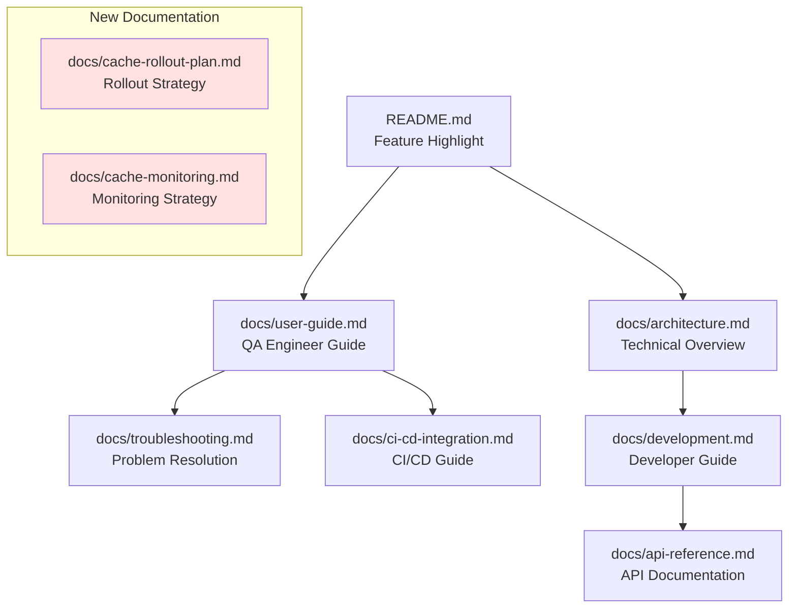
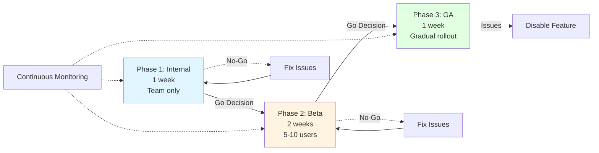
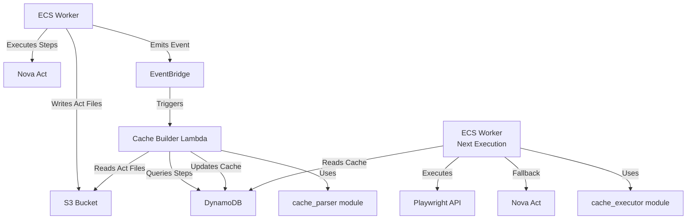
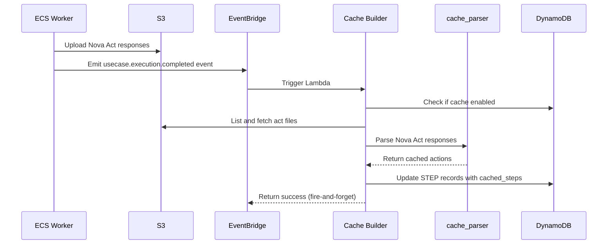
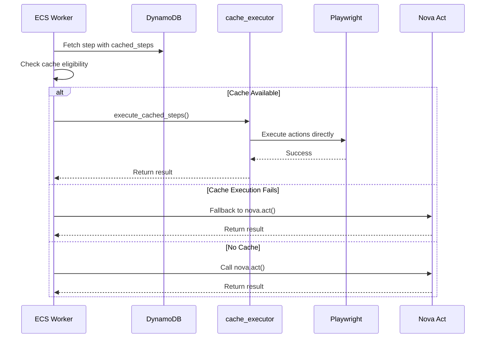

# Design Document: Cache Documentation and Rollout

## Overview

This design document outlines the comprehensive documentation strategy and rollout plan for the step cache feature in QA Studio. The step cache feature reduces test execution time by 40-60% by caching and replaying navigation steps using direct Playwright API calls instead of Nova Act for every execution. This package ensures the feature is properly documented for all personas (developers, QA engineers, business stakeholders) and includes a phased rollout strategy with monitoring and success metrics.

The documentation will be organized by persona to ensure each audience can quickly find relevant information. The rollout follows a three-phase approach (internal testing → beta testing → general availability) with clear success criteria and go/no-go decision points at each phase. Comprehensive monitoring ensures the feature's health and effectiveness can be tracked throughout the rollout and beyond.

### Key Design Principles

- **Persona-Driven Documentation**: Content organized by user role and needs
- **Progressive Disclosure**: High-level overview with links to detailed sections
- **Visual Communication**: Diagrams, screenshots, and code examples throughout
- **Phased Rollout**: Gradual release with validation gates
- **Data-Driven Decisions**: Clear metrics and success criteria for each phase
- **Risk Mitigation**: Rollback procedures and monitoring at every stage

## Architecture

### Documentation Structure




### Rollout Architecture



### Integration Points

| Component | Integration Type | Purpose |
|-----------|-----------------|---------|
| docs/ directory | File System | Documentation storage and organization |
| README.md | File System | Feature highlight and quick reference |
| CloudWatch | Monitoring | Metrics, logs, and dashboards |
| EventBridge | Event Source | Cache building trigger monitoring |
| DynamoDB | Data Store | Cache data and metadata |
| S3 | Artifact Store | Nova Act responses for cache building |

## Components and Interfaces

### Documentation Files

#### 1. docs/user-guide.md (Updated)

**Target Persona**: QA Engineer

**New Section**: "Step Caching"

**Content Structure**:
- What is step caching?
- Benefits and performance improvements
- How to enable caching (new usecases)
- How to enable caching (existing usecases)
- Understanding cacheable steps
- Cache building process
- Cache invalidation
- Visual indicators in UI
- Troubleshooting quick reference

**Screenshots Required**:
- Cache toggle in usecase creation form
- Cache toggle in usecase settings
- Cache indicator in step list
- Cache status in execution logs

#### 2. docs/api-reference.md (Updated)

**Target Persona**: Developer

**New Content**:
- POST /usecases endpoint: enableCache field
- PATCH /usecases/{id} endpoint: enableCache field
- GET /usecases/{id} response: enableCache field
- GET /usecases/{id}/steps response: cachedSteps, cacheLastUpdated fields
- Example request/response payloads
- Data types and default values

**API Field Documentation**:

| Field | Type | Default | Description |
|-------|------|---------|-------------|
| enableCache | boolean | false | Whether step caching is enabled for this usecase |
| cachedSteps | string (JSON) | null | JSON-serialized list of cached Playwright actions |
| cacheLastUpdated | string (ISO8601) | null | Timestamp when cache was last built |

#### 3. docs/architecture.md (Updated)

**Target Persona**: Developer, System Architect

**New Section**: "Step Cache Architecture"

**Content Structure**:
- Cache building flow (EventBridge → Lambda → DynamoDB)
- Cache execution flow (Worker → Playwright API)
- Sequence diagrams (cache building and execution)
- Module documentation (cache_parser, cache_executor)
- Lambda function documentation (build_step_cache)
- Fallback mechanism
- DynamoDB schema changes

#### 4. README.md (Updated)

**Target Persona**: All (First Impression)

**Update Location**: "Key Features" section

**Content**:
- Brief mention of step caching
- Performance improvement (40-60% faster)
- Opt-in per usecase
- Link to user guide

#### 5. docs/cache-rollout-plan.md (New)

**Target Persona**: Product Manager, DevOps Engineer

**Content Structure**:
- Executive summary
- Rollout phases (3 phases)
- Success criteria per phase
- Go/no-go decision criteria
- Rollback procedures
- Stakeholder responsibilities
- Communication plan
- Timeline with dates
- Risk assessment and mitigation

#### 6. docs/cache-monitoring.md (New)

**Target Persona**: DevOps Engineer, SRE

**Content Structure**:
- Monitoring strategy overview
- Key metrics and targets
- CloudWatch dashboard layout
- Alert thresholds and notifications
- Log queries for troubleshooting
- Weekly review process
- Performance metrics
- Cost savings tracking

#### 7. docs/troubleshooting.md (Updated)

**Target Persona**: QA Engineer, Developer

**New Section**: "Step Cache Troubleshooting"

**Content Structure**:
- Common symptoms and solutions
- Diagnostic procedures
- How to disable cache
- How to manually rebuild cache
- Escalation contacts

#### 8. docs/development.md (Updated)

**Target Persona**: Developer

**New Section**: "Step Cache Development"

**Content Structure**:
- cache_parser module API
- cache_executor module API
- Running cache tests
- Local testing procedures
- EventBridge event schema
- S3 file naming conventions
- Adding new cacheable action types
- Code organization

#### 9. docs/ci-cd-integration.md (Updated)

**Target Persona**: DevOps Engineer, QA Engineer

**New Section**: "Cache Behavior in CI/CD"

**Content Structure**:
- Asynchronous cache building
- First execution cache miss
- Recommendations for regression suites
- Parallel execution behavior
- Monitoring cache effectiveness
- Example CI/CD configurations

## Data Models

### Documentation Metadata

| Field | Type | Description |
|-------|------|-------------|
| file_path | string | Relative path from repo root |
| target_persona | string[] | Primary audience(s) |
| last_updated | string | ISO8601 timestamp |
| version | string | Documentation version |
| related_files | string[] | Links to related documentation |

### Rollout Phase

| Field | Type | Description |
|-------|------|-------------|
| phase_number | int | 1, 2, or 3 |
| phase_name | string | "Internal", "Beta", or "GA" |
| duration | string | Expected duration |
| audience | string | Target user group |
| success_criteria | object[] | List of criteria with targets |
| go_decision_date | string | Date for go/no-go decision |
| status | string | "not_started", "in_progress", "completed", "rolled_back" |

### Success Criteria

| Field | Type | Description |
|-------|------|-------------|
| metric_name | string | Name of the metric |
| target_value | number | Target threshold |
| operator | string | "greater_than", "less_than", "equals" |
| actual_value | number | Measured value |
| met | boolean | Whether criteria was met |

### Monitoring Metric

| Field | Type | Description |
|-------|------|-------------|
| metric_name | string | CloudWatch metric name |
| metric_type | string | "gauge", "counter", "histogram" |
| target_value | number | Target threshold |
| alert_threshold | number | Threshold for alerting |
| unit | string | Metric unit (%, ms, count) |
| measurement_frequency | string | "realtime", "hourly", "daily", "weekly" |

### EventBridge Event Schema (for documentation)

```json
{
  "source": "qa-studio.worker",
  "detail-type": "usecase.execution.completed",
  "detail": {
    "usecase_id": "string",
    "execution_id": "string",
    "execution_status": "success" | "failed",
    "timestamp": "ISO8601 string"
  }
}
```

### S3 File Naming Convention (for documentation)

```
executions/{execution_id}/act_{act_id}.json
```

## Correctness Properties

*A property is a characteristic or behavior that should hold true across all valid executions of a system-essentially, a formal statement about what the system should do. Properties serve as the bridge between human-readable specifications and machine-verifiable correctness guarantees.*

### Property Reflection

After reviewing all acceptance criteria in the prework analysis, I've determined that this feature is entirely about documentation creation and rollout planning. None of the requirements are amenable to automated property-based testing because:

1. **Documentation Quality**: We cannot automatically verify if documentation is clear, complete, or helpful
2. **Content Presence**: While we could check if files exist, we cannot verify if content meets quality standards
3. **Rollout Planning**: Planning documents are strategic artifacts that require human judgment
4. **Monitoring Strategy**: Strategy documents define processes that require human implementation

Therefore, this design document has **no testable correctness properties**. Validation will be done through:
- Manual documentation review
- User feedback during rollout phases
- Monitoring metric achievement
- Stakeholder approval at phase gates

## Error Handling

### Documentation Maintenance Errors

| Error Type | Prevention Strategy | Recovery Strategy |
|------------|-------------------|-------------------|
| Outdated documentation | Version tracking, review process | Update documentation, notify users |
| Broken links | Automated link checking | Fix links, add redirects |
| Missing screenshots | Screenshot checklist | Capture and add screenshots |
| Incorrect examples | Code review, testing | Correct examples, add validation |
| Inconsistent terminology | Style guide, glossary | Standardize terminology |

### Rollout Phase Errors

| Error Type | Detection Method | Response |
|------------|-----------------|----------|
| Success criteria not met | Metric monitoring | No-go decision, fix issues |
| Critical bugs discovered | User reports, monitoring | Rollback, fix, re-test |
| Performance degradation | CloudWatch alarms | Investigate, rollback if severe |
| User confusion | Support tickets, feedback | Update documentation, provide training |
| Monitoring gaps | Metric review | Add missing metrics, adjust thresholds |

### Rollback Procedures

**Phase 1 Rollback**:
1. Document issues discovered
2. Disable cache feature flag (if implemented)
3. Fix identified issues
4. Re-test internally
5. Restart Phase 1

**Phase 2 Rollback**:
1. Notify beta users
2. Disable cache for beta users
3. Analyze failure root cause
4. Fix issues and update documentation
5. Re-test internally
6. Restart Phase 2 with same or different beta users

**Phase 3 Rollback**:
1. Halt gradual rollout
2. Disable cache for all users via feature flag
3. Send communication to affected users
4. Analyze issues and fix
5. Update documentation
6. Plan re-rollout strategy

## Testing Strategy

### Documentation Testing

Since this feature is about documentation and planning (not code), testing focuses on validation rather than automated tests:

**Documentation Review Checklist**:
- [ ] All required sections present
- [ ] Screenshots captured and embedded
- [ ] Code examples tested and working
- [ ] Links verified and functional
- [ ] Terminology consistent across documents
- [ ] Persona-appropriate language and detail level
- [ ] Examples cover common use cases
- [ ] Troubleshooting covers known issues

**Peer Review Process**:
1. Developer writes documentation
2. Technical writer reviews for clarity
3. QA engineer validates examples
4. Product manager reviews completeness
5. Stakeholders approve before rollout

**User Testing**:
- Internal team members test documentation during Phase 1
- Beta users provide feedback during Phase 2
- Collect feedback via surveys and support tickets

### Rollout Testing

**Phase 1 Testing** (Internal):
- All team members enable cache on test usecases
- Execute tests and verify cache building
- Verify cache execution and speedup
- Test fallback mechanism
- Review monitoring dashboards
- Document any issues or confusion

**Phase 2 Testing** (Beta):
- Selected users enable cache on real usecases
- Monitor cache hit rates and failure rates
- Collect user feedback via surveys
- Review support tickets for cache-related issues
- Validate monitoring and alerting
- Measure performance improvements

**Phase 3 Testing** (GA):
- Gradual rollout with monitoring at each stage
- Automated alerts for anomalies
- Daily metric reviews during rollout
- User feedback collection
- Performance tracking

### Monitoring Validation

**Pre-Rollout**:
- Verify all CloudWatch dashboards created
- Test all alert thresholds
- Validate log queries return expected results
- Confirm notification channels working

**During Rollout**:
- Monitor metrics in real-time
- Respond to alerts within SLA
- Daily metric review meetings
- Weekly rollout status reports

**Post-Rollout**:
- Weekly metric reviews
- Monthly performance reports
- Quarterly documentation updates
- Continuous improvement based on feedback


## User Journey

This feature has multiple user journeys depending on the persona and phase of interaction.

### QA Engineer Journey: Learning About Cache

1. **Discovery**: QA Engineer hears about new cache feature from announcement
2. **Learning**: Reads README.md feature highlight, clicks link to user guide
3. **Understanding**: Reads "Step Caching" section in user guide
   - Learns what caching is and benefits (40-60% speedup)
   - Views screenshots of cache toggle UI
   - Understands which steps are cacheable (navigation only)
4. **Decision**: Decides to try cache on a test usecase

### QA Engineer Journey: Enabling Cache

1. **New Usecase Path**:
   - Creates new usecase via UI
   - Sees "Enable Step Caching" toggle in creation form
   - Enables toggle based on documentation
   - Saves usecase with cache enabled

2. **Existing Usecase Path**:
   - Opens existing usecase in UI
   - Navigates to usecase settings
   - Finds "Enable Step Caching" toggle
   - Enables toggle
   - Saves changes

### QA Engineer Journey: First Execution (Cache Miss)

1. **Execution**: Triggers test execution
2. **Observation**: Watches execution in real-time or reviews results
3. **Understanding**: Sees normal execution time (no cache yet)
4. **Learning**: Reads logs showing "Cache miss: no cached steps available"
5. **Waiting**: Cache builds asynchronously after successful execution

### QA Engineer Journey: Second Execution (Cache Hit)

1. **Execution**: Triggers test execution again
2. **Observation**: Notices significantly faster execution (40-60% speedup)
3. **Validation**: Reviews execution logs
   - Sees "Cache hit for step X (executed in Yms)" messages
   - Sees cache indicators in step list UI
4. **Satisfaction**: Confirms cache is working as documented

### QA Engineer Journey: Troubleshooting

1. **Problem**: Cache not building or execution failing
2. **Documentation**: Opens docs/troubleshooting.md
3. **Diagnosis**: Follows diagnostic steps for symptom
4. **Resolution**: Applies resolution steps
5. **Escalation**: If unresolved, contacts support using provided contact info

### Developer Journey: Understanding Architecture

1. **Context**: Developer needs to understand or modify cache system
2. **Architecture**: Reads docs/architecture.md "Step Cache Architecture" section
   - Reviews cache building flow diagram
   - Reviews cache execution flow diagram
   - Understands module responsibilities
3. **Deep Dive**: Reads docs/development.md for implementation details
   - Studies cache_parser module API
   - Studies cache_executor module API
   - Reviews code organization
4. **Testing**: Runs cache tests locally following documentation
5. **Extension**: Adds new cacheable action type following guide

### Developer Journey: API Integration

1. **Requirement**: Developer needs to integrate cache feature via API
2. **API Reference**: Opens docs/api-reference.md
3. **Learning**: Reads cache field documentation
   - enableCache field in POST/PATCH/GET endpoints
   - cachedSteps and cacheLastUpdated in responses
4. **Implementation**: Uses example payloads to implement integration
5. **Testing**: Tests API integration with cache enabled/disabled

### DevOps Engineer Journey: CI/CD Integration

1. **Requirement**: DevOps engineer wants to use cache in CI/CD pipeline
2. **Documentation**: Reads docs/ci-cd-integration.md cache section
3. **Understanding**: Learns about:
   - Asynchronous cache building
   - First execution cache miss behavior
   - Recommendations for regression suites
4. **Implementation**: Adds cache configuration to CI/CD pipeline
5. **Monitoring**: Sets up cache effectiveness monitoring

### DevOps Engineer Journey: Monitoring Setup

1. **Requirement**: DevOps engineer needs to monitor cache feature
2. **Documentation**: Reads docs/cache-monitoring.md
3. **Dashboard Setup**: Creates CloudWatch dashboard with specified metrics
4. **Alert Configuration**: Sets up alerts with documented thresholds
5. **Log Queries**: Saves log queries for troubleshooting
6. **Process**: Establishes weekly review process

### Product Manager Journey: Rollout Planning

1. **Planning**: Product manager needs to plan cache feature rollout
2. **Documentation**: Reads docs/cache-rollout-plan.md
3. **Phase Planning**: Reviews 3-phase rollout strategy
4. **Stakeholders**: Identifies stakeholders and assigns responsibilities
5. **Timeline**: Sets specific dates for each phase
6. **Communication**: Prepares communication plan for each phase
7. **Execution**: Monitors rollout progress and makes go/no-go decisions

### Product Manager Journey: Phase Gate Decision

1. **Phase Completion**: Phase 1 or 2 completes
2. **Metric Review**: Reviews success criteria metrics
3. **Feedback Analysis**: Analyzes user feedback and support tickets
4. **Risk Assessment**: Reviews any issues or concerns
5. **Decision**: Makes go/no-go decision for next phase
6. **Communication**: Communicates decision to stakeholders
7. **Action**: Either proceeds to next phase or initiates rollback

### Business Stakeholder Journey: Understanding Value

1. **Interest**: Business stakeholder hears about cache feature
2. **Overview**: Reads README.md feature highlight
3. **Value Proposition**: Understands 40-60% execution time reduction
4. **Cost Impact**: Reviews cost savings from reduced Nova Act calls
5. **Adoption**: Tracks user adoption metrics
6. **ROI**: Reviews performance and cost metrics in reports

## Rollout Plan Details

### Phase 1: Internal Testing (Week 1)

**Audience**: QA Studio team members (5-10 people)

**Objectives**:
- Validate cache functionality in real-world scenarios
- Test documentation completeness and clarity
- Identify critical bugs before external release
- Establish baseline metrics

**Activities**:
1. **Day 1**: Kickoff meeting, distribute documentation
2. **Days 2-3**: Team members enable cache on test usecases
3. **Days 4-5**: Execute tests, collect feedback
4. **Day 6**: Review metrics, analyze feedback
5. **Day 7**: Go/no-go decision meeting

**Success Criteria**:
- Zero critical bugs discovered
- Cache hit rate >70% for navigation steps
- Cache execution failure rate <5%
- Average speedup >5x for cached steps
- All team members successfully enabled and used cache
- Documentation rated "clear" by >80% of team

**Go Decision Criteria**:
- All success criteria met
- No critical bugs outstanding
- Documentation approved by team
- Monitoring dashboards operational

**No-Go Actions**:
- Document all issues
- Fix critical bugs
- Update documentation based on feedback
- Re-test internally
- Reschedule Phase 1

### Phase 2: Beta Testing (Weeks 2-3)

**Audience**: Selected power users (5-10 external users)

**Selection Criteria**:
- Active QA Studio users
- Diverse use case types
- Willing to provide feedback
- Technical proficiency

**Objectives**:
- Validate cache with diverse real-world usecases
- Collect user feedback on documentation
- Monitor performance at scale
- Identify edge cases and issues

**Activities**:
1. **Week 2, Day 1**: Invite beta users, share documentation
2. **Week 2, Days 2-7**: Beta users enable cache, execute tests
3. **Week 3, Days 1-5**: Continue testing, collect feedback
4. **Week 3, Day 6**: Analyze metrics and feedback
5. **Week 3, Day 7**: Go/no-go decision meeting

**Success Criteria**:
- Cache hit rate >70% across all beta users
- Cache execution failure rate <5%
- Average speedup >5x
- User satisfaction score >4/5
- <10 support tickets related to cache
- No critical bugs reported
- Documentation rated "helpful" by >70% of beta users

**Go Decision Criteria**:
- All success criteria met
- No critical bugs outstanding
- Positive user feedback
- Monitoring shows stable performance
- Support team ready for GA

**No-Go Actions**:
- Disable cache for beta users
- Analyze root cause of failures
- Fix issues and update documentation
- Re-test internally
- Restart Phase 2 (possibly with different users)

### Phase 3: General Availability (Week 4)

**Audience**: All QA Studio users

**Rollout Strategy**: Gradual rollout with monitoring

**Rollout Schedule**:
- **Days 1-2**: 10% of users (feature flag)
- **Days 3-4**: 50% of users
- **Days 5-7**: 100% of users

**Objectives**:
- Safely release cache feature to all users
- Monitor performance at full scale
- Respond quickly to any issues
- Achieve target adoption rate

**Activities**:
1. **Day 1**: Enable for 10% of users, monitor closely
2. **Day 2**: Review metrics, check for issues
3. **Day 3**: Increase to 50% if metrics healthy
4. **Day 4**: Review metrics, check for issues
5. **Day 5**: Increase to 100% if metrics healthy
6. **Days 6-7**: Monitor full rollout, respond to issues

**Success Criteria** (30 days post-GA):
- Cache hit rate >70% across all users
- Cache execution failure rate <5%
- Average speedup >5x
- User adoption >50% (% of usecases with cache enabled)
- User satisfaction score >4/5
- Support ticket volume <5% increase

**Monitoring During Rollout**:
- Real-time CloudWatch dashboard monitoring
- Automated alerts for threshold breaches
- Daily metric review meetings
- Immediate response to critical issues

**Rollback Triggers**:
- Cache execution failure rate >10%
- Critical bugs affecting test reliability
- Widespread user complaints
- Performance degradation
- Security issues

**Rollback Procedure**:
1. Halt gradual rollout immediately
2. Disable cache via feature flag for all users
3. Send communication to affected users
4. Analyze root cause
5. Fix issues
6. Update documentation
7. Plan re-rollout strategy

## Monitoring Strategy Details

### Key Metrics

#### 1. Cache Hit Rate

**Definition**: Percentage of navigation steps executed using cache vs Nova Act

**Target**: >70%

**Calculation**: `(cache_hits / total_navigation_steps) * 100`

**CloudWatch Metric**: Custom metric from worker logs

**Alert Threshold**: <60% for 1 hour

**Measurement Frequency**: Real-time, reviewed daily

#### 2. Cache Execution Failure Rate

**Definition**: Percentage of cache executions that fail and fall back to Nova Act

**Target**: <5%

**Calculation**: `(cache_failures / cache_attempts) * 100`

**CloudWatch Metric**: Custom metric from worker logs

**Alert Threshold**: >8% for 30 minutes

**Measurement Frequency**: Real-time, reviewed daily

#### 3. Average Speedup Ratio

**Definition**: Average execution time reduction when using cache

**Target**: >5x (cache execution <20% of Nova Act time)

**Calculation**: `avg(nova_act_time / cache_time)`

**CloudWatch Metric**: Custom metric from execution logs

**Alert Threshold**: <4x for 1 hour

**Measurement Frequency**: Hourly, reviewed daily

#### 4. Cache Building Latency

**Definition**: Time from execution completion to cache stored in DynamoDB

**Target**: <30 seconds

**Calculation**: `cache_stored_time - execution_completed_time`

**CloudWatch Metric**: Lambda duration + EventBridge delay

**Alert Threshold**: >45 seconds for 30 minutes

**Measurement Frequency**: Real-time, reviewed daily

#### 5. User Adoption Rate

**Definition**: Percentage of usecases with cache enabled

**Target**: >50% within 30 days of GA

**Calculation**: `(usecases_with_cache_enabled / total_usecases) * 100`

**CloudWatch Metric**: Custom metric from DynamoDB scan (weekly)

**Alert Threshold**: <30% at 30 days post-GA

**Measurement Frequency**: Weekly

#### 6. Cache Utilization Rate

**Definition**: Percentage of executions that use cache (vs total executions)

**Target**: >40% within 30 days of GA

**Calculation**: `(executions_with_cache / total_executions) * 100`

**CloudWatch Metric**: Custom metric from execution logs

**Alert Threshold**: <25% at 30 days post-GA

**Measurement Frequency**: Daily

#### 7. Cost Savings

**Definition**: Reduction in Nova Act API calls due to cache

**Target**: 40-60% reduction in Nova Act calls

**Calculation**: `baseline_nova_calls - current_nova_calls`

**CloudWatch Metric**: Custom metric from execution logs

**Alert Threshold**: <30% reduction at 30 days post-GA

**Measurement Frequency**: Weekly

#### 8. User Satisfaction

**Definition**: User rating of cache feature

**Target**: >4/5 average rating

**Measurement**: In-app survey or feedback form

**Alert Threshold**: <3.5/5 average

**Measurement Frequency**: Continuous collection, reviewed weekly

### CloudWatch Dashboard Layout

**Dashboard Name**: "QA Studio - Step Cache Performance"

**Sections**:

1. **Overview** (Top Row)
   - Cache hit rate (gauge)
   - Cache failure rate (gauge)
   - Average speedup (gauge)
   - User adoption rate (gauge)

2. **Performance** (Second Row)
   - Cache execution time (line graph, 24h)
   - Nova Act execution time (line graph, 24h)
   - Cache building latency (line graph, 24h)

3. **Volume** (Third Row)
   - Cache hits vs misses (stacked area, 24h)
   - Cache failures (line graph, 24h)
   - Total executions (line graph, 24h)

4. **Adoption** (Fourth Row)
   - Usecases with cache enabled (line graph, 7d)
   - Cache utilization rate (line graph, 7d)
   - Nova Act call reduction (line graph, 7d)

### Alert Configuration

| Alert Name | Metric | Threshold | Duration | Severity | Notification |
|------------|--------|-----------|----------|----------|--------------|
| Low Cache Hit Rate | Cache hit rate | <60% | 1 hour | Warning | Email |
| High Cache Failure Rate | Cache failure rate | >8% | 30 min | Critical | Email + Slack |
| Low Speedup | Average speedup | <4x | 1 hour | Warning | Email |
| High Cache Building Latency | Building latency | >45s | 30 min | Warning | Email |
| Low Adoption | Adoption rate | <30% | 1 day | Info | Email (weekly) |
| Lambda Errors | Lambda errors | >5 | 15 min | Critical | Email + Slack |

### Log Queries

#### Cache Hit Rate Query
```
fields @timestamp, usecase_id, step_sort, @message
| filter @message like /Cache hit/
| stats count() as cache_hits by bin(5m)
```

#### Cache Failure Query
```
fields @timestamp, usecase_id, step_sort, @message
| filter @message like /Cache execution failed/
| parse @message /Cache execution failed for step * : *, falling back/
| stats count() by error_type
```

#### Cache Performance Query
```
fields @timestamp, usecase_id, step_sort, duration_ms
| filter @message like /Cache hit/
| parse @message /executed in *ms/
| stats avg(duration_ms), p50(duration_ms), p95(duration_ms), p99(duration_ms)
```

#### Cache Building Query
```
fields @timestamp, usecase_id, execution_id, steps_processed, successful_updates
| filter @message like /Cache building completed/
| stats avg(successful_updates), sum(successful_updates) by bin(1h)
```

### Weekly Review Process

**Schedule**: Every Monday, 10:00 AM

**Attendees**: Product Manager, DevOps Engineer, QA Lead, Developer

**Agenda**:
1. Review previous week's metrics
2. Analyze trends (improving/degrading)
3. Review support tickets related to cache
4. Discuss user feedback
5. Identify action items
6. Update documentation if needed

**Metrics to Review**:
- Cache hit rate trend
- Cache failure rate trend
- Average speedup trend
- User adoption progress
- Cost savings achieved
- Support ticket volume

**Deliverable**: Weekly cache performance report (email to stakeholders)


## Documentation Content Specifications

### User Guide: Step Caching Section

**Location**: docs/user-guide.md (after "Writing Good Test Steps" section)

**Content Outline**:

```markdown
## Step Caching

Step caching is a performance optimization feature that reduces test execution time by 40-60%. When enabled, QA Studio caches the browser actions from successful test executions and replays them directly using Playwright API instead of calling Nova Act for every execution.

### How It Works

1. **First Execution**: Your test runs normally using Nova Act. After successful completion, the system automatically analyzes the Nova Act responses and builds a cache of the browser actions (clicks, typing, navigation, etc.).

2. **Subsequent Executions**: When you run the test again, cached navigation steps execute directly using Playwright, bypassing Nova Act entirely. This eliminates AI inference latency (typically 2-5 seconds per step).

3. **Automatic Fallback**: If a cached step fails (e.g., the page changed), the system automatically falls back to Nova Act, ensuring your tests remain reliable.

### Benefits

- **40-60% faster execution**: Cached steps execute in 200-400ms vs 2-5 seconds with Nova Act
- **Cost savings**: Reduced Nova Act API calls
- **Same reliability**: Automatic fallback ensures tests don't break
- **Zero maintenance**: Cache updates automatically when steps change

### Which Steps Are Cached?

Only **navigation steps** are cacheable. These include:
- Clicking buttons and links
- Typing text into fields
- Hovering over elements
- Scrolling
- Navigating to URLs

Other step types (validation, assertion, retrieve value) always execute normally since they need to read current page state.

### Enabling Cache for New Usecases

When creating a new usecase:

1. Fill in the usecase details (name, URL, description)
2. Look for the **"Enable Step Caching"** toggle
3. Enable the toggle
4. Complete usecase creation as normal

[Screenshot: Cache toggle in usecase creation form]

### Enabling Cache for Existing Usecases

To enable caching on an existing usecase:

1. Open the usecase in the UI
2. Click the **Settings** or **Edit** button
3. Find the **"Enable Step Caching"** toggle
4. Enable the toggle
5. Click **Save**

[Screenshot: Cache toggle in usecase settings]

The cache will build automatically after the next successful execution.

### Understanding Cache Status

In the step list, you'll see cache indicators:

- **Green cache icon**: Step has cached actions available
- **Gray cache icon**: Step is cacheable but no cache yet
- **No icon**: Step type is not cacheable

[Screenshot: Cache indicators in step list]

In execution logs, you'll see messages like:
- `Cache hit for step 3 (executed in 250ms)` - Step used cache
- `Cache miss for step 3: no cached steps available` - First execution, cache building
- `Cache execution failed for step 3: ..., falling back to Nova Act` - Cache failed, used fallback

### When Cache Is Built

Cache builds automatically after **successful test execution**. The process is asynchronous and typically completes within 30 seconds. You don't need to do anything - just run your test again and the cache will be used.

### Cache Invalidation

Cache automatically invalidates when:
- You change the step instruction
- You reorder steps
- You delete and recreate a step

The system detects these changes and rebuilds the cache on the next successful execution.

### Troubleshooting

**Cache not building after execution**:
- Verify the execution completed successfully (failed executions don't build cache)
- Check that caching is enabled in usecase settings
- Wait 30-60 seconds for asynchronous cache building to complete

**Cache execution fails repeatedly**:
- The page may have changed since cache was built
- Disable cache temporarily to verify test works with Nova Act
- If test works without cache, the cache will rebuild on next successful execution

**Test slower with cache enabled**:
- First execution is always slower (cache building overhead)
- Subsequent executions should be 40-60% faster
- Check execution logs to verify cache hits

For more troubleshooting guidance, see [Troubleshooting Guide](troubleshooting.md#step-cache-troubleshooting).
```

### API Reference: Cache Fields

**Location**: docs/api-reference.md (add to relevant endpoint sections)

**Content to Add**:

```markdown
### Cache-Related Fields

#### POST /usecases

Create a new usecase with optional cache enablement.

**Request Body**:
```json
{
  "name": "Login Test",
  "url": "https://example.com",
  "description": "Test login flow",
  "enableCache": true
}
```

**Cache Field**:
- `enableCache` (boolean, optional, default: false) - Whether to enable step caching for this usecase

#### PATCH /usecases/{id}

Update usecase settings including cache enablement.

**Request Body**:
```json
{
  "enableCache": true
}
```

**Cache Field**:
- `enableCache` (boolean, optional) - Whether to enable step caching for this usecase

#### GET /usecases/{id}

Retrieve usecase details including cache status.

**Response**:
```json
{
  "id": "usecase-123",
  "name": "Login Test",
  "enableCache": true,
  ...
}
```

**Cache Field**:
- `enableCache` (boolean) - Whether step caching is enabled for this usecase

#### GET /usecases/{id}/steps

Retrieve usecase steps with cache metadata.

**Response**:
```json
{
  "steps": [
    {
      "id": "step-1",
      "instruction": "Click the login button",
      "step_type": "navigation",
      "cachedSteps": "[{\"type\":\"click\",\"bbox\":{\"x1\":100,\"y1\":200,\"x2\":300,\"y2\":400}}]",
      "cacheLastUpdated": "2024-01-15T10:30:00Z"
    }
  ]
}
```

**Cache Fields**:
- `cachedSteps` (string, nullable) - JSON-serialized list of cached Playwright actions. Null if no cache available.
- `cacheLastUpdated` (string, nullable) - ISO8601 timestamp when cache was last built. Null if no cache available.

**Cached Steps Format**:

The `cachedSteps` field contains a JSON string with this structure:

```json
[
  {
    "type": "click",
    "bbox": {"x1": 100, "y1": 200, "x2": 300, "y2": 400}
  },
  {
    "type": "type",
    "text": "user@example.com",
    "bbox": {"x1": 150, "y1": 250, "x2": 350, "y2": 450},
    "press_enter": false
  },
  {
    "type": "navigate",
    "url": "https://example.com/dashboard"
  }
]
```

**Action Types**:
- `click`: Click at bbox center coordinates
- `hover`: Hover at bbox center coordinates
- `type`: Click to focus, type text, optionally press Enter
- `scroll`: Scroll in direction (up/down/left/right) by amount
- `navigate`: Navigate browser to URL
```

### Architecture: Step Cache Section

**Location**: docs/architecture.md (add new section after "Monitoring & Observability")

**Content**:

```markdown
## Step Cache Architecture

The step cache system optimizes test execution by caching and replaying browser actions from successful test runs. This reduces execution time by 40-60% by eliminating Nova Act inference latency for navigation steps.

### System Components



### Cache Building Flow

When a test execution completes successfully:



**Process**:
1. Worker executes test steps using Nova Act
2. Worker uploads Nova Act responses to S3 (one file per step)
3. Worker emits `usecase.execution.completed` event to EventBridge
4. EventBridge triggers Cache Builder Lambda
5. Lambda checks if caching is enabled for the usecase
6. Lambda lists act files in S3 for the execution
7. Lambda queries EXECUTION_STEP records from DynamoDB
8. For each navigation step with an act file:
   - Lambda fetches Nova Act response from S3
   - cache_parser module extracts cacheable actions (click, type, navigate, etc.)
   - Lambda updates original STEP record with cached_steps
9. Lambda logs summary statistics and returns

**Fire-and-Forget Pattern**: All errors are caught and logged. Cache building failures never affect test execution reliability.

### Cache Execution Flow

When a test executes with cache available:



**Process**:
1. Worker fetches step from DynamoDB (includes cached_steps if available)
2. Worker checks cache eligibility:
   - Is caching enabled for usecase?
   - Does step have cached_steps?
   - Is step type "navigation"?
3. If eligible, worker calls cache_executor.execute_cached_steps()
4. cache_executor executes actions directly via Playwright API
5. If cache execution succeeds, return result (200-400ms)
6. If cache execution fails, catch exception and fall back to Nova Act
7. If cache not available, call Nova Act normally (2-5 seconds)

**Automatic Fallback**: Any cache execution error triggers immediate fallback to Nova Act, ensuring test reliability.

### Module Documentation

#### cache_parser Module

**Location**: `web-app/worker/cache_parser.py`

**Responsibility**: Parse Nova Act responses and extract cacheable actions

**Key Function**:
```python
def parse_nova_act_steps(act_response: dict) -> list[dict]:
    """
    Parse Nova Act response and extract cacheable actions.
    
    Args:
        act_response: Nova Act response JSON
        
    Returns:
        List of action dictionaries with type, bbox, and action-specific fields
        
    Raises:
        CacheParsingError: If response format is invalid
    """
```

**Supported Actions**:
- `agentClick("<box>x1,y1,x2,y2</box>")` → `{"type": "click", "bbox": {...}}`
- `agentHover("<box>x1,y1,x2,y2</box>")` → `{"type": "hover", "bbox": {...}}`
- `agentType("<box>x1,y1,x2,y2</box>", "text")` → `{"type": "type", "text": "...", "bbox": {...}}`
- `agentScroll("direction", amount)` → `{"type": "scroll", "direction": "...", "amount": ...}`
- `agentNavigate("url")` → `{"type": "navigate", "url": "..."}`

#### cache_executor Module

**Location**: `web-app/worker/cache_executor.py`

**Responsibility**: Execute cached actions using Playwright API

**Key Function**:
```python
def execute_cached_steps(nova: NovaAct, cached_steps: list[dict]) -> None:
    """
    Execute cached actions using Playwright API.
    
    Args:
        nova: NovaAct instance with initialized page
        cached_steps: List of action dictionaries from cache_parser
        
    Raises:
        CacheExecutionError: If any action fails
    """
```

**Execution Logic**:
- Iterates through cached actions sequentially
- Executes each action via Playwright page object
- Adds configurable delay between actions (default: 100ms)
- Raises CacheExecutionError on any failure

#### build_step_cache Lambda

**Location**: `web-app/lambdas/endpoints/build_cache.py`

**Trigger**: EventBridge event `usecase.execution.completed`

**Environment Variables**:
- `DYNAMODB_TABLE_NAME`: DynamoDB table name
- `S3_BUCKET`: S3 bucket for artifacts

**IAM Permissions**:
- S3: Read access to artifacts bucket
- DynamoDB: Read/write access to table
- CloudWatch: Log write access

**Timeout**: 60 seconds

**Memory**: 512 MB

**Error Handling**: Fire-and-forget pattern (all errors caught and logged)

### Fallback Mechanism

The cache execution includes a comprehensive fallback mechanism:

**Fallback Triggers**:
- JSON parsing error (invalid cached_steps format)
- CacheExecutionError (Playwright action failed)
- Any unexpected exception during cache execution

**Fallback Behavior**:
1. Catch exception
2. Log warning with error details
3. Call Nova Act with original instruction
4. Return Nova Act result
5. Test continues normally

**Guarantees**:
- Cache failures never cause test failures
- Fallback execution identical to non-cached execution
- Nova Act errors propagate normally (not suppressed)

### DynamoDB Schema Changes

#### USECASE Record (Updated)

| Field | Type | Description |
|-------|------|-------------|
| pk | string | "USECASES" |
| sk | string | "USECASE#{usecase_id}" |
| **enable_cache** | **boolean** | **Whether caching is enabled (default: false)** |
| ... | ... | Other usecase fields |

#### STEP Record (Updated)

| Field | Type | Description |
|-------|------|-------------|
| pk | string | "USECASE#{usecase_id}" |
| sk | string | "STEP#{step_id}" |
| **cached_steps** | **string** | **JSON-serialized list of cached actions (nullable)** |
| **cache_last_updated** | **string** | **ISO8601 timestamp of last cache update (nullable)** |
| ... | ... | Other step fields |

### Performance Characteristics

**Cache Building**:
- Latency: 5-30 seconds (asynchronous)
- Throughput: Handles 100+ steps per execution
- Cost: Minimal (Lambda execution + DynamoDB writes)

**Cache Execution**:
- Latency: 200-400ms per step (vs 2-5s with Nova Act)
- Speedup: 5-10x faster
- Reliability: Automatic fallback ensures same reliability as Nova Act

**Storage**:
- Cache size: 1-10 KB per step
- DynamoDB cost: Minimal (cached_steps stored as string attribute)
```

### README: Key Features Update

**Location**: README.md (update "Key Features" section)

**Content to Add**:

```markdown
- **Step Caching**: Reduce test execution time by 40-60% with automatic caching of navigation steps. Cached steps execute directly via Playwright API, eliminating AI inference latency while maintaining full reliability through automatic fallback. [Learn more →](docs/user-guide.md#step-caching)
```

### Troubleshooting: Cache Section

**Location**: docs/troubleshooting.md (add new section)

**Content**:

```markdown
## Step Cache Troubleshooting

### Cache Not Building After Test Execution

**Symptoms**:
- Test executes successfully
- No cache indicators appear in step list
- Subsequent executions show "Cache miss" in logs

**Diagnostic Steps**:
1. Verify execution completed with status "success" (failed executions don't build cache)
2. Check usecase settings - is "Enable Step Caching" toggle enabled?
3. Check CloudWatch logs for Cache Builder Lambda
4. Wait 30-60 seconds - cache building is asynchronous

**Resolution**:
- If execution failed, fix test and run again
- If cache disabled, enable in usecase settings
- If Lambda errors in logs, check Lambda permissions and S3 access
- If no errors but no cache, check EventBridge rule is active

### Cache Execution Fails Repeatedly

**Symptoms**:
- Execution logs show "Cache execution failed" messages
- Tests fall back to Nova Act every time
- Execution time not improved

**Diagnostic Steps**:
1. Check error message in logs for specific failure reason
2. Verify page hasn't changed since cache was built
3. Check if element selectors or page structure changed
4. Review cache_last_updated timestamp

**Resolution**:
- If page changed, cache will rebuild on next successful execution
- If persistent failures, temporarily disable cache
- If element not found errors, page structure may have changed significantly
- Consider rebuilding cache by running test with cache disabled once, then re-enabling

### Test Slower With Cache Enabled

**Symptoms**:
- Execution time not reduced
- Expected 40-60% speedup not achieved

**Diagnostic Steps**:
1. Check if this is first execution (cache not built yet)
2. Review execution logs for cache hit vs miss ratio
3. Check how many steps are navigation vs other types
4. Verify cache indicators show in step list

**Resolution**:
- First execution is always slower (cache building overhead)
- Run test 2-3 more times to see speedup
- Only navigation steps are cached - if test has many validation/assertion steps, speedup will be less
- Check logs to confirm cache hits: "Cache hit for step X (executed in Yms)"

### Cache Indicators Not Showing in UI

**Symptoms**:
- Cache is working (logs show cache hits)
- No visual indicators in step list UI

**Diagnostic Steps**:
1. Refresh the page
2. Check browser console for JavaScript errors
3. Verify API returns cachedSteps and cacheLastUpdated fields
4. Check if using latest version of web app

**Resolution**:
- Hard refresh browser (Ctrl+Shift+R or Cmd+Shift+R)
- Clear browser cache
- Check API response includes cache fields
- Report UI bug if issue persists

### How to Disable Cache

If you need to disable caching:

**For a specific usecase**:
1. Open usecase in UI
2. Go to Settings
3. Disable "Enable Step Caching" toggle
4. Save changes

**For all usecases** (emergency):
- Contact DevOps team to disable via feature flag
- This immediately disables cache for all users

### How to Manually Rebuild Cache

To force cache rebuild:

1. Disable cache in usecase settings
2. Run test once (builds no cache)
3. Re-enable cache in usecase settings
4. Run test again (builds fresh cache)

Alternatively, modify any step instruction - this invalidates cache automatically.

### Escalation

If issues persist after trying these solutions:

- **Support Email**: support@qa-studio.example.com
- **Slack Channel**: #qa-studio-support
- **On-Call**: Page DevOps on-call via PagerDuty

Include in your report:
- Usecase ID
- Execution ID
- Error messages from logs
- Steps to reproduce
```


### Development: Cache Section

**Location**: docs/development.md (add new section)

**Content**:

```markdown
## Step Cache Development

This section covers the implementation details of the step cache system for developers who need to maintain or extend the feature.

### Module Overview

The cache system consists of two main modules:

- **cache_parser**: Parses Nova Act responses to extract cacheable actions
- **cache_executor**: Executes cached actions using Playwright API

### cache_parser Module API

**Location**: `web-app/worker/cache_parser.py`

**Main Function**:

```python
def parse_nova_act_steps(act_response: dict) -> list[dict]:
    """
    Parse Nova Act response and extract cacheable Playwright actions.
    
    Args:
        act_response: Nova Act response JSON with structure:
            {
                "steps": [
                    {
                        "response": {
                            "rawProgramBody": "agentClick(...); agentType(...);"
                        }
                    }
                ]
            }
    
    Returns:
        List of action dictionaries:
        [
            {"type": "click", "bbox": {"x1": 100, "y1": 200, "x2": 300, "y2": 400}},
            {"type": "type", "text": "example", "bbox": {...}, "press_enter": false}
        ]
    
    Raises:
        CacheParsingError: If response format is invalid or unparseable
    """
```

**Supported Action Patterns**:

| Nova Act Code | Parsed Action |
|---------------|---------------|
| `agentClick("<box>100,200,300,400</box>")` | `{"type": "click", "bbox": {"x1": 100, "y1": 200, "x2": 300, "y2": 400}}` |
| `agentHover("<box>100,200,300,400</box>")` | `{"type": "hover", "bbox": {"x1": 100, "y1": 200, "x2": 300, "y2": 400}}` |
| `agentType("<box>100,200,300,400</box>", "text")` | `{"type": "type", "text": "text", "bbox": {...}, "press_enter": false}` |
| `agentScroll("down", 500)` | `{"type": "scroll", "direction": "down", "amount": 500}` |
| `agentNavigate("https://example.com")` | `{"type": "navigate", "url": "https://example.com"}` |

**Error Handling**:
- Raises `CacheParsingError` for invalid formats
- Returns empty list if no cacheable actions found
- Logs warnings for unrecognized action types

### cache_executor Module API

**Location**: `web-app/worker/cache_executor.py`

**Main Function**:

```python
def execute_cached_steps(nova: NovaAct, cached_steps: list[dict]) -> None:
    """
    Execute cached actions using Playwright API.
    
    Args:
        nova: NovaAct instance with initialized page object
        cached_steps: List of action dictionaries from cache_parser
    
    Raises:
        CacheExecutionError: If any action fails to execute
    
    Environment Variables:
        CACHE_ACTION_DELAY_MS: Delay between actions in milliseconds (default: 100)
    """
```

**Action Execution**:

| Action Type | Playwright Code |
|-------------|-----------------|
| click | `page.mouse.click(center_x, center_y)` |
| hover | `page.mouse.move(center_x, center_y)` |
| type | `page.mouse.click(center_x, center_y); page.keyboard.type(text); [page.keyboard.press("Enter")]` |
| scroll | `page.mouse.wheel(delta_x, delta_y)` |
| navigate | `page.goto(url)` |

**Error Handling**:
- Wraps all Playwright errors in `CacheExecutionError`
- Includes action details in error message
- Fails fast on first error (no partial execution)

### Running Cache Tests

**Unit Tests**:

```bash
# Run all cache-related unit tests
cd web-app/worker
pytest tests/test_cache_parser.py -v
pytest tests/test_cache_executor.py -v
pytest lambdas/endpoints/test_build_cache.py -v

# Run with coverage
pytest tests/test_cache_parser.py --cov=cache_parser --cov-report=html
```

**Integration Tests**:

```bash
# Run cache integration tests
cd web-app/worker
pytest tests/test_cache_integration.py -v

# These tests use real Playwright but mock Nova Act
```

**Property-Based Tests**:

```bash
# Run property tests (100+ iterations each)
pytest tests/test_cache_properties.py -v

# Increase iterations for more thorough testing
pytest tests/test_cache_properties.py -v --hypothesis-iterations=1000
```

### Testing Cache Locally

**Prerequisites**:
- Docker or Podman installed
- AWS credentials configured
- DynamoDB local or access to dev environment

**Setup**:

```bash
# Install dependencies
cd web-app/worker
pip install -e ".[dev]"

# Set environment variables
export DYNAMODB_TABLE_NAME=qa-studio-dev
export S3_BUCKET=qa-studio-artifacts-dev
export AWS_REGION=us-east-1
```

**Test Cache Building**:

```bash
# Create a test event
cat > test_event.json <<EOF
{
  "source": "qa-studio.worker",
  "detail-type": "usecase.execution.completed",
  "detail": {
    "usecase_id": "test-usecase-123",
    "execution_id": "test-execution-456",
    "execution_status": "success",
    "timestamp": "2024-01-15T10:30:00.000Z"
  }
}
EOF

# Invoke Lambda locally
cd web-app/lambdas/endpoints
python -c "
import json
from build_cache import lambda_handler

with open('test_event.json') as f:
    event = json.load(f)
    
result = lambda_handler(event, None)
print(json.dumps(result, indent=2))
"
```

**Test Cache Execution**:

```bash
# Run worker with cache enabled
cd web-app/worker
python -c "
from navigation_step import execute_navigation_step
from models import ExecutionStep
from nova_act import NovaAct

# Create test step with cache
step = ExecutionStep(
    pk='EXECUTION#test',
    sk='EXECUTION_STEP#1',
    step_id='step-1',
    sort=1,
    instruction='Click login button',
    step_type='navigation',
    enable_cache=True,
    cached_steps='[{\"type\":\"click\",\"bbox\":{\"x1\":100,\"y1\":200,\"x2\":300,\"y2\":400}}]'
)

# Execute with cache
nova = NovaAct(...)  # Initialize Nova Act
result, success, logs = execute_navigation_step(nova, step)
print(f'Success: {success}')
print(f'Logs: {logs}')
"
```

### EventBridge Event Schema

**Event Source**: `qa-studio.worker`

**Detail Type**: `usecase.execution.completed`

**Event Structure**:

```json
{
  "version": "0",
  "id": "unique-event-id",
  "detail-type": "usecase.execution.completed",
  "source": "qa-studio.worker",
  "account": "123456789012",
  "time": "2024-01-15T10:30:00Z",
  "region": "us-east-1",
  "resources": [],
  "detail": {
    "usecase_id": "01234567-89ab-cdef-0123-456789abcdef",
    "execution_id": "01234567-89ab-cdef-0123-456789abcdef",
    "execution_status": "success",
    "timestamp": "2024-01-15T10:30:00.000Z"
  }
}
```

**Field Descriptions**:

| Field | Type | Description |
|-------|------|-------------|
| detail.usecase_id | string | UUID of the usecase |
| detail.execution_id | string | UUID of the execution |
| detail.execution_status | string | "success" or "failed" |
| detail.timestamp | string | ISO8601 timestamp of completion |

**EventBridge Rule**:

```typescript
const cacheBuilderRule = new Rule(this, 'cache_builder_rule', {
  ruleName: 'qa-studio-cache-builder',
  description: 'Triggers cache builder after successful execution',
  eventBus: eventBus,
  eventPattern: {
    source: ['qa-studio.worker'],
    detailType: ['usecase.execution.completed']
  }
});
```

### S3 File Naming Conventions

**Nova Act Response Files**:

```
s3://{bucket}/executions/{execution_id}/act_{act_id}.json
```

**Example**:
```
s3://qa-studio-artifacts/executions/exec-123/act_abc-def-ghi.json
```

**File Structure**:

```json
{
  "steps": [
    {
      "response": {
        "rawProgramBody": "agentClick(\"<box>100,200,300,400</box>\");\nagentType(\"<box>150,250,350,450</box>\", \"example\");",
        "metadata": {
          "act_id": "abc-def-ghi"
        }
      }
    }
  ]
}
```

**Naming Rules**:
- `execution_id`: UUID from EXECUTION record
- `act_id`: Unique identifier from Nova Act response metadata
- Extension: Always `.json`
- Path: Always under `executions/{execution_id}/`

### Adding New Cacheable Action Types

To add support for a new Nova Act action type:

**1. Update cache_parser.py**:

```python
def parse_nova_act_steps(act_response: dict) -> list[dict]:
    # ... existing code ...
    
    # Add new action pattern
    if 'agentNewAction' in raw_program:
        match = re.search(r'agentNewAction\("([^"]+)", (\d+)\)', raw_program)
        if match:
            actions.append({
                'type': 'new_action',
                'param1': match.group(1),
                'param2': int(match.group(2))
            })
```

**2. Update cache_executor.py**:

```python
def execute_cached_steps(nova: NovaAct, cached_steps: list[dict]) -> None:
    for action in cached_steps:
        # ... existing action handlers ...
        
        elif action['type'] == 'new_action':
            # Implement Playwright equivalent
            page.new_action(action['param1'], action['param2'])
```

**3. Add Tests**:

```python
# test_cache_parser.py
def test_parse_new_action():
    act_response = {
        'steps': [{
            'response': {
                'rawProgramBody': 'agentNewAction("value", 123);'
            }
        }]
    }
    
    result = parse_nova_act_steps(act_response)
    
    assert len(result) == 1
    assert result[0]['type'] == 'new_action'
    assert result[0]['param1'] == 'value'
    assert result[0]['param2'] == 123

# test_cache_executor.py
def test_execute_new_action(mock_nova):
    cached_steps = [
        {'type': 'new_action', 'param1': 'value', 'param2': 123}
    ]
    
    execute_cached_steps(mock_nova, cached_steps)
    
    mock_nova.page.new_action.assert_called_once_with('value', 123)
```

**4. Update Documentation**:
- Add action to docs/architecture.md supported actions table
- Add example to docs/development.md
- Update API reference if action has special fields

### Code Organization

```
web-app/
├── worker/
│   ├── cache_parser.py          # Parse Nova Act responses
│   ├── cache_executor.py        # Execute cached actions
│   ├── navigation_step.py       # Integration point (modified)
│   ├── models.py                # ExecutionStep dataclass
│   └── tests/
│       ├── test_cache_parser.py
│       ├── test_cache_executor.py
│       ├── test_navigation_step.py
│       ├── test_cache_integration.py
│       └── test_cache_properties.py
├── lambdas/
│   └── endpoints/
│       ├── build_cache.py       # Cache builder Lambda
│       └── test_build_cache.py
└── lib/
    └── worker-stack.ts          # CDK infrastructure
```

**Module Boundaries**:

- **cache_parser**: Pure function, no dependencies on Nova Act or Playwright
- **cache_executor**: Depends on Playwright (via NovaAct.page), no Nova Act calls
- **navigation_step**: Orchestrates cache_executor and Nova Act, handles fallback
- **build_cache**: Depends on cache_parser, boto3, no worker dependencies

**Dependency Graph**:

```
navigation_step.py
├── cache_executor.py
│   └── Playwright (via NovaAct.page)
├── cache_parser.py (indirectly via build_cache)
└── NovaAct

build_cache.py
├── cache_parser.py
├── boto3 (S3, DynamoDB)
└── EventBridge (trigger)
```

### Debugging Tips

**Enable Debug Logging**:

```python
import logging
logging.getLogger('cache_parser').setLevel(logging.DEBUG)
logging.getLogger('cache_executor').setLevel(logging.DEBUG)
```

**Common Issues**:

1. **Cache not building**: Check EventBridge rule is active and Lambda has permissions
2. **Parse errors**: Check Nova Act response format hasn't changed
3. **Execution errors**: Check Playwright page is initialized before cache execution
4. **Fallback not working**: Verify exception handling in navigation_step.py

**Useful Log Queries**:

```
# Find all cache building attempts
fields @timestamp, usecase_id, execution_id
| filter @message like /Cache building/
| sort @timestamp desc

# Find all parse errors
fields @timestamp, @message
| filter @message like /Failed to parse/
| sort @timestamp desc

# Find all execution errors
fields @timestamp, step_sort, @message
| filter @message like /Cache execution failed/
| sort @timestamp desc
```
```

### CI/CD Integration: Cache Section

**Location**: docs/ci-cd-integration.md (add new section)

**Content**:

```markdown
## Step Cache in CI/CD Pipelines

The step cache feature can significantly reduce CI/CD pipeline execution time for regression test suites. This section explains how cache behaves in CI/CD environments and best practices for integration.

### How Cache Works in CI/CD

**Key Characteristics**:

1. **Asynchronous Building**: Cache builds after test execution completes, not during
2. **First Run Cache Miss**: First execution in CI/CD will always be a cache miss
3. **Subsequent Runs Benefit**: Second and later executions use cache (40-60% faster)
4. **Shared Cache**: Cache is stored in DynamoDB, shared across all executions

### First Execution Behavior

When you first enable cache on a usecase and run it in CI/CD:

```
Run 1: Execute with Nova Act (2-5s per step) → Build cache asynchronously
Run 2: Execute with cache (200-400ms per step) → 40-60% faster
Run 3+: Execute with cache → Consistent speedup
```

**Important**: Don't expect speedup on the first run after enabling cache. The speedup appears on subsequent runs.

### Recommendations

**Enable Cache For**:
- ✅ Regression test suites (run frequently, stable pages)
- ✅ Smoke tests (run on every commit)
- ✅ Nightly test runs (benefit from cache across runs)
- ✅ Tests with many navigation steps

**Don't Enable Cache For**:
- ❌ One-time exploratory tests
- ❌ Tests on rapidly changing pages
- ❌ Tests that run once per deployment (no benefit)

### Parallel Test Execution

Cache works correctly with parallel test execution:

**Scenario 1: Same usecase, parallel executions**
- All executions read same cache from DynamoDB
- Cache hits work correctly
- No race conditions (read-only during execution)

**Scenario 2: Different usecases, parallel executions**
- Each usecase has independent cache
- No interference between usecases

**Scenario 3: Cache building during execution**
- Cache building is asynchronous and doesn't block executions
- New cache available for next execution

### Monitoring Cache Effectiveness

**In CI/CD Logs**:

Look for these log messages to verify cache is working:

```
✅ Cache hit for step 3 (executed in 250ms)  # Cache working
⚠️  Cache miss for step 3: no cached steps available  # First run or cache invalidated
⚠️  Cache execution failed for step 3: ..., falling back to Nova Act  # Cache failed, fallback working
```

**Calculate Speedup**:

```bash
# Compare execution times
BEFORE_CACHE=$(grep "Execution completed" logs/run1.log | awk '{print $5}')
AFTER_CACHE=$(grep "Execution completed" logs/run2.log | awk '{print $5}')

echo "Speedup: $(echo "scale=2; $BEFORE_CACHE / $AFTER_CACHE" | bc)x"
```

**CloudWatch Metrics**:

Query cache hit rate for your CI/CD executions:

```
fields @timestamp, usecase_id, execution_id
| filter trigger_type = "ci_runner"
| filter @message like /Cache hit/
| stats count() as cache_hits by usecase_id
```

### Example CI/CD Configurations

#### GitHub Actions

```yaml
name: Regression Tests

on:
  push:
    branches: [main]
  schedule:
    - cron: '0 2 * * *'  # Nightly at 2 AM

jobs:
  test:
    runs-on: ubuntu-latest
    steps:
      - uses: actions/checkout@v3
      
      - name: Install QA Studio CLI
        run: pip install qa-studio-cli
      
      - name: Authenticate
        run: |
          qa-studio login --client-id ${{ secrets.QA_STUDIO_CLIENT_ID }} \
                          --client-secret ${{ secrets.QA_STUDIO_CLIENT_SECRET }}
      
      - name: Run Regression Suite (with cache)
        run: |
          qa-studio suite run regression-suite \
            --wait \
            --fail-on-error
      
      - name: Check Cache Effectiveness
        if: always()
        run: |
          echo "Checking cache hit rate..."
          qa-studio suite logs regression-suite | grep "Cache hit" | wc -l
```

#### GitLab CI

```yaml
regression_tests:
  stage: test
  image: python:3.11
  script:
    - pip install qa-studio-cli
    - qa-studio login --client-id $QA_STUDIO_CLIENT_ID --client-secret $QA_STUDIO_CLIENT_SECRET
    - qa-studio suite run regression-suite --wait --fail-on-error
  only:
    - main
    - schedules
  artifacts:
    when: always
    reports:
      junit: qa-studio-results.xml
```

#### Jenkins

```groovy
pipeline {
    agent any
    
    environment {
        QA_STUDIO_CLIENT_ID = credentials('qa-studio-client-id')
        QA_STUDIO_CLIENT_SECRET = credentials('qa-studio-client-secret')
    }
    
    stages {
        stage('Setup') {
            steps {
                sh 'pip install qa-studio-cli'
                sh 'qa-studio login --client-id $QA_STUDIO_CLIENT_ID --client-secret $QA_STUDIO_CLIENT_SECRET'
            }
        }
        
        stage('Regression Tests') {
            steps {
                sh 'qa-studio suite run regression-suite --wait --fail-on-error'
            }
        }
        
        stage('Cache Metrics') {
            steps {
                sh '''
                    echo "Cache Hit Rate:"
                    qa-studio suite logs regression-suite | grep -c "Cache hit" || true
                    echo "Cache Miss Rate:"
                    qa-studio suite logs regression-suite | grep -c "Cache miss" || true
                '''
            }
        }
    }
}
```

### Best Practices

**1. Enable Cache Gradually**:
- Start with 1-2 stable test suites
- Monitor cache hit rates and failure rates
- Expand to more suites once confident

**2. Monitor Cache Health**:
- Track cache hit rate (target: >70%)
- Track cache failure rate (target: <5%)
- Set up alerts for anomalies

**3. Handle Cache Failures**:
- Cache failures automatically fall back to Nova Act
- Tests remain reliable even with cache issues
- Investigate if failure rate exceeds 5%

**4. Optimize for Cache**:
- Group similar tests in suites (share cache patterns)
- Run regression suites multiple times (benefit from cache)
- Avoid enabling cache on one-off tests

**5. Update Cache When Needed**:
- Cache invalidates automatically when step instructions change
- If page changes significantly, disable and re-enable cache to rebuild
- Monitor cache age (cache_last_updated field)

### Troubleshooting in CI/CD

**Problem**: No speedup observed

**Solution**:
- Check if this is the first run (cache not built yet)
- Verify cache is enabled in usecase settings
- Check logs for "Cache hit" messages
- Run suite 2-3 times to see speedup

**Problem**: Cache failures in CI/CD but not locally

**Solution**:
- Check if CI/CD environment has different page behavior
- Verify network latency isn't causing timeouts
- Check if page loads slower in CI/CD
- Consider increasing CACHE_ACTION_DELAY_MS

**Problem**: Inconsistent cache behavior

**Solution**:
- Check if tests are modifying page state
- Verify tests are idempotent
- Check if parallel executions are interfering
- Review test execution order

For more troubleshooting, see [Troubleshooting Guide](troubleshooting.md#step-cache-troubleshooting).
```

## Security Considerations

### Documentation Security

**Sensitive Information**:
- Screenshots must not contain real user data or credentials
- Example payloads must use placeholder data
- API examples must use example.com domains
- No production URLs or identifiers in documentation

**Access Control**:
- Documentation is public (in repository)
- Rollout plan may contain sensitive dates/stakeholders (internal only)
- Monitoring strategy may contain alert thresholds (internal only)

### Rollout Security

**Phase 1 (Internal)**:
- Team members use test accounts only
- No production data in test usecases
- Test in isolated environment if possible

**Phase 2 (Beta)**:
- Beta users selected based on trust and technical proficiency
- Beta users sign NDA if feature is confidential
- Monitor for security issues or data leaks

**Phase 3 (GA)**:
- Feature flag allows immediate disable if security issue discovered
- Monitoring alerts for anomalous behavior
- Incident response plan ready

### Cache Data Security

**Data in Cache**:
- Cached steps contain bbox coordinates (not sensitive)
- Cached steps may contain typed text (potentially sensitive)
- Text inputs should use secrets feature, not cached directly

**Storage Security**:
- DynamoDB encryption at rest (AWS-managed keys)
- S3 encryption at rest (AWS-managed keys)
- No cache data in CloudWatch logs (only metadata)

**Access Control**:
- Cache data accessible only within VPC
- Lambda has least-privilege IAM permissions
- No external access to cache data

## Performance Considerations

### Documentation Performance

**File Sizes**:
- Keep documentation files under 500 KB
- Optimize screenshots (PNG, compressed)
- Use external links for large diagrams

**Load Time**:
- Documentation served via GitHub Pages or S3+CloudFront
- Static files cached at edge locations
- Fast load times for all personas

### Rollout Performance

**Phase 1 Impact**:
- Minimal (5-10 team members)
- No production impact
- Test environment only

**Phase 2 Impact**:
- Low (5-10 beta users)
- Isolated to beta users
- Monitored closely

**Phase 3 Impact**:
- Gradual rollout minimizes risk
- 10% → 50% → 100% over 1 week
- Monitoring at each stage
- Rollback available if performance degrades

### Monitoring Performance

**Dashboard Load Time**:
- CloudWatch dashboards load in <3 seconds
- Metrics aggregated efficiently
- No impact on test execution

**Alert Latency**:
- Alerts trigger within 1-5 minutes of threshold breach
- Notification delivery within 1 minute
- Fast response to issues

## Future Enhancements

### Documentation Enhancements

1. **Interactive Tutorials**: Step-by-step guided tutorials in UI
2. **Video Guides**: Screen recordings showing cache enablement and usage
3. **Localization**: Translate documentation to multiple languages
4. **Versioning**: Version documentation with feature releases
5. **Search**: Full-text search across all documentation

### Rollout Enhancements

1. **A/B Testing**: Compare cache vs non-cache performance automatically
2. **Gradual Rollout Automation**: Automated rollout based on metrics
3. **Canary Deployments**: Test with small percentage before full rollout
4. **Feature Flags**: Fine-grained control over cache features
5. **User Opt-In**: Allow users to opt into beta features

### Monitoring Enhancements

1. **Predictive Alerts**: ML-based anomaly detection
2. **Cost Tracking**: Detailed cost savings dashboard
3. **User Analytics**: Track which users benefit most from cache
4. **Performance Trends**: Long-term trend analysis
5. **Automated Reports**: Weekly/monthly reports sent automatically

## Conclusion

This design document provides a comprehensive plan for documenting and rolling out the step cache feature. The documentation is organized by persona to ensure each audience can quickly find relevant information. The three-phase rollout strategy with clear success criteria and monitoring ensures a safe, gradual release with validation at each stage.

Key success factors:
- **Clear Documentation**: Persona-driven content with examples and screenshots
- **Phased Rollout**: Gradual release with validation gates
- **Comprehensive Monitoring**: Real-time metrics and alerts
- **Risk Mitigation**: Rollback procedures and fallback mechanisms
- **Continuous Improvement**: Weekly reviews and feedback incorporation

The rollout plan balances speed (4 weeks total) with safety (validation at each phase). The monitoring strategy ensures issues are detected quickly and resolved before impacting users. The documentation ensures all personas can successfully use and maintain the cache feature.
