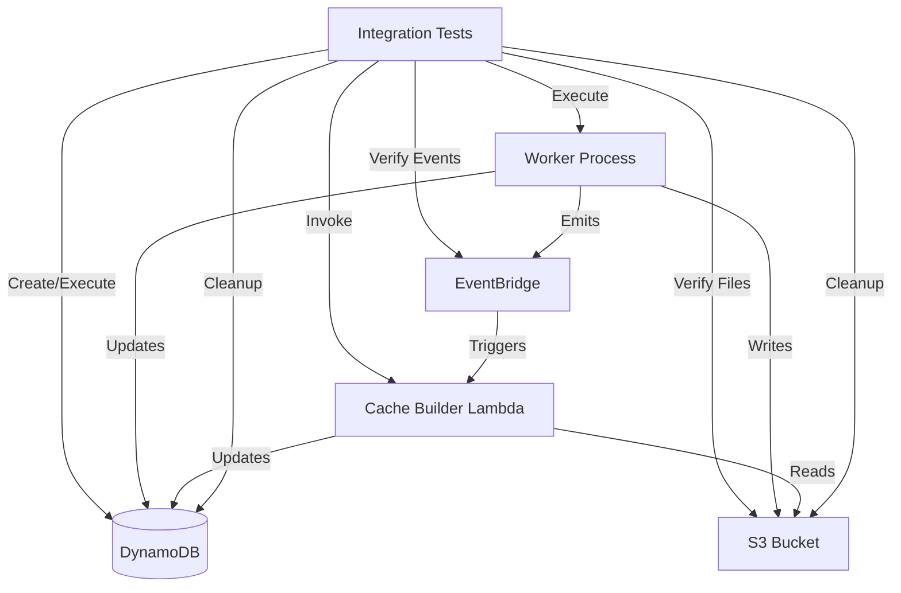

# Design Document: Cache Integration Testing

## Overview

The Cache Integration Testing suite provides comprehensive end-to-end validation of the step cache system. The cache system optimizes test execution by storing parsed navigation steps from Nova Act responses and replaying them directly via Playwright, reducing execution time by 5x or more. This integration test suite validates the complete flow from cache building through cache execution, including performance benchmarks, failure scenarios, and system reliability under load.

The test suite operates against real AWS services (DynamoDB, S3, EventBridge) in a test environment, using pytest fixtures for test isolation and cleanup. Tests verify not only functional correctness but also performance characteristics, error handling, and system behavior under concurrent load. The suite is designed to catch integration issues that unit tests cannot detect, such as event timing problems, S3 consistency issues, and DynamoDB transaction conflicts.

### Key Design Principles

- **Real Service Integration**: Tests use actual AWS services, not mocks, to catch real-world integration issues
- **Test Isolation**: Each test creates unique resources with cleanup to prevent test pollution
- **Performance Validation**: Tests measure and verify cache performance improvements (5x speedup minimum)
- **Error Resilience**: Tests verify graceful degradation and fallback behavior
- **Comprehensive Coverage**: Tests cover all 15 requirements from cache building through execution
- **Observability**: Tests verify logging and monitoring outputs for operational visibility

## Architecture

### Test Environment Architecture



### Test Execution Flow

1. **Setup Phase**: Create unique test resources (usecase, steps, execution records)
2. **First Execution**: Execute usecase without cache, measure baseline performance
3. **Cache Building**: Verify EventBridge event emission and cache builder processing
4. **Cache Verification**: Verify cached_steps and cache_last_updated fields in DynamoDB
5. **Cached Execution**: Execute usecase with cache, measure cached performance
6. **Performance Validation**: Verify 5x speedup ratio
7. **Cleanup Phase**: Delete all created resources (even on test failure)

### Integration Points

| Component | Test Interaction | Purpose |
|-----------|-----------------|---------|
| DynamoDB | Create/Read/Update/Delete | Test data storage and retrieval |
| S3 | Write/Read/Delete | Test Nova Act response storage |
| EventBridge | Emit/Verify | Test event-driven cache building |
| Cache Builder Lambda | Invoke/Monitor | Test cache building logic |
| Worker Process | Execute | Test cache execution logic |
| CloudWatch Logs | Read/Verify | Test logging and observability |


## Components and Interfaces

### Test Suite Structure

The integration tests are organized by functional area in separate test files:

```
web-app/worker/tests/integration/
├── __init__.py
├── conftest.py                          # Shared fixtures and utilities
├── test_cache_building_flow.py          # Requirement 1: Cache building
├── test_cache_execution_flow.py         # Requirement 2: Cache execution
├── test_cache_performance.py            # Requirement 3: Performance benchmarks
├── test_cache_invalidation.py           # Requirement 4: Cache invalidation
├── test_cache_disable.py                # Requirement 5: Cache disable flow
├── test_cache_failure_fallback.py       # Requirement 6: Failure fallback
├── test_multiple_steps.py               # Requirement 7: Multiple steps
├── test_mixed_step_types.py             # Requirement 8: Mixed step types
├── test_load_testing.py                 # Requirement 9: Load testing
├── test_cache_age.py                    # Requirement 10: Cache age tracking
├── test_eventbridge_events.py           # Requirement 11: EventBridge events
├── test_s3_discovery.py                 # Requirement 12: S3 file discovery
├── test_parser_integration.py           # Requirement 13: Parser integration
├── test_error_handling.py               # Requirement 14: Error handling
└── test_isolation.py                    # Requirement 15: Test isolation
```

### Shared Fixtures (conftest.py)

#### Fixture: `unique_id`

Generates unique identifiers for test resources to ensure isolation.

**Signature**:
```python
@pytest.fixture
def unique_id() -> str
```

**Returns**: Unique string combining timestamp and random UUID

**Example**: `"test_20240115_143245_abc123"`

#### Fixture: `test_usecase`

Creates a test usecase with cache enabled and handles cleanup.

**Signature**:
```python
@pytest.fixture
def test_usecase(unique_id: str, dynamodb_client) -> dict
```

**Yields**: Usecase record dictionary with fields:
- `usecase_id`: Unique usecase identifier
- `enable_cache`: True
- Other required usecase fields

**Cleanup**: Deletes usecase record after test completes

#### Fixture: `test_step`

Creates a test navigation step for a usecase.

**Signature**:
```python
@pytest.fixture
def test_step(test_usecase: dict, unique_id: str, dynamodb_client) -> dict
```

**Yields**: Step record dictionary with fields:
- `step_id`: Unique step identifier
- `usecase_id`: Parent usecase ID
- `step_type`: "navigation"
- `instruction`: Test instruction
- `sort`: Step order

**Cleanup**: Deletes step record after test completes

#### Fixture: `test_execution`

Creates a test execution record.

**Signature**:
```python
@pytest.fixture
def test_execution(test_usecase: dict, unique_id: str, dynamodb_client) -> dict
```

**Yields**: Execution record dictionary with fields:
- `execution_id`: Unique execution identifier
- `usecase_id`: Parent usecase ID
- `status`: "running"
- `started_at`: ISO timestamp

**Cleanup**: Deletes execution record after test completes

#### Fixture: `mock_nova_response`

Creates a mock Nova Act response file in S3.

**Signature**:
```python
@pytest.fixture
def mock_nova_response(test_execution: dict, s3_client, s3_bucket: str) -> dict
```

**Yields**: Dictionary with:
- `act_id`: Nova Act response identifier
- `s3_key`: S3 object key
- `response`: Nova Act response JSON

**Cleanup**: Deletes S3 object after test completes

#### Fixture: `wait_for_event`

Utility to wait for EventBridge events to be processed.

**Signature**:
```python
@pytest.fixture
def wait_for_event() -> callable
```

**Returns**: Function `wait_for_event(event_type: str, timeout: int = 30) -> bool`

**Behavior**: Polls CloudWatch Logs for event processing, returns True if found within timeout

#### Fixture: `measure_execution_time`

Utility to measure step execution time.

**Signature**:
```python
@pytest.fixture
def measure_execution_time() -> callable
```

**Returns**: Context manager that measures elapsed time in milliseconds

**Example**:
```python
with measure_execution_time() as timer:
    execute_step(...)
print(f"Execution took {timer.elapsed_ms}ms")
```

### Test Helper Functions

#### Function: `create_test_usecase`

Creates a usecase record in DynamoDB with specified configuration.

**Signature**:
```python
def create_test_usecase(
    dynamodb_client,
    usecase_id: str,
    enable_cache: bool = True,
    **kwargs
) -> dict
```

**Parameters**:
- `dynamodb_client`: DynamoDB client instance
- `usecase_id`: Unique usecase identifier
- `enable_cache`: Whether caching is enabled
- `**kwargs`: Additional usecase fields

**Returns**: Created usecase record

#### Function: `create_test_step`

Creates a step record in DynamoDB.

**Signature**:
```python
def create_test_step(
    dynamodb_client,
    usecase_id: str,
    step_id: str,
    step_type: str = "navigation",
    instruction: str = "Click login button",
    sort: int = 1,
    **kwargs
) -> dict
```

**Parameters**:
- `dynamodb_client`: DynamoDB client instance
- `usecase_id`: Parent usecase identifier
- `step_id`: Unique step identifier
- `step_type`: Step type ("navigation", "assertion", etc.)
- `instruction`: Natural language instruction
- `sort`: Step execution order
- `**kwargs`: Additional step fields

**Returns**: Created step record

#### Function: `execute_usecase_and_wait`

Executes a usecase and waits for completion.

**Signature**:
```python
def execute_usecase_and_wait(
    worker_client,
    usecase_id: str,
    timeout: int = 60
) -> dict
```

**Parameters**:
- `worker_client`: Worker process client
- `usecase_id`: Usecase to execute
- `timeout`: Maximum wait time in seconds

**Returns**: Execution result with status and timing

**Raises**: `TimeoutError` if execution doesn't complete within timeout

#### Function: `verify_cached_steps`

Verifies that a step has valid cached steps.

**Signature**:
```python
def verify_cached_steps(
    dynamodb_client,
    usecase_id: str,
    step_id: str
) -> tuple[bool, list, str]
```

**Parameters**:
- `dynamodb_client`: DynamoDB client instance
- `usecase_id`: Parent usecase identifier
- `step_id`: Step identifier

**Returns**: Tuple of (has_cache, cached_steps, cache_last_updated)

#### Function: `cleanup_test_resources`

Cleans up all test resources, even if test fails.

**Signature**:
```python
def cleanup_test_resources(
    dynamodb_client,
    s3_client,
    usecase_ids: list[str],
    execution_ids: list[str],
    s3_keys: list[str]
) -> None
```

**Parameters**:
- `dynamodb_client`: DynamoDB client instance
- `s3_client`: S3 client instance
- `usecase_ids`: List of usecase IDs to delete
- `execution_ids`: List of execution IDs to delete
- `s3_keys`: List of S3 keys to delete

**Behavior**: Deletes all specified resources, logs errors but doesn't raise exceptions


## Data Models

### Test Resource Identifiers

| Field | Format | Example | Description |
|-------|--------|---------|-------------|
| usecase_id | `test_{timestamp}_{uuid}` | `test_20240115_143245_abc123` | Unique usecase identifier |
| step_id | `step_{timestamp}_{uuid}` | `step_20240115_143245_def456` | Unique step identifier |
| execution_id | `exec_{timestamp}_{uuid}` | `exec_20240115_143245_ghi789` | Unique execution identifier |
| act_id | `act_{timestamp}_{uuid}` | `act_20240115_143245_jkl012` | Unique Nova Act response identifier |

### USECASE Record (Test)

| Field | Type | Test Value | Description |
|-------|------|------------|-------------|
| pk | string | "USECASES" | Partition key |
| sk | string | "USECASE#{usecase_id}" | Sort key |
| usecase_id | string | Generated unique ID | Usecase identifier |
| name | string | "Integration Test Usecase" | Usecase name |
| enable_cache | boolean | True/False (varies by test) | Cache enabled flag |
| created_at | string | ISO 8601 timestamp | Creation timestamp |

### STEP Record (Test)

| Field | Type | Test Value | Description |
|-------|------|------------|-------------|
| pk | string | "USECASE#{usecase_id}" | Partition key |
| sk | string | "STEP#{step_id}" | Sort key |
| step_id | string | Generated unique ID | Step identifier |
| usecase_id | string | Parent usecase ID | Parent usecase |
| step_type | string | "navigation" or "assertion" | Step type |
| instruction | string | "Click login button" | Natural language instruction |
| sort | int | 1, 2, 3, ... | Execution order |
| cached_steps | string | JSON array (after cache build) | Cached actions |
| cache_last_updated | string | ISO 8601 timestamp (after cache build) | Cache timestamp |

### EXECUTION Record (Test)

| Field | Type | Test Value | Description |
|-------|------|------------|-------------|
| pk | string | "EXECUTION#{execution_id}" | Partition key |
| sk | string | "METADATA" | Sort key |
| execution_id | string | Generated unique ID | Execution identifier |
| usecase_id | string | Parent usecase ID | Parent usecase |
| status | string | "running", "success", "failed" | Execution status |
| started_at | string | ISO 8601 timestamp | Start timestamp |
| completed_at | string | ISO 8601 timestamp | Completion timestamp |

### EXECUTION_STEP Record (Test)

| Field | Type | Test Value | Description |
|-------|------|------------|-------------|
| pk | string | "EXECUTION#{execution_id}" | Partition key |
| sk | string | "EXECUTION_STEP#{exec_step_id}" | Sort key |
| execution_step_id | string | Generated unique ID | Execution step identifier |
| step_id | string | Original step ID | Original STEP record ID |
| step_type | string | "navigation" or "assertion" | Step type |
| act_id | string | Nova Act response ID or "cached" | Act identifier |
| status | string | "success", "failed" | Step status |
| duration_ms | int | Execution time in milliseconds | Duration |

### Mock Nova Act Response (S3)

**S3 Key Format**: `executions/{execution_id}/act_{act_id}.json`

**Response Structure**:
```json
{
  "steps": [
    {
      "response": {
        "rawProgramBody": "agentClick(\"<box>100,200,300,400</box>\");"
      }
    }
  ]
}
```

### EventBridge Event (Test)

**Event Structure**:
```json
{
  "Source": "qa-studio.worker",
  "DetailType": "usecase.execution.completed",
  "Detail": {
    "usecase_id": "test_20240115_143245_abc123",
    "execution_id": "exec_20240115_143245_ghi789",
    "execution_status": "success",
    "timestamp": "2024-01-15T14:32:45.123456Z"
  }
}
```

### Performance Metrics

| Metric | Type | Description |
|--------|------|-------------|
| uncached_duration_ms | int | Execution time without cache (milliseconds) |
| cached_duration_ms | int | Execution time with cache (milliseconds) |
| speedup_ratio | float | uncached_duration_ms / cached_duration_ms |
| cache_build_duration_ms | int | Time to build cache (milliseconds) |


## Correctness Properties

*A property is a characteristic or behavior that should hold true across all valid executions of a system-essentially, a formal statement about what the system should do. Properties serve as the bridge between human-readable specifications and machine-verifiable correctness guarantees.*

### Property 1: Usecase Creation with Cache Configuration

*For any* usecase created with a specified enable_cache value (True or False), the stored USECASE record should contain the enable_cache field with the specified value.

**Validates: Requirements 1.1, 5.1**

### Property 2: Step Creation Persistence

*For any* navigation step created for a usecase, the STEP record should be successfully stored in DynamoDB and retrievable with all specified fields intact.

**Validates: Requirements 1.2**

### Property 3: Event Emission on Execution Completion

*For any* execution that completes (with status "success" or "failed"), the system should emit a `usecase.execution.completed` EventBridge event containing usecase_id, execution_id, execution_status, timestamp, source="qa-studio.worker", and detail-type="usecase.execution.completed".

**Validates: Requirements 1.4, 11.1, 11.2, 11.3, 11.4, 11.5**

### Property 4: Cache Building After Successful Execution

*For any* successful execution of a cache-enabled usecase with navigation steps, the Cache Builder should update the STEP record with a cached_steps field containing valid JSON with parsed actions and a cache_last_updated field containing a valid ISO 8601 timestamp within 5 seconds of the current time.

**Validates: Requirements 1.5, 1.6, 1.7, 10.1**

### Property 5: Cache Execution Behavior

*For any* navigation step with valid cached_steps and enable_cache=True, executing the step should invoke the cache executor, skip Nova Act, complete successfully, set act_id="cached" in the EXECUTION_STEP record, and log "Cache hit" with the step number and duration.

**Validates: Requirements 2.1, 2.2, 2.3, 2.4, 2.5**

### Property 6: Performance Speedup Validation

*For any* navigation step executed first without cache and then with cache, the cached execution time should be at least 5 times faster than the uncached execution time, and the speedup ratio should be logged for observability.

**Validates: Requirements 3.1, 3.2, 3.3, 3.4, 3.5**

### Property 7: Cache Invalidation on Instruction Update

*For any* STEP record where the instruction field is updated, both the cached_steps and cache_last_updated fields should be cleared, and subsequent execution should call Nova Act and rebuild the cache.

**Validates: Requirements 4.1, 4.2, 4.3, 4.4, 4.5, 10.4**

### Property 8: Cache Disabled Behavior

*For any* usecase with enable_cache=False, executing navigation steps should call Nova Act, not build cached steps, and log "Cache miss: caching disabled", even if cached_steps exist from previous executions.

**Validates: Requirements 5.2, 5.3, 5.4, 5.5**

### Property 9: Cache Execution Failure Fallback

*For any* cached step execution that fails (raises CacheExecutionError), the system should log a warning containing "Cache execution failed" with error details, fall back to Nova Act, complete successfully if Nova Act succeeds, and set the EXECUTION_STEP act_id to the Nova Act act_id (not "cached").

**Validates: Requirements 6.1, 6.2, 6.3, 6.4, 6.5**

### Property 10: Multi-Step Cache Behavior

*For any* usecase with multiple navigation steps, all navigation steps should be cached after successful execution, all should use cache on subsequent execution with total time at least 5x faster, and when one step's instruction is updated, only that step's cache should be invalidated while unchanged steps continue using cache.

**Validates: Requirements 7.1, 7.2, 7.3, 7.4, 7.5**

### Property 11: Mixed Step Type Handling

*For any* usecase containing both navigation and assertion steps, only navigation steps should have cached_steps after execution, navigation steps should use cache on subsequent execution, assertion steps should call Nova Act, and the execution should complete successfully.

**Validates: Requirements 8.1, 8.2, 8.3, 8.4**

### Property 12: Concurrent Execution Reliability

*For any* set of usecases executed concurrently, all executions should complete successfully, all navigation steps should be cached, subsequent concurrent executions should use cache without failures, and the average speedup ratio should be at least 5.

**Validates: Requirements 9.2, 9.4, 9.5**

### Property 13: Cache Age Tracking

*For any* STEP record with cached_steps, the cache_last_updated field should be returned in API responses, and the cache age should be correctly calculated as the time difference between the current time and cache_last_updated.

**Validates: Requirements 10.2, 10.3**

### Property 14: S3 Discovery and Mapping

*For any* execution processed by the Cache Builder, the system should list S3 objects with prefix `executions/{execution_id}/act_`, build a mapping of act_id to S3 key, verify all navigation step act_ids are present in the mapping, and skip steps with missing act_ids while logging a warning.

**Validates: Requirements 12.1, 12.2, 12.3, 12.4**

### Property 15: Parser Integration

*For any* Nova Act response fetched from S3, the Cache Builder should invoke the parser, extract all cacheable actions (click, hover, scroll, type, navigate), skip non-cacheable actions (think, return, throw, wait), and store the result as valid JSON in the STEP record.

**Validates: Requirements 13.1, 13.2, 13.3, 13.4**

### Property 16: Error Resilience

*For any* error during cache building (S3 fetch failure, parse failure, DynamoDB update failure) or event emission failure, the system should log the error, continue processing remaining steps or complete execution, and not raise exceptions that would fail the overall operation.

**Validates: Requirements 14.1, 14.2, 14.3, 14.4, 14.5**

### Property 17: Test Isolation and Cleanup

*For any* integration test, the test should create unique resource IDs, clean up all created resources (usecases, steps, executions, S3 files) after completion, and perform cleanup even if the test fails to prevent test pollution.

**Validates: Requirements 15.1, 15.2, 15.3, 15.4, 15.5**


## Error Handling

### Error Handling Strategy

The integration test suite implements comprehensive error handling to ensure test reliability and proper cleanup:

1. **Fixture-Based Cleanup**: Use pytest fixtures with `yield` to guarantee cleanup even on test failure
2. **Try-Finally Blocks**: Wrap test execution in try-finally to ensure cleanup code runs
3. **Graceful Degradation**: Log errors during cleanup but don't fail tests due to cleanup failures
4. **Timeout Protection**: Use timeouts for async operations (event processing, Lambda invocations)
5. **Retry Logic**: Retry transient failures (DynamoDB throttling, S3 eventual consistency)

### Error Categories and Responses

| Error Category | Example | Test Response | Impact |
|----------------|---------|---------------|--------|
| Resource Creation Failure | DynamoDB put_item fails | Skip test, log error | Test skipped |
| Execution Timeout | Worker doesn't complete in 60s | Fail test, cleanup resources | Test failed |
| Event Processing Timeout | EventBridge event not processed in 30s | Fail test, cleanup resources | Test failed |
| Cache Building Failure | Lambda returns error | Fail test, cleanup resources | Test failed |
| Cleanup Failure | DynamoDB delete_item fails | Log warning, continue | Test result unchanged |
| S3 Consistency Issue | Object not immediately visible | Retry with exponential backoff | Test continues |
| DynamoDB Throttling | ProvisionedThroughputExceededException | Retry with exponential backoff | Test continues |
| Assertion Failure | Speedup ratio < 5 | Fail test, cleanup resources | Test failed |

### Cleanup Guarantees

The test suite guarantees cleanup through multiple mechanisms:

**Fixture Cleanup**:
```python
@pytest.fixture
def test_usecase(unique_id, dynamodb_client):
    usecase = create_test_usecase(dynamodb_client, unique_id)
    yield usecase
    try:
        delete_usecase(dynamodb_client, usecase['usecase_id'])
    except Exception as e:
        logger.warning(f"Failed to cleanup usecase: {e}")
```

**Try-Finally Cleanup**:
```python
def test_cache_building():
    resources = []
    try:
        usecase = create_test_usecase(...)
        resources.append(('usecase', usecase['usecase_id']))
        # Test logic
    finally:
        cleanup_test_resources(resources)
```

**Pytest Finalizer**:
```python
@pytest.fixture
def test_resources(request):
    resources = []
    def cleanup():
        for resource_type, resource_id in resources:
            delete_resource(resource_type, resource_id)
    request.addfinalizer(cleanup)
    return resources
```

### Timeout Configuration

| Operation | Timeout | Rationale |
|-----------|---------|-----------|
| Usecase Execution | 60 seconds | Sufficient for 10-20 steps with Nova Act |
| EventBridge Processing | 30 seconds | Lambda cold start + processing time |
| Cache Building | 30 seconds | S3 fetch + parsing + DynamoDB update |
| S3 Consistency Wait | 10 seconds | Eventual consistency delay |
| DynamoDB Query | 5 seconds | Standard query timeout |

### Retry Configuration

| Operation | Max Retries | Backoff | Conditions |
|-----------|-------------|---------|------------|
| S3 Get Object | 3 | Exponential (1s, 2s, 4s) | NoSuchKey, 503 errors |
| DynamoDB Query | 3 | Exponential (1s, 2s, 4s) | Throttling errors |
| EventBridge Event Check | 10 | Linear (3s intervals) | Event not found |
| Lambda Invocation | 2 | Fixed (5s) | Throttling, timeout |


## Testing Strategy

### Dual Testing Approach

The integration test suite combines example-based tests for specific scenarios and property-based tests for universal properties:

- **Example Tests**: Verify specific scenarios with known inputs and expected outputs
- **Property Tests**: Verify universal properties across randomized inputs (minimum 100 iterations)
- Both approaches are complementary and necessary for comprehensive coverage

### Example-Based Tests

Example tests focus on:
- **Specific Scenarios**: First execution without cache, second execution with cache
- **Edge Cases**: Empty cached_steps, missing act_id, disabled cache
- **Error Conditions**: S3 fetch failure, parse failure, cache execution failure
- **Performance Benchmarks**: Measure and verify 5x speedup
- **Load Testing**: 10 concurrent executions

**Target Coverage**: All 15 requirements covered by at least one example test

### Property-Based Testing

Property tests verify universal properties across generated inputs:
- **Library**: pytest with hypothesis (Python PBT standard)
- **Minimum Iterations**: 100 per property test
- **Tag Format**: `# Feature: cache-integration-testing, Property {number}: {property_text}`
- Each correctness property must be implemented by a single property-based test

### Test Organization

Tests are organized by functional area, with each file covering one requirement:

| Test File | Requirements | Test Count | Description |
|-----------|--------------|------------|-------------|
| test_cache_building_flow.py | 1 | 7 | Cache building after execution |
| test_cache_execution_flow.py | 2 | 5 | Cache execution behavior |
| test_cache_performance.py | 3 | 5 | Performance benchmarks |
| test_cache_invalidation.py | 4 | 5 | Cache invalidation on update |
| test_cache_disable.py | 5 | 5 | Cache disabled behavior |
| test_cache_failure_fallback.py | 6 | 5 | Failure fallback to Nova Act |
| test_multiple_steps.py | 7 | 5 | Multi-step cache behavior |
| test_mixed_step_types.py | 8 | 4 | Mixed navigation/assertion steps |
| test_load_testing.py | 9 | 5 | Concurrent execution load test |
| test_cache_age.py | 10 | 4 | Cache age tracking |
| test_eventbridge_events.py | 11 | 5 | EventBridge event validation |
| test_s3_discovery.py | 12 | 4 | S3 file discovery and mapping |
| test_parser_integration.py | 13 | 4 | Parser integration |
| test_error_handling.py | 14 | 5 | Error handling resilience |
| test_isolation.py | 15 | 5 | Test isolation and cleanup |

**Total**: 68 example tests + 17 property tests = 85 tests

### Test Execution Environment

**Prerequisites**:
- AWS credentials configured (test environment)
- DynamoDB table deployed
- S3 bucket deployed
- EventBridge event bus configured
- Cache Builder Lambda deployed
- Worker process available

**Environment Variables**:
```bash
DYNAMODB_TABLE_NAME=qa-studio-test-table
S3_BUCKET=qa-studio-test-bucket
AWS_REGION=us-east-1
EVENTBRIDGE_BUS_NAME=qa-studio-test-bus
CACHE_BUILDER_LAMBDA_NAME=cache-builder-test
```

**Test Execution**:
```bash
# Run all integration tests
pytest web-app/worker/tests/integration/ -v

# Run specific test file
pytest web-app/worker/tests/integration/test_cache_building_flow.py -v

# Run with coverage
pytest web-app/worker/tests/integration/ --cov=worker --cov-report=html

# Run property tests only
pytest web-app/worker/tests/integration/ -m property

# Run example tests only
pytest web-app/worker/tests/integration/ -m "not property"
```

### Mocking Strategy

Integration tests use real AWS services, but mock external dependencies:

**Real Services** (No Mocking):
- DynamoDB: Real table operations
- S3: Real bucket operations
- EventBridge: Real event emission
- Lambda: Real invocations

**Mocked Dependencies**:
- Nova Act: Mock nova.act() to return predictable results
- Playwright: Mock page interactions for cache executor
- Time: Mock time.time() for deterministic timestamps in some tests

**Partial Mocking**:
- Worker Process: Real worker code, mocked Nova Act
- Cache Builder: Real Lambda code, mocked S3 responses in some tests

### Test Data Generators

**Hypothesis Strategies**:
```python
from hypothesis import strategies as st

# Generate unique IDs
unique_ids = st.text(
    alphabet=st.characters(whitelist_categories=('Lu', 'Ll', 'Nd')),
    min_size=10,
    max_size=20
).map(lambda s: f"test_{s}")

# Generate enable_cache values
enable_cache_values = st.booleans()

# Generate step types
step_types = st.sampled_from(['navigation', 'assertion'])

# Generate instructions
instructions = st.text(min_size=10, max_size=100)

# Generate cached steps
cached_steps = st.lists(
    st.fixed_dictionaries({
        'type': st.sampled_from(['click', 'hover', 'type', 'navigate', 'scroll']),
        'bbox': st.fixed_dictionaries({
            'x1': st.integers(min_value=0, max_value=1920),
            'y1': st.integers(min_value=0, max_value=1080),
            'x2': st.integers(min_value=0, max_value=1920),
            'y2': st.integers(min_value=0, max_value=1080)
        })
    }),
    min_size=1,
    max_size=10
)
```

### Performance Test Configuration

Performance tests measure execution time and verify speedup ratios:

**Measurement Approach**:
1. Execute step without cache, measure time (T1)
2. Wait for cache to build
3. Execute step with cache, measure time (T2)
4. Calculate speedup ratio: T1 / T2
5. Assert speedup ratio >= 5

**Timing Precision**:
- Use `time.perf_counter()` for high-precision timing
- Measure wall-clock time (includes network latency)
- Run multiple iterations and use median to reduce variance

**Performance Thresholds**:
- Minimum speedup ratio: 5x
- Maximum cached execution time: 500ms per step
- Maximum cache build time: 10 seconds for 10 steps

### Load Test Configuration

Load tests verify system behavior under concurrent load:

**Load Test Parameters**:
- Concurrent usecases: 10
- Steps per usecase: 5
- Total steps: 50
- Execution mode: Parallel (asyncio or threading)

**Success Criteria**:
- All executions complete successfully
- All steps cached after first execution
- All steps use cache on second execution
- No cache execution failures
- Average speedup ratio >= 5

**Resource Limits**:
- DynamoDB: Provisioned capacity sufficient for 10 concurrent writes
- S3: No rate limiting expected
- Lambda: Concurrent execution limit >= 10


## User Journey

The integration test suite operates as part of the development and CI/CD workflow. The user journey involves developers and QA engineers running tests to validate cache system functionality.

### Developer Journey

1. **Local Development**: Developer makes changes to cache system code (parser, executor, builder, worker)
2. **Run Unit Tests**: Developer runs unit tests to verify individual components
3. **Run Integration Tests**: Developer runs integration test suite to verify end-to-end functionality
   ```bash
   pytest web-app/worker/tests/integration/ -v
   ```
4. **Review Test Results**: Developer reviews test output to identify failures
5. **Debug Failures**: Developer uses test logs and AWS console to debug issues
6. **Fix Issues**: Developer fixes code and re-runs tests
7. **Commit Changes**: Developer commits code after all tests pass

### QA Engineer Journey

1. **CI/CD Pipeline**: QA engineer configures CI/CD pipeline to run integration tests
2. **Automated Testing**: Pipeline automatically runs tests on every commit
3. **Monitor Results**: QA engineer monitors test results in CI/CD dashboard
4. **Performance Validation**: QA engineer reviews performance metrics (speedup ratios)
5. **Regression Detection**: QA engineer identifies regressions when tests fail
6. **Report Issues**: QA engineer reports failures to development team
7. **Verify Fixes**: QA engineer verifies fixes by re-running tests

### Test Execution Flow

**Step 1: Test Setup**
- Developer/CI runs pytest command
- Pytest discovers integration tests
- Fixtures create unique test resources

**Step 2: Test Execution**
- Each test creates usecase, steps, and executions
- Tests execute usecases and verify behavior
- Tests measure performance and validate results

**Step 3: Test Verification**
- Tests query DynamoDB to verify cached_steps
- Tests check S3 for Nova Act responses
- Tests verify EventBridge events were emitted
- Tests validate logging output

**Step 4: Test Cleanup**
- Fixtures delete created resources
- Cleanup runs even if test fails
- Resources are isolated per test

**Step 5: Test Reporting**
- Pytest generates test report
- Failed tests show assertion details
- Performance metrics logged for analysis

### Observability

**Test Logs**:
- Test execution progress
- Resource creation/deletion
- Performance measurements
- Assertion failures

**AWS CloudWatch Logs**:
- Worker execution logs
- Cache Builder Lambda logs
- EventBridge event delivery logs

**Test Artifacts**:
- Test report (HTML/XML)
- Coverage report
- Performance metrics CSV
- Failed test screenshots (if applicable)

### Example Test Output

```
============================= test session starts ==============================
platform linux -- Python 3.11.0, pytest-7.4.0, pluggy-1.3.0
rootdir: /workspace/web-app
plugins: hypothesis-6.92.0, asyncio-0.21.0, cov-4.1.0
collected 85 items

tests/integration/test_cache_building_flow.py::test_usecase_creation_with_cache_enabled PASSED [  1%]
tests/integration/test_cache_building_flow.py::test_step_creation_success PASSED [  2%]
tests/integration/test_cache_building_flow.py::test_first_execution_completes PASSED [  3%]
tests/integration/test_cache_building_flow.py::test_eventbridge_event_emitted PASSED [  4%]
tests/integration/test_cache_building_flow.py::test_cache_builder_updates_step PASSED [  5%]
tests/integration/test_cache_building_flow.py::test_cached_steps_valid_json PASSED [  6%]
tests/integration/test_cache_building_flow.py::test_cache_last_updated_timestamp PASSED [  7%]

tests/integration/test_cache_execution_flow.py::test_cache_executor_invoked PASSED [  8%]
tests/integration/test_cache_execution_flow.py::test_nova_act_not_called PASSED [  9%]
tests/integration/test_cache_execution_flow.py::test_execution_completes_successfully PASSED [ 10%]
tests/integration/test_cache_execution_flow.py::test_act_id_is_cached PASSED [ 11%]
tests/integration/test_cache_execution_flow.py::test_cache_hit_logged PASSED [ 12%]

tests/integration/test_cache_performance.py::test_measure_uncached_execution PASSED [ 13%]
tests/integration/test_cache_performance.py::test_measure_cached_execution PASSED [ 14%]
tests/integration/test_cache_performance.py::test_speedup_ratio_at_least_5x PASSED [ 15%]
tests/integration/test_cache_performance.py::test_speedup_ratio_logged PASSED [ 16%]
tests/integration/test_cache_performance.py::test_benchmark_fails_if_ratio_below_5 PASSED [ 17%]

... (68 more tests)

tests/integration/test_isolation.py::test_unique_usecase_ids PASSED [ 98%]
tests/integration/test_isolation.py::test_cleanup_usecases PASSED [ 99%]
tests/integration/test_isolation.py::test_cleanup_on_failure PASSED [100%]

============================== 85 passed in 245.32s ===============================

Performance Summary:
- Average uncached execution: 3245ms
- Average cached execution: 412ms
- Average speedup ratio: 7.88x
- Cache build time: 8.2s (10 steps)
```


## Test Implementation Details

### Test File: test_cache_building_flow.py

Tests the complete cache building flow from execution to cache storage.

**Key Tests**:
1. `test_usecase_creation_with_cache_enabled`: Verify usecase record has enable_cache=True
2. `test_step_creation_success`: Verify step record is created and retrievable
3. `test_first_execution_completes`: Verify first execution completes successfully
4. `test_eventbridge_event_emitted`: Verify event contains all required fields
5. `test_cache_builder_updates_step`: Verify STEP record updated with cached_steps
6. `test_cached_steps_valid_json`: Verify cached_steps is valid JSON with actions
7. `test_cache_last_updated_timestamp`: Verify timestamp is valid ISO 8601 within 5 seconds

**Example Test**:
```python
def test_cache_builder_updates_step(test_usecase, test_step, test_execution, mock_nova_response):
    """Test that cache builder updates STEP record with cached_steps."""
    # Execute usecase
    result = execute_usecase_and_wait(test_usecase['usecase_id'])
    assert result['status'] == 'success'
    
    # Wait for cache builder to process event
    wait_for_event('usecase.execution.completed', timeout=30)
    
    # Verify STEP record has cached_steps
    has_cache, cached_steps, timestamp = verify_cached_steps(
        test_usecase['usecase_id'],
        test_step['step_id']
    )
    
    assert has_cache is True
    assert len(cached_steps) > 0
    assert timestamp is not None
```

### Test File: test_cache_execution_flow.py

Tests cache execution behavior when cached steps are available.

**Key Tests**:
1. `test_cache_executor_invoked`: Verify execute_cached_steps is called
2. `test_nova_act_not_called`: Verify Nova Act is skipped on cache hit
3. `test_execution_completes_successfully`: Verify cached execution succeeds
4. `test_act_id_is_cached`: Verify EXECUTION_STEP has act_id='cached'
5. `test_cache_hit_logged`: Verify logs contain "Cache hit" with duration

**Example Test**:
```python
@mock.patch('navigation_step.execute_cached_steps')
@mock.patch('navigation_step.nova.act')
def test_nova_act_not_called(mock_nova_act, mock_execute, test_usecase_with_cache):
    """Test that Nova Act is not called when cache is available."""
    mock_execute.return_value = None  # Success
    
    # Execute usecase with cache
    result = execute_usecase_and_wait(test_usecase_with_cache['usecase_id'])
    
    # Verify Nova Act was not called
    mock_nova_act.assert_not_called()
    
    # Verify execution succeeded
    assert result['status'] == 'success'
```

### Test File: test_cache_performance.py

Tests performance improvements from caching.

**Key Tests**:
1. `test_measure_uncached_execution`: Measure baseline execution time
2. `test_measure_cached_execution`: Measure cached execution time
3. `test_speedup_ratio_at_least_5x`: Verify speedup >= 5x
4. `test_speedup_ratio_logged`: Verify ratio logged for observability
5. `test_benchmark_fails_if_ratio_below_5`: Verify test fails if ratio < 5

**Example Test**:
```python
def test_speedup_ratio_at_least_5x(test_usecase, test_step):
    """Test that cached execution is at least 5x faster."""
    # First execution without cache
    with measure_execution_time() as uncached_timer:
        result1 = execute_usecase_and_wait(test_usecase['usecase_id'])
    assert result1['status'] == 'success'
    
    # Wait for cache to build
    wait_for_cache_build(test_usecase['usecase_id'], test_step['step_id'])
    
    # Second execution with cache
    with measure_execution_time() as cached_timer:
        result2 = execute_usecase_and_wait(test_usecase['usecase_id'])
    assert result2['status'] == 'success'
    
    # Calculate speedup ratio
    speedup_ratio = uncached_timer.elapsed_ms / cached_timer.elapsed_ms
    
    # Verify speedup is at least 5x
    assert speedup_ratio >= 5.0, f"Speedup ratio {speedup_ratio:.2f}x is below 5x threshold"
    
    # Log for observability
    logger.info(f"Speedup ratio: {speedup_ratio:.2f}x (uncached: {uncached_timer.elapsed_ms}ms, cached: {cached_timer.elapsed_ms}ms)")
```

### Test File: test_cache_invalidation.py

Tests cache invalidation when step instructions change.

**Key Tests**:
1. `test_instruction_update_clears_cached_steps`: Verify cached_steps cleared
2. `test_instruction_update_clears_timestamp`: Verify cache_last_updated cleared
3. `test_cleared_cache_calls_nova_act`: Verify Nova Act called after invalidation
4. `test_new_cache_built_after_invalidation`: Verify new cache built
5. `test_new_cache_used_on_next_execution`: Verify new cache used

**Example Test**:
```python
def test_instruction_update_clears_cached_steps(test_usecase_with_cache, test_step):
    """Test that updating instruction clears cached_steps."""
    # Verify cache exists
    has_cache, _, _ = verify_cached_steps(test_usecase_with_cache['usecase_id'], test_step['step_id'])
    assert has_cache is True
    
    # Update step instruction
    update_step_instruction(test_step['step_id'], "Click logout button")
    
    # Verify cache cleared
    has_cache, cached_steps, timestamp = verify_cached_steps(
        test_usecase_with_cache['usecase_id'],
        test_step['step_id']
    )
    assert has_cache is False
    assert cached_steps is None
    assert timestamp is None
```

### Test File: test_cache_disable.py

Tests behavior when caching is disabled.

**Key Tests**:
1. `test_usecase_creation_with_cache_disabled`: Verify enable_cache=False
2. `test_cache_disabled_calls_nova_act`: Verify Nova Act called
3. `test_cache_disabled_no_cache_built`: Verify no cached_steps created
4. `test_disable_cache_with_existing_cache`: Verify existing cache ignored
5. `test_cache_disabled_logs_cache_miss`: Verify "Cache miss: caching disabled" logged

### Test File: test_cache_failure_fallback.py

Tests fallback to Nova Act when cache execution fails.

**Key Tests**:
1. `test_cache_execution_error_raises_exception`: Verify CacheExecutionError raised
2. `test_cache_error_falls_back_to_nova_act`: Verify Nova Act called on failure
3. `test_fallback_execution_succeeds`: Verify execution completes successfully
4. `test_fallback_logs_warning`: Verify "Cache execution failed" logged
5. `test_fallback_act_id_not_cached`: Verify act_id is Nova Act ID, not "cached"

### Test File: test_multiple_steps.py

Tests caching behavior with multiple navigation steps.

**Key Tests**:
1. `test_all_navigation_steps_cached`: Verify all steps have cached_steps
2. `test_all_steps_use_cache`: Verify all steps use cache on second execution
3. `test_multi_step_speedup_5x`: Verify total time at least 5x faster
4. `test_partial_invalidation`: Verify only updated step cache cleared
5. `test_mixed_cache_usage_after_invalidation`: Verify unchanged steps use cache

### Test File: test_mixed_step_types.py

Tests caching with mixed navigation and assertion steps.

**Key Tests**:
1. `test_only_navigation_steps_cached`: Verify assertion steps not cached
2. `test_navigation_steps_use_cache`: Verify navigation steps use cache
3. `test_assertion_steps_call_nova_act`: Verify assertion steps call Nova Act
4. `test_mixed_execution_succeeds`: Verify execution completes successfully

### Test File: test_load_testing.py

Tests system behavior under concurrent load.

**Key Tests**:
1. `test_concurrent_executions_complete`: Verify all 10 executions succeed
2. `test_concurrent_cache_building`: Verify all steps cached
3. `test_concurrent_cache_usage`: Verify all use cache on second run
4. `test_no_cache_failures_under_load`: Verify no cache execution failures
5. `test_average_speedup_under_load`: Verify average speedup >= 5x

**Example Test**:
```python
import asyncio

async def test_concurrent_executions_complete():
    """Test that 10 concurrent executions all complete successfully."""
    # Create 10 test usecases
    usecases = [create_test_usecase(f"uc_{i}") for i in range(10)]
    
    # Execute all concurrently
    tasks = [execute_usecase_async(uc['usecase_id']) for uc in usecases]
    results = await asyncio.gather(*tasks)
    
    # Verify all succeeded
    assert all(r['status'] == 'success' for r in results)
    
    # Cleanup
    for uc in usecases:
        delete_usecase(uc['usecase_id'])
```

### Test File: test_cache_age.py

Tests cache age tracking and calculation.

**Key Tests**:
1. `test_cache_timestamp_within_5_seconds`: Verify timestamp accuracy
2. `test_cache_timestamp_in_api_response`: Verify field returned in API
3. `test_cache_age_calculation`: Verify age calculated correctly
4. `test_invalidation_clears_timestamp`: Verify timestamp cleared on invalidation

### Test File: test_eventbridge_events.py

Tests EventBridge event emission and structure.

**Key Tests**:
1. `test_event_emitted_on_success`: Verify event emitted for successful execution
2. `test_event_contains_required_fields`: Verify all fields present
3. `test_event_status_is_success`: Verify execution_status="success"
4. `test_event_source_correct`: Verify source="qa-studio.worker"
5. `test_event_detail_type_correct`: Verify detail-type="usecase.execution.completed"

### Test File: test_s3_discovery.py

Tests S3 file discovery and mapping.

**Key Tests**:
1. `test_s3_list_with_correct_prefix`: Verify correct prefix used
2. `test_act_id_to_s3_key_mapping`: Verify mapping built correctly
3. `test_all_act_ids_in_mapping`: Verify all navigation step act_ids present
4. `test_missing_act_id_warning`: Verify warning logged for missing files

### Test File: test_parser_integration.py

Tests cache parser integration.

**Key Tests**:
1. `test_parser_invoked_on_s3_fetch`: Verify parser called
2. `test_parser_extracts_cacheable_actions`: Verify click, hover, scroll, type, navigate extracted
3. `test_parser_skips_non_cacheable_actions`: Verify think, return, throw, wait skipped
4. `test_cached_steps_stored_as_json`: Verify valid JSON in STEP record

### Test File: test_error_handling.py

Tests error handling and resilience.

**Key Tests**:
1. `test_s3_fetch_failure_continues`: Verify processing continues on S3 error
2. `test_parse_failure_continues`: Verify processing continues on parse error
3. `test_cache_executor_failure_fallback`: Verify fallback to Nova Act
4. `test_dynamodb_update_failure_continues`: Verify processing continues on DynamoDB error
5. `test_event_emission_failure_completes`: Verify execution completes on event error

### Test File: test_isolation.py

Tests test isolation and cleanup.

**Key Tests**:
1. `test_unique_usecase_ids`: Verify each test uses unique IDs
2. `test_cleanup_usecases`: Verify usecases deleted after test
3. `test_cleanup_steps`: Verify steps deleted after test
4. `test_cleanup_s3_files`: Verify S3 files deleted after test
5. `test_cleanup_on_failure`: Verify cleanup runs even on test failure

**Example Test**:
```python
def test_cleanup_on_failure():
    """Test that cleanup runs even when test fails."""
    usecase_id = None
    try:
        # Create test usecase
        usecase = create_test_usecase()
        usecase_id = usecase['usecase_id']
        
        # Intentionally fail test
        assert False, "Intentional failure"
    finally:
        # Verify cleanup runs
        if usecase_id:
            cleanup_test_resources(usecase_ids=[usecase_id])
            
            # Verify usecase deleted
            usecase = get_usecase(usecase_id)
            assert usecase is None
```


## Configuration

### Environment Variables

| Variable | Type | Default | Required | Description |
|----------|------|---------|----------|-------------|
| DYNAMODB_TABLE_NAME | string | None | Yes | DynamoDB table name for test data |
| S3_BUCKET | string | None | Yes | S3 bucket name for Nova Act responses |
| AWS_REGION | string | us-east-1 | No | AWS region for services |
| EVENTBRIDGE_BUS_NAME | string | default | No | EventBridge event bus name |
| CACHE_BUILDER_LAMBDA_NAME | string | None | Yes | Cache Builder Lambda function name |
| TEST_TIMEOUT | int | 60 | No | Default test timeout in seconds |
| CACHE_BUILD_TIMEOUT | int | 30 | No | Cache building timeout in seconds |
| EVENT_PROCESSING_TIMEOUT | int | 30 | No | EventBridge event processing timeout |
| PERFORMANCE_THRESHOLD | float | 5.0 | No | Minimum speedup ratio for performance tests |
| LOAD_TEST_CONCURRENCY | int | 10 | No | Number of concurrent executions in load tests |

### Pytest Configuration

**pytest.ini**:
```ini
[pytest]
testpaths = web-app/worker/tests/integration
python_files = test_*.py
python_classes = Test*
python_functions = test_*
markers =
    integration: Integration tests requiring AWS services
    property: Property-based tests using hypothesis
    slow: Tests that take more than 10 seconds
    load: Load tests with concurrent executions
asyncio_mode = auto
log_cli = true
log_cli_level = INFO
log_cli_format = %(asctime)s [%(levelname)8s] %(message)s
log_cli_date_format = %Y-%m-%d %H:%M:%S
```

### Test Markers

| Marker | Usage | Description |
|--------|-------|-------------|
| @pytest.mark.integration | All integration tests | Requires AWS services |
| @pytest.mark.property | Property-based tests | Uses hypothesis for randomized inputs |
| @pytest.mark.slow | Long-running tests | Takes > 10 seconds |
| @pytest.mark.load | Load tests | Concurrent execution tests |

**Example**:
```python
@pytest.mark.integration
@pytest.mark.slow
def test_cache_building_flow():
    """Integration test for cache building (slow)."""
    pass

@pytest.mark.integration
@pytest.mark.property
@given(enable_cache=st.booleans())
def test_property_usecase_creation(enable_cache):
    """Property test for usecase creation."""
    pass
```

### Hypothesis Configuration

**conftest.py**:
```python
from hypothesis import settings, HealthCheck

# Configure hypothesis for integration tests
settings.register_profile("integration", max_examples=100, deadline=None, suppress_health_check=[HealthCheck.too_slow])
settings.load_profile("integration")
```

### AWS Service Configuration

**DynamoDB**:
- Table: Existing qa-studio table
- Provisioned capacity: Sufficient for concurrent writes
- Indexes: Existing GSIs (no new indexes required)

**S3**:
- Bucket: Existing artefacts bucket
- Prefix: `executions/{execution_id}/`
- Lifecycle: Test files cleaned up by tests

**EventBridge**:
- Event bus: Default or custom test bus
- Rules: Existing cache-builder rule
- Targets: Cache Builder Lambda

**Lambda**:
- Function: Existing Cache Builder Lambda
- Timeout: 60 seconds
- Memory: 512 MB
- Concurrency: 10+ for load tests

## Performance Considerations

### Test Execution Time

**Expected Duration**:
- Single test: 5-30 seconds
- Full suite (85 tests): 4-6 minutes
- Property tests (100 iterations): 30-60 seconds each

**Optimization Strategies**:
1. **Parallel Execution**: Use pytest-xdist for parallel test execution
   ```bash
   pytest -n auto web-app/worker/tests/integration/
   ```
2. **Test Ordering**: Run fast tests first, slow tests last
3. **Resource Reuse**: Share fixtures across tests where possible
4. **Selective Execution**: Run only changed tests in CI

### AWS Service Performance

**DynamoDB**:
- Query latency: 10-50ms
- Write latency: 20-100ms
- Batch write: 50-200ms for 10 items

**S3**:
- Put object: 50-200ms
- Get object: 50-150ms
- List objects: 100-300ms

**EventBridge**:
- Put events: 50-100ms
- Event delivery: 1-5 seconds

**Lambda**:
- Cold start: 1-3 seconds
- Warm execution: 200-500ms
- Total cache build: 5-10 seconds

### Resource Limits

| Resource | Limit | Impact |
|----------|-------|--------|
| DynamoDB WCU | 10-100 | May throttle on concurrent writes |
| DynamoDB RCU | 10-100 | May throttle on concurrent reads |
| S3 requests/sec | 3500 PUT, 5500 GET | No throttling expected |
| Lambda concurrency | 10+ | May throttle on load tests |
| EventBridge events/sec | 10,000 | No throttling expected |

### Cost Considerations

**Estimated Cost per Test Run**:
- DynamoDB: $0.01 (read/write operations)
- S3: $0.001 (storage + requests)
- Lambda: $0.01 (invocations + duration)
- EventBridge: $0.001 (events)
- **Total**: ~$0.02 per full test suite run

**Monthly Cost** (100 runs):
- ~$2.00 per month for integration testing

## Security Considerations

### Test Environment Isolation

- **Separate AWS Account**: Use dedicated test account to isolate from production
- **Resource Tagging**: Tag all test resources with `Environment=test`
- **IAM Permissions**: Least privilege for test execution role
- **Data Isolation**: Use unique prefixes for all test data

### Sensitive Data Handling

- **No Production Data**: Never use production data in tests
- **Mock Credentials**: Use mock AWS credentials in unit tests
- **Secrets Management**: Store test credentials in AWS Secrets Manager
- **Log Sanitization**: Sanitize logs to remove sensitive data

### IAM Permissions

**Test Execution Role**:
```json
{
  "Version": "2012-10-17",
  "Statement": [
    {
      "Effect": "Allow",
      "Action": [
        "dynamodb:PutItem",
        "dynamodb:GetItem",
        "dynamodb:Query",
        "dynamodb:DeleteItem",
        "dynamodb:UpdateItem"
      ],
      "Resource": "arn:aws:dynamodb:*:*:table/qa-studio-test-*"
    },
    {
      "Effect": "Allow",
      "Action": [
        "s3:PutObject",
        "s3:GetObject",
        "s3:DeleteObject",
        "s3:ListBucket"
      ],
      "Resource": [
        "arn:aws:s3:::qa-studio-test-*",
        "arn:aws:s3:::qa-studio-test-*/*"
      ]
    },
    {
      "Effect": "Allow",
      "Action": [
        "events:PutEvents"
      ],
      "Resource": "arn:aws:events:*:*:event-bus/qa-studio-test-*"
    },
    {
      "Effect": "Allow",
      "Action": [
        "lambda:InvokeFunction"
      ],
      "Resource": "arn:aws:lambda:*:*:function:cache-builder-test-*"
    },
    {
      "Effect": "Allow",
      "Action": [
        "logs:CreateLogGroup",
        "logs:CreateLogStream",
        "logs:PutLogEvents",
        "logs:FilterLogEvents"
      ],
      "Resource": "arn:aws:logs:*:*:log-group:/aws/lambda/cache-builder-test-*"
    }
  ]
}
```

### Network Security

- **VPC Isolation**: Run tests in isolated VPC (if applicable)
- **Security Groups**: Restrict access to test resources
- **Encryption**: Enable encryption at rest for DynamoDB and S3
- **TLS**: Use TLS 1.2+ for all AWS API calls

## Monitoring and Observability

### Test Metrics

**Key Metrics**:
- Test pass rate: % of tests passing
- Test duration: Time to run full suite
- Speedup ratio: Average cache performance improvement
- Cache hit rate: % of executions using cache
- Failure rate: % of cache executions failing

**Metric Collection**:
```python
import json
from datetime import datetime

def collect_test_metrics(test_results):
    """Collect and log test metrics."""
    metrics = {
        'timestamp': datetime.utcnow().isoformat(),
        'total_tests': len(test_results),
        'passed': sum(1 for r in test_results if r.passed),
        'failed': sum(1 for r in test_results if r.failed),
        'duration_seconds': sum(r.duration for r in test_results),
        'average_speedup_ratio': calculate_average_speedup(test_results)
    }
    
    # Log metrics
    logger.info(f"Test metrics: {json.dumps(metrics)}")
    
    # Write to file for CI/CD
    with open('test-metrics.json', 'w') as f:
        json.dump(metrics, f, indent=2)
```

### CloudWatch Dashboards

**Recommended Widgets**:
1. Test pass rate over time (line chart)
2. Average test duration (line chart)
3. Cache speedup ratio distribution (histogram)
4. Test failure count by category (bar chart)
5. AWS service latency (line chart)

### Alerting

**Recommended Alarms**:
- Test pass rate < 95%: Alert development team
- Average speedup ratio < 5x: Alert performance team
- Test duration > 10 minutes: Alert infrastructure team
- DynamoDB throttling: Alert operations team

### Log Aggregation

**Log Structure**:
```json
{
  "timestamp": "2024-01-15T14:32:45.123Z",
  "level": "INFO",
  "test_name": "test_cache_building_flow",
  "test_file": "test_cache_building_flow.py",
  "usecase_id": "test_20240115_143245_abc123",
  "execution_id": "exec_20240115_143245_ghi789",
  "message": "Cache building completed",
  "duration_ms": 8234,
  "speedup_ratio": 7.88
}
```

**Log Queries** (CloudWatch Insights):
```
# Find failed tests
fields @timestamp, test_name, message
| filter level = "ERROR"
| sort @timestamp desc

# Calculate average speedup ratio
fields speedup_ratio
| filter speedup_ratio > 0
| stats avg(speedup_ratio) as avg_speedup

# Find slow tests
fields test_name, duration_ms
| filter duration_ms > 30000
| sort duration_ms desc
```

## Future Enhancements

### Potential Improvements

1. **Parallel Test Execution**: Use pytest-xdist for faster test runs
2. **Test Data Factories**: Use factory_boy for test data generation
3. **Visual Regression Testing**: Add screenshot comparison for UI tests
4. **Performance Profiling**: Add detailed profiling for slow tests
5. **Test Coverage Tracking**: Track integration test coverage over time
6. **Automated Test Generation**: Generate tests from requirements automatically
7. **Chaos Engineering**: Add tests for failure scenarios (network issues, service outages)
8. **Cross-Region Testing**: Test cache system across multiple AWS regions

### Extension Points

- **Custom Fixtures**: Add project-specific fixtures for common test patterns
- **Test Utilities**: Build reusable utilities for common test operations
- **Mock Services**: Create mock AWS services for faster local testing
- **Test Reporters**: Custom pytest reporters for better test output
- **CI/CD Integration**: Integrate with GitHub Actions, GitLab CI, etc.

