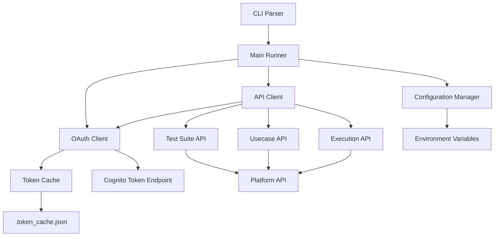
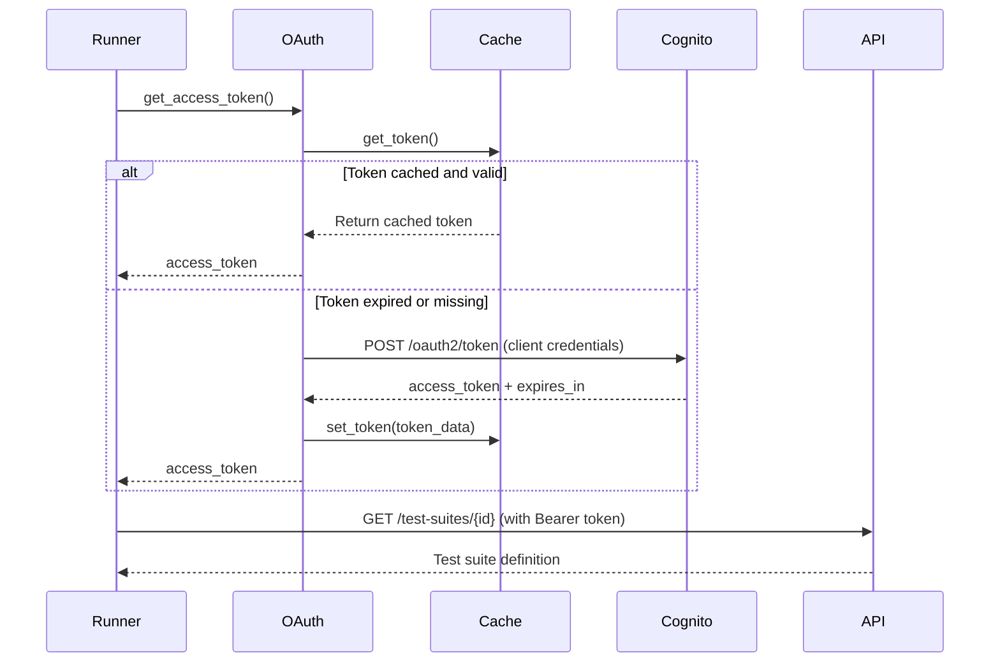

# Design Document: Runner Core & Authentication

## Overview

This design document describes the architecture and implementation of the CI/CD runner core application - a Python CLI tool that authenticates with the Nova Act QA Studio API using OAuth client credentials, fetches test suite definitions, creates execution records, and prepares for test execution.

The runner is designed to be the foundation for CI/CD integration, handling authentication, API communication, configuration management, and CLI argument parsing. It does NOT execute tests itself (that's WP3) - it focuses on the authentication and API client infrastructure.

### Key Design Goals

1. **Secure Authentication**: Implement OAuth 2.0 client credentials flow with token caching and automatic refresh
2. **Robust API Client**: Handle authentication headers, retries, and error responses gracefully
3. **Flexible Configuration**: Support environment variables and CLI arguments with proper precedence
4. **Clear Error Messages**: Provide actionable feedback when authentication or API calls fail
5. **Testable Architecture**: Separate concerns to enable comprehensive unit and property-based testing

### Technology Stack

- **Language**: Python 3.9+
- **HTTP Client**: `requests` library for OAuth and API calls
- **CLI Framework**: `click` for argument parsing and help generation
- **Configuration**: `pydantic` for settings validation
- **Environment**: `python-dotenv` for loading environment variables

---

## Architecture

### Component Diagram



### Authentication Flow



### Directory Structure

```
cicd-runner/
├── src/
│   ├── __init__.py
│   ├── main.py              # Main runner logic
│   ├── auth/
│   │   ├── __init__.py
│   │   ├── oauth_client.py  # OAuth client credentials flow
│   │   └── token_cache.py   # Token caching to disk
│   ├── api/
│   │   ├── __init__.py
│   │   ├── client.py        # Base API client with auth
│   │   ├── test_suites.py   # Test suite endpoints
│   │   ├── usecases.py      # Usecase endpoints
│   │   └── executions.py    # Execution endpoints
│   ├── cli/
│   │   ├── __init__.py
│   │   └── parser.py        # CLI argument parsing
│   ├── config/
│   │   ├── __init__.py
│   │   └── settings.py      # Configuration management
│   └── utils/
│       ├── __init__.py
│       ├── logger.py        # Logging setup
│       └── errors.py        # Custom exceptions
├── tests/
│   ├── __init__.py
│   ├── test_auth.py
│   ├── test_api_client.py
│   ├── test_cli_parser.py
│   └── test_oauth_properties.py  # Property-based tests
├── requirements.txt
├── setup.py
└── README.md
```

---

## Components and Interfaces

### 1. OAuth Client (`src/auth/oauth_client.py`)

**Purpose**: Manage OAuth 2.0 client credentials authentication with Cognito.

**Key Responsibilities**:
- Request access tokens using client credentials flow
- Cache tokens to avoid unnecessary requests
- Detect token expiration and refresh automatically
- Provide clear error messages for authentication failures

**Interface**:

```python
class OAuthClient:
    """OAuth client credentials authentication."""
    
    def __init__(
        self,
        client_id: str,
        client_secret: str,
        token_endpoint: str
    ):
        """
        Initialize OAuth client.
        
        Args:
            client_id: OAuth client ID from Cognito
            client_secret: OAuth client secret from Cognito
            token_endpoint: Cognito token endpoint URL
        """
        
    def get_access_token(self) -> str:
        """
        Get valid access token, using cache if available.
        
        Returns:
            Valid access token string
            
        Raises:
            AuthenticationError: If authentication fails
        """
        
    def _request_new_token(self) -> str:
        """
        Request new access token from Cognito.
        
        Returns:
            New access token string
            
        Raises:
            AuthenticationError: If token request fails
        """
        
    def _is_token_expired(self, token_data: dict) -> bool:
        """
        Check if token is expired or about to expire.
        
        Args:
            token_data: Cached token data with expires_at
            
        Returns:
            True if token is expired or expires within 5 minutes
        """
```

**OAuth Token Request**:
- **Method**: POST
- **URL**: `https://{cognito_domain}.auth.{region}.amazoncognito.com/oauth2/token`
- **Headers**: `Content-Type: application/x-www-form-urlencoded`
- **Body**: 
  - `grant_type=client_credentials`
  - `client_id={client_id}`
  - `client_secret={client_secret}`
  - `scope=api/suite.read api/suite.write api/execution.write`
- **Response**: `{"access_token": "...", "expires_in": 3600, "token_type": "Bearer"}`

**Error Handling**:
- HTTP 400: Invalid client credentials or malformed request
- HTTP 401: Invalid client_id or client_secret
- Network errors: Connection timeout, DNS resolution failures
- All errors wrapped in `AuthenticationError` with descriptive messages

### 2. Token Cache (`src/auth/token_cache.py`)

**Purpose**: Persist OAuth tokens to disk to avoid re-authentication on every run.

**Key Responsibilities**:
- Save tokens to `.token_cache.json` in the current directory
- Load cached tokens and validate expiration
- Clear cache when tokens are revoked or invalid

**Interface**:

```python
class TokenCache:
    """Cache OAuth tokens to disk."""
    
    def __init__(self, cache_file: str = '.token_cache.json'):
        """
        Initialize token cache.
        
        Args:
            cache_file: Path to cache file (default: .token_cache.json)
        """
        
    def get_token(self) -> Optional[dict]:
        """
        Retrieve cached token.
        
        Returns:
            Token data dict with access_token and expires_at, or None
        """
        
    def set_token(self, token_data: dict) -> None:
        """
        Cache token to disk.
        
        Args:
            token_data: Token response from Cognito with access_token and expires_in
        """
        
    def clear(self) -> None:
        """Clear cached token from disk."""
```

**Cache File Format**:

```json
{
  "access_token": "eyJraWQiOiJ...",
  "expires_at": "2024-02-16T13:00:00",
  "expires_in": 3600
}
```

**Expiration Logic**:
- Tokens are considered expired if `expires_at` is within 5 minutes of current time
- This buffer ensures tokens don't expire mid-request
- If cache file is corrupted or missing, return `None` and request new token

### 3. API Client (`src/api/client.py`)

**Purpose**: Base HTTP client for making authenticated API requests.

**Key Responsibilities**:
- Add authentication headers to all requests
- Handle HTTP methods (GET, POST, PATCH)
- Parse JSON responses
- Raise descriptive errors for API failures

**Interface**:

```python
class APIClient:
    """Base API client with authentication."""
    
    def __init__(self, base_url: str, oauth_client: OAuthClient):
        """
        Initialize API client.
        
        Args:
            base_url: Platform API base URL
            oauth_client: OAuth client for authentication
        """
        
    def get(self, path: str, params: Optional[Dict] = None) -> Dict[str, Any]:
        """
        Make authenticated GET request.
        
        Args:
            path: API path (e.g., "/test-suites/123")
            params: Optional query parameters
            
        Returns:
            Parsed JSON response
            
        Raises:
            APIError: If request fails
        """
        
    def post(self, path: str, data: Optional[Dict] = None) -> Dict[str, Any]:
        """
        Make authenticated POST request.
        
        Args:
            path: API path
            data: Optional JSON body
            
        Returns:
            Parsed JSON response
            
        Raises:
            APIError: If request fails
        """
        
    def patch(self, path: str, data: Optional[Dict] = None) -> Dict[str, Any]:
        """
        Make authenticated PATCH request.
        
        Args:
            path: API path
            data: Optional JSON body
            
        Returns:
            Parsed JSON response
            
        Raises:
            APIError: If request fails
        """
        
    def _get_headers(self) -> Dict[str, str]:
        """
        Get request headers with authentication.
        
        Returns:
            Headers dict with Authorization and Content-Type
        """
        
    def _handle_response(self, response: requests.Response) -> Dict[str, Any]:
        """
        Handle API response and errors.
        
        Args:
            response: HTTP response object
            
        Returns:
            Parsed JSON response
            
        Raises:
            APIError: If status code >= 400
        """
```

**Request Headers**:
- `Authorization: Bearer {access_token}`
- `Content-Type: application/json`

**Error Handling**:
- HTTP 400: Invalid request (missing parameters, validation errors)
- HTTP 401: Unauthorized (token expired or invalid)
- HTTP 403: Forbidden (insufficient scopes)
- HTTP 404: Resource not found
- HTTP 500: Internal server error
- All errors wrapped in `APIError` with status code and response body

### 4. Test Suite API (`src/api/test_suites.py`)

**Purpose**: Wrapper for test suite-related API endpoints.

**Interface**:

```python
class TestSuiteAPI:
    """Test suite API operations."""
    
    def __init__(self, client: APIClient):
        """
        Initialize test suite API.
        
        Args:
            client: Base API client
        """
        
    def get_suite(self, suite_id: str) -> Dict[str, Any]:
        """
        Fetch test suite definition.
        
        Args:
            suite_id: Test suite UUID
            
        Returns:
            Test suite object with name, usecases, etc.
            
        Raises:
            APIError: If request fails
        """
        
    def execute_suite(
        self,
        suite_id: str,
        base_url: Optional[str] = None,
        variables: Optional[Dict[str, str]] = None,
        region: Optional[str] = None,
        model_id: Optional[str] = None
    ) -> Dict[str, Any]:
        """
        Execute test suite (CI/CD runner mode).
        
        Args:
            suite_id: Test suite UUID
            base_url: Optional base URL override
            variables: Optional variable overrides
            region: Optional AWS region override
            model_id: Optional model ID override
            
        Returns:
            Execution response with suite_execution_id and execution_ids
            
        Raises:
            APIError: If request fails
        """
```

**API Endpoints Used**:
- `GET /test-suites/{id}` - Fetch suite definition
- `POST /test-suites/{id}/execute` - Create execution records

### 5. CLI Parser (`src/cli/parser.py`)

**Purpose**: Parse command-line arguments and invoke the runner.

**Interface**:

```python
@click.command()
@click.option('--suite-id', required=True, help='Test suite ID to execute')
@click.option('--base-url', help='Override base URL for all use cases')
@click.option('--var', 'variables', multiple=True, help='Override variable (key=value, repeatable)')
@click.option('--region', help='Override AWS region for browser')
@click.option('--model-id', help='Override Nova Act model ID')
@click.option('--verbose', is_flag=True, help='Enable verbose logging')
@click.option('--timeout', type=int, default=3600, help='Global timeout in seconds')
def main(
    suite_id: str,
    base_url: str,
    variables: tuple,
    region: str,
    model_id: str,
    verbose: bool,
    timeout: int
):
    """Nova Act QA Studio CI/CD Runner"""
```

**Argument Parsing**:
- `--suite-id`: Required, test suite UUID
- `--base-url`: Optional, overrides base URL for all usecases
- `--var`: Repeatable, format `key=value`, parsed into dict
- `--region`: Optional, AWS region override
- `--model-id`: Optional, Bedrock model ID override
- `--verbose`: Flag, enables DEBUG logging
- `--timeout`: Optional, default 3600 seconds

**Variable Parsing**:
- Input: `--var username=test --var password=secret`
- Output: `{"username": "test", "password": "secret"}`
- Validation: Each `--var` must contain exactly one `=` character
- Error: `click.BadParameter` if format is invalid

### 6. Configuration Manager (`src/config/settings.py`)

**Purpose**: Load and validate configuration from environment variables.

**Interface**:

```python
class Settings(BaseModel):
    """Application settings from environment variables."""
    
    oauth_client_id: str
    oauth_client_secret: str
    oauth_token_endpoint: str
    api_endpoint: str
    log_level: str = "INFO"
    
    @classmethod
    def from_env(cls) -> 'Settings':
        """
        Load settings from environment variables.
        
        Returns:
            Validated Settings instance
            
        Raises:
            ValidationError: If required variables are missing
        """
```

**Environment Variables**:
- `OAUTH_CLIENT_ID` (required): OAuth client ID from Cognito
- `OAUTH_CLIENT_SECRET` (required): OAuth client secret from Cognito
- `OAUTH_TOKEN_ENDPOINT` (required): Cognito token endpoint URL
  - Format: `https://{domain}.auth.{region}.amazoncognito.com/oauth2/token`
- `API_ENDPOINT` (required): Platform API base URL
  - Format: `https://{api-id}.execute-api.{region}.amazonaws.com/{stage}`
- `LOG_LEVEL` (optional): Logging level (default: INFO)

**Validation**:
- All required variables must be present
- URLs must be valid HTTPS URLs
- Pydantic raises `ValidationError` with clear messages if validation fails

### 7. Main Runner (`src/main.py`)

**Purpose**: Orchestrate the runner workflow.

**Interface**:

```python
def run_runner(
    suite_id: str,
    base_url: Optional[str],
    variables: Dict[str, str],
    region: Optional[str],
    model_id: Optional[str],
    timeout: int
) -> None:
    """
    Main runner execution logic.
    
    Args:
        suite_id: Test suite UUID
        base_url: Optional base URL override
        variables: Variable overrides
        region: Optional AWS region override
        model_id: Optional model ID override
        timeout: Global timeout in seconds
        
    Raises:
        SystemExit: Exit code 0 on success, 2 on failure
    """
```

**Execution Flow**:
1. Load configuration from environment variables
2. Initialize OAuth client
3. Authenticate and obtain access token
4. Initialize API client
5. Fetch test suite definition
6. Create execution records via API
7. Log suite_execution_id and execution_ids
8. Exit with code 0 (success) or 2 (failure)

**Exit Codes**:
- `0`: Success
- `2`: Failure (authentication, API, or configuration error)

### 8. Custom Exceptions (`src/utils/errors.py`)

**Purpose**: Define custom exception types for clear error handling.

**Interface**:

```python
class RunnerError(Exception):
    """Base exception for runner errors."""
    pass

class AuthenticationError(RunnerError):
    """OAuth authentication failed."""
    pass

class APIError(RunnerError):
    """API request failed."""
    
    def __init__(self, message: str, status_code: int, response: dict):
        super().__init__(message)
        self.status_code = status_code
        self.response = response

class ConfigurationError(RunnerError):
    """Configuration validation failed."""
    pass
```

---

## Data Models

### Token Data

**Purpose**: Represent OAuth token with expiration information.

```python
{
    "access_token": str,      # JWT access token
    "expires_at": datetime,   # Expiration timestamp (UTC)
    "expires_in": int         # Lifetime in seconds
}
```

### Test Suite Response

**Purpose**: Test suite definition from API.

```python
{
    "id": str,                # Suite UUID
    "name": str,              # Suite name
    "usecases": List[dict],   # List of usecase objects
    "created_at": str,        # ISO8601 timestamp
    "updated_at": str         # ISO8601 timestamp
}
```

### Execution Response

**Purpose**: Execution creation response from API.

```python
{
    "suite_execution_id": str,  # Suite execution UUID
    "suite_id": str,            # Suite UUID
    "status": str,              # "pending"
    "created_at": str,          # ISO8601 timestamp
    "execution_ids": List[{     # List of execution records
        "usecase_id": str,
        "execution_id": str,
        "usecase_name": str
    }]
}
```

### CLI Arguments

**Purpose**: Parsed command-line arguments.

```python
{
    "suite_id": str,                    # Required
    "base_url": Optional[str],          # Optional
    "variables": Dict[str, str],        # Parsed from --var
    "region": Optional[str],            # Optional
    "model_id": Optional[str],          # Optional
    "verbose": bool,                    # Flag
    "timeout": int                      # Default 3600
}
```

### Settings

**Purpose**: Application configuration from environment.

```python
{
    "oauth_client_id": str,         # Required
    "oauth_client_secret": str,     # Required
    "oauth_token_endpoint": str,    # Required
    "api_endpoint": str,            # Required
    "log_level": str                # Default "INFO"
}
```

---

## Correctness Properties

*A property is a characteristic or behavior that should hold true across all valid executions of a system—essentially, a formal statement about what the system should do. Properties serve as the bridge between human-readable specifications and machine-verifiable correctness guarantees.*

### Property 1: Environment Variable Parsing

*For any* set of valid environment variables (OAUTH_CLIENT_ID, OAUTH_CLIENT_SECRET, OAUTH_TOKEN_ENDPOINT, API_ENDPOINT), calling `Settings.from_env()` should successfully parse them into a Settings object with matching field values.

**Validates: Requirements US1.1**

### Property 2: Token Caching Round Trip

*For any* valid OAuth token response, after calling `token_cache.set_token(token_data)`, calling `token_cache.get_token()` should return a token with the same access_token value.

**Validates: Requirements US1.3**

### Property 3: Expired Token Detection

*For any* cached token where `expires_at` is in the past or within 5 minutes of the current time, calling `oauth_client._is_token_expired(token_data)` should return True.

**Validates: Requirements US1.4**

### Property 4: Fresh Token Detection

*For any* cached token where `expires_at` is more than 5 minutes in the future, calling `oauth_client._is_token_expired(token_data)` should return False.

**Validates: Requirements US1.4**

### Property 5: Authentication Error Messages

*For any* authentication failure response (HTTP 400, 401, network error), the raised `AuthenticationError` should contain a descriptive message that includes the error type and relevant details.

**Validates: Requirements US1.5**

### Property 6: API Request Headers

*For any* API request method (GET, POST, PATCH), the request headers should include an `Authorization` header with format `Bearer {access_token}` and a `Content-Type` header with value `application/json`.

**Validates: Requirements US2.4**

### Property 7: Variable Parsing from CLI

*For any* list of valid `--var key=value` arguments, the CLI parser should produce a dictionary where each key maps to its corresponding value.

**Validates: Requirements US3.3**

### Property 8: Timeout Argument Parsing

*For any* integer value provided to `--timeout`, the CLI parser should parse it as an integer; when omitted, it should default to 3600.

**Validates: Requirements US3.5**

### Property 9: Execute Suite Request Format

*For any* suite_id, calling `test_suite_api.execute_suite(suite_id)` should make a POST request to `/test-suites/{suite_id}/execute` with a request body containing `trigger_type="ci_runner"`.

**Validates: Requirements US4.1, US4.2**

### Property 10: CLI Overrides in Request Body

*For any* combination of CLI overrides (base_url, variables, region, model_id), when provided to `execute_suite()`, all non-None overrides should be included in the request body.

**Validates: Requirements US4.3**

### Property 11: API Error Handling

*For any* API error response (HTTP 400, 403, 404, 500), the raised `APIError` should contain the status code, error message, and response body.

**Validates: Requirements US4.5**

### Property 12: Base URL Argument Parsing

*For any* valid URL string provided to `--base-url`, the CLI parser should correctly parse it; when omitted, it should be None.

**Validates: Requirements US3.2**

---

## Error Handling

### Authentication Errors

**Scenario**: OAuth token request fails

**Causes**:
- Invalid client_id or client_secret (HTTP 401)
- Malformed request (HTTP 400)
- Network connectivity issues
- Cognito endpoint unavailable

**Handling**:
- Wrap all authentication errors in `AuthenticationError`
- Include HTTP status code and response body in error message
- Log error details for debugging
- Exit with code 2

**Example Error Message**:
```
AuthenticationError: OAuth authentication failed: 401 - {"error": "invalid_client"}
```

### API Errors

**Scenario**: API request fails

**Causes**:
- Invalid request parameters (HTTP 400)
- Token expired or invalid (HTTP 401)
- Insufficient scopes (HTTP 403)
- Resource not found (HTTP 404)
- Internal server error (HTTP 500)

**Handling**:
- Wrap all API errors in `APIError` with status_code and response
- Provide actionable error messages
- Log full error details
- Exit with code 2

**Example Error Messages**:
```
APIError: API request failed: 403 - Missing required scopes: api/suite.write
APIError: API request failed: 404 - Test suite not found: 01234567-89ab-cdef
```

### Configuration Errors

**Scenario**: Required environment variables missing

**Causes**:
- OAUTH_CLIENT_ID not set
- OAUTH_CLIENT_SECRET not set
- OAUTH_TOKEN_ENDPOINT not set
- API_ENDPOINT not set

**Handling**:
- Pydantic raises `ValidationError` with field names
- Wrap in `ConfigurationError` with clear message
- List all missing variables
- Exit with code 2

**Example Error Message**:
```
ConfigurationError: Missing required environment variables: OAUTH_CLIENT_ID, OAUTH_CLIENT_SECRET
```

### CLI Argument Errors

**Scenario**: Invalid CLI arguments

**Causes**:
- Missing required --suite-id
- Invalid --var format (missing =)
- Invalid --timeout value (non-integer)

**Handling**:
- Click raises `BadParameter` or `MissingParameter`
- Display error message and usage help
- Exit with code 2

**Example Error Messages**:
```
Error: Missing option '--suite-id'
Error: Variable must be in key=value format: invalid_var
```

### Token Expiration During Execution

**Scenario**: Token expires mid-execution

**Handling**:
- OAuth client automatically detects expiration before each request
- Requests new token transparently
- No user intervention required
- Logs token refresh for debugging

**Note**: Tokens typically last 1 hour, sufficient for most runner executions.

---

## Testing Strategy

### Dual Testing Approach

This feature requires both unit tests and property-based tests for comprehensive coverage:

- **Unit tests**: Verify specific examples, edge cases, and error conditions
- **Property tests**: Verify universal properties across all inputs

Together, these approaches provide comprehensive coverage where unit tests catch concrete bugs and property tests verify general correctness.

### Property-Based Testing

**Library**: `hypothesis` for Python

**Configuration**:
- Minimum 100 iterations per property test
- Each test tagged with feature name and property number
- Tag format: `# Feature: wp2-runner-core-authentication, Property {N}: {property_text}`

**Property Test Coverage**:

1. **Property 1**: Environment variable parsing
   - Generate random valid environment variable sets
   - Verify Settings.from_env() parses correctly
   - Test with various URL formats and credential strings

2. **Property 2**: Token caching round trip
   - Generate random token responses
   - Verify set_token → get_token preserves access_token
   - Test with various expiration times

3. **Property 3 & 4**: Token expiration detection
   - Generate tokens with various expiration times
   - Verify expired tokens detected correctly
   - Verify fresh tokens not marked as expired
   - Test boundary conditions (exactly 5 minutes)

4. **Property 5**: Authentication error messages
   - Generate various error responses (400, 401, network)
   - Verify AuthenticationError contains descriptive messages
   - Verify error details included

5. **Property 6**: API request headers
   - Generate random access tokens
   - Verify all API methods include correct headers
   - Test GET, POST, PATCH methods

6. **Property 7**: Variable parsing
   - Generate random lists of key=value pairs
   - Verify CLI parser produces correct dictionary
   - Test with various key/value combinations

7. **Property 8**: Timeout argument parsing
   - Generate random integer values
   - Verify timeout parsed correctly
   - Verify default value when omitted

8. **Property 9**: Execute suite request format
   - Generate random suite IDs
   - Verify POST request to correct endpoint
   - Verify trigger_type="ci_runner" in body

9. **Property 10**: CLI overrides in request body
   - Generate random combinations of overrides
   - Verify all provided overrides included in body
   - Verify None values excluded

10. **Property 11**: API error handling
    - Generate various API error responses
    - Verify APIError contains status code and details
    - Test all error status codes (400, 403, 404, 500)

11. **Property 12**: Base URL argument parsing
    - Generate random valid URLs
    - Verify base-url parsed correctly
    - Verify None when omitted

### Unit Testing

**Coverage Target**: 70% minimum

**Unit Test Focus**:

1. **OAuth Client**:
   - Test successful token request with mocked Cognito
   - Test token request with invalid credentials (401)
   - Test token request with network error
   - Test token caching behavior
   - Test token refresh on expiration

2. **Token Cache**:
   - Test saving token to disk
   - Test loading token from disk
   - Test handling corrupted cache file
   - Test handling missing cache file
   - Test clearing cache

3. **API Client**:
   - Test GET request with mocked response
   - Test POST request with mocked response
   - Test PATCH request with mocked response
   - Test error handling for each status code
   - Test header construction

4. **Test Suite API**:
   - Test get_suite with mocked response
   - Test execute_suite with all overrides
   - Test execute_suite with no overrides
   - Test execute_suite with partial overrides

5. **CLI Parser**:
   - Test required suite-id argument
   - Test optional arguments
   - Test variable parsing (valid format)
   - Test variable parsing (invalid format)
   - Test help message display

6. **Configuration Manager**:
   - Test loading valid environment variables
   - Test missing required variables
   - Test invalid URL formats
   - Test default log level

7. **Main Runner**:
   - Test successful execution flow (mocked)
   - Test authentication failure handling
   - Test API failure handling
   - Test configuration error handling

### Integration Testing

**Integration Test Focus**:

1. **End-to-End Authentication**:
   - Use real OAuth credentials (test environment)
   - Verify token obtained successfully
   - Verify token cached to disk
   - Verify subsequent runs use cached token

2. **End-to-End API Calls**:
   - Use real API endpoint (test environment)
   - Verify test suite fetched successfully
   - Verify execution records created
   - Verify response parsed correctly

3. **CLI Integration**:
   - Run CLI with various argument combinations
   - Verify arguments passed to runner correctly
   - Verify exit codes correct

**Test Environment Requirements**:
- Test Cognito user pool with OAuth client
- Test API endpoint with test data
- Test suite with known ID
- Environment variables configured

### Mocking Strategy

**Mock External Dependencies**:
- Cognito token endpoint (requests.post)
- Platform API endpoints (requests.get, requests.post)
- File system operations (for token cache tests)
- Environment variables (for configuration tests)

**Use Real Implementations**:
- OAuth client logic
- Token cache logic
- API client logic
- CLI parser logic
- Configuration validation

**Mocking Libraries**:
- `unittest.mock` for mocking HTTP requests
- `pytest-mock` for pytest fixtures
- `responses` library for mocking requests

---

## Dependencies

### Python Version

- **Minimum**: Python 3.9
- **Recommended**: Python 3.11+

### Required Packages

```
requests>=2.31.0          # HTTP client for OAuth and API calls
python-dotenv>=1.0.0      # Load environment variables from .env
pydantic>=2.5.0           # Configuration validation
click>=8.1.7              # CLI framework
```

### Development Dependencies

```
pytest>=7.4.0             # Test framework
pytest-mock>=3.12.0       # Mocking fixtures
hypothesis>=6.92.0        # Property-based testing
responses>=0.24.0         # Mock HTTP requests
coverage>=7.3.0           # Code coverage
black>=23.12.0            # Code formatting
mypy>=1.7.0               # Type checking
```

### Installation

```bash
# Install production dependencies
pip install -r requirements.txt

# Install development dependencies
pip install -r requirements-dev.txt
```

---

## Security Considerations

### Credential Storage

**OAuth Credentials**:
- NEVER commit client_id or client_secret to version control
- Store in environment variables or secrets manager
- Use `.env` file for local development (add to .gitignore)
- Use CI/CD secrets for pipeline execution

**Token Cache**:
- `.token_cache.json` contains sensitive access tokens
- Add to .gitignore to prevent accidental commits
- Tokens expire after 1 hour (limited exposure window)
- Clear cache when rotating OAuth client secrets

### Token Security

**Access Token Handling**:
- Tokens transmitted over HTTPS only
- Tokens included in Authorization header (not URL)
- Tokens cached to disk with restrictive permissions
- Tokens automatically refreshed before expiration

**Token Expiration**:
- Tokens expire after 1 hour (Cognito default)
- 5-minute buffer before expiration for safety
- Automatic refresh transparent to user

### Scope Validation

**Required Scopes**:
- `api/suite.read` - Read test suite definitions
- `api/suite.write` - Execute test suites
- `api/execution.write` - Create execution records

**Scope Enforcement**:
- API validates scopes on every request
- Insufficient scopes return HTTP 403
- OAuth client must be created with correct scopes
- Users cannot grant scopes they don't possess

### Error Message Security

**Avoid Leaking Sensitive Information**:
- Don't include full client_secret in error messages
- Don't include full access tokens in logs
- Truncate sensitive values in error output
- Log full details only in DEBUG mode

**Example Safe Error Message**:
```
AuthenticationError: OAuth authentication failed: 401 - Invalid client credentials
```

**Example Unsafe Error Message** (avoid):
```
AuthenticationError: Failed with client_secret=abc123xyz... and token=eyJhbGc...
```

---

## Future Enhancements

### Retry Logic

**Current State**: No automatic retries for transient failures

**Future Enhancement**:
- Implement exponential backoff for API requests
- Retry on HTTP 429 (rate limit), 500, 502, 503, 504
- Configurable max retries (default: 3)
- Respect Retry-After header

### Token Refresh Optimization

**Current State**: Token refreshed when expired or within 5 minutes

**Future Enhancement**:
- Proactive token refresh in background thread
- Refresh at 50% of token lifetime
- Reduce latency for long-running executions

### Configuration File Support

**Current State**: Configuration via environment variables only

**Future Enhancement**:
- Support `.runner.yaml` configuration file
- Precedence: CLI args > env vars > config file
- Store common settings (API endpoint, region, model_id)

### Credential Rotation

**Current State**: Manual credential updates required

**Future Enhancement**:
- Detect OAuth client rotation automatically
- Clear token cache when credentials change
- Provide clear error message with rotation instructions

---

## Glossary

- **OAuth Client**: Machine-to-machine authentication credentials (client_id + client_secret)
- **Access Token**: JWT token used to authenticate API requests
- **Token Cache**: Local file storing access token to avoid re-authentication
- **Client Credentials Flow**: OAuth 2.0 flow for machine-to-machine authentication
- **Cognito**: AWS service providing user and M2M authentication
- **Test Suite**: Collection of usecases to execute together
- **Execution Record**: Database record tracking usecase execution status
- **Suite Execution**: Database record tracking test suite execution status
- **CLI Override**: Command-line argument that overrides default values
- **Trigger Type**: Execution mode (ci_runner, OnDemand, Scheduled, etc.)

---

## References

- [OAuth 2.0 Client Credentials Flow](https://oauth.net/2/grant-types/client-credentials/)
- [AWS Cognito OAuth 2.0 Endpoints](https://docs.aws.amazon.com/cognito/latest/developerguide/token-endpoint.html)
- [Click CLI Framework](https://click.palletsprojects.com/)
- [Pydantic Settings Management](https://docs.pydantic.dev/latest/concepts/pydantic_settings/)
- [Hypothesis Property-Based Testing](https://hypothesis.readthedocs.io/)
- [Platform API Documentation](../../../docs/API.md)

