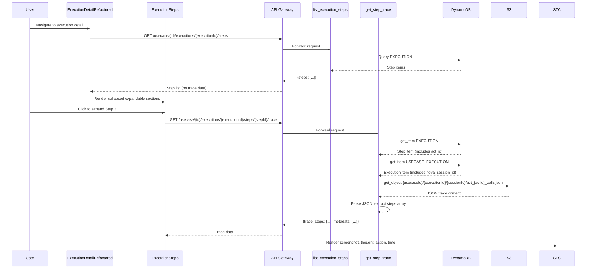
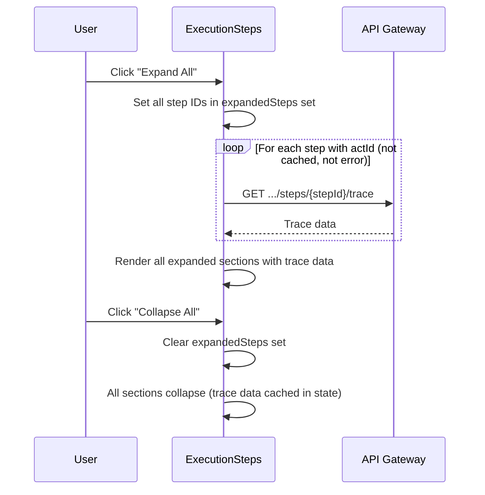

# Design Document: Execution Detail UI Enhancement

## Overview

This feature replaces the modal-based trace viewing on the execution detail page with inline expandable sections. Each execution step becomes a Cloudscape `ExpandableSection` that shows status, cached indicator, instruction, and validation when collapsed, and reveals the full trace data (screenshot, thought process, agent action, time spent) when expanded. The recording player is also moved from a modal into an expandable section at the execution level.

The backend is extended with a new Lambda endpoint that fetches and parses JSON trace files from S3 (`act_{act_id}_calls.json`) and returns structured trace data per step. This eliminates the need for the frontend to fetch HTML trace files via presigned URLs and provides a denser, more relevant view of each step's execution.

Key benefits: users can view multiple steps simultaneously, scroll through the entire test journey, and quickly scan step outcomes without opening/closing modals.

### Design Decisions

1. **Lazy-load trace data on expand**: Trace data (including base64 screenshots) is fetched per-step when the user expands a section, rather than loading all traces upfront. This keeps the initial page load fast and avoids transferring large payloads for steps the user never inspects.

2. **New GET endpoint instead of modifying list_execution_steps**: The existing `list_execution_steps` Lambda returns step metadata from DynamoDB. Adding S3 reads for every step would slow it down and return unnecessary data. A separate `get_step_trace` endpoint keeps concerns separated and allows lazy loading.

3. **JSON trace over HTML trace**: The JSON trace file (`act_{act_id}_calls.json`) contains structured data (thought, action, screenshot, time) that can be rendered natively in React. The HTML trace contains redundant prompt sections and requires an iframe to display.

4. **Controlled expansion state**: Using controlled `expanded` prop on `ExpandableSection` (not `defaultExpanded`) enables "Expand All" / "Collapse All" functionality and allows the parent component to manage which sections are open.

5. **Recording in expandable section**: Moving the recording from a modal to an `ExpandableSection` keeps the user on the same page and allows them to reference steps while watching the recording.

6. **Reuse existing scope `api/executions.read`**: The new endpoint reads execution trace data, which falls under the existing `api/executions.read` scope. No new OAuth scopes are needed.

## Architecture

```mermaid
graph TD
    subgraph Frontend
        EDR[ExecutionDetailRefactored]
        EI[ExecutionInformation]
        ES[ExecutionSteps - modified]
        SES[StepExpandableSection - new]
        SH[StepHeader - new]
        STC[StepTraceContent - new]
        RP[RecordingPlayer]
    end

    subgraph Backend
        LEST[list_execution_steps Lambda]
        GST[get_step_trace Lambda - new]
        S3[S3 Bucket - JSON Traces]
        DDB[DynamoDB]
    end

    EDR --> EI
    EDR --> ES
    EDR -->|ExpandableSection| RP
    ES --> SES
    SES --> SH
    SES -->|on expand| STC
    STC -->|GET /usecase/{id}/executions/{executionId}/steps/{stepId}/trace| GST
    GST -->|get_item execution| DDB
    GST -->|get_object act_{act_id}_calls.json| S3
    LEST -->|query steps| DDB
```

## Sequence Diagrams

### Main Flow: Page Load and Step Expansion



### Expand All / Collapse All Flow



## Components and Interfaces

### Backend: New Lambda `get_step_trace`

**Purpose**: Fetch and parse JSON trace data for a single execution step from S3.

**Route**: `GET /usecase/{id}/executions/{executionId}/steps/{stepId}/trace`

**Scope**: `api/executions.read` (existing scope)

**Interface**:
```python
def handler(event: Dict[str, Any], context: Any) -> Dict[str, Any]:
    """
    Fetches JSON trace file from S3 for a given execution step.
    
    Path Parameters:
        id: usecase ID
        executionId: execution ID
        stepId: step sort number (used as step identifier)
    
    Returns:
        200: {trace_steps: [...], metadata: {...}}
        400: Missing required parameters
        404: Step not found, execution not found, or trace file not found
        500: Internal server error
    """
```

**Responsibilities**:
- Validate `api/executions.read` scope
- Look up execution step in DynamoDB to get `act_id`
- Look up execution in DynamoDB to get `nova_session_id`
- Fetch `act_{act_id}_calls.json` from S3 at path `{usecaseId}/{executionId}/{sessionId}/`
- Parse JSON and return structured trace data
- Handle missing/malformed JSON gracefully

### Backend: Pydantic Models

```python
from pydantic import BaseModel
from typing import List, Optional

class TraceStep(BaseModel):
    step_num: int
    thought: str
    action: str
    screenshot: str  # base64 encoded PNG
    time_s: float

class TraceMetadata(BaseModel):
    session_id: str
    act_id: str
    num_steps_executed: int
    start_time: float
    end_time: float
    prompt: str
    time_worked_s: float

class StepTraceResponse(BaseModel):
    trace_steps: List[TraceStep]
    metadata: TraceMetadata

class StepTraceErrorResponse(BaseModel):
    error: str
```

### Frontend: New Component `StepExpandableSection`

**Purpose**: Renders a single execution step as a Cloudscape ExpandableSection.

**Props**:
```typescript
interface StepExpandableSectionProps {
  step: any;  // execution step from API
  expanded: boolean;
  onExpandChange: (expanded: boolean) => void;
  usecaseId: string;
  executionId: string;
}
```

**Responsibilities**:
- Render collapsed header with status, cached badge, instruction, validation
- On expand: fetch trace data via API if not already loaded
- Show loading spinner while fetching
- Show error alert if fetch fails
- Cache fetched trace data in local state to avoid re-fetching on collapse/expand

### Frontend: New Component `StepHeader`

**Purpose**: Renders the collapsed header content for a step expandable section.

**Props**:
```typescript
interface StepHeaderProps {
  stepNum: number;
  status: string;
  isCached: boolean;
  instruction: string;
  stepType: string;
  validation?: {
    validation_type: string;
    validation_operator: string;
    validation_value: string;
    actual_value: string;
  };
}
```

**Responsibilities**:
- Display step number and instruction text
- Show status icon using existing `StatusIndicatorCompact`
- Show "Cached" badge when `actId === "cached"`
- Show validation result using existing `ValidationResult` component

### Frontend: New Component `StepTraceContent`

**Purpose**: Renders the expanded trace content with screenshot and details in a responsive grid.

**Props**:
```typescript
interface TraceStep {
  step_num: number;
  thought: string;
  action: string;
  screenshot: string;  // base64
  time_s: number;
}

interface StepTraceContentProps {
  traceSteps: TraceStep[];
  loading: boolean;
  error: string | null;
}
```

**Responsibilities**:
- Render 2-column Grid layout (screenshot left, details right) on desktop
- Stack vertically on mobile (< 688px)
- Display each trace sub-step's screenshot, thought, action, and time
- Show loading spinner while data is being fetched
- Show error alert if trace data failed to load
- Handle missing screenshot/thought/action gracefully

### Frontend: Modified `ExecutionSteps`

**Changes**:
- Remove: Table component, modal state, `handleViewFile`, `onViewFile` prop
- Add: "Test Journey Steps" header with "Expand All" / "Collapse All" buttons
- Add: Map steps to `StepExpandableSection` components
- Add: `expandedSteps` state (Set<number>) for controlled expansion
- Add: `traceDataCache` state (Map<number, TraceData>) to avoid re-fetching

### Frontend: Modified `ExecutionDetailRefactored`

**Changes**:
- Remove: HTML trace modal (`modalVisible`, `modalContent`, iframe modal)
- Remove: Recording modal (`recordingModalVisible`)
- Remove: `handleViewContent` callback
- Add: Recording `ExpandableSection` (collapsed by default) containing `RecordingPlayer`
- Remove: `onViewFile` prop from `ExecutionSteps`

### Frontend: Modified `ExecutionInformation`

**Changes**:
- Remove: "Recording" → "View" button from KeyValuePairs
- Remove: `onViewRecording` prop (recording now in expandable section)

## Data Models

### JSON Trace File Structure (S3)

S3 Key: `{usecaseId}/{executionId}/{sessionId}/act_{actId}_calls.json`

| Field | Type | Description |
|---|---|---|
| `steps` | Array<TraceStep> | List of trace sub-steps within this act |
| `steps[].step_num` | int | Sub-step number within the act |
| `steps[].thought` | string | Agent's reasoning/thought process |
| `steps[].action` | string | Agent action taken (e.g., `agentClick(...)`) |
| `steps[].screenshot` | string | Base64-encoded PNG screenshot |
| `steps[].time_s` | float | Time spent on this sub-step in seconds |
| `metadata` | object | Act-level metadata |
| `metadata.session_id` | string | Nova Act session ID |
| `metadata.act_id` | string | Act ID |
| `metadata.num_steps_executed` | int | Total sub-steps executed |
| `metadata.start_time` | float | Unix timestamp of act start |
| `metadata.end_time` | float | Unix timestamp of act end |
| `metadata.prompt` | string | The instruction/prompt for this act |
| `metadata.time_worked_s` | float | Total time worked in seconds |

### API Response: GET .../steps/{stepId}/trace

| Field | Type | Description |
|---|---|---|
| `trace_steps` | Array<TraceStep> | Parsed trace sub-steps |
| `metadata` | TraceMetadata | Act-level metadata |

### DynamoDB Records (Existing, No Changes)

**Execution Step** (PK: `EXECUTION#{executionId}`, SK: `EXECUTION_STEP#{sort}`):

| Field | Type | Description |
|---|---|---|
| `sort` | number | Step order number |
| `status` | string | `pending` / `executing` / `success` / `error` / `failed` / `stopped` |
| `instruction` | string | Step instruction text |
| `actId` / `act_id` | string | Nova Act ID, `"cached"`, or `"error"` |
| `step_type` | string | `navigation` / `validation` / `assertion` / `download` |
| `validation_type` | string | Validation type (for validation steps) |
| `validation_operator` | string | Comparison operator |
| `validation_value` | string | Expected value |
| `actual_value` | string | Actual value from execution |
| `logs` | string | Step logs |

**Execution** (PK: `USECASE_EXECUTION#{usecaseId}`, SK: `EXECUTION#{executionId}`):

| Field | Type | Description |
|---|---|---|
| `nova_session_id` | string | Nova Act session ID (used for S3 path) |
| `status` | string | Execution status |

## Key Functions with Formal Specifications

### Backend: `get_step_trace.handler`

```python
def handler(event: Dict[str, Any], context: Any) -> Dict[str, Any]:
```

**Preconditions:**
- `event` contains valid `pathParameters` with `id`, `executionId`, `stepId`
- Request has valid authorization token with `api/executions.read` scope
- `BUCKET_NAME` and `TABLE_NAME` environment variables are set

**Postconditions:**
- Returns 200 with `{trace_steps, metadata}` if trace file exists and is valid JSON
- Returns 400 if required path parameters are missing
- Returns 404 if step, execution, or trace file not found
- Returns 404 if step has no `act_id` or `act_id` is `"cached"` or `"error"`
- Returns 500 on unexpected errors
- No side effects (read-only operation)

### Backend: `parse_trace_json`

```python
def parse_trace_json(raw_json: str) -> StepTraceResponse:
```

**Preconditions:**
- `raw_json` is a non-empty string

**Postconditions:**
- Returns `StepTraceResponse` with validated `trace_steps` and `metadata`
- Raises `ValueError` if JSON is malformed or missing required fields
- Each `TraceStep` has non-negative `step_num` and `time_s`

### Frontend: `fetchStepTrace`

```typescript
async function fetchStepTrace(
  usecaseId: string,
  executionId: string,
  stepId: string
): Promise<StepTraceData>
```

**Preconditions:**
- `usecaseId`, `executionId`, `stepId` are non-empty strings
- User is authenticated with valid session

**Postconditions:**
- Returns parsed trace data on success
- Throws error with descriptive message on failure
- Does not modify any global state

## Example Usage

### Backend: Lambda Handler

```python
# GET /usecase/{id}/executions/{executionId}/steps/{stepId}/trace
def handler(event, context):
    user_identity, error = require_scopes(event, ['api/executions.read'])
    if error:
        return error

    usecase_id = event['pathParameters']['id']
    execution_id = event['pathParameters']['executionId']
    step_id = event['pathParameters']['stepId']

    # 1. Get step to find act_id
    step = table.get_item(Key={
        'pk': f'EXECUTION#{execution_id}',
        'sk': f'EXECUTION_STEP#{step_id}'
    })
    act_id = step['Item']['act_id']

    # 2. Get execution to find nova_session_id
    execution = table.get_item(Key={
        'pk': f'USECASE_EXECUTION#{usecase_id}',
        'sk': f'EXECUTION#{execution_id}'
    })
    session_id = execution['Item']['nova_session_id']

    # 3. Find and fetch JSON trace from S3
    prefix = f"{usecase_id}/{execution_id}/{session_id}/"
    s3_key = find_json_trace_key(bucket, prefix, act_id)
    raw = s3_client.get_object(Bucket=bucket, Key=s3_key)['Body'].read()

    # 4. Parse and return
    trace = parse_trace_json(raw.decode('utf-8'))
    return create_response(200, trace.model_dump())
```

### Frontend: Step Expansion

```typescript
// In StepExpandableSection
const [traceData, setTraceData] = useState<StepTraceData | null>(null);
const [loading, setLoading] = useState(false);

const handleExpandChange = async (expanded: boolean) => {
  onExpandChange(expanded);
  if (expanded && !traceData && hasTrace) {
    setLoading(true);
    try {
      const data = await api.get(
        `usecase/${usecaseId}/executions/${executionId}/steps/${step.sort}/trace`
      );
      setTraceData(data);
    } catch (err) {
      setError('Failed to load trace data');
    } finally {
      setLoading(false);
    }
  }
};
```

## Correctness Properties

*A property is a characteristic or behavior that should hold true across all valid executions of a system-essentially, a formal statement about what the system should do. Properties serve as the bridge between human-readable specifications and machine-verifiable correctness guarantees.*

### Property 1: Trace data completeness

*For any* valid JSON trace file content, parsing it with `parse_trace_json` shall produce a `StepTraceResponse` where every trace sub-step contains `step_num`, `thought`, `action`, `screenshot`, and `time_s` fields, and the metadata contains `session_id`, `act_id`, `num_steps_executed`, `start_time`, `end_time`, `prompt`, and `time_worked_s` fields.

**Validates: Requirements 1.1, 1.5, 2.1, 2.2, 2.3**

### Property 2: Scope authorization enforcement

*For any* request to `get_step_trace` without a valid `api/executions.read` scope, the endpoint shall return a 403 response and not process the request further.

**Validates: Requirements 4.1, 4.2**

### Property 3: Non-traceable act_id rejection

*For any* step where `act_id` is `None`, `"cached"`, or `"error"`, the `get_step_trace` endpoint shall return a 404 response with a descriptive error message.

**Validates: Requirements 3.4, 3.5, 3.6**

### Property 4: JSON parse error resilience

*For any* malformed or structurally invalid JSON string, the `parse_trace_json` function shall raise a `ValueError` (never an unhandled exception), and the endpoint shall return a 404 response rather than a 500.

**Validates: Requirements 2.4, 3.8**

### Property 5: S3 key construction correctness

*For any* combination of `usecaseId`, `executionId`, `sessionId`, and `actId`, the S3 key constructed by the endpoint shall match the pattern `{usecaseId}/{executionId}/{sessionId}/act_{actId}_calls.json`.

**Validates: Requirement 1.4**

### Property 6: Step header content completeness

*For any* execution step, the Step_Header component shall render the step number, status icon, and instruction text; and additionally render a "Cached" badge when `act_id` is "cached" and a validation result when validation data is present.

**Validates: Requirements 5.1, 5.2**

### Property 7: Trace data client-side caching

*For any* step that has been expanded and its trace data successfully fetched, collapsing and re-expanding that step shall display the cached trace data without triggering another API call.

**Validates: Requirements 6.5, 6.6**

### Property 8: Expand All / Collapse All round-trip

*For any* set of steps, clicking "Expand All" shall set all step IDs in the expanded set, and clicking "Collapse All" shall clear the expanded set, returning to the initial collapsed state.

**Validates: Requirements 7.2, 7.3**

### Property 9: Expand All selective fetching

*For any* "Expand All" action on a set of steps with mixed `act_id` values, API calls for trace data shall only be made for steps where `act_id` exists and is not `"cached"` or `"error"`.

**Validates: Requirement 7.4**

### Property 10: Recording section conditional rendering

*For any* execution, the Recording_Section shall be rendered if and only if a recording URL exists. When no recording URL is present, the section shall not appear.

**Validates: Requirements 9.1, 9.4**

### Property 11: No presigned URL exposure

*For any* response from the `get_step_trace` endpoint, the response body shall not contain S3 presigned URLs. All trace data (including screenshots) shall be served inline.

**Validates: Requirement 4.3**

## Error Handling

| Scenario | Backend Response | Frontend Behavior |
|---|---|---|
| Missing path parameters | 400: `{error: "Missing required parameters"}` | Should not occur (URL constructed by frontend) |
| Step not found in DynamoDB | 404: `{error: "Execution step not found"}` | Show "Trace unavailable" in expanded section |
| Execution not found in DynamoDB | 404: `{error: "Execution not found"}` | Show error alert |
| Step has no `act_id` | 404: `{error: "No trace available for this step"}` | Don't show expand arrow / show "No trace" |
| `act_id` is `"cached"` | 404: `{error: "No trace available for cached step"}` | Show "Cached" badge, no trace content |
| `act_id` is `"error"` | 404: `{error: "No trace available for errored step"}` | Show error status, no trace content |
| JSON trace file not found in S3 | 404: `{error: "Trace file not found"}` | Show "Trace unavailable" message |
| JSON trace file is malformed | 404: `{error: "Failed to parse trace data"}` | Show "Trace unavailable" message |
| S3 access error | 500: `{error: "Internal server error"}` | Show generic error alert |
| Network error (frontend) | N/A | Show "Failed to load trace" with retry option |

## Testing Strategy

### Unit Testing: Backend

**Test file**: `web-app/lambdas/endpoints/test_get_step_trace.py`

Tests:
- Happy path: valid step with JSON trace in S3 → 200 with parsed data
- Missing path parameters → 400
- Step not found → 404
- Execution not found → 404
- Step with `act_id = "cached"` → 404
- Step with `act_id = "error"` → 404
- Step with no `act_id` → 404
- JSON trace file not in S3 → 404
- Malformed JSON in S3 → 404
- S3 `ClientError` → 500
- Scope validation: missing scope → 403
- `parse_trace_json` with valid JSON → correct `StepTraceResponse`
- `parse_trace_json` with missing fields → `ValueError`
- `parse_trace_json` with empty steps array → valid response with empty list

**Mocking**: `boto3.resource` (DynamoDB), `boto3.client` (S3), `require_scopes`

### Unit Testing: Frontend

**Test file**: `web-app/frontend/src/components/execution/__tests__/StepExpandableSection.test.tsx`

Tests:
- Renders collapsed with correct header (status, instruction, cached badge)
- Expands and fetches trace data on click
- Shows loading spinner while fetching
- Shows trace content after successful fetch
- Shows error message on fetch failure
- Does not re-fetch on collapse/expand cycle
- Handles step with no `act_id` (no expand)
- Handles cached step (shows badge, no trace fetch)

**Test file**: `web-app/frontend/src/components/execution/__tests__/ExecutionSteps.test.tsx`

Tests:
- Renders all steps as expandable sections
- "Expand All" expands all sections
- "Collapse All" collapses all sections
- Expand All only fetches trace for steps with valid `act_id`

### Property-Based Testing

**Library**: `hypothesis` (Python backend)

1. **Property 1: Trace data completeness** — Generate random valid JSON trace structures, verify `parse_trace_json` returns all required fields.
2. **Property 3: Graceful handling** — Generate random `act_id` values including edge cases (`None`, `"cached"`, `"error"`, empty string), verify correct 404 responses.
3. **Property 7: JSON parse resilience** — Generate random malformed JSON strings, verify `parse_trace_json` raises `ValueError` (never unhandled exceptions).

### Integration Testing

- End-to-end: Execute a usecase, navigate to execution detail, expand a step, verify screenshot and thought process are displayed.
- Verify recording expandable section loads and plays recording.

## Performance Considerations

- **Lazy loading**: Trace data fetched per-step on expand, not on page load. Initial page load only queries DynamoDB for step metadata.
- **Screenshot size**: Base64 screenshots can be large (100KB-1MB each). The API returns them as-is from the JSON trace. For MVP, this is acceptable. Future optimization: generate thumbnails or use presigned URLs for images.
- **Expand All with many steps**: If an execution has 50+ steps, "Expand All" triggers parallel API calls. Consider adding a concurrency limit (e.g., 5 concurrent fetches) or a warning for large executions.
- **Trace data caching**: Once fetched, trace data is cached in component state. Navigating away and back will re-fetch (acceptable for MVP).

## Security Considerations

- The new endpoint uses the existing `api/executions.read` scope — no new scopes needed.
- The endpoint validates scope via `require_scopes` (same pattern as all other endpoints).
- S3 access is server-side only; no presigned URLs are exposed to the frontend for JSON traces.
- Base64 screenshots are served through the API response, not directly from S3.

## Dependencies

- **Cloudscape ExpandableSection**: `@cloudscape-design/components/expandable-section` (already in project dependencies)
- **Cloudscape Grid**: `@cloudscape-design/components/grid` (already in project dependencies)
- **Pydantic**: For `StepTraceResponse` model validation (already in Lambda dependencies)
- **boto3**: S3 `get_object` for JSON trace retrieval (already available in Lambda runtime)
- **Existing components reused**: `StatusIndicatorCompact`, `ValidationResult`, `RecordingPlayer`

## User Journey

### QA Engineer: Reviewing Test Execution Results

1. **Navigate to execution detail**: QA engineer clicks on an execution from the execution history list.
2. **Scan step overview**: All steps are displayed as collapsed expandable sections. Each shows status icon, step number, instruction, cached badge (if applicable), and validation result. The QA engineer can quickly scan which steps passed/failed.
3. **Inspect a failing step**: QA engineer clicks on a failed step to expand it. A loading spinner appears briefly, then the trace content loads showing:
   - Screenshot of the browser at that point
   - Agent's thought process explaining its reasoning
   - The action taken (e.g., `agentClick('submit-button')`)
   - Time spent on the step
4. **Compare multiple steps**: QA engineer expands several steps simultaneously to compare screenshots and understand the flow progression.
5. **View all steps at once**: QA engineer clicks "Expand All" to see the complete journey with all trace data loaded.
6. **Watch recording**: QA engineer expands the "Recording" section at the top to watch the full browser session recording while referencing individual step details below.
7. **Collapse and move on**: QA engineer clicks "Collapse All" to return to the overview, then navigates to another execution.

### Developer: Debugging a Test Failure

1. **Open failing execution**: Developer navigates to a failed execution from a notification or the dashboard.
2. **Find the failing step**: Scans the collapsed step list — the red status icon immediately identifies the failing step.
3. **Expand failing step**: Clicks to expand. Sees the screenshot showing the browser state at failure, reads the agent's thought process to understand what it was trying to do, and sees the action that failed.
4. **Check preceding steps**: Expands the step before the failure to see if the page was in the expected state.
5. **Copy act ID**: Uses the existing copy-to-clipboard for the act ID to reference in logs or bug reports.
