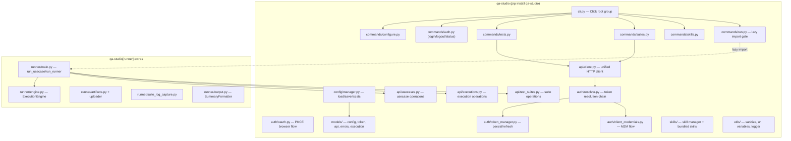

# Design Document: Merge CLI Tools

## Overview

This design describes the unification of `qa-studio-cli` and `qa-studio-ci-runner` into a single Python package (`qa-studio`) with an optional `[runner]` extras group for heavy dependencies. The merged package eliminates duplicated API clients, error hierarchies, config loaders, and token models while preserving all existing functionality behind a single `qa-studio` entry point.

The core insight is that both packages already share the same config file (`~/.qa-studio/config.json`), the same API backend, and overlapping authentication patterns. The runner already reads the CLI's config. Merging them formalizes this coupling into a single, well-structured package.

### Design Decisions

1. **Single package, optional extras** — `pip install qa-studio` for lightweight interactive use; `pip install qa-studio[runner]` for CI/execution. This avoids forcing Nova Act / Playwright / boto3 on interactive users.
2. **Lazy imports** — Runner-heavy modules are only imported when `qa-studio run` is invoked. All other commands start fast with zero runner dependencies.
3. **Unified API client with pluggable auth** — A single `ApiClient` class accepts a token provider callable (`Callable[[], str]`), supporting both static tokens (interactive) and dynamic tokens (client-credentials with refresh).
4. **Config model extension** — `CLIConfig` gains optional M2M fields (`oauth_client_id`, `oauth_client_secret`, `oauth_token_endpoint`) so CI environments can store credentials in the config file instead of env vars.
5. **Single error hierarchy** — One base `QAStudioError` with subclasses `AuthError`, `ConfigError`, `ApiError`, `ExecutionError`. The runner's `RunnerError` becomes `ExecutionError`.
6. **No backward compatibility shim** — The `qa-studio-ci-runner` entry point is removed. Clean break.

## Architecture



### Auth Token Resolution Order

When the `run` command needs a token, the resolver tries sources in this order:

1. **Token file** (`--token-file` flag) — reads `access_token` from JSON, re-reads on each call
2. **Environment variables** (`OAUTH_CLIENT_ID` + `OAUTH_CLIENT_SECRET` + `OAUTH_TOKEN_ENDPOINT`) — client-credentials flow
3. **Config file M2M credentials** (`~/.qa-studio/config.json` optional fields) — client-credentials flow
4. **Stored user token** (`~/.qa-studio/token.json`) — from interactive `qa-studio login`, with auto-refresh

For interactive commands (`tests`, `suites`, etc.), the existing flow is preserved: load token from `token.json`, refresh if expired, fail with "run `qa-studio login`" message.

### API URL Handling

The CLI stores `api_url` without `/api` suffix (e.g. `https://api.qa-studio.com`). The CLI commands prepend `/api` in their request paths (e.g. `/api/usecases`). The runner expects `{api_url}/api` as its base URL.

The unified API client normalizes this:
- `ApiClient` stores the raw `api_url` from config (no `/api` suffix)
- All request paths include `/api` prefix explicitly (e.g. `/api/usecase/{id}`)
- The runner's API modules (`usecases.py`, `executions.py`, `test_suites.py`) already use paths without `/api` prefix — these will be updated to include it, matching the CLI convention

This eliminates the inconsistency where the runner appended `/api` to the base URL.

## Components and Interfaces

### Package Layout

```
qa-studio-cli/
├── setup.py
├── requirements.txt                  # core: click, requests, pydantic
├── requirements-runner.txt           # runner extras: nova-act, boto3, tenacity, playwright
├── qa_studio_cli/
│   ├── __init__.py
│   ├── cli.py                        # Click root group + top-level commands
│   ├── commands/
│   │   ├── __init__.py
│   │   ├── tests.py                  # tests group (list, get, create, run, delete)
│   │   ├── suites.py                 # suites group (list, get, create, add-tests, remove-test, run)
│   │   ├── skills.py                 # skills group (list, show) + setup/uninstall
│   │   └── run.py                    # `qa-studio run` — lazy import gate
│   ├── config/
│   │   ├── __init__.py
│   │   └── manager.py               # save_config, load_config, config_exists
│   ├── auth/
│   │   ├── __init__.py
│   │   ├── oauth.py                  # Browser PKCE flow (unchanged)
│   │   ├── token_manager.py          # Token persistence + refresh (unchanged)
│   │   ├── client_credentials.py     # M2M OAuth client-credentials flow
│   │   └── resolver.py              # Token resolution chain for runner
│   ├── api/
│   │   ├── __init__.py
│   │   ├── client.py                 # Unified ApiClient
│   │   ├── usecases.py               # UseCaseAPI (from runner)
│   │   ├── executions.py             # ExecutionAPI (from runner)
│   │   └── test_suites.py            # TestSuiteAPI (from runner)
│   ├── models/
│   │   ├── __init__.py
│   │   ├── config.py                 # CLIConfig (extended with M2M fields)
│   │   ├── token.py                  # TokenData
│   │   ├── api.py                    # UsecaseModel, SuiteModel, StepModel, etc.
│   │   ├── errors.py                 # Unified error hierarchy
│   │   └── execution.py              # Runner-specific models (lazy import only)
│   ├── runner/
│   │   ├── __init__.py
│   │   ├── main.py                   # run_usecase, run_runner, _run_*_local/remote
│   │   ├── engine.py                 # ExecutionEngine (Nova Act)
│   │   ├── step_executor.py          # Step execution logic
│   │   ├── workflow_manager.py       # Workflow orchestration
│   │   ├── artifacts.py              # Artifact path management
│   │   ├── artifact_uploader.py      # S3 upload logic
│   │   ├── suite_log_capture.py      # Suite-level log capture
│   │   └── output.py                 # SummaryFormatter
│   ├── skills/
│   │   ├── __init__.py
│   │   └── manager.py               # Skill install/uninstall/status
│   └── utils/
│       ├── __init__.py
│       ├── errors.py                 # sanitize_error_message()
│       ├── url.py                    # apply_base_url_override()
│       ├── variables.py              # merge_variables()
│       └── logger.py                 # setup_logging()
├── skills/                           # Bundled skill content (SKILL.md files)
│   ├── qa-studio-suites/
│   └── qa-studio-tests/
└── tests/
    ├── test_cli.py
    ├── test_api_client.py
    ├── test_config.py
    ├── test_auth.py
    ├── test_tests_commands.py
    ├── test_suites_commands.py
    ├── test_skills.py
    ├── test_models.py
    ├── test_error_hierarchy.py
    ├── test_runner_main.py           # requires [runner] extras
    ├── test_engine.py                # requires [runner] extras
    ├── test_artifacts.py             # requires [runner] extras
    └── conftest.py                   # skip markers for runner tests
```

### Click Command Tree

```
qa-studio
├── configure                         # Interactive setup (core + optional M2M fields)
├── login                             # Browser-based OAuth PKCE
├── logout                            # Delete stored tokens
├── status                            # Show auth + skills status
├── setup                             # Install Kiro skills
├── uninstall                         # Remove Kiro skills
├── tests
│   ├── list                          # List all tests
│   ├── get <id>                      # Get test details + steps
│   ├── create --from-journey         # Create from user journey
│   ├── run <id>                      # Execute via API (remote)
│   └── delete <id>                   # Delete a test
├── suites
│   ├── list                          # List all suites
│   ├── get <id>                      # Get suite details
│   ├── create                        # Create a suite
│   ├── add-tests <suite_id> <ids..>  # Add tests to suite
│   ├── remove-test <suite_id> <id>   # Remove test from suite
│   └── run <suite_id>                # Execute suite via API (remote)
├── skills
│   ├── list                          # List available skills
│   └── show <name>                   # Show skill details
└── run                               # Local Nova Act execution (requires [runner])
    --usecase-id / --suite-id         # Mutually exclusive target
    --local-only                      # Skip remote state tracking
    --token-file                      # Token file auth
    --base-url                        # URL override
    --var KEY=VALUE                    # Variable overrides (repeatable)
    --region                          # AWS region override
    --model-id                        # Bedrock model override
    --timeout                         # Global timeout (default: 3600)
    --keep-artifacts                   # Keep local artifacts after upload
    --verbose                          # Enable verbose logging
    --format json|human               # Output format (default: json)
```

### Unified API Client Interface

```python
class ApiClient:
    """Unified HTTP client for QA Studio API."""

    def __init__(self, base_url: str, token_provider: Callable[[], str]):
        """
        Args:
            base_url: API base URL without /api suffix (e.g. https://api.qa-studio.com)
            token_provider: Callable that returns a valid access token string.
                            Called on every request to support token refresh.
        """
        self.base_url = base_url.rstrip("/")
        self._token_provider = token_provider
        self._session = requests.Session()

    def get(self, path: str, params: dict | None = None) -> dict: ...
    def post(self, path: str, json_body: dict | None = None) -> dict: ...
    def patch(self, path: str, json_body: dict | None = None) -> dict: ...
    def delete(self, path: str) -> dict | None: ...
```

Key design choices:
- Uses `requests.Session()` for connection pooling (from runner's client)
- `token_provider` callable abstracts over static tokens, client-credentials, and token-file modes
- Error mapping matches the CLI's existing behavior (401 → "session expired", 403 → "insufficient permissions", 404 → "not found")
- All paths include `/api` prefix explicitly

### Auth Resolver Interface

```python
class TokenResolver:
    """Resolve access token from multiple sources in priority order."""

    def __init__(
        self,
        token_file: str | None = None,
        config: CLIConfig | None = None,
    ):
        """
        Resolution order:
        1. Token file (if --token-file provided)
        2. Env vars OAUTH_CLIENT_ID/SECRET/TOKEN_ENDPOINT → client-credentials
        3. Config file M2M fields → client-credentials
        4. Stored user token (~/.qa-studio/token.json) with auto-refresh
        """

    def get_token(self) -> str:
        """Return a valid access token. Raises AuthError on failure."""
```

### Lazy Import Gate (commands/run.py)

```python
@cli.command()
@click.option('--usecase-id', default=None)
@click.option('--suite-id', default=None)
# ... all other options ...
def run(usecase_id, suite_id, ...):
    """Execute tests locally with Nova Act (requires: pip install qa-studio[runner])."""
    try:
        from qa_studio_cli.runner.main import run_usecase, run_runner
    except ImportError:
        click.echo(
            "Runner dependencies not installed. Run: pip install qa-studio[runner]",
            err=True,
        )
        raise SystemExit(1)
    # ... delegate to run_usecase or run_runner
```


### Client Credentials Module

```python
class ClientCredentialsProvider:
    """OAuth client-credentials flow with in-memory token caching."""

    def __init__(self, client_id: str, client_secret: str, token_endpoint: str):
        self._client_id = client_id
        self._client_secret = client_secret
        self._token_endpoint = token_endpoint
        self._access_token: str | None = None
        self._expires_at: datetime | None = None

    def get_token(self) -> str:
        """Return cached token or request a new one. Raises AuthError."""

    def _request_token(self) -> str:
        """POST to token endpoint with client_credentials grant."""

    def _is_expired(self) -> bool:
        """True if token is expired or expires within 5 minutes."""
```

This replaces the runner's `OAuthClient` class. The scopes requested match the existing runner scopes: `api/suite.read api/suite.write api/usecases.read api/usecases.execute api/executions.read api/executions.write`.

### Token File Provider

```python
class TokenFileProvider:
    """Read access_token from a JSON file, re-reading on each call."""

    def __init__(self, path: str):
        self._path = Path(path).expanduser()
        # Validate on init
        self.get_token()

    def get_token(self) -> str:
        """Read and return access_token from the JSON file. Raises AuthError."""
```

### setup.py with Extras

```python
setup(
    name="qa-studio",
    version="0.2.0",
    packages=find_packages(),
    package_data={"": ["skills/**/*.md"]},
    include_package_data=True,
    install_requires=[
        "click>=8.1.7",
        "requests>=2.31.0",
        "pydantic>=2.5.0",
    ],
    extras_require={
        "runner": [
            "nova-act==3.1.157.0",
            "boto3>=1.34.0",
            "tenacity>=8.2.0",
            "playwright",
        ],
    },
    python_requires=">=3.11",
    entry_points={
        "console_scripts": [
            "qa-studio=qa_studio_cli.cli:cli",
        ],
    },
)
```

Note: `python-dotenv` is dropped — the unified config module handles env var overlay directly. The runner's `Settings.from_env()` pattern is replaced by `load_config()` with env var overlay + `TokenResolver`.

## Data Models

### CLIConfig (extended)

```python
class CLIConfig(BaseModel):
    """Persisted CLI configuration in ~/.qa-studio/config.json."""

    api_url: str = Field(..., description="QA Studio API base URL")
    cognito_domain: str = Field(..., description="Cognito hosted UI domain")
    client_id: str = Field(..., min_length=1, description="Cognito app client ID (public)")

    # Optional M2M client credentials (for CI/runner auth)
    oauth_client_id: Optional[str] = Field(default=None, description="OAuth M2M client ID")
    oauth_client_secret: Optional[str] = Field(default=None, description="OAuth M2M client secret")
    oauth_token_endpoint: Optional[str] = Field(default=None, description="Cognito token endpoint URL")

    @field_validator("api_url", "cognito_domain")
    @classmethod
    def validate_https_url(cls, v: str) -> str:
        if not v.startswith("https://"):
            raise ValueError("URL must start with https://")
        return v.rstrip("/")

    @field_validator("oauth_token_endpoint")
    @classmethod
    def validate_optional_https_url(cls, v: str | None) -> str | None:
        if v is not None and not v.startswith("https://"):
            raise ValueError("Token endpoint must start with https://")
        return v
```

### TokenData (unchanged)

```python
class TokenData(BaseModel):
    access_token: str = Field(..., min_length=1)
    refresh_token: str = Field(..., min_length=1)
    expires_at: int = Field(..., gt=0)
    token_type: str = Field(default="Bearer")
```

### Unified Error Hierarchy

```python
class QAStudioError(Exception):
    """Base exception for all QA Studio errors."""
    def __init__(self, message: str):
        super().__init__(message)
        self.message = message

class AuthError(QAStudioError):
    """Authentication failed or tokens invalid."""
    pass

class ConfigError(QAStudioError):
    """Configuration missing or invalid."""
    pass

class ApiError(QAStudioError):
    """Backend API returned non-success HTTP status."""
    def __init__(self, status_code: int, message: str, error_code: str | None = None):
        super().__init__(message)
        self.status_code = status_code
        self.error_code = error_code

    def __str__(self) -> str:
        if self.error_code:
            return f"[{self.status_code}] {self.message} ({self.error_code})"
        return f"[{self.status_code}] {self.message}"

class ExecutionError(QAStudioError):
    """Test execution failed (runner-specific)."""
    pass
```

This replaces both the CLI's `AuthError/ConfigError/ApiError` and the runner's `RunnerError/AuthenticationError/APIError/ConfigurationError/ExecutionError`. The mapping:

| Old (CLI) | Old (Runner) | New |
|-----------|-------------|-----|
| `AuthError` | `AuthenticationError` | `AuthError` |
| `ConfigError` | `ConfigurationError` | `ConfigError` |
| `ApiError` | `APIError` | `ApiError` |
| — | `RunnerError` | `QAStudioError` |
| — | `ExecutionError` | `ExecutionError` |

### Execution Models (runner-specific, lazy import)

These models live in `models/execution.py` and are only imported by runner code:

- `StepResult` (dataclass) — result of a single step
- `UseCaseMetadata` — use case definition from API
- `UseCaseStep` — step within a use case
- `StepResultDetail` — step result in execution output
- `ArtifactPaths` — local artifact file paths
- `LocalExecutionResult` — local-only execution result
- `RemoteExecutionResult` — remote execution result

These are moved as-is from `qa-studio-ci-runner/src/execution/models.py`. The `TokenFileData` model is removed — the `TokenFileProvider` reads `access_token` directly without a full model.

### API Response Models (unchanged)

All existing models from `qa_studio_cli/models/api.py` remain unchanged:
- `UsecaseModel`, `StepModel`, `SuiteModel`, `SuiteUsecaseModel`
- `SuiteExecutionResponse`, `GenerateUsecaseResponse`, `ImportUsecaseResponse`, `ExecuteUsecaseResponse`


## Correctness Properties

*A property is a characteristic or behavior that should hold true across all valid executions of a system — essentially, a formal statement about what the system should do. Properties serve as the bridge between human-readable specifications and machine-verifiable correctness guarantees.*

### Property 1: Config round-trip with optional M2M fields

*For any* valid `CLIConfig` instance (with or without optional M2M fields `oauth_client_id`, `oauth_client_secret`, `oauth_token_endpoint`), saving the config to disk via `save_config()` and then loading it via `load_config()` should produce a `CLIConfig` that is equal to the original.

**Validates: Requirements 4.1, 4.6**

### Property 2: Environment variable overrides take precedence

*For any* valid config file on disk and *for any* non-empty environment variable value set for `QA_STUDIO_API_URL`, `QA_STUDIO_COGNITO_DOMAIN`, or `QA_STUDIO_CLIENT_ID`, calling `load_config()` should return a `CLIConfig` where the overridden field matches the environment variable value rather than the file value.

**Validates: Requirements 4.2**

### Property 3: HTTPS URL validation rejects non-HTTPS

*For any* string that does not start with `https://`, constructing a `CLIConfig` with that string as `api_url` or `cognito_domain` should raise a `ValidationError`. Conversely, *for any* string starting with `https://` followed by at least one character, validation should accept it.

**Validates: Requirements 4.3**

### Property 4: Sensitive files are written with 0o600 permissions

*For any* valid `CLIConfig` saved via `save_config()` or *for any* valid `TokenData` saved via `save_token()`, the resulting file on disk should have permissions `0o600` (owner read/write only).

**Validates: Requirements 4.4, 5.4**

### Property 5: Mutually exclusive run target validation

*For any* invocation of the `run` command, if both `--usecase-id` and `--suite-id` are provided, the command should reject with a usage error. If neither is provided, the command should also reject. Only when exactly one of the two is provided should the command proceed.

**Validates: Requirements 3.1**

### Property 6: Token file provider returns access_token from valid JSON

*For any* JSON file containing an `access_token` string field, `TokenFileProvider.get_token()` should return that exact string. *For any* JSON file missing the `access_token` field or containing a non-string value, it should raise `AuthError`.

**Validates: Requirements 5.3**

### Property 7: Token file provider re-reads on each call

*For any* two distinct valid token strings, if the token file is written with the first token, then `get_token()` is called, then the file is overwritten with the second token, then `get_token()` is called again, the second call should return the second token (not a cached first token).

**Validates: Requirements 5.6**

### Property 8: API client sends Bearer authorization header

*For any* request made through the unified `ApiClient` (GET, POST, PATCH, or DELETE), the HTTP request should include an `Authorization` header with value `Bearer {token}` where `{token}` is the string returned by the token provider.

**Validates: Requirements 6.1**

### Property 9: API client supports all required HTTP methods

*For any* HTTP method in `{GET, POST, PATCH, DELETE}`, the `ApiClient` should successfully dispatch a request using that method and return the parsed response (or `None` for 204).

**Validates: Requirements 6.5**

### Property 10: All error classes inherit from QAStudioError

*For any* error class in the unified error hierarchy (`AuthError`, `ConfigError`, `ApiError`, `ExecutionError`), it should be a subclass of `QAStudioError`, and all instances should have a `.message` attribute.

**Validates: Requirements 7.4**

### Property 11: Non-run commands do not import runner dependencies

*For any* CLI command other than `run` (i.e. `configure`, `login`, `logout`, `status`, `setup`, `uninstall`, `tests *`, `suites *`, `skills *`), executing that command should not cause `nova_act`, `playwright`, or `boto3` to appear in `sys.modules`.

**Validates: Requirements 9.2**

## Error Handling

### CLI-Level Error Handling

All Click commands catch domain exceptions and translate them to user-friendly messages:

| Exception | CLI Behavior |
|-----------|-------------|
| `ConfigError` | Print message + "Run 'qa-studio configure' first." Exit 1. |
| `AuthError` | Print message + "Run 'qa-studio login'." Exit 1. |
| `ApiError(401)` | "Session expired. Run 'qa-studio login' to re-authenticate." Exit 1. |
| `ApiError(403)` | "Insufficient permissions. {detail}" Exit 1. |
| `ApiError(404)` | "Resource not found." Exit 1. |
| `ApiError(other)` | Print status + message. Exit 1. |
| `ExecutionError` | Print sanitized message. Exit 2. |
| `ImportError` (runner deps) | "Runner dependencies not installed. Run: pip install qa-studio[runner]" Exit 1. |

### Runner-Level Error Handling

The runner's `run_usecase()` and `run_runner()` functions catch all exceptions at the top level:
- Sanitize error messages via `sanitize_error_message()` to strip tokens, emails, and sensitive URL params
- Log the full traceback at DEBUG level
- Exit with code 2 for runner errors, 1 for test failures, 0 for success

### Auth Resolution Errors

The `TokenResolver` tries sources in order and raises `AuthError` only when all sources are exhausted:
- Token file not found or invalid → try next source
- Env vars incomplete → try next source
- Config M2M fields incomplete → try next source
- Stored token expired + refresh fails → raise `AuthError("Session expired. Run 'qa-studio login' to re-authenticate.")`
- No sources available → raise `AuthError` with guidance on which auth method to configure

## Testing Strategy

### Dual Testing Approach

The test suite uses both unit tests and property-based tests:

- **Unit tests**: Verify specific examples, edge cases, error conditions, and integration points (Click command invocations, mocked HTTP responses, file I/O)
- **Property tests**: Verify universal properties across randomly generated inputs (config round-trips, URL validation, token file behavior, auth headers)

Both are complementary — unit tests catch concrete bugs in specific scenarios, property tests verify general correctness across the input space.

### Property-Based Testing Configuration

- **Library**: [Hypothesis](https://hypothesis.readthedocs.io/) for Python
- **Minimum iterations**: 100 per property test (via `@settings(max_examples=100)`)
- **Each property test references its design property** with a tag comment:
  ```python
  # Feature: merge-cli-tools, Property 1: Config round-trip with optional M2M fields
  ```
- **Each correctness property is implemented by a single property-based test**

### Test Organization

```
tests/
├── conftest.py                    # Shared fixtures, runner skip marker
├── test_config.py                 # Config round-trip, env overlay, HTTPS validation (Properties 1-3)
├── test_file_permissions.py       # File permission checks (Property 4)
├── test_run_command.py            # Mutually exclusive options (Property 5)
├── test_token_file_provider.py    # Token file read + re-read (Properties 6-7)
├── test_api_client.py             # Bearer header, HTTP methods, error mapping (Properties 8-9)
├── test_error_hierarchy.py        # Error class inheritance (Property 10)
├── test_lazy_imports.py           # Runner dep isolation (Property 11)
├── test_cli_commands.py           # Unit tests for all Click commands
├── test_auth.py                   # Unit tests for OAuth, token manager, client credentials
├── test_models.py                 # Unit tests for pydantic models
├── test_runner_main.py            # Runner integration tests (requires [runner])
├── test_engine.py                 # ExecutionEngine tests (requires [runner])
└── test_artifacts.py              # Artifact upload tests (requires [runner])
```

### Runner Test Skipping

Runner-specific tests are gated with a pytest marker:

```python
# conftest.py
import pytest

try:
    import nova_act  # noqa: F401
    HAS_RUNNER = True
except ImportError:
    HAS_RUNNER = False

requires_runner = pytest.mark.skipif(
    not HAS_RUNNER,
    reason="Runner extras not installed (pip install qa-studio[runner])"
)
```

```python
# test_engine.py
@requires_runner
class TestExecutionEngine:
    ...
```

### Coverage Target

Aim for 70% unit test coverage across the unified package, with property tests providing additional confidence on core invariants.
