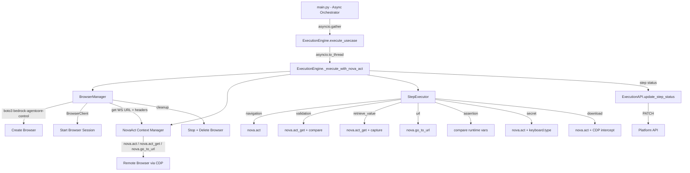

# Design Document: Nova Act Runner Integration

## Overview

This design replaces the fictional `nova_act_sdk` integration in the CI/CD runner's execution engine with the real Nova Act SDK (`nova_act`), `bedrock_agentcore` for browser management, and proper step-type dispatching. The design adapts the proven patterns from the `worker/` directory for the CI/CD runner context, where communication happens via HTTP API (not DynamoDB) and execution is orchestrated with asyncio for parallel usecase execution while Nova Act itself runs synchronously.

The key architectural change is introducing a `BrowserManager` class for browser lifecycle management and a `StepExecutor` class for step-type dispatching, both adapted from the worker's inline implementation into testable, modular components. The existing async orchestration (`execute_all` / `execute_usecase`) is preserved, with synchronous Nova Act execution wrapped in `asyncio.to_thread()`.

## Architecture



### Execution Flow

1. `main.py` calls `ExecutionEngine.execute_all()` with a list of execution records
2. `execute_all()` creates async tasks via `asyncio.gather()` for parallel usecase execution
3. Each `execute_usecase()` wraps the synchronous Nova Act work in `asyncio.to_thread()`
4. Inside the thread, `_execute_with_nova_act()` runs synchronously:
   a. `BrowserManager.create_and_start()` creates and starts a remote browser
   b. `NovaAct` context manager connects to the browser via CDP WebSocket
   c. `StepExecutor` dispatches each step by type
   d. Step status is reported to the API after each step
   e. `BrowserManager.cleanup()` stops and deletes the browser (in finally block)

## Components and Interfaces

### 1. BrowserManager (`src/execution/browser_manager.py`)

Encapsulates the full browser lifecycle. Adapted from `worker/browser.py`.

```python
class BrowserManager:
    """Manages remote browser lifecycle via bedrock-agentcore."""

    def __init__(self, region: str, execution_role_arn: str,
                 s3_bucket: str | None = None, s3_prefix: str | None = None):
        ...

    def create_and_start(self, browser_name: str, execution_id: str) -> tuple[str, dict]:
        """
        Create browser, wait for READY, start session.
        Returns (ws_url, cdp_headers).
        """
        ...

    def cleanup(self) -> None:
        """Stop session and delete browser. Safe to call multiple times."""
        ...
```

Key differences from worker:
- No VPC support initially (CI/CD runs use PUBLIC mode; VPC can be added later)
- Recording is optional (only when `NOVA_ACT_S3_BUCKET` is set)
- Returns `(ws_url, cdp_headers)` tuple instead of a `BrowserClient` object
- Cleanup is idempotent and safe to call in finally blocks

### 2. StepExecutor (`src/execution/step_executor.py`)

Dispatches step execution by type. Adapted from the worker's individual step files into a single cohesive class.

```python
class StepResult:
    """Result of a single step execution."""
    success: bool
    act_id: str
    logs: str
    actual_value: str

class StepExecutor:
    """Executes individual test steps by type."""

    def __init__(self, nova: NovaAct, secrets_resolver: Callable | None = None):
        ...

    def execute(self, step: dict, variables: dict,
                runtime_variables: dict) -> StepResult:
        """
        Dispatch step execution by step_type.
        Returns StepResult with success, act_id, logs, actual_value.
        """
        ...

    def _execute_navigation(self, step: dict) -> StepResult: ...
    def _execute_validation(self, step: dict) -> StepResult: ...
    def _execute_retrieve_value(self, step: dict) -> StepResult: ...
    def _execute_url(self, step: dict) -> StepResult: ...
    def _execute_assertion(self, step: dict,
                           runtime_variables: dict) -> StepResult: ...
    def _execute_secret(self, step: dict) -> StepResult: ...
    def _execute_download(self, step: dict) -> StepResult: ...
```

The `StepResult` dataclass provides a uniform return type across all step types, replacing the inconsistent tuple returns in the worker.

### 3. WorkflowManager (`src/execution/workflow_manager.py`)

Manages Nova Act workflow definitions for GA Service mode. Adapted from `worker/nova_act_workflow.py`.

```python
class WorkflowManager:
    """Manages Nova Act workflow definitions for GA Service mode."""

    NOVA_ACT_REGION = 'us-east-1'

    def __init__(self, s3_bucket: str):
        ...

    def ensure_workflow(self, usecase_id: str) -> str:
        """Ensure workflow definition exists, return workflow name."""
        ...
```

### 4. ExecutionEngine (modified `src/execution/engine.py`)

The existing class is modified to use real Nova Act. Key changes:

- `_execute_with_nova_act()` becomes synchronous (called via `asyncio.to_thread()`)
- Uses `BrowserManager` for browser lifecycle
- Uses `StepExecutor` for step dispatching
- Uses `WorkflowManager` for GA Service mode
- Adds `_execute_steps_sync()` as the synchronous entry point
- Adds step status reporting via `ExecutionAPI.update_step_status()`

```python
class ExecutionEngine:
    def __init__(self, execution_api: ExecutionAPI):
        ...

    async def execute_all(self, executions: list[dict]) -> list[dict]:
        """Unchanged - parallel execution via asyncio.gather."""
        ...

    async def execute_usecase(self, execution: dict) -> dict:
        """Modified - wraps sync execution in asyncio.to_thread."""
        ...

    def _execute_usecase_sync(self, execution: dict) -> dict:
        """New - synchronous usecase execution with Nova Act."""
        ...

    def _execute_with_nova_act(self, execution_details: dict,
                                usecase_id: str,
                                execution_id: str) -> dict:
        """Rewritten - uses real Nova Act with BrowserManager."""
        ...
```

### 5. ExecutionAPI (extended `src/api/executions.py`)

Add step status update method:

```python
class ExecutionAPI:
    # ... existing methods ...

    async def update_step_status(
        self, usecase_id: str, execution_id: str, step_id: str,
        status: str, error_message: str | None = None,
        actual_value: str | None = None
    ) -> dict:
        """Update individual step status via API."""
        ...
```

### 6. Variable Resolution

The existing `_replace_variables()` method is kept but extended to support runtime variables. Runtime variables are accumulated during execution and merged with the initial variables for each step.

```python
def _resolve_variables(self, text: str, variables: dict,
                       runtime_variables: dict) -> str:
    """Replace {{variable}} placeholders. Runtime vars take precedence."""
    merged = {**variables, **runtime_variables}
    # existing regex replacement logic
    ...
```

## Data Models

### StepResult

```python
@dataclass
class StepResult:
    success: bool
    act_id: str = ""
    logs: str = ""
    actual_value: str = ""
```

### BrowserSession (internal to BrowserManager)

```python
@dataclass
class BrowserSession:
    browser_id: str
    ws_url: str
    cdp_headers: dict
    browser_client: BrowserClient  # from bedrock_agentcore
```

### Execution Details (from API - unchanged)

The execution details returned by `GET /usecase/{usecase_id}/executions/{execution_id}` include:

```python
{
    "execution_id": str,
    "usecase_id": str,
    "starting_url": str,
    "region": str,
    "model_id": str,
    "steps": [
        {
            "step_id": str,
            "sort": int,
            "instruction": str,
            "step_type": str,           # navigation|validation|retrieve_value|url|assertion|secret|download
            "validation_type": str,      # string|number|bool (for validation/assertion)
            "validation_operator": str,  # exact|contains|not_equal|greater_then|less_then|equals|...
            "validation_value": str,     # expected value (for validation/assertion)
            "capture_variable": str,     # variable name to capture (for retrieve_value)
            "value_type": str,           # string|number|bool (for retrieve_value)
            "assertion_variable": str,   # runtime variable name (for assertion)
            "secret_key": str,           # secret name (for secret steps)
            "enable_advanced_click_types": bool
        }
    ],
    "variables": dict[str, str],
    "headers": dict[str, str]
}
```

### Step Status Update Payload (to API)

```python
{
    "status": str,           # "completed" | "failed"
    "error_message": str,    # optional, for failed steps
    "actual_value": str      # optional, for validation/retrieve_value steps
}
```

### Environment Variables

| Variable | Required | Default | Description |
|---|---|---|---|
| `BEDROCK_EXECUTION_ROLE` | Yes | - | IAM role ARN for browser creation |
| `USE_NOVA_ACT_GA` | No | `false` | Enable GA Service mode |
| `NOVA_ACT_S3_BUCKET` | When GA=true | - | S3 bucket for workflow exports and recordings |
| `NOVA_ACT_API_KEY` | When GA=false | - | API key for Preview API mode |
| `AWS_REGION` | No | `us-east-1` | AWS region for browser creation |


## Correctness Properties

*A property is a characteristic or behavior that should hold true across all valid executions of a system—essentially, a formal statement about what the system should do. Properties serve as the bridge between human-readable specifications and machine-verifiable correctness guarantees.*

### Property 1: Browser polling state machine

*For any* sequence of browser status responses from the `get_browser` API where the statuses are drawn from {CREATING, PENDING, READY, FAILED, DELETED}, the `BrowserManager` polling logic should: return successfully if and only if a READY status appears before any FAILED/DELETED status and before the timeout, raise an error immediately if FAILED or DELETED is encountered, and raise a timeout error if neither READY nor a terminal status appears within the maximum wait time.

**Validates: Requirements 2.2, 2.3, 2.4**

### Property 2: Browser cleanup invariant

*For any* execution outcome (success, step failure, Nova Act exception, browser creation failure), the `BrowserManager.cleanup()` method should be called exactly once, and after cleanup completes, the browser session should be stopped and the browser resource should be deleted (or deletion attempted if the browser was partially created).

**Validates: Requirements 2.6, 9.3, 9.5**

### Property 3: Step type dispatch correctness

*For any* step with a `step_type` field, the `StepExecutor` should call the correct Nova Act method: `nova.act()` for `navigation` and any unrecognized type, `nova.act_get()` for `validation` and `retrieve_value`, `nova.go_to_url()` for `url`, no Nova Act call for `assertion`, `nova.act()` + `keyboard.type()` for `secret`, and `nova.act()` for `download`.

**Validates: Requirements 4.1, 4.4, 4.8**

### Property 4: Validation comparison correctness

*For any* validation step with a given `validation_type` (string, number, bool), `validation_operator` (exact, contains, not_equal, greater_then, less_then, equals, and their variants), expected value, and actual value returned by `nova.act_get()`, the `StepExecutor` should return `success=True` if and only if the comparison holds according to the operator semantics.

**Validates: Requirements 4.2**

### Property 5: Assertion comparison without Nova Act calls

*For any* assertion step with a given `validation_type`, `validation_operator`, `validation_value`, and `assertion_variable` referencing a runtime variable, the `StepExecutor` should return the correct comparison result AND should not invoke any Nova Act methods (`act`, `act_get`, `go_to_url`).

**Validates: Requirements 4.5**

### Property 6: Step status reporting correctness

*For any* step execution result (success or failure, with or without actual_value), the status update sent to the platform API should contain: status `completed` for successful steps and `failed` for failed steps, the `act_id` from result metadata when available, the error message in logs for failed steps, and the `actual_value` for validation and retrieve_value step types.

**Validates: Requirements 5.1, 5.2, 5.3**

### Property 7: Variable resolution correctness

*For any* string containing `{{variable_name}}` placeholders and a variables dictionary, the `_resolve_variables` method should replace all placeholders whose names exist in the dictionary with their corresponding values, and leave all placeholders whose names do not exist in the dictionary unchanged in the output string.

**Validates: Requirements 6.1, 6.4**

### Property 8: Runtime variable capture and availability

*For any* sequence of steps where a `retrieve_value` step with `capture_variable=X` precedes an `assertion` step referencing variable `X`, the value captured by the retrieve_value step should be available to the assertion step's comparison logic.

**Validates: Requirements 6.2, 6.3**

### Property 9: Parallel execution isolation

*For any* N usecases executed in parallel via `execute_all()`, exactly N separate browser instances should be created (one per usecase), and no browser instance or Nova Act session should be shared between usecases.

**Validates: Requirements 7.2**

### Property 10: Stop-on-failure behavior

*For any* ordered list of steps where step at position K raises an exception, no steps at positions > K should be executed, and the step at position K should be recorded as failed.

**Validates: Requirements 9.1**

### Property 11: Error message sanitization

*For any* error message string containing sensitive patterns (URLs with query parameters, email addresses, token/key/secret path segments), the `sanitize_error_message` function should replace those patterns with redacted placeholders, and the output should not contain the original sensitive values.

**Validates: Requirements 9.4**

## Error Handling

### Browser Lifecycle Errors

| Error | Cause | Handling |
|---|---|---|
| Browser creation failure | IAM role invalid, service unavailable, quota exceeded | Log error, report execution as failed, skip cleanup of non-existent browser |
| Browser polling timeout | Browser stuck in CREATING/PENDING for >600s | Raise timeout error, attempt to delete the browser |
| Browser terminal status | Browser enters FAILED or DELETED during polling | Raise error with status details, attempt cleanup |
| BrowserClient start failure | WebSocket connection fails | Log error, delete the browser resource, report failure |

### Nova Act Errors

| Error | Cause | Handling |
|---|---|---|
| Step execution exception | Element not found, timeout, navigation failure | Catch exception, record step as failed, stop further steps, cleanup browser |
| Context manager exception | Nova Act initialization failure | Catch in outer try/finally, ensure browser cleanup |
| act_get schema mismatch | Page content doesn't match expected schema | Caught by Nova Act, returned as failed result |

### API Communication Errors

| Error | Cause | Handling |
|---|---|---|
| Step status update failure | Network timeout, API 500, token expired | Log warning, continue execution (non-fatal) |
| Execution status update failure | Same as above | Log error, continue (test result still valid locally) |
| Artifact upload failure | Presigned URL expired, S3 error | Log warning, continue (non-fatal) |

### Configuration Errors

| Error | Cause | Handling |
|---|---|---|
| Missing BEDROCK_EXECUTION_ROLE | Environment not configured | Raise ConfigurationError before execution starts |
| Missing NOVA_ACT_API_KEY (Preview mode) | API key not provided | Raise ConfigurationError before execution starts |
| Missing NOVA_ACT_S3_BUCKET (GA mode) | S3 bucket not configured | Raise ConfigurationError before execution starts |

All error messages are sanitized via `sanitize_error_message()` before being sent to the API.

## Testing Strategy

### Unit Tests

Target: ≥70% coverage across all new and modified modules.

**BrowserManager tests** (`tests/test_browser_manager.py`):
- Mock `boto3.client('bedrock-agentcore-control')` and `BrowserClient`
- Test create_and_start happy path
- Test polling with various status sequences (CREATING → READY, PENDING → READY)
- Test polling timeout
- Test polling with FAILED/DELETED status
- Test cleanup idempotency (calling cleanup twice should not error)
- Test S3 recording configuration when bucket is set vs not set
- Test PUBLIC network mode configuration

**StepExecutor tests** (`tests/test_step_executor.py`):
- Mock `NovaAct` instance
- Test dispatch for each step type (navigation, validation, retrieve_value, url, assertion, secret, download)
- Test unknown step type falls back to navigation
- Test all validation operators (exact, contains, not_equal, greater_then, less_then, equals, case-insensitive variants)
- Test assertion step does not call Nova Act methods
- Test StepResult construction for success and failure cases

**Variable resolution tests** (`tests/test_variable_resolution.py`):
- Test placeholder replacement with known variables
- Test unknown placeholder left unchanged
- Test runtime variable override of initial variables
- Test multiple placeholders in single string
- Test no placeholders in string (passthrough)

**ExecutionEngine tests** (`tests/test_execution_engine.py`):
- Mock BrowserManager, StepExecutor, ExecutionAPI
- Test execute_usecase status lifecycle (running → completed/failed)
- Test stop-on-failure behavior
- Test step status reporting after each step
- Test runtime variable accumulation across steps
- Test error handling when browser creation fails
- Test error handling when Nova Act raises exception
- Test cleanup always called in finally block

**ExecutionAPI tests** (`tests/test_execution_api.py`):
- Test update_step_status constructs correct API call
- Test step status payload includes all required fields

### Property-Based Tests

Library: `hypothesis` (Python property-based testing library)
Minimum iterations: 100 per property

**Property test tasks** (integrated as sub-tasks in implementation):

- **Property 1** (Browser polling): Generate random sequences of statuses, verify polling logic correctness
  - Tag: `Feature: nova-act-runner-integration, Property 1: Browser polling state machine`

- **Property 4** (Validation comparison): Generate random validation_type, operator, expected, actual combinations, verify comparison correctness
  - Tag: `Feature: nova-act-runner-integration, Property 4: Validation comparison correctness`

- **Property 5** (Assertion without Nova Act): Generate random assertion configurations, verify correct comparison AND no Nova Act calls
  - Tag: `Feature: nova-act-runner-integration, Property 5: Assertion comparison without Nova Act calls`

- **Property 7** (Variable resolution): Generate random strings with placeholders and variable dicts, verify replacement correctness
  - Tag: `Feature: nova-act-runner-integration, Property 7: Variable resolution correctness`

- **Property 10** (Stop-on-failure): Generate random step lists with failure at random position, verify no subsequent steps execute
  - Tag: `Feature: nova-act-runner-integration, Property 10: Stop-on-failure behavior`

- **Property 11** (Error sanitization): Generate random strings with embedded sensitive patterns, verify sanitization removes them
  - Tag: `Feature: nova-act-runner-integration, Property 11: Error message sanitization`

### Integration Notes

- Nova Act and BrowserClient are external dependencies that must be mocked in unit tests
- The boto3 `bedrock-agentcore-control` client should be mocked via `unittest.mock` or `moto` where applicable
- End-to-end testing requires actual AWS credentials and Nova Act access, which should be done manually or in a dedicated integration test environment
