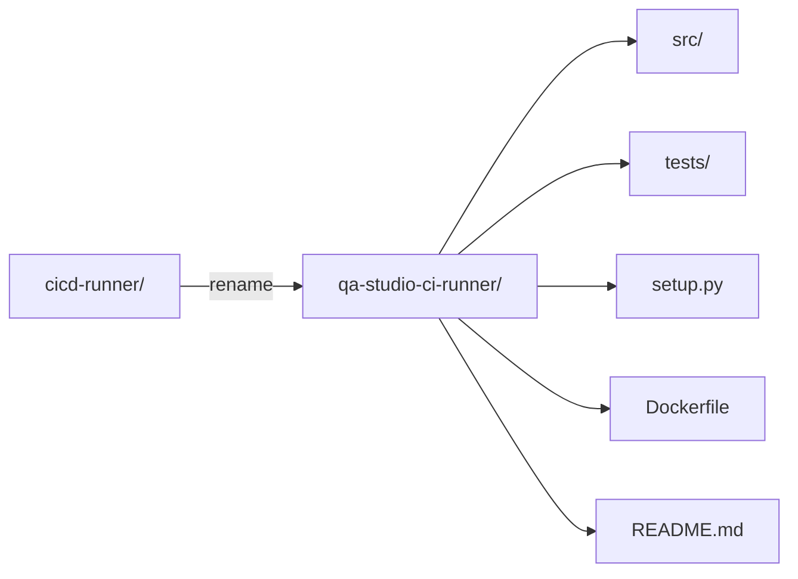

# Design Document: Rename cicd-runner to qa-studio-ci-runner

## Overview

This design covers the rename of the `cicd-runner` package to `qa-studio-ci-runner` across the entire repository. The rename is a pure refactoring operation — no functional changes, no new features, no API changes. The goal is branding alignment with the upcoming `qa-studio-cli` tool.

The rename touches three categories of changes:

1. **Structural**: Directory rename `cicd-runner/` → `qa-studio-ci-runner/`, egg-info cleanup
2. **Package metadata**: `setup.py` fields, Dockerfile ENTRYPOINT
3. **Text references**: Documentation files, spec files, design docs

Internal Python imports (`from src.*`) remain unchanged because the runner uses a `src/` layout — the top-level directory name does not affect import paths.

## Architecture

This is a rename-only operation. The architecture of the runner itself does not change.



### Change Categories

| Category | Files Affected | Type of Change |
|----------|---------------|----------------|
| Directory rename | `cicd-runner/` → `qa-studio-ci-runner/` | `git mv` |
| setup.py | `qa-studio-ci-runner/setup.py` | Field value updates |
| Dockerfile | `qa-studio-ci-runner/Dockerfile` | ENTRYPOINT + comment |
| Runner README | `qa-studio-ci-runner/README.md` | Text replacement |
| docs/cli-reference.md | `docs/cli-reference.md` | Text replacement |
| docs/ci-cd-integration/generic-docker.md | `docs/ci-cd-integration/generic-docker.md` | Text replacement |
| docs/configuration.md | `docs/configuration.md` | Text replacement |
| Spec files | `.kiro/specs/*/` | Path + command references |
| Design docs | `.kiro/design/` | Command references |
| Egg-info | `cicd-runner/cicd_runner.egg-info/` | Delete |

### What Does NOT Change

- Internal Python imports (`from src.api.client import ...`) — the `src/` package name is unchanged
- Test imports (`from src.execution.engine import ...`) — same reason
- Python source files under `src/` and `tests/` — no code changes needed
- API endpoints, OAuth scopes, DynamoDB records — no backend changes
- Frontend code — no references to the runner package name

## Components and Interfaces

### Component: setup.py

Current state:
```python
setup(
    name="cicd-runner",
    author="CI/CD Runner Team",
    description="CI/CD runner for executing test suites via Platform API",
    entry_points={
        "console_scripts": [
            "cicd-runner=src.cli.parser:main",
        ],
    },
)
```

Target state:
```python
setup(
    name="qa-studio-ci-runner",
    author="QA Studio Team",
    description="QA Studio CI Runner for executing test suites via Platform API",
    entry_points={
        "console_scripts": [
            "qa-studio-ci-runner=src.cli.parser:main",
        ],
    },
)
```

### Component: Dockerfile

Current ENTRYPOINT:
```dockerfile
# Add venv to PATH so cicd-runner is available
ENV PATH="/app/.venv/bin:$PATH"
ENTRYPOINT ["/app/.venv/bin/cicd-runner"]
```

Target ENTRYPOINT:
```dockerfile
# Add venv to PATH so qa-studio-ci-runner is available
ENV PATH="/app/.venv/bin:$PATH"
ENTRYPOINT ["/app/.venv/bin/qa-studio-ci-runner"]
```

### Component: Documentation Files

Three documentation files need text replacement:

1. `qa-studio-ci-runner/README.md` — all `cicd-runner` → `qa-studio-ci-runner`
2. `docs/cli-reference.md` — all `cicd-runner` → `qa-studio-ci-runner`
3. `docs/ci-cd-integration/generic-docker.md` — `cicd-runner` → `qa-studio-ci-runner` and `python -m cicd_runner` → `python -m qa_studio_ci_runner`
4. `docs/configuration.md` — `cicd-runner` → `qa-studio-ci-runner` (if any references exist)

### Component: Spec and Design Files

All `.kiro/specs/` files that reference `cicd-runner/` paths, `cicd-runner` commands, or `cicd_runner` module names need updating. Key files:

- `.kiro/specs/qa-studio-cli/wp1-cli-foundation.md`
- `.kiro/specs/cicd-runner/` directory contents
- `.kiro/specs/wp5-docker-container/` contents
- `.kiro/specs/runner-log-capture/` contents
- Any other spec files found via grep

### Component: Egg-info Cleanup

The `cicd-runner/cicd_runner.egg-info/` directory must be deleted. It will be regenerated as `qa_studio_ci_runner.egg-info/` on the next `pip install -e .`.

## Data Models

No data model changes. This is a rename-only operation that does not affect:
- DynamoDB table schemas
- API request/response formats
- Pydantic models
- Frontend state


## Correctness Properties

*A property is a characteristic or behavior that should hold true across all valid executions of a system — essentially, a formal statement about what the system should do. Properties serve as the bridge between human-readable specifications and machine-verifiable correctness guarantees.*

Most acceptance criteria for this rename are specific example checks (e.g., "setup.py name field equals X"). Two properties emerge from the prework analysis after consolidation:

### Property 1: No stale references in repository

*For any* file in the repository (excluding `.git/`, `node_modules/`, `venv/`, `__pycache__/`, `*.egg-info/`, and binary files), the file content shall contain neither the string `cicd-runner` nor the string `cicd_runner`.

**Validates: Requirements 4.4, 5.1, 5.2, 5.3, 7.3, 8.1, 8.2**

### Property 2: Python import paths preserved

*For any* Python source file under `qa-studio-ci-runner/src/` or `qa-studio-ci-runner/tests/`, all intra-package imports shall use `from src.` paths (not `from cicd_runner.` or `from qa_studio_ci_runner.`).

**Validates: Requirements 6.1, 6.2**

## Error Handling

This is a rename operation, not a runtime feature. Error handling applies to the execution of the rename itself:

| Risk | Mitigation |
|------|------------|
| Missed reference to old name | Property 1 (grep verification) catches any stale references |
| Broken imports after rename | Property 2 confirms import paths are unchanged; pytest run confirms tests pass |
| Stale egg-info directory | Explicit deletion step; `.gitignore` already excludes `*.egg-info/` |
| Git merge conflicts on docs with conflict markers | `docs/cli-reference.md` currently has unresolved git conflict markers (`<<<<<<<`, `>>>>>>>`). These must be resolved before or during the rename. |
| Docker build failure | Verify Dockerfile ENTRYPOINT matches new console_scripts entry point name |

## Testing Strategy

### Unit Tests (Example-Based)

Since this is a rename, most verification is example-based — checking specific files contain specific values:

- `setup.py` fields: `name`, `author`, `description`, `entry_points` match expected values
- `Dockerfile`: ENTRYPOINT references `/app/.venv/bin/qa-studio-ci-runner`
- Directory structure: `qa-studio-ci-runner/src/`, `qa-studio-ci-runner/tests/` exist
- Egg-info: `cicd_runner.egg-info/` does not exist

### Property-Based Tests

Property-based testing library: **Hypothesis** (already used in this project — `.hypothesis/` directory exists in the runner).

Each property test must run a minimum of 100 iterations.

- **Property 1 test**: Generate random file paths from the repository file list (excluding build artifacts), read each file, assert neither `cicd-runner` nor `cicd_runner` appears in the content.
  - Tag: `Feature: rename-cicd-runner, Property 1: No stale references in repository`

- **Property 2 test**: Generate random Python file paths from `qa-studio-ci-runner/src/` and `qa-studio-ci-runner/tests/`, read each file, extract all `from X import` and `import X` statements, assert none reference `cicd_runner` or `qa_studio_ci_runner` as a top-level module.
  - Tag: `Feature: rename-cicd-runner, Property 2: Python import paths preserved`

### Integration Tests

- Run `pip install -e .` from `qa-studio-ci-runner/` and verify `qa-studio-ci-runner --help` produces output
- Run `pytest` from `qa-studio-ci-runner/` and verify all tests pass
- Build Docker image from `qa-studio-ci-runner/Dockerfile` and verify it starts

### Pre-Merge Verification

A final recursive grep for `cicd-runner` and `cicd_runner` across the repo (excluding `.git/`, `node_modules/`, `venv/`, `__pycache__/`, `*.egg-info/`) must return zero results.
