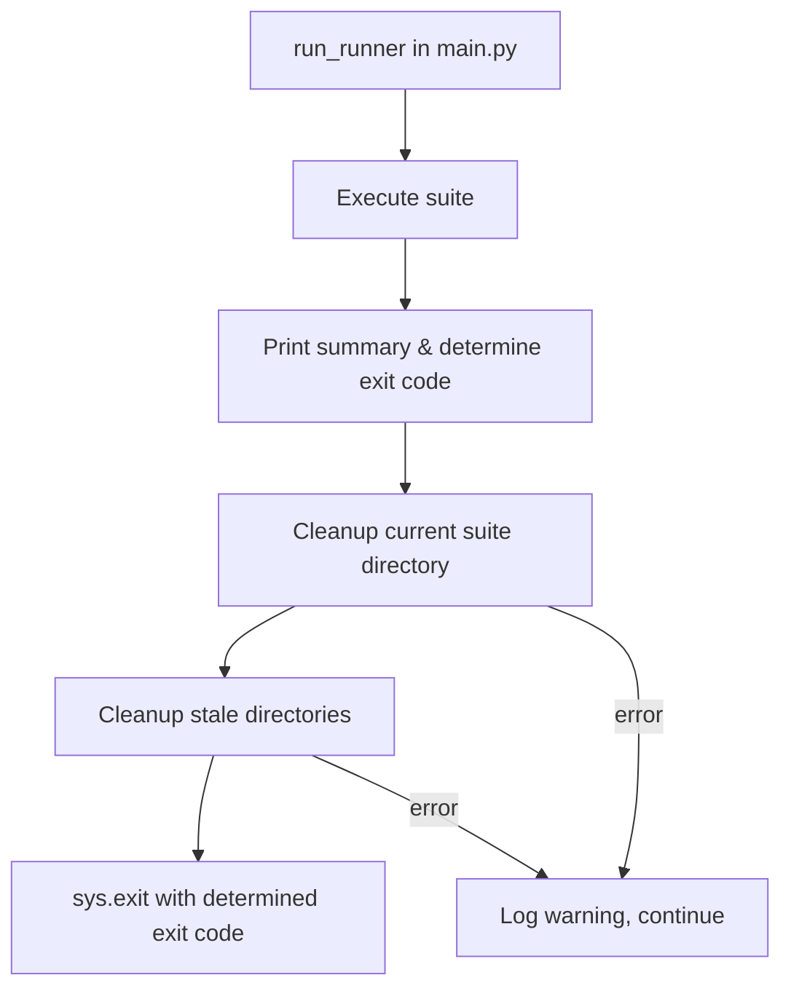

# Design Document: Runner Artifact Cleanup

## Overview

This feature adds a cleanup module to the CI/CD runner that removes execution artifact directories from disk after a suite run completes. It addresses two scenarios: (1) cleaning up the current suite's directories immediately after execution, and (2) removing stale directories from previous runs that exceed a configurable retention period.

The cleanup is designed to be fail-safe — errors during cleanup are logged but never affect the runner's exit code or test results.

## Architecture

The cleanup logic lives in a new `Cleanup` class under `cicd-runner/src/execution/cleanup.py`. It is invoked from `run_runner()` in `main.py` after the execution summary is printed and the exit code is determined.



Two cleanup phases run sequentially:

1. **Current suite cleanup**: Removes `~/.ci_runner/{suite_execution_id}/` after all artifacts are uploaded.
2. **Stale directory cleanup**: Scans `~/.ci_runner/` for directories older than the retention period and removes them.

Both phases are wrapped in try/except so failures never propagate.

## Components and Interfaces

### Cleanup class

**Module**: `cicd-runner/src/execution/cleanup.py`

```python
class Cleanup:
    """Handles removal of execution artifact directories."""

    def __init__(self, base_path: Path):
        """
        Args:
            base_path: The root directory (e.g. ~/.ci_runner/) containing suite directories.
        """

    def remove_suite_directory(self, suite_execution_id: str) -> CleanupResult:
        """
        Remove the directory for a specific suite execution.

        Args:
            suite_execution_id: The suite execution ID whose directory should be removed.

        Returns:
            CleanupResult with counts of removed items.
        """

    def remove_stale_directories(self, retention_seconds: float) -> CleanupResult:
        """
        Scan base_path for suite directories older than retention_seconds and remove them.

        Args:
            retention_seconds: Age threshold in seconds. Directories with mtime older
                               than (now - retention_seconds) are removed.

        Returns:
            CleanupResult with counts of removed items.
        """
```

### CleanupResult dataclass

```python
@dataclass
class CleanupResult:
    removed_dirs: int
    removed_files: int
    errors: List[str]
```

### Integration in main.py

The `run_runner()` function is modified to call cleanup after the summary is printed:

```python
# After summary is printed and exit_code is determined:
try:
    base_path = Path.home() / ".ci_runner"
    cleanup = Cleanup(base_path)

    result = cleanup.remove_suite_directory(suite_execution_id)
    logger.info(f"Cleaned up suite directory: {result.removed_dirs} dirs, {result.removed_files} files removed")

    if settings.cleanup_retention_hours > 0:
        retention_seconds = settings.cleanup_retention_hours * 3600
        stale_result = cleanup.remove_stale_directories(retention_seconds)
        logger.info(f"Stale cleanup: {stale_result.removed_dirs} dirs, {stale_result.removed_files} files removed")
except Exception as e:
    logger.warning(f"Cleanup failed: {sanitize_error_message(str(e))}")

sys.exit(exit_code)
```

### Settings extension

A new optional field is added to `Settings`:

```python
cleanup_retention_hours: float = Field(default=24.0, description="Hours to retain old suite directories. 0 disables stale cleanup.")
```

Loaded from environment variable `CLEANUP_RETENTION_HOURS`.

## Data Models

### CleanupResult

| Field | Type | Description |
|-------|------|-------------|
| `removed_dirs` | `int` | Number of directories removed |
| `removed_files` | `int` | Number of files removed |
| `errors` | `List[str]` | Error messages for items that could not be removed |

### Directory structure (existing, unchanged)

```
~/.ci_runner/                          # base_path
├── {suite_execution_id_1}/            # Suite_Directory
│   ├── {execution_id_a}/              # Execution_Directory
│   │   ├── artifacts/
│   │   ├── nova_act_logs/
│   │   └── downloads/
│   └── {execution_id_b}/
│       ├── artifacts/
│       ├── nova_act_logs/
│       └── downloads/
└── {suite_execution_id_2}/            # Stale Suite_Directory (eligible for removal)
    └── ...
```

### Settings field addition

| Field | Type | Default | Env Var | Description |
|-------|------|---------|---------|-------------|
| `cleanup_retention_hours` | `float` | `24.0` | `CLEANUP_RETENTION_HOURS` | Retention period in hours. 0 disables stale cleanup. |


## Correctness Properties

*A property is a characteristic or behavior that should hold true across all valid executions of a system — essentially, a formal statement about what the system should do. Properties serve as the bridge between human-readable specifications and machine-verifiable correctness guarantees.*

### Property 1: Recursive removal leaves no trace

*For any* directory tree rooted at a suite execution directory (containing arbitrary nested subdirectories and files), after `remove_suite_directory()` completes successfully, the suite directory and all its contents shall no longer exist on disk.

**Validates: Requirements 1.1, 1.2**

### Property 2: Cleanup result counts match actual removals

*For any* directory tree rooted at a suite execution directory, the `CleanupResult` returned by `remove_suite_directory()` shall report `removed_dirs` and `removed_files` counts that equal the number of directories and files that existed before cleanup.

**Validates: Requirements 1.5**

### Property 3: Stale-only removal preserves young directories

*For any* set of suite directories under the base path with varying modification times, and *for any* positive retention period, `remove_stale_directories()` shall remove exactly those directories whose modification time is older than `(now - retention_seconds)` and shall leave all other directories untouched.

**Validates: Requirements 2.1, 2.2**

### Property 4: Cleanup errors do not affect exit code

*For any* determined exit code (0, 1, or 2) and *for any* exception raised during cleanup, the runner process shall exit with the originally determined exit code.

**Validates: Requirements 3.1**

## Error Handling

| Scenario | Behavior |
|----------|----------|
| Suite directory does not exist | `remove_suite_directory()` returns `CleanupResult(0, 0, [])` — no error raised |
| Permission error on a file/directory | Log warning with the path, skip the item, continue removing remaining items, include error in `CleanupResult.errors` |
| Base directory does not exist | `remove_stale_directories()` returns `CleanupResult(0, 0, [])` — no error raised |
| `os.stat()` fails on a directory during stale scan | Log warning, skip that directory, continue scanning |
| Any unhandled exception in cleanup | Caught in `main.py`'s try/except wrapper, logged as warning, exit code unchanged |

The `Cleanup` class uses `shutil.rmtree` with an `onerror` handler to accumulate permission errors rather than aborting. This ensures partial cleanup still reclaims as much space as possible.

## Testing Strategy

### Unit Tests

- `test_remove_suite_directory_basic`: Create a known directory structure, call cleanup, assert it's gone.
- `test_remove_suite_directory_missing`: Call cleanup on a non-existent directory, assert no exception and empty result.
- `test_remove_stale_directories_mixed_ages`: Create directories with old and new mtimes, assert only old ones are removed.
- `test_remove_stale_directories_zero_retention`: Set retention to 0, assert no directories are removed (skip behavior).
- `test_remove_stale_directories_missing_base`: Call with non-existent base path, assert no exception.
- `test_settings_default_retention`: Assert `cleanup_retention_hours` defaults to 24.0.
- `test_settings_custom_retention`: Set env var, assert it's loaded correctly.
- `test_main_cleanup_error_does_not_change_exit_code`: Mock cleanup to raise, verify exit code is unchanged.
- `test_cleanup_permission_error`: Create a read-only file, call cleanup, assert warning logged and no exception raised.

### Property-Based Tests

Property-based tests use `hypothesis` (already in `requirements-dev.txt`).

Each test runs a minimum of 100 iterations.

- **Feature: runner-artifact-cleanup, Property 1: Recursive removal leaves no trace**
  - Generate random directory trees (varying depth, file count, file names) under a temp suite directory.
  - Call `remove_suite_directory()`.
  - Assert the suite directory no longer exists.

- **Feature: runner-artifact-cleanup, Property 2: Cleanup result counts match actual removals**
  - Generate random directory trees.
  - Count files and directories before cleanup.
  - Call `remove_suite_directory()`.
  - Assert `result.removed_dirs == pre_count_dirs` and `result.removed_files == pre_count_files`.

- **Feature: runner-artifact-cleanup, Property 3: Stale-only removal preserves young directories**
  - Generate a random set of suite directories with random ages (some above, some below a random retention threshold).
  - Call `remove_stale_directories()`.
  - Assert stale directories are gone and young directories still exist.

- **Feature: runner-artifact-cleanup, Property 4: Cleanup errors do not affect exit code**
  - Generate a random exit code from {0, 1, 2} and a random exception type.
  - Mock cleanup to raise that exception.
  - Assert `sys.exit()` is called with the original exit code.

### Test File Location

All tests go in `cicd-runner/tests/test_cleanup.py`.
