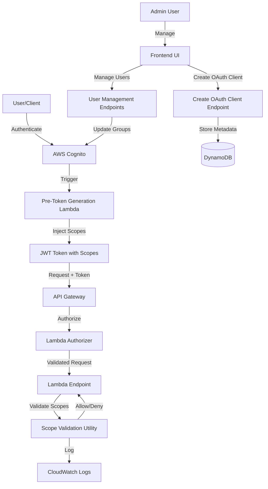

# Design Document: Scope-Based Access Control

## Overview

This design implements OAuth 2.0 scope-based authorization using AWS Cognito resource servers, user groups, and pre-token generation Lambda triggers. The system provides fine-grained access control for both user authentication and machine-to-machine (M2M) OAuth clients.

The implementation follows a layered approach:
1. **Infrastructure Layer**: Cognito resource server, user groups, and Lambda triggers defined in CDK
2. **Authorization Layer**: Pre-token generation Lambda that maps groups to scopes
3. **Validation Layer**: Scope validation utility used by all API endpoints
4. **Presentation Layer**: Frontend UI for OAuth client creation and user management

Key design decisions:
- **Scope inheritance**: The `api/admin` scope grants access to all other scopes, simplifying admin authorization
- **Immutable scopes**: OAuth client scopes cannot be updated; clients must be deleted and recreated
- **Centralized validation**: All endpoints use a shared `require_scopes()` utility for consistent authorization
- **Audit logging**: All scope validation attempts are logged to CloudWatch for security monitoring

## Architecture

### High-Level Architecture



### Directory Structure

The Lambda functions are organized by purpose:

```
lambdas/
├── endpoints/              # API Gateway request handlers
│   ├── create_oauth_client.py
│   ├── list_oauth_clients.py
│   ├── delete_oauth_client.py
│   ├── list_users.py
│   ├── get_user.py
│   ├── update_user_groups.py
│   ├── (all other endpoint files)
│   ├── utils.py           # Shared utilities including scope validation
│   └── requirements.txt
│
├── auth/                  # Cognito triggers & authorizers
│   ├── authorizer.py      # Lambda authorizer for API Gateway
│   └── pre_token_generation.py  # Cognito trigger for scope injection
│
└── events/                # EventBridge/async handlers
    └── handle_task_state_change.py
```

### Scope Hierarchy

```
api/                       # Resource server identifier
├── usecases.read         # View use cases
├── usecases.write        # Create/update/delete use cases
├── usecases.execute      # Trigger executions
├── executions.read       # View execution results
├── executions.write      # Modify execution records
├── oauth-clients.manage  # Manage OAuth clients (admin only)
└── admin                 # Full access (inherits all scopes)
```

### Group-to-Scope Mapping

| Group   | Scopes                                                                                                                                      |
|---------|---------------------------------------------------------------------------------------------------------------------------------------------|
| users   | `api/usecases.read`, `api/usecases.write`, `api/executions.read`, `api/executions.write`, `api/usecases.execute`                          |
| admins  | All scopes from `users` + `api/oauth-clients.manage` + `api/admin`                                                                         |

## Components and Interfaces

### 1. Resource Server (CDK - auth-stack.ts)

**Purpose**: Define available OAuth scopes in Cognito

**Interface**:
```typescript
const resourceServer = new UserPoolResourceServer(this, 'resource_server', {
  userPool: this.userPool,
  identifier: 'api',
  userPoolResourceServerName: this.cdkName('api-resource-server'),
  scopes: [
    { scopeName: 'usecases.read', scopeDescription: 'Read use cases' },
    { scopeName: 'usecases.write', scopeDescription: 'Create, update, delete use cases' },
    { scopeName: 'executions.read', scopeDescription: 'View execution results' },
    { scopeName: 'executions.write', scopeDescription: 'Modify execution records' },
    { scopeName: 'usecases.execute', scopeDescription: 'Trigger use case executions' },
    { scopeName: 'oauth-clients.manage', scopeDescription: 'Manage OAuth clients' },
    { scopeName: 'admin', scopeDescription: 'Full administrative access' }
  ]
});
```

**Dependencies**: UserPool

### 2. Cognito Groups (CDK - auth-stack.ts)

**Purpose**: Organize users by permission level

**Interface**:
```typescript
const usersGroup = new CfnUserPoolGroup(this, 'users_group', {
  userPoolId: this.userPool.userPoolId,
  groupName: 'users',
  description: 'Default user permissions'
});

const adminsGroup = new CfnUserPoolGroup(this, 'admins_group', {
  userPoolId: this.userPool.userPoolId,
  groupName: 'admins',
  description: 'Administrative permissions'
});

// Assign admin user to admins group
new CfnUserPoolUserToGroupAttachment(this, 'admin_user_group', {
  userPoolId: this.userPool.userPoolId,
  username: props.adminEmail,
  groupName: 'admins'
});
```

**Dependencies**: UserPool

### 3. Pre-Token Generation Lambda (lambdas/auth/pre_token_generation.py)

**Purpose**: Inject scopes into JWT tokens based on user group membership

**Input Event**:
```python
{
  "version": "1",
  "triggerSource": "TokenGeneration_Authentication",
  "region": "us-east-1",
  "userPoolId": "us-east-1_XXXXXXXXX",
  "userName": "user@example.com",
  "request": {
    "userAttributes": {...},
    "groupConfiguration": {
      "groupsToOverride": ["users", "admins"],
      "iamRolesToOverride": [],
      "preferredRole": null
    }
  },
  "response": {
    "claimsOverrideDetails": {
      "claimsToAddOrOverride": {},
      "claimsToSuppress": [],
      "groupOverrideDetails": null
    }
  }
}
```

**Logic**:
```python
def handler(event, context):
    # Extract user groups
    groups = event['request']['groupConfiguration']['groupsToOverride']
    
    # Map groups to scopes
    scopes = set()
    
    if 'users' in groups:
        scopes.update([
            'api/usecases.read',
            'api/usecases.write',
            'api/executions.read',
            'api/executions.write',
            'api/usecases.execute'
        ])
    
    if 'admins' in groups:
        scopes.update([
            'api/usecases.read',
            'api/usecases.write',
            'api/executions.read',
            'api/executions.write',
            'api/usecases.execute',
            'api/oauth-clients.manage',
            'api/admin'
        ])
    
    # Inject scopes into token
    scope_string = ' '.join(sorted(scopes))
    event['response']['claimsOverrideDetails']['claimsToAddOrOverride'] = {
        'scope': scope_string
    }
    
    return event
```

**Output**: Modified event with scopes in `claimsToAddOrOverride`

**Dependencies**: None (pure function)

### 4. User Pool Client Configuration (CDK - auth-stack.ts)

**Purpose**: Enable scope support for user authentication

**Interface**:
```typescript
this.userPoolClient = new UserPoolClient(this, 'user_pool_client', {
  userPoolClientName: this.cdkName('client'),
  userPool: this.userPool,
  generateSecret: false,
  authFlows: {
    userSrp: true,
    userPassword: true
  },
  oAuth: {
    flows: {
      authorizationCodeGrant: true,
      implicitCodeGrant: true
    },
    scopes: [
      OAuthScope.OPENID,
      OAuthScope.EMAIL,
      OAuthScope.PROFILE,
      OAuthScope.resourceServer(this.resourceServer, 
        ResourceServerScope.fromScopeName('usecases.read')),
      OAuthScope.resourceServer(this.resourceServer, 
        ResourceServerScope.fromScopeName('usecases.write')),
      OAuthScope.resourceServer(this.resourceServer, 
        ResourceServerScope.fromScopeName('executions.read')),
      OAuthScope.resourceServer(this.resourceServer, 
        ResourceServerScope.fromScopeName('executions.write')),
      OAuthScope.resourceServer(this.resourceServer, 
        ResourceServerScope.fromScopeName('usecases.execute')),
      OAuthScope.resourceServer(this.resourceServer, 
        ResourceServerScope.fromScopeName('oauth-clients.manage')),
      OAuthScope.resourceServer(this.resourceServer, 
        ResourceServerScope.fromScopeName('admin'))
    ]
  }
});
```

**Dependencies**: UserPool, ResourceServer

### 5. Scope Validation Utility (lambdas/endpoints/utils.py)

**Purpose**: Validate required scopes for endpoint access

**Interface**:
```python
def require_scopes(event: dict, required_scopes: list[str]) -> tuple[dict, dict | None]:
    """
    Validate that the request token contains required scopes.
    Implements scope inheritance: api/admin grants all access.
    
    Args:
        event: API Gateway proxy request event
        required_scopes: List of scope strings (e.g., ['api/usecases.read'])
        
    Returns:
        Tuple of (user_identity, error_response)
        If error_response is not None, return it immediately
    """
    # Extract user identity and scopes
    user_identity = extract_user_identity(event)
    token_scopes = user_identity.get('scopes', [])
    
    # Log scope validation attempt
    logger.info(f"Scope validation - Identity: {user_identity['identity']}, "
                f"Type: {user_identity['identity_type']}, "
                f"Token scopes: {token_scopes}, "
                f"Required: {required_scopes}")
    
    # Check for admin scope (grants all access)
    if 'api/admin' in token_scopes:
        logger.info(f"Admin scope present - granting access")
        return user_identity, None
    
    # Check if all required scopes are present
    missing_scopes = [s for s in required_scopes if s not in token_scopes]
    
    if missing_scopes:
        logger.warning(f"Insufficient scopes - Missing: {missing_scopes}")
        return user_identity, create_response(403, {
            'error': 'Forbidden',
            'message': f'Missing required scopes: {", ".join(missing_scopes)}',
            'required_scopes': required_scopes,
            'token_scopes': token_scopes
        })
    
    logger.info(f"Scope validation passed")
    return user_identity, None
```

**Usage Example**:
```python
def handler(event, context):
    # Validate scopes
    user_identity, error_response = require_scopes(event, ['api/usecases.read'])
    if error_response:
        return error_response
    
    # Proceed with business logic
    ...
```

**Dependencies**: `extract_user_identity()`, `create_response()`

### 6. Create OAuth Client Endpoint (lambdas/endpoints/create_oauth_client.py)

**Purpose**: Create OAuth clients with specified scopes

**Input**:
```json
{
  "name": "CI/CD Pipeline",
  "scopes": ["api/usecases.execute", "api/executions.read"]
}
```

**Logic**:
```python
def handler(event, context):
    # Validate admin scope
    user_identity, error_response = require_scopes(event, ['api/oauth-clients.manage'])
    if error_response:
        return error_response
    
    # Parse request
    body = json.loads(event['body'])
    client_name = body.get('name')
    requested_scopes = body.get('scopes', ['api/usecases.execute'])
    
    # Validate scopes
    valid_scopes = [
        'api/usecases.read', 'api/usecases.write',
        'api/executions.read', 'api/executions.write',
        'api/usecases.execute', 'api/oauth-clients.manage',
        'api/admin'
    ]
    
    invalid_scopes = [s for s in requested_scopes if s not in valid_scopes]
    if invalid_scopes:
        return create_response(400, {
            'error': f'Invalid scopes: {", ".join(invalid_scopes)}'
        })
    
    # Create Cognito client
    cognito_client = boto3.client('cognito-idp')
    response = cognito_client.create_user_pool_client(
        UserPoolId=os.environ['USER_POOL_ID'],
        ClientName=client_name,
        GenerateSecret=True,
        AllowedOAuthFlows=['client_credentials'],
        AllowedOAuthScopes=requested_scopes,
        AllowedOAuthFlowsUserPoolClient=True,
        # ... other configuration
    )
    
    # Store metadata in DynamoDB
    # ... (existing logic)
    
    return create_response(201, result)
```

**Output**:
```json
{
  "client_id": "abc123",
  "client_name": "CI/CD Pipeline",
  "client_secret": "secret123",
  "scopes": ["api/usecases.execute", "api/executions.read"],
  "created_date": "2024-01-15T10:30:00Z",
  "created_by": "admin@example.com"
}
```

**Dependencies**: `require_scopes()`, Cognito, DynamoDB

### 7. User Management Endpoints

#### List Users (lambdas/endpoints/list_users.py)

**Purpose**: List all Cognito users with their group memberships

**Input**: GET /users

**Logic**:
```python
def handler(event, context):
    # Validate admin scope
    user_identity, error_response = require_scopes(event, ['api/admin'])
    if error_response:
        return error_response
    
    cognito_client = boto3.client('cognito-idp')
    user_pool_id = os.environ['USER_POOL_ID']
    
    # List all users
    users = []
    pagination_token = None
    
    while True:
        if pagination_token:
            response = cognito_client.list_users(
                UserPoolId=user_pool_id,
                PaginationToken=pagination_token
            )
        else:
            response = cognito_client.list_users(UserPoolId=user_pool_id)
        
        for user in response['Users']:
            username = user['Username']
            
            # Get user's groups
            groups_response = cognito_client.admin_list_groups_for_user(
                UserPoolId=user_pool_id,
                Username=username
            )
            
            groups = [g['GroupName'] for g in groups_response['Groups']]
            
            users.append({
                'username': username,
                'email': next((a['Value'] for a in user['Attributes'] 
                              if a['Name'] == 'email'), None),
                'groups': groups,
                'created_date': user['UserCreateDate'].isoformat(),
                'enabled': user['Enabled']
            })
        
        pagination_token = response.get('PaginationToken')
        if not pagination_token:
            break
    
    return create_response(200, {'users': users})
```

**Output**:
```json
{
  "users": [
    {
      "username": "user@example.com",
      "email": "user@example.com",
      "groups": ["users"],
      "created_date": "2024-01-15T10:30:00Z",
      "enabled": true
    }
  ]
}
```

#### Update User Groups (lambdas/endpoints/update_user_groups.py)

**Purpose**: Update a user's group membership

**Input**: PUT /users/{userId}/groups
```json
{
  "groups": ["users", "admins"]
}
```

**Logic**:
```python
def handler(event, context):
    # Validate admin scope
    user_identity, error_response = require_scopes(event, ['api/admin'])
    if error_response:
        return error_response
    
    user_id = event['pathParameters']['userId']
    body = json.loads(event['body'])
    new_groups = body.get('groups', [])
    
    # Validate groups
    valid_groups = ['users', 'admins']
    invalid_groups = [g for g in new_groups if g not in valid_groups]
    if invalid_groups:
        return create_response(400, {
            'error': f'Invalid groups: {", ".join(invalid_groups)}'
        })
    
    cognito_client = boto3.client('cognito-idp')
    user_pool_id = os.environ['USER_POOL_ID']
    
    # Get current groups
    current_groups_response = cognito_client.admin_list_groups_for_user(
        UserPoolId=user_pool_id,
        Username=user_id
    )
    current_groups = [g['GroupName'] for g in current_groups_response['Groups']]
    
    # Remove from old groups
    for group in current_groups:
        if group not in new_groups:
            cognito_client.admin_remove_user_from_group(
                UserPoolId=user_pool_id,
                Username=user_id,
                GroupName=group
            )
    
    # Add to new groups
    for group in new_groups:
        if group not in current_groups:
            cognito_client.admin_add_user_to_group(
                UserPoolId=user_pool_id,
                Username=user_id,
                GroupName=group
            )
    
    return create_response(200, {
        'username': user_id,
        'groups': new_groups
    })
```

**Output**:
```json
{
  "username": "user@example.com",
  "groups": ["users", "admins"]
}
```

### 8. Frontend Components

#### OAuth Client Creation Form (frontend/src/components/CreateOAuthClient.tsx)

**Purpose**: UI for creating OAuth clients with scope selection

**Interface**:
```typescript
interface CreateOAuthClientFormProps {
  onSuccess: (client: OAuthClient) => void;
  onCancel: () => void;
}

interface OAuthClient {
  client_id: string;
  client_name: string;
  client_secret: string;
  scopes: string[];
  created_date: string;
  created_by: string;
}
```

**UI Elements**:
- Text input for client name
- Multi-select checkboxes for scopes with descriptions:
  - `api/usecases.read` - Read use cases
  - `api/usecases.write` - Create/update/delete use cases
  - `api/executions.read` - View execution results
  - `api/executions.write` - Modify execution records
  - `api/usecases.execute` - Trigger executions
  - `api/oauth-clients.manage` - Manage OAuth clients (admin only)
  - `api/admin` - Full admin access
- Info box explaining scope inheritance
- Validation: At least one scope must be selected

#### User Management Component (frontend/src/components/UserManagement.tsx)

**Purpose**: UI for managing user group memberships

**Interface**:
```typescript
interface UserManagementProps {
  users: User[];
  onUpdateGroups: (userId: string, groups: string[]) => Promise<void>;
}

interface User {
  username: string;
  email: string;
  groups: string[];
  created_date: string;
  enabled: boolean;
}
```

**UI Elements**:
- Table displaying all users with columns: Email, Groups, Created Date, Actions
- "Manage Groups" button per user
- Modal for group selection:
  - Checkbox for `users` group
  - Checkbox for `admins` group
  - Scope preview showing which scopes each group grants
  - Save/Cancel buttons

#### Navigation Component Updates (frontend/src/components/Navigation.tsx)

**Purpose**: Show/hide navigation items based on user scopes

**Logic**:
```typescript
function Navigation() {
  const { user } = useAuth();
  const scopes = user?.scopes || [];
  
  const canManageOAuthClients = scopes.includes('api/oauth-clients.manage') 
                                || scopes.includes('api/admin');
  const canManageUsers = scopes.includes('api/admin');
  
  return (
    <nav>
      <NavItem to="/usecases">Use Cases</NavItem>
      <NavItem to="/executions">Executions</NavItem>
      {canManageOAuthClients && <NavItem to="/oauth-clients">OAuth Clients</NavItem>}
      {canManageUsers && <NavItem to="/users">Users</NavItem>}
    </nav>
  );
}
```

## Data Models

### JWT Token Claims

```json
{
  "sub": "abc-123-def-456",
  "email": "user@example.com",
  "cognito:groups": ["users"],
  "scope": "api/usecases.read api/usecases.write api/executions.read api/executions.write api/usecases.execute",
  "token_use": "access",
  "auth_time": 1705320000,
  "iss": "https://cognito-idp.us-east-1.amazonaws.com/us-east-1_XXXXXXXXX",
  "exp": 1705323600,
  "iat": 1705320000,
  "client_id": "abc123xyz"
}
```

### M2M Token Claims

```json
{
  "sub": "client-id-123",
  "client_id": "client-id-123",
  "scope": "api/usecases.execute api/executions.read",
  "token_use": "access",
  "iss": "https://cognito-idp.us-east-1.amazonaws.com/us-east-1_XXXXXXXXX",
  "exp": 1705323600,
  "iat": 1705320000
}
```

### OAuth Client Metadata (DynamoDB)

```json
{
  "pk": "OAUTH_CLIENTS",
  "sk": "client-id-123",
  "client_id": "client-id-123",
  "client_name": "CI/CD Pipeline",
  "created_by": "admin@example.com",
  "created_at": "2024-01-15T10:30:00Z",
  "entity_type": "oauth_client"
}
```

Note: Scopes are NOT stored in DynamoDB. They are stored in Cognito only and retrieved via `describe_user_pool_client()`.

### User Identity Object (Python)

```python
{
  'identity': 'user@example.com',  # or client_id for M2M
  'identity_type': 'user',  # or 'client'
  'sub': 'abc-123-def-456',
  'email': 'user@example.com',  # only for users
  'client_id': 'client-id-123',  # only for M2M
  'scopes': ['api/usecases.read', 'api/usecases.write', ...]
}
```

### Scope Validation Log Entry (CloudWatch)

```
Scope validation - Identity: user@example.com, Type: user, Token scopes: ['api/usecases.read', 'api/usecases.write'], Required: ['api/usecases.read']
Scope validation passed
```

or

```
Scope validation - Identity: client-id-123, Type: client, Token scopes: ['api/usecases.execute'], Required: ['api/usecases.read']
Insufficient scopes - Missing: ['api/usecases.read']
```


## Correctness Properties

A property is a characteristic or behavior that should hold true across all valid executions of a system—essentially, a formal statement about what the system should do. Properties serve as the bridge between human-readable specifications and machine-verifiable correctness guarantees.

### Property 1: Users Group Scope Injection

*For any* user in the `users` group, when they authenticate, the generated token SHALL contain exactly the scopes: `api/usecases.read`, `api/usecases.write`, `api/executions.read`, `api/executions.write`, `api/usecases.execute`

**Validates: Requirements 3.1**

### Property 2: Admins Group Scope Injection

*For any* user in the `admins` group, when they authenticate, the generated token SHALL contain all user scopes plus `api/oauth-clients.manage` and `api/admin`

**Validates: Requirements 3.2**

### Property 3: Multi-Group Scope Union

*For any* user belonging to multiple groups, the generated token SHALL contain the union of all scopes from all groups (no duplicates, no missing scopes)

**Validates: Requirements 3.3**

### Property 4: Scope Claim Presence

*For any* token generated by the Pre_Token_Generation_Lambda, the access token SHALL contain a `scope` claim with space-separated scope strings

**Validates: Requirements 3.4**

### Property 5: OAuth Client Scope Acceptance

*For any* valid OAuth client creation request with a `scopes` parameter, the system SHALL accept the request and create the client

**Validates: Requirements 5.1**

### Property 6: Invalid Scope Rejection

*For any* OAuth client creation request containing at least one invalid scope, the system SHALL reject the request with an error and NOT create the client

**Validates: Requirements 5.2, 5.5**

### Property 7: OAuth Client Scope Configuration

*For any* successfully created OAuth client with specified scopes, querying the client configuration SHALL return exactly those scopes in `AllowedOAuthScopes`

**Validates: Requirements 5.4**

### Property 8: Scope Extraction from Token

*For any* API request with a valid JWT token, the system SHALL successfully extract the scopes from the token's scope claim

**Validates: Requirements 6.1**

### Property 9: Admin Scope Inheritance

*For any* endpoint and any token containing the `api/admin` scope, the scope validation SHALL pass regardless of what other scopes are required

**Validates: Requirements 6.2**

### Property 10: Insufficient Scope Rejection

*For any* endpoint requiring specific scopes, if the token lacks those scopes AND lacks `api/admin`, the system SHALL return a 403 Forbidden error

**Validates: Requirements 6.3**

### Property 11: Scope Validation Logging

*For any* scope validation attempt (success or failure), the system SHALL log an entry to CloudWatch containing the identity, identity type, token scopes, and required scopes

**Validates: Requirements 6.4**

### Property 12: Endpoint Scope Enforcement

*For any* protected endpoint, when a request is made with a token lacking the required scopes (and lacking `api/admin`), the endpoint SHALL reject the request before executing business logic

**Validates: Requirements 7.1, 7.2, 8.1, 8.2, 8.3, 9.1, 9.2, 9.3**

### Property 13: User Group Update Synchronization

*For any* user and any valid group modification request, after the update completes, querying the user's groups from Cognito SHALL return exactly the new group set

**Validates: Requirements 11.3**

### Property 14: UI Navigation Scope-Based Visibility

*For any* user token lacking `api/oauth-clients.manage` and `api/admin`, the OAuth Clients navigation item SHALL not be rendered in the UI

**Validates: Requirements 12.1**

### Property 15: UI Admin Section Visibility

*For any* user token lacking `api/admin`, the Users management navigation item SHALL not be rendered in the UI

**Validates: Requirements 12.2**

### Property 16: UI Scope Extraction

*For any* JWT token stored in application state, the UI SHALL successfully extract and use the scopes for conditional rendering decisions

**Validates: Requirements 12.3**

### Property 17: User Management Endpoint Admin Scope Requirement

*For any* user management endpoint (`GET /users`, `PUT /users/{userId}/groups`, `GET /users/{userId}`), requests without `api/admin` scope SHALL be rejected with 403 Forbidden

**Validates: Requirements 14.4**

## Error Handling

### Scope Validation Errors

**Error**: Token lacks required scopes
- **Response**: 403 Forbidden
- **Body**: 
  ```json
  {
    "error": "Forbidden",
    "message": "Missing required scopes: api/usecases.write",
    "required_scopes": ["api/usecases.write"],
    "token_scopes": ["api/usecases.read"]
  }
  ```
- **Logging**: Log warning with identity, missing scopes

**Error**: Token cannot be parsed or is invalid
- **Response**: 401 Unauthorized
- **Body**: `{"error": "Unauthorized"}`
- **Logging**: Log error with token details (redacted)

### OAuth Client Creation Errors

**Error**: Invalid scope requested
- **Response**: 400 Bad Request
- **Body**: `{"error": "Invalid scopes: api/invalid.scope"}`
- **Logging**: Log warning with requested scopes

**Error**: No scopes provided and no default available
- **Response**: 400 Bad Request
- **Body**: `{"error": "At least one scope must be specified"}`
- **Logging**: Log warning

**Error**: Cognito client creation fails
- **Response**: 500 Internal Server Error
- **Body**: `{"error": "Failed to create OAuth client"}`
- **Logging**: Log error with Cognito error details
- **Rollback**: If DynamoDB write fails after Cognito creation, delete the Cognito client

### User Group Management Errors

**Error**: Invalid group name
- **Response**: 400 Bad Request
- **Body**: `{"error": "Invalid groups: invalid_group"}`
- **Logging**: Log warning with requested groups

**Error**: User not found
- **Response**: 404 Not Found
- **Body**: `{"error": "User not found"}`
- **Logging**: Log warning with user ID

**Error**: Cognito API failure
- **Response**: 500 Internal Server Error
- **Body**: `{"error": "Failed to update user groups"}`
- **Logging**: Log error with Cognito error details

### Pre-Token Generation Lambda Errors

**Error**: Lambda execution fails
- **Impact**: User authentication fails
- **Logging**: CloudWatch logs with error details
- **Fallback**: Cognito returns error to user

**Error**: Invalid group configuration
- **Impact**: User receives no scopes or default scopes
- **Logging**: Log error with group details
- **Fallback**: Return empty scope set (user will be denied access to protected endpoints)

## Testing Strategy

### Dual Testing Approach

This feature requires both unit tests and property-based tests for comprehensive coverage:

- **Unit tests**: Verify specific examples, edge cases, and error conditions
- **Property tests**: Verify universal properties across all inputs

Together, these approaches provide comprehensive coverage where unit tests catch concrete bugs and property tests verify general correctness.

### Property-Based Testing

**Library**: Use `hypothesis` for Python Lambda functions, `fast-check` for TypeScript frontend components

**Configuration**: Each property test MUST run a minimum of 100 iterations to ensure comprehensive input coverage

**Test Tagging**: Each property-based test MUST include a comment tag referencing the design property:
```python
# Feature: scope-based-access-control, Property 1: Users Group Scope Injection
```

**Property Test Examples**:

1. **Users Group Scope Injection** (Property 1)
   - Generate: Random users in `users` group
   - Execute: Pre-token generation Lambda
   - Assert: Token contains exactly the expected user scopes

2. **Admin Scope Inheritance** (Property 9)
   - Generate: Random endpoints with random required scopes
   - Execute: Scope validation with token containing `api/admin`
   - Assert: Validation always passes

3. **Invalid Scope Rejection** (Property 6)
   - Generate: Random scope lists with at least one invalid scope
   - Execute: OAuth client creation
   - Assert: Request is rejected, no client created

4. **Endpoint Scope Enforcement** (Property 12)
   - Generate: Random endpoints with random tokens lacking required scopes
   - Execute: Endpoint handler
   - Assert: Request rejected with 403 before business logic

### Unit Testing

**Focus Areas**:
- Infrastructure verification (scopes defined, groups created)
- Specific error conditions (invalid scope names, missing parameters)
- Edge cases (empty scope lists, special characters in names)
- Integration points (Cognito API calls, DynamoDB writes)
- UI component rendering (scope selection, group management)

**Example Unit Tests**:

1. **Resource Server Configuration**
   - Verify all 7 scopes are defined in CDK output
   - Verify scope descriptions are present

2. **Default Scope Assignment**
   - Create OAuth client without scopes parameter
   - Verify default scope `api/usecases.execute` is assigned

3. **Scope Validation Logging**
   - Make request with insufficient scopes
   - Verify CloudWatch log entry contains required fields

4. **UI Scope Selection**
   - Render OAuth client creation form
   - Verify all scope checkboxes are present
   - Verify at least one scope must be selected

5. **User Group Update**
   - Update user from `users` to `admins` group
   - Verify Cognito group membership changes
   - Verify new token contains admin scopes

### Integration Testing

**Test Scenarios**:

1. **End-to-End User Authentication**
   - User in `users` group logs in
   - Verify token contains correct scopes
   - Verify user can access use case endpoints
   - Verify user cannot access OAuth client endpoints

2. **End-to-End Admin Authentication**
   - User in `admins` group logs in
   - Verify token contains all scopes including `api/admin`
   - Verify admin can access all endpoints

3. **M2M OAuth Flow**
   - Create OAuth client with specific scopes
   - Obtain M2M token using client credentials
   - Verify token contains only requested scopes
   - Verify token can access appropriate endpoints
   - Verify token cannot access endpoints requiring other scopes

4. **Scope Inheritance**
   - Create admin user token with `api/admin` scope
   - Attempt to access all endpoints
   - Verify all requests succeed

5. **User Group Management**
   - Admin creates new user
   - Admin assigns user to `users` group
   - User logs in and receives user scopes
   - Admin promotes user to `admins` group
   - User logs in again and receives admin scopes

### Manual Testing Checklist

- [ ] Deploy infrastructure and verify all scopes exist in Cognito
- [ ] Verify `users` and `admins` groups are created
- [ ] Verify admin user is in `admins` group
- [ ] Log in as regular user and verify token scopes
- [ ] Log in as admin and verify token scopes
- [ ] Create OAuth client with specific scopes via UI
- [ ] Verify OAuth client appears in list with correct scopes
- [ ] Obtain M2M token and test API access
- [ ] Verify scope validation logs appear in CloudWatch
- [ ] Test UI navigation visibility for regular user
- [ ] Test UI navigation visibility for admin user
- [ ] Manage user groups via UI and verify changes
- [ ] Test all error conditions (invalid scopes, insufficient permissions)
