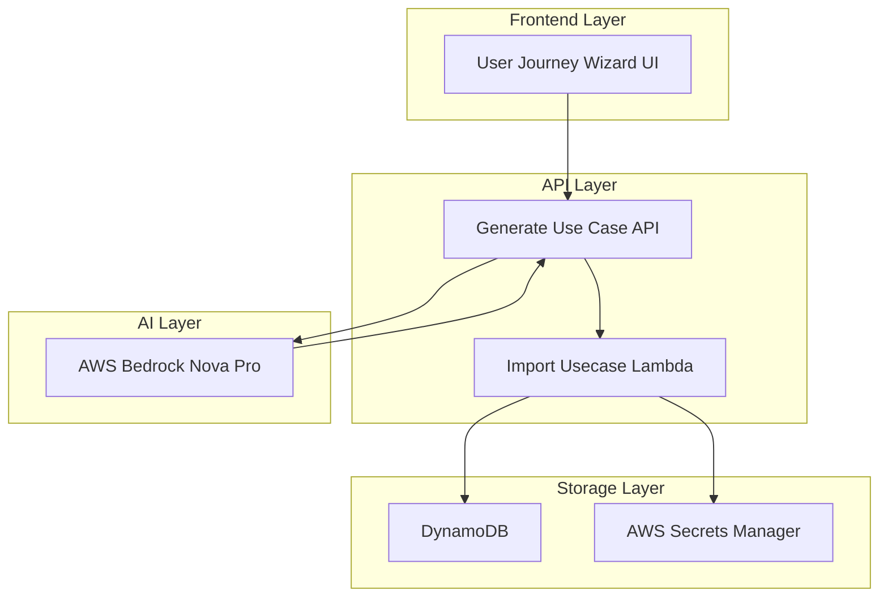

# Design Document

## Overview

The User Journey Wizard is a feature that transforms natural language user journey descriptions into structured automated test cases using AWS Bedrock Nova Pro. The system integrates seamlessly with the existing AcceptAI platform architecture, leveraging the current import/export infrastructure while adding AI-powered test case generation capabilities.

The feature consists of three main components:
1. **Frontend Wizard Interface** - A React-based form integrated into the existing navigation
2. **Backend API Endpoint** - A new Lambda function that processes user input and communicates with Bedrock
3. **AI Processing Pipeline** - Integration with AWS Bedrock Nova Pro for intelligent test case generation

## Architecture

### System Architecture Diagram



### Component Integration

The User Journey Wizard integrates with existing system components:

- **Navigation System**: Extends the current SideNavigation component in App.tsx
- **API Infrastructure**: Uses the existing API Gateway and Lambda pattern
- **Import System**: Leverages the existing import_usecase Lambda function
- **Authentication**: Uses the existing Cognito authentication flow
- **Data Storage**: Utilizes the current DynamoDB table structure

## Components and Interfaces

### Frontend Components

#### 1. UserJourneyWizard Component
**Location**: `frontend/src/components/UserJourneyWizard.tsx`

**Props Interface**:
```typescript
interface UserJourneyWizardProps {
  onUsecaseCreated?: (usecaseId: string) => void;
}
```

**State Interface**:
```typescript
interface WizardState {
  formData: {
    title: string;
    startingUrl: string;
    userJourney: string;
  };
  isGenerating: boolean;
  generatedUsecase: any | null;
  previewMode: boolean;
  error: string | null;
  validationErrors: Record<string, string>;
}
```

#### 2. UsecasePreview Component
**Location**: `frontend/src/components/UserJourneyWizard/UsecasePreview.tsx`

**Props Interface**:
```typescript
interface UsecasePreviewProps {
  usecase: GeneratedUsecase;
  onImport: () => void;
  onRegenerate: () => void;
  isImporting: boolean;
}
```

### Backend Components

#### 1. Generate Usecase Lambda
**Location**: `lambda/cmd/generate_usecase/main.go`

**Request Interface**:
```go
type GenerateUsecaseRequest struct {
    Title        string `json:"title"`
    StartingURL  string `json:"startingUrl"`
    UserJourney  string `json:"userJourney"`
}
```

**Response Interface**:
```go
type GenerateUsecaseResponse struct {
    Success     bool   `json:"success"`
    UsecaseData string `json:"usecaseData"` // JSON string compatible with import_usecase
    Message     string `json:"message"`
    Error       string `json:"error,omitempty"`
}
```

#### 2. Bedrock Integration Service
**Location**: `lambda/cmd/generate_usecase/bedrock.go`

**Service Interface**:
```go
type BedrockService interface {
    GenerateUsecase(ctx context.Context, request GenerateUsecaseRequest) (*BedrockResponse, error)
}

type BedrockResponse struct {
    GeneratedJSON string `json:"generatedJson"`
    Confidence    float64 `json:"confidence"`
}
```

### API Interfaces

#### 1. Generate Usecase Endpoint
- **Method**: POST
- **Path**: `/generate-usecase`
- **Authentication**: Cognito JWT Token
- **Content-Type**: application/json

**Request Body**:
```json
{
  "title": "User Login Flow Test",
  "startingUrl": "https://example.com/login",
  "userJourney": "User navigates to login page, enters email and password, clicks login button, and should be redirected to dashboard"
}
```

**Response Body**:
```json
{
  "success": true,
  "usecaseData": "{\"exportVersion\":\"1.0\",\"exportedAt\":\"2025-01-09T10:00:00Z\",\"usecase\":{...},\"steps\":[...]}",
  "message": "Usecase generated successfully"
}
```

#### 2. Bedrock Nova Pro Integration

**Model**: `anthropic.claude-3-5-sonnet-20241022-v2:0`
**Region**: `us-east-1`

**Prompt Template**:
```
You are an expert test automation engineer. Convert the following user journey description into a structured JSON format for automated web testing.

User Journey Details:
- Title: {title}
- Starting URL: {startingUrl}
- Journey Description: {userJourney}

Generate a JSON object that matches this exact schema:
{
  "exportVersion": "1.0",
  "exportedAt": "{current_timestamp}",
  "usecase": {
    "name": "{generated_name}",
    "description": "{generated_description}",
    "starting_url": "{startingUrl}",
    "active": true,
    "headless": false,
    "tags": []
  },
  "steps": [
    {
      "sort": 1,
      "instruction": "{step_instruction}",
      "step_type": "{navigation|validation|secret|retrieve_value}",
      "secret_key": "",
      "capture_variable": "",
      "validation_type": "",
      "validation_operator": "",
      "validation_value": "",
      "assertion_variable": "",
      "value_step": "",
      "value_type": ""
    }
  ],
  "variables": [],
  "secrets": [],
  "hooks": null
}

Rules:
1. Generate comprehensive steps covering the entire user journey
2. Include navigation steps for page interactions
3. Add validation steps for expected outcomes
4. Use appropriate step types: navigation, validation, secret, retrieve_value
5. For validation steps, use operators: equals, contains, not_equals, greater_than, less_than
6. Include error handling and edge cases
7. Ensure all selectors are realistic CSS selectors
8. Return only valid JSON, no additional text
```

## Data Models

### Generated Usecase Schema

The generated JSON must be compatible with the existing import_usecase Lambda. Key data structures:

#### Usecase Object
```typescript
interface UsecaseImport {
  name: string;
  description: string;
  starting_url: string;
  active: boolean;
  headless: boolean;
  tags: string[];
}
```

#### Step Object
```typescript
interface StepImport {
  sort: number;
  instruction: string;
  step_type: 'navigation' | 'validation' | 'secret' | 'retrieve_value';
  secret_key?: string;
  capture_variable?: string;
  validation_type?: string;
  validation_operator?: 'equals' | 'contains' | 'not_equals' | 'greater_than' | 'less_than';
  validation_value?: string;
  assertion_variable?: string;
  value_step?: string;
  value_type?: string;
}
```

### Frontend State Management

#### Form Validation Rules
```typescript
const validationRules = {
  title: {
    required: true,
    maxLength: 200,
    pattern: /^[a-zA-Z0-9\s\-_]+$/
  },
  startingUrl: {
    required: true,
    pattern: /^https?:\/\/.+/
  },
  userJourney: {
    required: true,
    minLength: 50,
    maxLength: 2000
  }
};
```

## Error Handling

### Frontend Error Handling

#### Validation Errors
- Real-time form validation with immediate feedback
- Field-level error messages with specific guidance
- Form submission prevention until all validations pass

#### API Errors
- Network timeout handling with retry options
- Rate limiting detection and user-friendly messaging
- Bedrock service unavailability fallback

#### Error Display Strategy
```typescript
interface ErrorState {
  type: 'validation' | 'network' | 'bedrock' | 'import' | 'unknown';
  message: string;
  retryable: boolean;
  details?: string;
}
```

### Backend Error Handling

#### Lambda Error Responses
```go
type ErrorResponse struct {
    Success bool   `json:"success"`
    Error   string `json:"error"`
    Code    string `json:"code"`
    Details string `json:"details,omitempty"`
}
```

#### Error Categories
1. **Input Validation Errors** (400)
   - Invalid URL format
   - Missing required fields
   - Content length violations

2. **Authentication Errors** (401)
   - Invalid JWT token
   - Expired session

3. **Bedrock Service Errors** (502)
   - Model unavailable
   - Rate limiting
   - Invalid response format

4. **Import Service Errors** (500)
   - DynamoDB write failures
   - Secrets Manager errors
   - JSON parsing failures

### Retry Logic

#### Frontend Retry Strategy
- Exponential backoff for network errors
- Maximum 3 retry attempts
- User-initiated retry for Bedrock failures

#### Backend Retry Strategy
- Bedrock API calls: 2 retries with 1s, 2s delays
- DynamoDB operations: AWS SDK default retry logic
- Circuit breaker pattern for Bedrock service

## Testing Strategy

### Unit Testing

#### Frontend Tests
**Location**: `frontend/src/components/__tests__/`

**Test Coverage**:
- Form validation logic
- State management
- Error handling
- Component rendering
- User interactions

**Testing Framework**: Jest + React Testing Library

#### Backend Tests
**Location**: `lambda/cmd/generate_usecase/`

**Test Coverage**:
- Request validation
- Bedrock integration
- JSON generation
- Error scenarios
- Authentication

**Testing Framework**: Go testing package + testify

### Integration Testing

#### API Integration Tests
- End-to-end wizard flow
- Bedrock service integration
- Import usecase integration
- Authentication flow

#### Frontend Integration Tests
- Complete user journey simulation
- API error handling
- State persistence
- Navigation integration

### Performance Testing

#### Load Testing Scenarios
1. **Concurrent Wizard Usage**
   - 50 concurrent users
   - Average response time < 10s
   - 99th percentile < 30s

2. **Bedrock API Limits**
   - Rate limiting behavior
   - Queue management
   - Graceful degradation

#### Performance Metrics
- Time to first response: < 5s
- Complete generation time: < 15s
- Import completion time: < 3s
- UI responsiveness: < 100ms

### Security Testing

#### Input Validation Testing
- SQL injection attempts
- XSS payload testing
- Malformed JSON handling
- Oversized request testing

#### Authentication Testing
- Token validation
- Session expiry handling
- Unauthorized access attempts
- CORS policy validation

## Implementation Considerations

### AWS Bedrock Configuration

#### Model Selection
- **Primary**: `anthropic.claude-3-5-sonnet-20241022-v2:0`
- **Fallback**: `anthropic.claude-3-haiku-20240307-v1:0`
- **Region**: `us-east-1` (Nova Pro availability)

#### Request Configuration
```go
type BedrockConfig struct {
    ModelID           string
    MaxTokens         int    // 4096
    Temperature       float64 // 0.1 for consistency
    TopP              float64 // 0.9
    StopSequences     []string
    TimeoutSeconds    int    // 30
}
```

### CDK Infrastructure Updates

#### New Lambda Function
```typescript
const generateUsecaseLambda = this.CreateLambda({
  path: 'generate_usecase',
  name: 'GenerateUsecase',
  memorySize: 512,
  timeout: cdk.Duration.seconds(60),
  environment: {
    TABLE_NAME: table.tableName,
    BEDROCK_MODEL_ID: 'anthropic.claude-3-5-sonnet-20241022-v2:0',
    BEDROCK_REGION: 'us-east-1'
  }
});
```

#### IAM Permissions
```typescript
generateUsecaseLambda.addToRolePolicy(new iam.PolicyStatement({
  effect: iam.Effect.ALLOW,
  actions: [
    'bedrock:InvokeModel',
    'bedrock:InvokeModelWithResponseStream'
  ],
  resources: [
    'arn:aws:bedrock:us-east-1::foundation-model/anthropic.claude-3-5-sonnet-20241022-v2:0'
  ]
}));
```

#### API Gateway Endpoint
```typescript
const generateUsecase = api.root.addResource('generate-usecase');
generateUsecase.addMethod('POST', new apigateway.LambdaIntegration(generateUsecaseLambda), {
  authorizer,
  authorizationType: apigateway.AuthorizationType.COGNITO
});
```

### Frontend Navigation Integration

#### App.tsx Updates
```typescript
const navigationItems = [
  { type: "link", text: "Home", href: "/" },
  { type: "link", text: "Create Use Case", href: "/create-usecase" },
  { type: "link", text: "User Journey Wizard", href: "/user-journey-wizard" }
];
```

#### Route Configuration
```typescript
<Routes>
  <Route path="/" element={<HomeScreen />} />
  <Route path="/create-usecase" element={<CreateUsecase />} />
  <Route path="/user-journey-wizard" element={<UserJourneyWizard />} />
  <Route path="/usecase/:id" element={<UsecaseDetail />} />
</Routes>
```

### Monitoring and Observability

#### CloudWatch Metrics
- Lambda execution duration
- Bedrock API call success rate
- Import success rate
- User journey wizard usage

#### Logging Strategy
- Structured JSON logging
- Request/response correlation IDs
- User action tracking
- Error categorization

#### Alerting
- Bedrock API failure rate > 5%
- Average response time > 20s
- Import failure rate > 2%
- Authentication errors spike