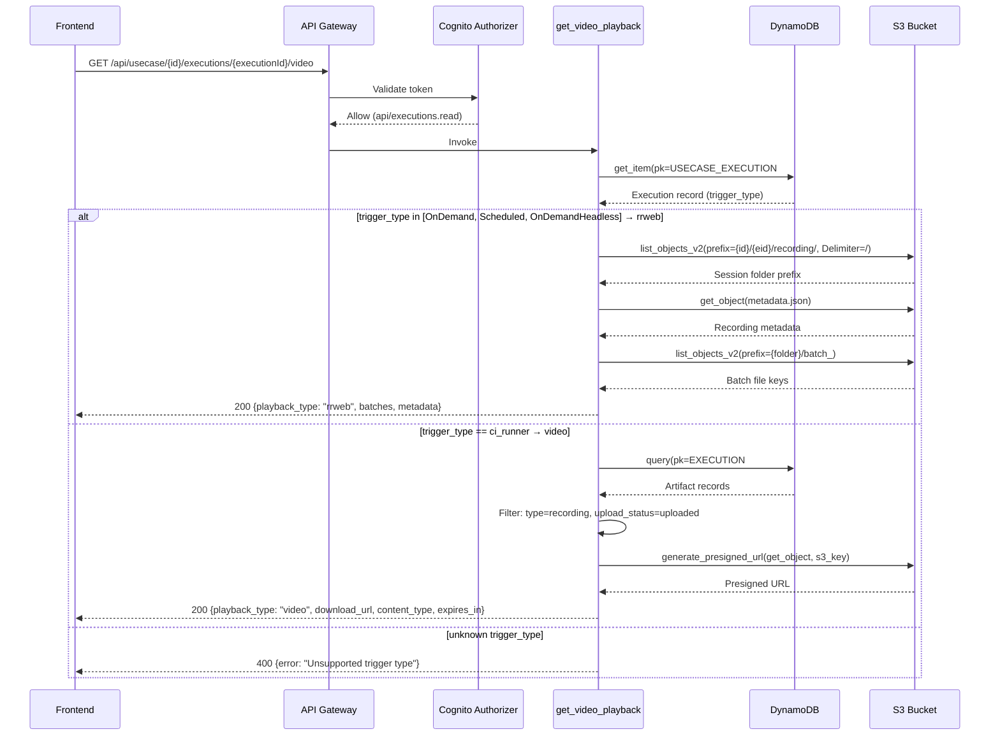

# Design Document: Video Playback Endpoint

## Overview

This design describes a new read-only Lambda endpoint (`GET /api/usecase/{id}/executions/{executionId}/video`) that returns video playback data for a given execution. The endpoint inspects the execution record's `trigger_type` to determine the recording type and returns either rrweb batch metadata (worker path) or a presigned S3 download URL (qa-studio-ci-runner path), along with a `playback_type` discriminator so the frontend knows which player to render.

The endpoint is a pure read operation — it does not create or modify any records. It reuses existing DynamoDB record types (execution records and artifact records) and existing S3 storage paths. No new record types, GSIs, or S3 key patterns are introduced.

### Design Decisions

1. **Single endpoint, branching response**: Rather than two separate endpoints for rrweb vs video, a single endpoint with a `playback_type` discriminator keeps the frontend integration simple and avoids route proliferation.
2. **Reuse existing data**: The endpoint reads from existing execution records (`USECASE_EXECUTION#{id}` / `EXECUTION#{eid}`) and artifact records (`EXECUTION#{eid}` / `ARTIFACT#{aid}`). No new DynamoDB record types needed.
3. **Reuse existing S3 patterns**: Worker recordings already live at `{usecase_id}/{execution_id}/recording/` and runner recordings are tracked via artifact records. The endpoint follows the same S3 access patterns as `list_recording_batches.py` and `generate_execution_artifact_url.py`.
4. **Independent Lambda**: Follows the project convention of one Lambda per endpoint, registered in the Lambda stack and wired in the API stack.

## Architecture



### Component Boundaries

- **Lambda function** (`lambdas/endpoints/get_video_playback.py`): Contains all handler logic. No shared business logic extracted — the function is self-contained and simple enough.
- **CDK Lambda Stack** (`lib/lambda-stack.ts`): Declares the new Lambda with `TABLE_NAME` and `BUCKET_NAME` environment variables, grants `tableReadPolicy` and S3 read access.
- **CDK API Stack** (`lib/api-stack.ts`): Registers `GET /api/usecase/{id}/executions/{executionId}/video` under the existing `execution` resource.
- **Shared utils** (`lambdas/endpoints/utils.py`): Reuses `create_response`, `require_scopes`, `get_table_name`, `get_bucket_name`.

### Dependency Graph

```
get_video_playback.py
├── utils.py (create_response, require_scopes, get_table_name, get_bucket_name)
├── boto3 (DynamoDB client, S3 client)
└── No other internal dependencies
```

No new coupling is introduced. The endpoint only reads existing data.

## Components and Interfaces

### Lambda Handler: `get_video_playback.handler`

**Input**: API Gateway proxy event with:
- `pathParameters.id` — usecase ID
- `pathParameters.executionId` — execution ID
- Authorization header (validated by Cognito authorizer + scope check)

**Output**: API Gateway proxy response

#### Response Shapes

**rrweb response** (HTTP 200):
```json
{
  "playback_type": "rrweb",
  "execution_id": "<execution_id>",
  "trigger_type": "<trigger_type>",
  "batches": ["1761741997665", "1761742001234"],
  "metadata": { /* contents of metadata.json */ }
}
```

**video response** (HTTP 200):
```json
{
  "playback_type": "video",
  "execution_id": "<execution_id>",
  "trigger_type": "ci_runner",
  "download_url": "https://s3.amazonaws.com/...",
  "content_type": "video/webm",
  "expires_in": 3600
}
```

**Error responses**:
- `400`: Missing path parameters or unsupported trigger type
- `403`: Missing/invalid token or insufficient scope
- `404`: Execution not found, or no recording available
- `500`: Internal error (DynamoDB/S3 failure)

### Internal Functions

| Function | Purpose |
|---|---|
| `classify_playback_type(trigger_type)` | Maps trigger_type → `"rrweb"` or `"video"`, raises ValueError for unknown types |
| `get_rrweb_playback_data(s3_client, bucket, usecase_id, execution_id)` | Lists recording folder, loads metadata.json, lists batch files. Returns `(batches, metadata)` or raises if not found |
| `get_video_playback_data(dynamodb, table_name, bucket, execution_id)` | Queries artifact records, filters for recording with `upload_status=uploaded`, generates presigned GET URL. Returns `(url, content_type, expires_in)` or raises if not found |

### CDK Integration

**Lambda Stack** — new property and definition:
```typescript
public readonly getVideoPlaybackLambda: Function

// In constructor:
this.getVideoPlaybackLambda = this.createPythonLambda({
  path: 'get_video_playback',
  environment: {
    TABLE_NAME: props.table.tableName,
    BUCKET_NAME: props.artefactsBucket.bucketName
  }
})
```

**Permissions**:
- `tableReadPolicy` (DynamoDB read for execution + artifact records)
- `artefactsBucket.grantRead()` (S3 read for rrweb batches + presigned GET URLs)

**API Stack** — new route under existing `execution` resource:
```typescript
// /usecase/{id}/executions/{executionId}/video
const executionVideo = this.addResource(execution, 'video')
this.addMethod(executionVideo, HttpMethod.GET, l.getVideoPlaybackLambda)
```

## Data Models

### Existing Records Used (no new records)

**Execution Record** (read-only):
- PK: `USECASE_EXECUTION#{usecase_id}`
- SK: `EXECUTION#{execution_id}`
- Key field: `trigger_type` — `"OnDemand"` | `"Scheduled"` | `"OnDemandHeadless"` | `"ci_runner"`

**Artifact Record** (read-only, queried for video path):
- PK: `EXECUTION#{execution_id}`
- SK: `ARTIFACT#{artifact_id}`
- Key fields: `type` (`"recording"`), `upload_status` (`"uploaded"`), `s3_key`, `s3_bucket`, `content_type`

### S3 Key Patterns (existing)

**Worker rrweb recordings**:
```
{usecase_id}/{execution_id}/recording/{session_folder_id}/metadata.json
{usecase_id}/{execution_id}/recording/{session_folder_id}/batch_<timestamp>.ndjson.gz
```

**Runner video recordings** (tracked via artifact record):
```
{usecase_id}/{execution_id}/recording.webm
```

### DynamoDB Access Patterns

| Operation | Access Pattern | Type |
|---|---|---|
| Get execution record | `get_item(pk=USECASE_EXECUTION#{usecase_id}, sk=EXECUTION#{execution_id})` | Point read |
| List artifact records | `query(pk=EXECUTION#{execution_id}, sk begins_with ARTIFACT#)` | Query |

Both are read-only operations using existing key patterns. No scans, no new GSIs.

## Correctness Properties

*A property is a characteristic or behavior that should hold true across all valid executions of a system — essentially, a formal statement about what the system should do. Properties serve as the bridge between human-readable specifications and machine-verifiable correctness guarantees.*

### Property 1: Trigger type classification is total and correct

*For any* string value of `trigger_type`, `classify_playback_type` shall return `"rrweb"` if the value is in `{"OnDemand", "Scheduled", "OnDemandHeadless"}`, return `"video"` if the value is `"ci_runner"`, and raise `ValueError` for any other string.

**Validates: Requirements 1.2, 1.3, 7.3**

### Property 2: Successful response envelope contains required fields

*For any* successful (HTTP 200) response from the endpoint, the JSON body shall contain the keys `playback_type`, `execution_id`, and `trigger_type`. Additionally, if `playback_type` is `"rrweb"`, the body shall also contain `batches` (a list) and `metadata` (a dict). If `playback_type` is `"video"`, the body shall also contain `download_url` (a non-empty string), `content_type` (a non-empty string), and `expires_in` (a positive integer).

**Validates: Requirements 2.3, 3.3, 5.1, 5.2, 5.3**

### Property 3: S3 recording path construction

*For any* `usecase_id` and `execution_id` strings, the S3 prefix used to locate rrweb recordings shall be exactly `"{usecase_id}/{execution_id}/recording/"`.

**Validates: Requirements 2.1**

### Property 4: Requests without required scope are rejected

*For any* request event that does not include the `api/executions.read` scope, the endpoint shall return HTTP 403.

**Validates: Requirements 4.1, 4.2**

### Property 5: Internal errors produce HTTP 500 with generic message

*For any* DynamoDB or S3 `ClientError` raised during handler execution, the endpoint shall return HTTP 500 with a body containing an `error` key, and the error message shall not expose internal details (no stack traces, no AWS account IDs, no bucket names).

**Validates: Requirements 7.2**

## Error Handling

| Scenario | HTTP Status | Response Body | Logging |
|---|---|---|---|
| Missing `id` or `executionId` path parameter | 400 | `{"error": "Missing required path parameters", "message": "usecase_id and execution_id are required"}` | Warning |
| Execution record not found in DynamoDB | 404 | `{"error": "Execution not found", "message": "No execution found with ID: {executionId}"}` | Info |
| Unrecognized `trigger_type` | 400 | `{"error": "Unsupported trigger type", "message": "trigger_type '{value}' is not supported"}` | Warning |
| No rrweb recording folder in S3 | 404 | `{"error": "Recording not found", "message": "No recording available for this execution"}` | Info |
| No uploaded recording artifact found | 404 | `{"error": "Recording not found", "message": "No recording available for this execution"}` | Info |
| Missing `api/executions.read` scope | 403 | Handled by `require_scopes` utility | — |
| DynamoDB `ClientError` | 500 | `{"error": "Internal server error"}` | Error (full exception) |
| S3 `ClientError` | 500 | `{"error": "Internal server error"}` | Error (full exception) |
| Missing `BUCKET_NAME` env var | 500 | `{"error": "Configuration error", "message": "Internal server error"}` | Error |

## Testing Strategy

### Unit Tests

Unit tests target specific examples, edge cases, and error conditions. Test file: `lambdas/endpoints/test_get_video_playback.py`.

**Examples to test:**
- Happy path: rrweb playback with valid execution (trigger_type=OnDemand), mocked S3 returning batches and metadata
- Happy path: video playback with valid execution (trigger_type=ci_runner), mocked DynamoDB artifact query and S3 presigned URL
- 404: execution not found
- 404: rrweb path but no recording folder in S3
- 404: video path but no artifact with upload_status=uploaded
- 400: missing path parameters
- 400: unrecognized trigger_type
- 500: DynamoDB ClientError
- 500: S3 ClientError
- 403: missing scope

**Mocking approach**: Use `unittest.mock.patch` on `boto3.client` to mock DynamoDB and S3 clients, following the pattern in `test_generate_execution_artifact_url.py`.

### Property-Based Tests

Property-based tests verify universal properties across generated inputs. Use `hypothesis` as the PBT library (Python ecosystem standard). Each test runs minimum 100 iterations.

**Tests to implement:**

1. **Feature: video-playback-endpoint, Property 1: Trigger type classification is total and correct**
   - Generate random strings. For known trigger types, assert correct classification. For unknown strings, assert ValueError.

2. **Feature: video-playback-endpoint, Property 2: Successful response envelope contains required fields**
   - Generate random valid execution records and mock S3/DynamoDB responses. Assert response body always contains the required fields for the given playback_type.

3. **Feature: video-playback-endpoint, Property 3: S3 recording path construction**
   - Generate random usecase_id and execution_id strings. Assert the constructed prefix matches `"{usecase_id}/{execution_id}/recording/"`.

4. **Feature: video-playback-endpoint, Property 4: Requests without required scope are rejected**
   - Generate random events without the required scope. Assert 403 response.

5. **Feature: video-playback-endpoint, Property 5: Internal errors produce HTTP 500 with generic message**
   - Generate random ClientError exceptions. Assert 500 response with generic error message (no internal details leaked).

### End-to-End Tests

Following the project pattern in `lambdas/endpoints/generate_userjourney.py`, an E2E test should:
1. Create a test execution via the API
2. Call `GET /api/usecase/{id}/executions/{executionId}/video`
3. Verify the response shape matches the expected playback_type based on the execution's trigger_type
