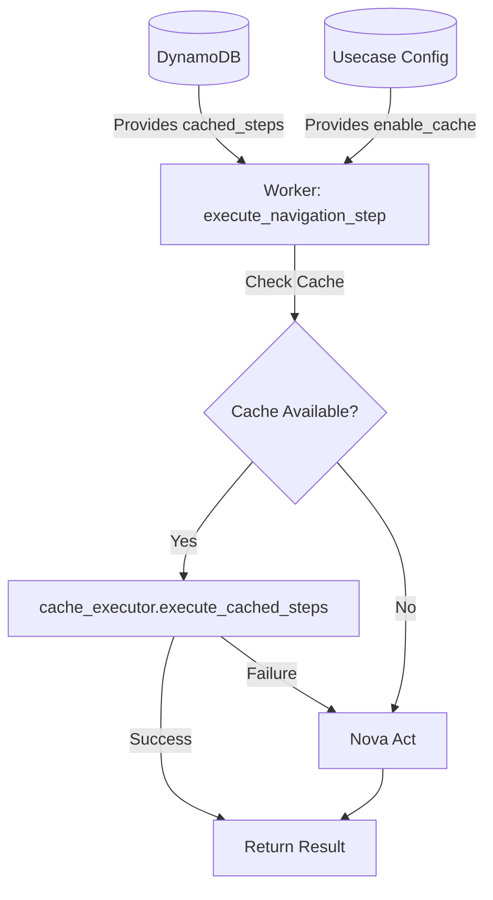
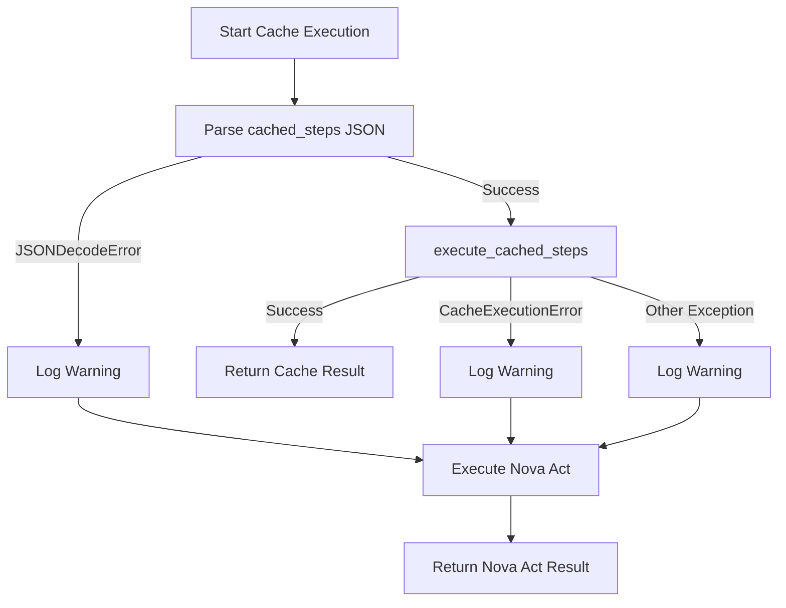
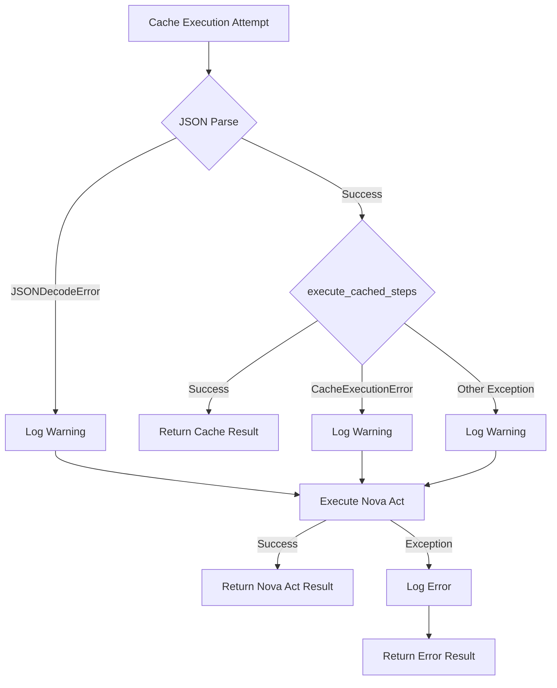

# Design Document: Worker Cache Execution

## Overview

The Worker Cache Execution feature integrates cached step execution into the ECS worker's test execution flow. When a usecase has caching enabled and a navigation step has cached steps available, the worker executes those cached steps directly using the Playwright API via the cache_executor module, bypassing Nova Act entirely. This eliminates LLM inference latency (typically 2-5 seconds per step) and reduces execution time by 40-60%.

The implementation modifies the existing `execute_navigation_step` function in `navigation_step.py` to check for cache availability before calling Nova Act. On cache execution failure, the system automatically falls back to Nova Act, ensuring test reliability is never compromised. The feature integrates seamlessly with existing worker infrastructure and requires no changes to the ExecutionStep dataclass or Nova Act integration.

### Key Design Principles

- **Minimal Code Changes**: Single function modification in navigation_step.py
- **Automatic Fallback**: Cache failures transparently fall back to Nova Act
- **Result Compatibility**: Cache execution returns Nova Act-compatible result objects
- **Comprehensive Observability**: Detailed logging for cache hits, misses, and failures
- **Zero Breaking Changes**: Maintains existing function signatures and return types

## Architecture

### System Context



### Execution Flow

1. **Step Execution Initiated**: Worker calls `execute_navigation_step(nova, step)`
2. **Cache Eligibility Check**: 
   - Check if `enable_cache == True` on usecase config
   - Check if `cached_steps` field exists and is non-empty on step
3. **Cache Execution Path** (if eligible):
   - Parse `cached_steps` JSON string to list
   - Call `execute_cached_steps(nova, cached_steps)`
   - If successful, return cache result
   - If fails, catch exception and proceed to fallback
4. **Nova Act Fallback Path**:
   - Build instruction (with optional advanced click types prompt)
   - Call `nova.act(instruction)`
   - Return Nova Act result
5. **Result Return**: Return (result, success, logs) tuple

### Integration Points

| Component | Integration Type | Purpose |
|-----------|-----------------|---------|
| cache_executor | Module Import | Executes cached steps via Playwright |
| ExecutionStep | Data Model | Provides cached_steps field |
| Nova Act | Fallback | Executes steps when cache unavailable/fails |
| DynamoDB | Data Source | Stores cached_steps in STEP records |
| CloudWatch | Logging | Observability for cache hits/misses |

## Components and Interfaces

### Modified Function: `execute_navigation_step`

**Location**: `web-app/worker/navigation_step.py`

**Function Signature** (unchanged):
```python
def execute_navigation_step(nova: NovaAct, step: ExecutionStep) -> tuple[Any, bool, str]
```

**Parameters**:
- `nova`: NovaAct instance with initialized page
- `step`: ExecutionStep dataclass with instruction, cached_steps, enable_advanced_click_types

**Returns**:
- Tuple of `(result, success, logs)`:
  - `result`: Nova Act result object or cache result object
  - `success`: Boolean indicating step success
  - `logs`: String containing error logs (empty on success)

**Implementation Logic**:

```python
def execute_navigation_step(nova: NovaAct, step: ExecutionStep):
    logger.info(f"Executing navigation step {step.sort}: {step.instruction}")
    result = None
    success = True
    logs = ""
    
    # Check cache availability
    enable_cache = getattr(step, 'enable_cache', False)
    cached_steps_json = getattr(step, 'cached_steps', None)
    
    if enable_cache and cached_steps_json:
        try:
            # Parse cached steps
            cached_steps = json.loads(cached_steps_json)
            
            # Execute cached steps
            start_time = time.time()
            execute_cached_steps(nova, cached_steps)
            duration_ms = int((time.time() - start_time) * 1000)
            
            logger.info(f"Cache hit for step {step.sort} (executed in {duration_ms}ms)")
            
            # Create cache result object
            result = SimpleNamespace()
            result.metadata = SimpleNamespace()
            result.metadata.act_id = "cached"
            result.logs = ""
            
            return result, success, logs
            
        except CacheExecutionError as e:
            logger.warning(f"Cache execution failed for step {step.sort}: {e}, falling back to Nova Act")
        except json.JSONDecodeError as e:
            logger.warning(f"Failed to parse cached_steps for step {step.sort}: {e}, falling back to Nova Act")
        except Exception as e:
            logger.warning(f"Unexpected error during cache execution for step {step.sort}: {e}, falling back to Nova Act")
    else:
        if not enable_cache:
            logger.info(f"Cache miss for step {step.sort}: caching disabled")
        elif not cached_steps_json:
            logger.info(f"Cache miss for step {step.sort}: no cached steps available")
    
    # Fallback to Nova Act
    try:
        # Build the instruction with optional advanced click types prompt
        instruction = step.instruction
        if hasattr(step, 'enable_advanced_click_types') and step.enable_advanced_click_types:
            instruction = f"{click_base_prompt}\n\n{step.instruction}"
        
        result = nova.act(instruction)
              
    except Exception as e:
        logger.error(f"Error executing navigation step {step.sort}: {str(e)}")
        success = False
        logs = str(e)
        # Create a minimal result object to prevent None access errors
        from types import SimpleNamespace
        result = SimpleNamespace()
        result.metadata = SimpleNamespace()
        result.metadata.act_id = e.metadata.act_id if hasattr(e, 'metadata') else "error"

    status = "success" if success else "error"
    logger.info(f"Navigation step {step.sort} completed with status: {status}")
    
    return result, success, logs
```

### Required Imports

**New Imports**:
```python
import json
import time
from types import SimpleNamespace
from cache_executor import execute_cached_steps, CacheExecutionError
```

**Existing Imports** (unchanged):
```python
import logging
from nova_act import NovaAct, BOOL_SCHEMA
from models import ExecutionStep
```

### Cache Result Object Structure

The cache result object mimics the Nova Act result structure to maintain compatibility:

```python
result = SimpleNamespace()
result.metadata = SimpleNamespace()
result.metadata.act_id = "cached"
result.logs = ""
```

**Key Properties**:
- `result.metadata.act_id`: Set to "cached" to distinguish from Nova Act results
- `result.logs`: Empty string (no Nova Act logs for cached execution)
- Compatible with downstream code expecting Nova Act result structure

### Error Handling Flow



## Data Models

### ExecutionStep (Extended)

The ExecutionStep dataclass is extended with cache-related fields (populated from DynamoDB):

| Field | Type | Required | Description |
|-------|------|----------|-------------|
| pk | string | Yes | "EXECUTION#{execution_id}" |
| sk | string | Yes | "EXECUTION_STEP#{execution_step_id}" |
| step_id | string | Yes | Original STEP record identifier |
| sort | int | Yes | Step execution order |
| instruction | string | Yes | Natural language instruction |
| step_type | string | Yes | "navigation", "assertion", etc. |
| enable_advanced_click_types | bool | No | Whether to use advanced click types |
| **enable_cache** | **bool** | **No** | **Whether caching is enabled (from USECASE)** |
| **cached_steps** | **string** | **No** | **JSON-serialized list of cached actions** |
| ... | ... | ... | Other existing fields |

**Note**: The `enable_cache` and `cached_steps` fields are added to ExecutionStep during execution by copying from the USECASE and STEP records. No dataclass modification is required as these are accessed via `getattr()`.

### Cached Steps Format

The `cached_steps` field contains a JSON string representing a list of action dictionaries:

```json
[
  {
    "type": "click",
    "bbox": {"x1": 100, "y1": 200, "x2": 300, "y2": 400}
  },
  {
    "type": "type",
    "text": "example@email.com",
    "bbox": {"x1": 150, "y1": 250, "x2": 350, "y2": 450},
    "press_enter": false
  },
  {
    "type": "navigate",
    "url": "https://example.com/dashboard"
  }
]
```

**Action Types**:
- `click`: Click at bbox center
- `hover`: Hover at bbox center
- `type`: Click to focus, type text, optionally press Enter
- `scroll`: Scroll in direction (up/down/left/right) by amount
- `navigate`: Navigate to URL

### Cache Result Object

| Field | Type | Value | Description |
|-------|------|-------|-------------|
| metadata.act_id | string | "cached" | Identifies result as from cache |
| logs | string | "" | Empty logs (no Nova Act output) |

### Nova Act Result Object (Existing)

| Field | Type | Description |
|-------|------|-------------|
| metadata.act_id | string | Nova Act response identifier |
| logs | string | Nova Act execution logs |
| ... | ... | Other Nova Act result fields |

### Log Message Formats

| Event | Level | Format |
|-------|-------|--------|
| Cache hit | INFO | `Cache hit for step {sort} (executed in {duration_ms}ms)` |
| Cache miss (disabled) | INFO | `Cache miss for step {sort}: caching disabled` |
| Cache miss (no data) | INFO | `Cache miss for step {sort}: no cached steps available` |
| Cache execution failed | WARNING | `Cache execution failed for step {sort}: {error}, falling back to Nova Act` |
| JSON parse failed | WARNING | `Failed to parse cached_steps for step {sort}: {error}, falling back to Nova Act` |
| Unexpected error | WARNING | `Unexpected error during cache execution for step {sort}: {error}, falling back to Nova Act` |
| Fallback to Nova Act | INFO | `Falling back to Nova Act` (implicit in existing log) |


## Correctness Properties

*A property is a characteristic or behavior that should hold true across all valid executions of a system-essentially, a formal statement about what the system should do. Properties serve as the bridge between human-readable specifications and machine-verifiable correctness guarantees.*

### Property 1: Cache Eligibility Decision

*For any* ExecutionStep with various combinations of enable_cache and cached_steps values, the worker should attempt cache execution if and only if both enable_cache is True AND cached_steps is non-null and non-empty, otherwise it should call Nova Act.

**Validates: Requirements 1.1, 1.2, 1.3, 1.4, 1.5, 1.6**

### Property 2: Cache Execution Integration

*For any* ExecutionStep with valid cached_steps JSON, when cache is available, the worker should parse the JSON and call execute_cached_steps with the Nova Act instance and parsed steps list.

**Validates: Requirements 2.1, 2.2, 2.3**

### Property 3: Cache Success Result Structure

*For any* successful cache execution, the worker should return a tuple (result, True, "") where result.metadata.act_id equals "cached" and result.logs equals "".

**Validates: Requirements 2.4, 5.1, 5.2, 5.3, 5.5**

### Property 4: Cache Success Skips Nova Act

*For any* ExecutionStep where cache execution succeeds, the worker should not call nova.act() and should return the cache result directly.

**Validates: Requirements 2.5**

### Property 5: JSON Parsing Error Handling

*For any* ExecutionStep with invalid JSON in cached_steps, the worker should catch the JSONDecodeError, log a warning, and fall back to calling Nova Act.

**Validates: Requirements 2.6, 7.1**

### Property 6: CacheExecutionError Handling

*For any* cache execution that raises CacheExecutionError, the worker should catch the exception, log a warning containing the error details, and fall back to calling Nova Act.

**Validates: Requirements 3.1, 3.2, 3.3**

### Property 7: General Exception Handling

*For any* cache execution that raises an unexpected exception (not CacheExecutionError or JSONDecodeError), the worker should catch the exception, log a warning, and fall back to calling Nova Act.

**Validates: Requirements 3.4, 7.6**

### Property 8: Fallback Execution Correctness

*For any* cache execution failure (any exception type), when falling back to Nova Act, the worker should execute the step with the same instruction (including advanced click types if enabled) and return the Nova Act result object unchanged.

**Validates: Requirements 3.5, 3.6, 5.4**

### Property 9: Cache Hit Logging

*For any* successful cache execution, the worker should log an INFO message containing "Cache hit", the step sort number, and the execution duration in milliseconds.

**Validates: Requirements 4.1, 4.5, 4.6**

### Property 10: Cache Miss Logging

*For any* ExecutionStep where cache is unavailable (enable_cache is False or cached_steps is missing), the worker should log an INFO message containing "Cache miss", the step sort number, and the specific reason (caching disabled or no cached steps available).

**Validates: Requirements 4.2, 4.5**

### Property 11: Cache Failure Logging

*For any* cache execution that fails with an exception, the worker should log a WARNING message containing "Cache execution failed" or "Failed to parse cached_steps", the step sort number, and the error details.

**Validates: Requirements 4.3, 4.5, 7.5**

### Property 12: Advanced Click Types Integration

*For any* ExecutionStep with enable_advanced_click_types=True, the worker should execute cached steps normally if cache is available, but when falling back to Nova Act (cache miss or failure), it should include the click_base_prompt in the instruction.

**Validates: Requirements 6.1, 6.2, 6.3**

### Property 13: Return Signature Consistency

*For any* ExecutionStep (regardless of cache hit, miss, or failure), the worker should always return a tuple of exactly three elements: (result, success, logs) where result is an object with metadata.act_id, success is a boolean, and logs is a string.

**Validates: Requirements 5.5**

## Error Handling

### Error Handling Strategy

The worker cache execution implements a defense-in-depth error handling strategy with multiple layers:

1. **Cache Eligibility Checks**: Validate enable_cache and cached_steps before attempting execution
2. **JSON Parsing Protection**: Catch JSONDecodeError when parsing cached_steps
3. **Cache Execution Protection**: Catch CacheExecutionError from cache_executor module
4. **General Exception Protection**: Catch all other exceptions during cache execution
5. **Automatic Fallback**: All cache failures transparently fall back to Nova Act
6. **Comprehensive Logging**: All errors logged with context for debugging

### Error Categories and Responses

| Error Category | Exception Type | Response | Log Level |
|----------------|---------------|----------|-----------|
| Invalid JSON | JSONDecodeError | Log warning, fall back to Nova Act | WARNING |
| Cache execution failure | CacheExecutionError | Log warning, fall back to Nova Act | WARNING |
| Unexpected error | Exception | Log warning, fall back to Nova Act | WARNING |
| Nova Act failure | Exception | Log error, return failure result | ERROR |
| Missing enable_cache | N/A | Skip cache, call Nova Act | INFO |
| Missing cached_steps | N/A | Skip cache, call Nova Act | INFO |

### Fallback Guarantees

The fallback mechanism ensures:
- **Zero Test Failures**: Cache failures never cause test failures
- **Identical Behavior**: Fallback execution identical to non-cached execution
- **Result Compatibility**: Nova Act results returned unchanged
- **Instruction Preservation**: Advanced click types and other instruction modifications preserved
- **Error Propagation**: Nova Act errors propagate normally (not suppressed)

### Error Recovery Flow



## Testing Strategy

### Dual Testing Approach

The testing strategy combines unit tests for specific scenarios and property-based tests for universal properties:

- **Unit Tests**: Verify specific examples, edge cases, and error conditions
- **Property Tests**: Verify universal properties across randomized inputs
- Both approaches are complementary and necessary for comprehensive coverage

### Unit Testing Focus

Unit tests should focus on:
- **Specific Examples**: Successful cache execution with valid cached_steps
- **Edge Cases**: Empty cached_steps, null values, missing fields
- **Error Conditions**: JSON parse errors, CacheExecutionError, unexpected exceptions
- **Integration Points**: Interaction with cache_executor module, Nova Act fallback
- **Logging Verification**: Correct log messages for hits, misses, and failures
- **Result Structure**: Cache result object structure and compatibility

**Target Coverage**: Minimum 70% code coverage

### Property-Based Testing Configuration

- **Library**: pytest with hypothesis for Python
- **Minimum Iterations**: 100 per property test
- **Tag Format**: `# Feature: worker-cache-execution, Property {number}: {property_text}`
- Each correctness property must be implemented by a single property-based test

### Test Structure

```
web-app/worker/tests/
├── test_navigation_step.py           # Unit tests
│   ├── test_cache_hit_success()
│   ├── test_cache_miss_disabled()
│   ├── test_cache_miss_no_data()
│   ├── test_json_parse_error()
│   ├── test_cache_execution_error()
│   ├── test_unexpected_exception()
│   ├── test_fallback_to_nova_act()
│   ├── test_advanced_click_types_with_cache()
│   ├── test_cache_result_structure()
│   ├── test_logging_cache_hit()
│   ├── test_logging_cache_miss()
│   ├── test_logging_cache_failure()
│   └── test_return_signature()
└── test_navigation_step_properties.py  # Property-based tests
    ├── test_property_cache_eligibility_decision()
    ├── test_property_cache_execution_integration()
    ├── test_property_cache_success_result_structure()
    ├── test_property_cache_success_skips_nova_act()
    ├── test_property_json_parsing_error_handling()
    ├── test_property_cache_execution_error_handling()
    ├── test_property_general_exception_handling()
    ├── test_property_fallback_execution_correctness()
    ├── test_property_cache_hit_logging()
    ├── test_property_cache_miss_logging()
    ├── test_property_cache_failure_logging()
    ├── test_property_advanced_click_types_integration()
    └── test_property_return_signature_consistency()
```

### Mocking Strategy

**Cache Executor Module**: Mock `execute_cached_steps` to control success/failure
```python
@mock.patch('navigation_step.execute_cached_steps')
def test_cache_hit_success(mock_execute):
    mock_execute.return_value = None  # Success
    # Test cache hit path
```

**Nova Act**: Mock `nova.act()` to verify fallback calls
```python
@mock.patch.object(NovaAct, 'act')
def test_fallback_to_nova_act(mock_act):
    mock_act.return_value = mock_result
    # Test fallback path
```

**Logging**: Use `caplog` fixture to verify log messages
```python
def test_logging_cache_hit(caplog):
    # Execute step
    assert "Cache hit" in caplog.text
    assert "step 1" in caplog.text
```

### Test Data Generators

**Valid Cached Steps JSON**:
```python
valid_cached_steps = json.dumps([
    {"type": "click", "bbox": {"x1": 100, "y1": 200, "x2": 300, "y2": 400}},
    {"type": "type", "text": "test", "bbox": {"x1": 150, "y1": 250, "x2": 350, "y2": 450}, "press_enter": False}
])
```

**Invalid JSON**:
```python
invalid_json = "not valid json {["
```

**ExecutionStep with Cache**:
```python
step = ExecutionStep(
    pk="EXECUTION#exec_1",
    sk="EXECUTION_STEP#1",
    step_id="step_1",
    sort=1,
    instruction="Click login button",
    step_type="navigation",
    enable_cache=True,
    cached_steps=valid_cached_steps,
    # ... other required fields
)
```

### Property Test Example

```python
from hypothesis import given, strategies as st

# Feature: worker-cache-execution, Property 1: Cache Eligibility Decision
@given(
    enable_cache=st.booleans(),
    cached_steps=st.one_of(st.none(), st.just(""), st.just("[]"), st.just('[{"type":"click","bbox":{"x1":0,"y1":0,"x2":100,"y2":100}}]'))
)
@mock.patch('navigation_step.execute_cached_steps')
@mock.patch.object(NovaAct, 'act')
def test_property_cache_eligibility_decision(mock_act, mock_execute, enable_cache, cached_steps):
    """For any ExecutionStep, cache should be attempted iff enable_cache=True AND cached_steps is non-empty"""
    step = create_execution_step(enable_cache=enable_cache, cached_steps=cached_steps)
    nova = create_mock_nova()
    
    execute_navigation_step(nova, step)
    
    should_use_cache = enable_cache and cached_steps and cached_steps != "" and cached_steps != "[]"
    
    if should_use_cache:
        mock_execute.assert_called_once()
        if mock_execute.side_effect is None:  # Success
            mock_act.assert_not_called()
    else:
        mock_act.assert_called_once()
```

### Integration Testing

Integration tests should verify:
- **End-to-End Cache Flow**: Execute step with real cache_executor (mocked Playwright)
- **Real JSON Parsing**: Use actual cached_steps JSON from cache builder
- **Timing Verification**: Measure cache execution duration
- **Fallback Behavior**: Verify fallback works with real Nova Act errors

### Performance Testing

Performance tests should measure:
- **Cache Execution Time**: Verify < 500ms for typical cached steps
- **Overhead**: Measure cache eligibility check overhead (< 10ms)
- **Speedup**: Compare cache vs Nova Act execution time (target 5x+)

**Note**: Performance tests may be flaky in CI environments and should be marked as optional or run separately.

## User Journey

This feature operates transparently within the worker execution flow. The user journey is indirect:

### QA Engineer Journey

1. **Enable Caching**: QA Engineer enables caching on a usecase via UI toggle
2. **First Execution**: QA Engineer triggers test execution
   - Worker executes steps using Nova Act (cache miss)
   - Cache builder processes execution and stores cached steps
3. **Subsequent Executions**: QA Engineer triggers test execution again
   - Worker detects cached steps available
   - Worker executes cached steps directly (40-60% faster)
   - QA Engineer observes faster execution time
4. **Monitor Performance**: QA Engineer views execution logs
   - Logs show "Cache hit" messages with timing
   - Logs show which steps used cache vs Nova Act

### Developer Journey

1. **Debug Cache Issues**: Developer investigates test execution logs
   - Logs show cache hit/miss decisions
   - Logs show cache execution failures with error details
   - Logs show fallback to Nova Act
2. **Monitor Cache Effectiveness**: Developer reviews CloudWatch logs
   - Filter for "Cache hit" vs "Cache miss" messages
   - Analyze cache failure rates
   - Identify steps that benefit most from caching

### System Behavior

**Cache Hit Path** (Fast):
```
1. Worker receives ExecutionStep with cached_steps
2. Worker parses cached_steps JSON (< 1ms)
3. Worker calls execute_cached_steps (200-400ms)
4. Worker logs "Cache hit for step 1 (executed in 250ms)"
5. Worker returns cache result
```

**Cache Miss Path** (Normal):
```
1. Worker receives ExecutionStep without cached_steps
2. Worker logs "Cache miss for step 1: no cached steps available"
3. Worker calls Nova Act (2-5 seconds)
4. Worker returns Nova Act result
```

**Cache Failure Path** (Fallback):
```
1. Worker receives ExecutionStep with cached_steps
2. Worker attempts cache execution
3. Cache execution fails (e.g., page changed)
4. Worker logs "Cache execution failed for step 1: ..., falling back to Nova Act"
5. Worker calls Nova Act (2-5 seconds)
6. Worker returns Nova Act result
```

## Performance Considerations

### Cache Execution Performance

**Expected Performance**:
- **Cache eligibility check**: < 1ms (field access and boolean checks)
- **JSON parsing**: 1-5ms (typical cached_steps size: 1-10 KB)
- **Cache execution**: 200-400ms (5-10 Playwright actions with 100ms delays)
- **Total cache path**: 200-500ms

**Nova Act Performance** (for comparison):
- **Nova Act inference**: 2-5 seconds per step
- **Speedup**: 5-10x faster with cache

### Memory Usage

- **Cached Steps JSON**: Typically 1-10 KB per step
- **Parsed Steps List**: Minimal memory overhead (< 1 KB)
- **Result Objects**: Identical memory usage for cache vs Nova Act results

### Optimization Opportunities

1. **JSON Parsing**: Consider caching parsed JSON in memory for repeated executions (future enhancement)
2. **Action Delays**: Configurable via CACHE_ACTION_DELAY_MS environment variable
3. **Parallel Execution**: Cache execution is synchronous but could be parallelized for multiple steps (future enhancement)

## Security Considerations

### Data Security

- **Cached Steps Content**: Contains bbox coordinates and text inputs (may include sensitive data)
- **Storage**: Cached steps stored in DynamoDB with encryption at rest
- **Transmission**: Cached steps transmitted within VPC (no external exposure)
- **Logging**: Logs do not include cached_steps content (only metadata)

### Error Information Disclosure

- **Error Messages**: Logged errors include exception details but not sensitive data
- **CloudWatch Logs**: Logs may contain step instructions (already logged in existing code)
- **Result Objects**: Cache result objects do not expose internal implementation details

### Injection Risks

- **JSON Parsing**: Uses standard json.loads() (safe from injection)
- **Cached Steps Validation**: Validated by cache_executor module (type checking)
- **No Code Execution**: Cached steps are data structures, not executable code

## Future Enhancements

### Potential Improvements

1. **Cache Warming**: Pre-execute steps to build cache before first real execution
2. **Adaptive Caching**: Automatically disable cache for frequently failing steps
3. **Cache Analytics**: Track cache hit rates, speedup metrics, and failure reasons
4. **Selective Fallback**: Retry cache execution with different parameters before falling back
5. **Cache Versioning**: Support multiple cache versions for A/B testing
6. **Parallel Cache Execution**: Execute multiple cached steps in parallel
7. **Smart Cache Invalidation**: Detect page changes and invalidate stale caches
8. **Cache Compression**: Compress cached_steps JSON to reduce DynamoDB storage costs

### Extension Points

- **Custom Executors**: Plugin architecture for different execution strategies
- **Cache Strategies**: Configurable caching strategies (LRU, TTL-based, adaptive)
- **Monitoring Hooks**: Callbacks for cache hit/miss events for custom monitoring
- **Result Enrichment**: Add cache metadata to result objects for downstream analysis

