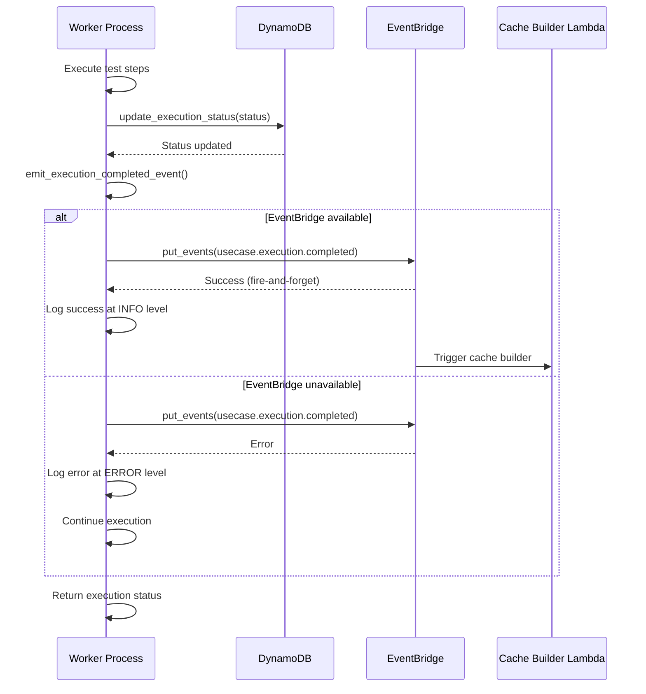

# Design Document: Worker Event Emission

## Overview

This design adds EventBridge event emission to the worker process after test execution completes. When a test execution finishes (either successfully or with failure), the worker emits a `usecase.execution.completed` event to EventBridge. This event triggers downstream cache building processes that parse Nova Act responses and store cacheable steps in DynamoDB.

The implementation follows a fire-and-forget pattern: event emission failures are logged but do not affect test execution outcomes. The worker continues to operate normally even if EventBridge is unavailable, ensuring that the core testing functionality remains reliable.

### Design Decisions

1. **Direct worker emission vs DynamoDB client emission**: The worker will emit events directly rather than relying on the existing DynamoDB client event emission. This provides explicit control over the event structure and timing, and keeps the worker's event emission independent of database operations.

2. **Fire-and-forget pattern**: Event emission is non-blocking and failures do not affect test execution. This ensures that adding event emission doesn't introduce new failure modes or impact test reliability.

3. **Single event type for both success and failure**: Rather than separate event types, we use a single `usecase.execution.completed` event with a `execution_status` field. This simplifies downstream event processing and reduces the number of event rules needed.

4. **Minimal configuration**: The worker uses boto3's default AWS SDK configuration (region from session, IAM role permissions). No additional environment variables are required for EventBridge configuration.

5. **Separate event emission function**: Event emission logic is extracted into a dedicated function (`emit_execution_completed_event`) that can be easily tested in isolation with mocked boto3 clients.

## Architecture



### Component Boundaries

- **Worker process** (`web-app/worker/worker.py`): Contains the main execution flow. Calls event emission function after updating execution status in DynamoDB.
- **Event emission module** (`web-app/worker/event_emitter.py`): New module containing event emission logic. Handles EventBridge client initialization, event structure creation, and error handling.
- **No changes to DynamoDB client**: The existing event emission in `dynamodb_client.py` remains unchanged. The worker's direct event emission is independent and serves a different purpose (triggering cache building vs general status change notifications).

### Dependency Graph

```
worker.py
├── event_emitter.py (new)
│   ├── boto3 (EventBridge client)
│   └── logging
├── dynamodb_client.py (unchanged)
├── utils.py (get_region)
└── Other existing dependencies
```

The new event emission functionality is isolated in a separate module with minimal dependencies. The worker imports and calls the event emission function at the appropriate points in the execution flow.

## Components and Interfaces

### Event Emission Module: `event_emitter.py`

New module containing event emission logic.

#### Function: `emit_execution_completed_event`

Emits a `usecase.execution.completed` event to EventBridge after test execution completes.

**Signature**:
```python
def emit_execution_completed_event(
    usecase_id: str,
    execution_id: str,
    execution_status: str,
    region_name: str = None
) -> None
```

**Parameters**:
- `usecase_id` (str): The usecase identifier
- `execution_id` (str): The execution identifier
- `execution_status` (str): Final execution status ("success" or "failed")
- `region_name` (str, optional): AWS region. If None, uses boto3 default session region

**Behavior**:
1. Initialize EventBridge client (if initialization fails, log error and return)
2. Create event detail with required fields
3. Call `put_events` with event structure
4. Log success at INFO level or error at ERROR level
5. Never raise exceptions (fire-and-forget pattern)

**Event Structure**:
```python
{
    'Source': 'qa-studio.worker',
    'DetailType': 'usecase.execution.completed',
    'Detail': json.dumps({
        'usecase_id': usecase_id,
        'execution_id': execution_id,
        'execution_status': execution_status,  # "success" or "failed"
        'timestamp': datetime.utcnow().strftime('%Y-%m-%dT%H:%M:%S.%fZ')
    })
}
```

**Error Handling**:
- EventBridge client initialization failure: Log error, return without emitting
- `put_events` failure: Log error with exception details, return
- Never raises exceptions to calling code

**Logging**:
- INFO level on success: "Emitted execution completed event: {usecase_id}/{execution_id} -> {execution_status}"
- ERROR level on client init failure: "Failed to initialize EventBridge client: {error}"
- ERROR level on emission failure: "Failed to emit execution completed event: {error}"
- DEBUG level: Full event detail JSON (if debug logging enabled)

### Worker Integration Points

The worker calls `emit_execution_completed_event` at two locations in `main_batch()`:

**Success path** (after line 237):
```python
db_client.update_execution_status(usecase_id, execution_id, "success", completed_at=get_time())
db_client.update_suite_execution_counters(execution_id, usecase_id, "success")

# Emit event after successful execution
emit_execution_completed_event(usecase_id, execution_id, "success", region_name)

logger.info(f"Execution {execution_id} completed successfully")
return True
```

**Failure path** (after line 232):
```python
db_client.update_execution_status(usecase_id, execution_id, "failed", completed_at=get_time())
db_client.update_suite_execution_counters(execution_id, usecase_id, "failed")

# Emit event after failed execution
emit_execution_completed_event(usecase_id, execution_id, "failed", region_name)

return False
```

**Additional failure path** (after line 217 in Nova Act exception handler):
```python
try:
    completed_at = get_time()
    db_client.update_execution_status(usecase_id, execution_id, "failed", completed_at=completed_at)
    db_client.update_suite_execution_counters(execution_id, usecase_id, "failed")
    
    # Emit event after failed execution
    emit_execution_completed_event(usecase_id, execution_id, "failed", region_name)
except Exception as db_error:
    logger.error(f"Failed to update execution status after Nova Act error: {str(db_error)}")
```

## Data Models

### Event Structure

The emitted event follows the EventBridge PutEvents API structure:

| Field | Type | Value | Description |
|---|---|---|---|
| `Source` | string | `"qa-studio.worker"` | Event source identifier |
| `DetailType` | string | `"usecase.execution.completed"` | Event type identifier |
| `Detail` | JSON string | See below | Event payload |

### Event Detail Schema

The `Detail` field contains a JSON-serialized object:

| Field | Type | Format | Required | Description |
|---|---|---|---|---|
| `usecase_id` | string | — | Yes | Usecase identifier |
| `execution_id` | string | — | Yes | Execution identifier |
| `execution_status` | string | `"success"` or `"failed"` | Yes | Final execution status |
| `timestamp` | string | ISO 8601 UTC | Yes | Event timestamp (YYYY-MM-DDTHH:MM:SS.ffffffZ) |

**Example event detail**:
```json
{
  "usecase_id": "uc_abc123",
  "execution_id": "exec_xyz789",
  "execution_status": "success",
  "timestamp": "2025-01-15T14:32:45.123456Z"
}
```

### No DynamoDB Changes

This feature does not create, modify, or read any DynamoDB records. It only emits events based on execution data already available in the worker process.

## Correctness Properties

*A property is a characteristic or behavior that should hold true across all valid executions of a system — essentially, a formal statement about what the system should do. Properties serve as the bridge between human-readable specifications and machine-verifiable correctness guarantees.*

### Property 1: Event emission for all completed executions

*For any* execution that completes (with status "success" or "failed"), the worker shall call `emit_execution_completed_event` with the correct usecase_id, execution_id, and execution_status.

**Validates: Requirements 1.1, 1.2, 1.4**

### Property 2: Event structure completeness

*For any* event emitted by `emit_execution_completed_event`, the event shall have Source="qa-studio.worker", DetailType="usecase.execution.completed", and the Detail JSON shall contain all four required fields (usecase_id, execution_id, execution_status, timestamp) with non-empty values.

**Validates: Requirements 2.1, 2.2, 2.3, 2.4, 2.5, 2.7**

### Property 3: Timestamp format correctness

*For any* event emitted, the timestamp field shall match the ISO 8601 format with UTC timezone (YYYY-MM-DDTHH:MM:SS.ffffffZ) and shall be parseable by `datetime.fromisoformat()`.

**Validates: Requirements 2.6**

### Property 4: Event emission after status update

*For any* execution completion, the call to `emit_execution_completed_event` shall occur after the call to `db_client.update_execution_status` completes.

**Validates: Requirements 1.3, 3.4**

### Property 5: Fire-and-forget error handling

*For any* exception raised during EventBridge client initialization or event emission, the `emit_execution_completed_event` function shall log the error and return without raising the exception to the caller.

**Validates: Requirements 1.5, 3.1, 3.2, 3.3**

### Property 6: Worker status independence

*For any* execution completion, the worker's return value (True for success, False for failure) shall be the same regardless of whether event emission succeeds or fails.

**Validates: Requirements 3.5**

### Property 7: Logging on success

*For any* successful event emission, the worker shall log a message at INFO level containing the usecase_id, execution_id, and execution_status.

**Validates: Requirements 5.1**

### Property 8: Logging on failure

*For any* failed event emission (client initialization or put_events), the worker shall log a message at ERROR level containing the error message and exception details.

**Validates: Requirements 5.2, 5.3**

## Error Handling

| Scenario | Behavior | Logging | Impact on Execution |
|---|---|---|---|
| EventBridge client initialization fails | Log error, return without emitting | ERROR: "Failed to initialize EventBridge client: {error}" | None - execution continues |
| `put_events` raises `ClientError` | Log error with exception details, return | ERROR: "Failed to emit execution completed event: {error}" | None - execution continues |
| `put_events` raises any other exception | Log error with exception details, return | ERROR: "Failed to emit execution completed event: {error}" | None - execution continues |
| Event emission succeeds | Log success message | INFO: "Emitted execution completed event: {usecase_id}/{execution_id} -> {execution_status}" | None - execution continues |
| Debug logging enabled | Log full event detail | DEBUG: Event detail JSON | None - execution continues |

All errors are handled within `emit_execution_completed_event` and never propagate to the caller. The worker's execution flow is never interrupted by event emission failures.

## Testing Strategy

### Unit Tests

Unit tests target specific examples, edge cases, and error conditions. Test file: `web-app/worker/test_event_emitter.py`.

**Examples to test:**
- Happy path: successful event emission with status="success"
- Happy path: successful event emission with status="failed"
- EventBridge client initialization failure
- `put_events` raises `ClientError`
- `put_events` raises generic `Exception`
- Verify event structure (Source, DetailType, Detail fields)
- Verify timestamp format matches ISO 8601 with UTC timezone
- Verify logging at INFO level on success
- Verify logging at ERROR level on failures
- Verify function never raises exceptions

**Mocking approach**: Use `unittest.mock.patch` on `boto3.client` to mock EventBridge client. Mock `put_events` to return success or raise exceptions. Capture log output using `unittest.mock.patch` on the logger.

**Integration with worker**: Test file `web-app/worker/test_worker.py` (if it exists) should verify:
- Event emission is called after successful execution
- Event emission is called after failed execution
- Event emission is called in Nova Act exception handler
- Worker return value is unaffected by event emission failures

### Property-Based Tests

Property-based tests verify universal properties across generated inputs. Use `hypothesis` as the PBT library (Python ecosystem standard). Each test runs minimum 100 iterations.

**Tests to implement:**

1. **Feature: worker-event-emission, Property 1: Event emission for all completed executions**
   - Generate random usecase_id, execution_id, and execution_status ("success" or "failed")
   - Mock EventBridge client
   - Call `emit_execution_completed_event`
   - Assert `put_events` was called with correct parameters

2. **Feature: worker-event-emission, Property 2: Event structure completeness**
   - Generate random usecase_id, execution_id, and execution_status
   - Mock EventBridge client to capture the event
   - Call `emit_execution_completed_event`
   - Assert event has correct Source, DetailType, and all Detail fields are present and non-empty

3. **Feature: worker-event-emission, Property 3: Timestamp format correctness**
   - Generate random usecase_id, execution_id, and execution_status
   - Mock EventBridge client to capture the event
   - Call `emit_execution_completed_event`
   - Parse timestamp from Detail and assert it matches ISO 8601 format with UTC timezone

4. **Feature: worker-event-emission, Property 5: Fire-and-forget error handling**
   - Generate random usecase_id, execution_id, and execution_status
   - Mock EventBridge client to raise random exceptions
   - Call `emit_execution_completed_event`
   - Assert function returns without raising exception

5. **Feature: worker-event-emission, Property 7: Logging on success**
   - Generate random usecase_id, execution_id, and execution_status
   - Mock EventBridge client to succeed
   - Capture log output
   - Call `emit_execution_completed_event`
   - Assert INFO log contains usecase_id, execution_id, and execution_status

6. **Feature: worker-event-emission, Property 8: Logging on failure**
   - Generate random usecase_id, execution_id, and execution_status
   - Mock EventBridge client to raise random exceptions
   - Capture log output
   - Call `emit_execution_completed_event`
   - Assert ERROR log contains error message

### Test Coverage Target

Aim for at least 70% code coverage for the new `event_emitter.py` module. The fire-and-forget pattern and comprehensive error handling should make it straightforward to achieve high coverage.

## User Journey

This feature has no direct user-facing interface. The user journey is indirect:

1. **QA Engineer** creates and runs a test execution through the QA Studio UI or CLI
2. **Worker** executes the test steps using Nova Act
3. **Worker** updates execution status in DynamoDB (existing behavior)
4. **Worker** emits `usecase.execution.completed` event to EventBridge (new behavior)
5. **EventBridge** triggers Cache Builder Lambda (downstream system, not part of this feature)
6. **Cache Builder** processes the execution and stores cacheable steps (downstream system)
7. **QA Engineer** benefits from faster test execution on subsequent runs due to cached steps

From the QA Engineer's perspective, this feature is transparent. The only observable effect is improved test execution performance over time as the cache builds up.

## Implementation Notes

### EventBridge Client Initialization

The EventBridge client is initialized inside `emit_execution_completed_event` on each call rather than being cached. This approach:
- Simplifies error handling (no need to track client state)
- Avoids issues with long-running worker processes and credential expiration
- Has minimal performance impact (client initialization is fast, and event emission happens only once per execution)

If performance profiling shows client initialization is a bottleneck, we can refactor to cache the client with proper error recovery.

### Timestamp Precision

The timestamp uses microsecond precision (`%f` in strftime) to ensure uniqueness and provide detailed timing information for downstream processing. The format matches ISO 8601 with explicit UTC timezone indicator (`Z` suffix).

### Region Configuration

The function accepts an optional `region_name` parameter. If not provided, boto3 uses the default session region (typically from `AWS_REGION` environment variable or EC2 instance metadata). This matches the existing pattern in the worker where `region_name` is obtained from `get_region()`.

### No Retry Logic

The fire-and-forget pattern means no retry logic is implemented. If event emission fails, the error is logged and the worker continues. Downstream systems should be designed to handle missing events gracefully (e.g., by polling for executions without cached steps).

### Compatibility with Existing Event Emission

The existing event emission in `dynamodb_client.py` (source: `nova-act-qa-studio.execution`, detail-type: `nova-act-qa-studio.execution.status.changed`) remains unchanged. The two event emissions serve different purposes:
- **DynamoDB client events**: General execution status change notifications (may be used by multiple consumers)
- **Worker events**: Specific trigger for cache building (consumed by Cache Builder Lambda)

Both events can coexist without conflict. Downstream systems can subscribe to whichever event type suits their needs.
