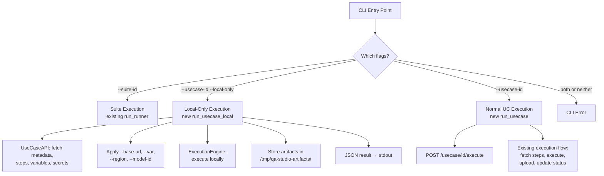
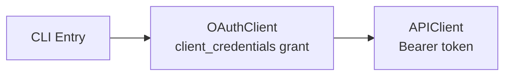

# Design Document: WP1 - CI/CD Runner Enhancement

## Overview

This design extends the existing CI/CD runner (`cicd-runner/`) to support two new execution modes beyond the current suite-based execution:

1. **Local-only single use case execution** — fetches a use case definition directly from the API, executes it locally via Nova Act, stores artifacts on the local filesystem, and outputs structured JSON to stdout. No execution records, no S3 uploads, no status updates.
2. **Normal single use case execution** — creates a server-side execution record via `POST /usecase/{id}/execute`, then follows the existing execution flow (fetch steps, execute, upload artifacts, update status).

Authentication for all modes uses the existing `OAuthClient` with client_credentials grant.

All existing suite execution functionality remains unchanged.

Reference: #[[file:.kiro/specs/wp1-cicd-runner-enhancement/requirements.md]]
Reference: #[[file:.kiro/design/kiro-extension.md]]

## Architecture

### Execution Mode Routing

The CLI determines the execution mode based on the combination of flags provided:



### Authentication Flow



### Component Boundaries

The design introduces minimal new components while reusing existing infrastructure:

| Component | Change | Responsibility |
|-----------|--------|---------------|
| `cli/parser.py` | Modified | Add `--usecase-id`, `--local-only` flags; mutual exclusion validation |
| `main.py` | Modified | Add `run_usecase()` and `run_usecase_local()` orchestration functions |
| `api/usecases.py` | **New** | `UseCaseAPI` class for fetching use case definitions directly |
| `execution/engine.py` | Modified | Add `execute_usecase_local()` method for local-only execution |
| `execution/models.py` | Modified | Add Pydantic models for local execution JSON output |

### Dependency Graph

```
cli/parser.py
  → main.run_runner()          (existing, unchanged)
  → main.run_usecase()         (new, normal UC mode)
  → main.run_usecase_local()   (new, local-only mode)

main.run_usecase_local()
  → auth/oauth_client.py (existing, unchanged)
  → config/settings.py (existing, unchanged)
  → api/client.py (existing, unchanged)
  → api/usecases.py (new)
  → execution/engine.py (new method)

main.run_usecase()
  → auth/oauth_client.py (existing, unchanged)
  → config/settings.py (existing, unchanged)
  → api/client.py (existing)
  → api/executions.py (existing)
  → execution/engine.py (existing execute_usecase method)
```


## Components and Interfaces

### 1. CLI Parser (`cli/parser.py`)

The Click command gains two new options and validation logic:

```python
@click.command()
@click.option('--suite-id', default=None, help='Test suite ID to execute')
@click.option('--usecase-id', default=None, help='Single use case ID to execute')
@click.option('--local-only', is_flag=True, default=False, help='Local execution only (no execution records)')
# ... existing options unchanged ...
```

Validation rules (enforced in the Click callback before dispatching):
- `--suite-id` and `--usecase-id` are mutually exclusive
- At least one of `--suite-id` or `--usecase-id` is required
- `--local-only` requires `--usecase-id`

Routing:
- `--suite-id` → `run_runner()` (existing, unchanged)
- `--usecase-id` + `--local-only` → `run_usecase_local()`
- `--usecase-id` without `--local-only` → `run_usecase()`

### 2. UseCaseAPI (`api/usecases.py`) — New

A new API client class for fetching use case definitions directly. Follows the same pattern as `TestSuiteAPI` and `ExecutionAPI`.

```python
class UseCaseAPI:
    def __init__(self, client: APIClient): ...

    def get_usecase(self, usecase_id: str) -> dict:
        """GET /usecase/{usecase_id} → metadata (name, starting_url, executing_region, model_id)"""

    def get_steps(self, usecase_id: str) -> list[dict]:
        """GET /usecase/{usecase_id}/steps → list of step dicts"""

    def get_variables(self, usecase_id: str) -> dict[str, str]:
        """GET /usecase/{usecase_id}/variables → key-value dict"""

    def get_secrets(self, usecase_id: str) -> list[dict]:
        """GET /usecase/{usecase_id}/secrets → list of secret dicts with resolved values"""

    def execute_usecase(self, usecase_id: str, base_url: str | None, variables: dict | None,
                        region: str | None, model_id: str | None) -> dict:
        """POST /usecase/{usecase_id}/execute?trigger-type=ci_runner → execution record"""
```

All methods use the existing `APIClient` for HTTP requests, inheriting Bearer token auth. Errors are propagated as `APIError` with status code and response body.

### 3. Main Orchestration (`main.py`) — Modified

Two new functions are added alongside the existing `run_runner()`:

**`run_usecase_local()`** — Local-only execution:
1. Authenticate via OAuthClient (client_credentials grant)
2. Load settings via `Settings.from_env()`
3. Validate AWS session
4. Initialize APIClient + UseCaseAPI
5. Fetch use case definition (metadata, steps, variables, secrets)
6. Apply overrides (base_url, variables, region, model_id)
7. Prepare artifact directory (`/tmp/qa-studio-artifacts/{usecase_id}/`), clearing if exists
8. Execute via `ExecutionEngine.execute_usecase_local()`
9. Build JSON result object
10. Write JSON to stdout, all logs to stderr
11. Exit with appropriate code (0/1/2)

**`run_usecase()`** — Normal single use case execution:
1. Authenticate via OAuthClient (client_credentials grant)
2. Load settings via `Settings.from_env()`
3. Validate AWS session
4. Initialize APIClient + UseCaseAPI
5. Create execution record via `UseCaseAPI.execute_usecase()`
6. Execute via existing `ExecutionEngine.execute_usecase()` flow
7. Print summary, exit with code

### 4. ExecutionEngine (`execution/engine.py`) — Modified

A new method `execute_usecase_local()` is added. This method reuses the existing `_execute_with_nova_act()` and `_run_steps_with_nova()` internals but:

- Does NOT call `execution_api.update_status()` or `execution_api.update_step_status()`
- Does NOT call `artifact_uploader.upload_*()` methods
- Stores artifacts in the provided local directory instead of `~/.ci_runner/`
- Captures step screenshots locally without uploading
- Returns a structured result dict with local artifact paths

The key insight is that `_run_steps_with_nova()` currently interleaves step execution with API status updates and artifact uploads. For local-only mode, we need a variant that skips those side effects.

Approach: Add a `local_only` flag to `_run_steps_with_nova()` that gates the API calls and uploads. This avoids duplicating the step execution logic while keeping the change minimal.

```python
async def execute_usecase_local(
    self,
    usecase_definition: dict,  # metadata + steps + variables + secrets
    usecase_id: str,
    artifact_dir: Path,
    region: str | None = None,
    model_id: str | None = None,
) -> dict:
    """Execute a use case locally without API side effects.
    
    Returns a dict with step results and local artifact paths.
    """
```

### 5. Output Models (`execution/models.py`) — Modified

New Pydantic models for the JSON output of local-only execution:

```python
class LocalStepResult(BaseModel):
    step_id: str = Field(alias="stepId")
    instruction: str
    status: str  # "success" or "failed"
    duration: float
    screenshot: str | None = None  # local file path

class LocalExecutionResult(BaseModel):
    status: str  # "success" or "failed"
    usecase_id: str = Field(alias="usecaseId")
    usecase_name: str = Field(alias="usecaseName")
    duration: float
    steps: list[LocalStepResult]
    artifacts: dict[str, str]  # {"video": "/path/...", "logs": "/path/..."}
```

These models use camelCase aliases for JSON serialization (matching the API convention from the design doc) and are serialized via `model.model_dump(by_alias=True)`.


## Data Models

### Use Case Definition (fetched from API)

The `UseCaseAPI` fetches and composes a use case definition from multiple endpoints. The composed object passed to the engine looks like:

```python
{
    "usecase_id": "uuid-string",
    "name": "Login Flow Test",
    "starting_url": "https://app.example.com/login",
    "executing_region": "us-east-1",
    "model_id": "nova-act-v1.0",
    "steps": [
        {
            "step_id": "uuid-string",
            "sort": 1,
            "instruction": "Click the login button",
            "step_type": "navigation",
            # ... other step fields
        }
    ],
    "variables": {
        "username": "testuser",
        "timeout": "30"
    },
    "secrets": [
        {"key": "admin_password", "value": "resolved-secret-value"}
    ]
}
```

### Pydantic Models for Local Execution Output

```python
from pydantic import BaseModel, Field
from typing import Optional

class LocalStepResult(BaseModel):
    """Result of a single step in local-only execution."""
    step_id: str = Field(serialization_alias="stepId")
    instruction: str
    status: str  # "success" or "failed"
    duration: float
    screenshot: Optional[str] = None  # local file path

    model_config = {"populate_by_name": True}

class LocalArtifacts(BaseModel):
    """Local artifact paths."""
    video: Optional[str] = None
    logs: Optional[str] = None

class LocalExecutionResult(BaseModel):
    """Complete result of a local-only execution, serialized to stdout as JSON."""
    status: str  # "success" or "failed"
    usecase_id: str = Field(serialization_alias="usecaseId")
    usecase_name: str = Field(serialization_alias="usecaseName")
    duration: float
    steps: list[LocalStepResult]
    artifacts: LocalArtifacts

    model_config = {"populate_by_name": True}
```

### Artifact Directory Structure

For local-only execution, artifacts are stored at `/tmp/qa-studio-artifacts/{usecase-id}/`:

```
/tmp/qa-studio-artifacts/{usecase-id}/
├── step-1-screenshot.png
├── step-2-screenshot.png
├── step-3-screenshot.png
├── recording.webm
└── execution.log
```

The directory is cleared before each execution to avoid stale artifacts from previous runs.

### Exit Codes

| Code | Meaning |
|------|---------|
| 0 | All steps passed |
| 1 | One or more steps failed |
| 2 | Runner internal error (config, auth, API, etc.) |

These semantics apply to all three execution modes (suite, normal UC, local-only).


## Correctness Properties

*A property is a characteristic or behavior that should hold true across all valid executions of a system — essentially, a formal statement about what the system should do. Properties serve as the bridge between human-readable specifications and machine-verifiable correctness guarantees.*

### Property 1: CLI flag validation rejects invalid combinations

*For any* invocation of the CLI, if both `--suite-id` and `--usecase-id` are provided, or if neither is provided, or if `--local-only` is provided without `--usecase-id`, the CLI shall reject the command with an appropriate error message and non-zero exit code.

**Validates: Requirements 1.2, 1.3, 2.2**

### Property 2: CLI routing dispatches to the correct execution function

*For any* valid CLI invocation, if `--suite-id` is provided the runner calls `run_runner()`; if `--usecase-id` with `--local-only` is provided the runner calls `run_usecase_local()`; if `--usecase-id` without `--local-only` is provided the runner calls `run_usecase()`.

**Validates: Requirements 1.4, 2.3, 2.4, 7.1**

### Property 3: UseCaseAPI calls the correct endpoint for each method

*For any* use case UUID, `get_usecase()` calls `GET /usecase/{id}`, `get_steps()` calls `GET /usecase/{id}/steps`, `get_variables()` calls `GET /usecase/{id}/variables`, and `get_secrets()` calls `GET /usecase/{id}/secrets`.

**Validates: Requirements 3.1, 3.2, 3.3, 3.4**

### Property 4: UseCaseAPI propagates API errors with status code and body

*For any* HTTP error status code returned by the platform API, the corresponding `UseCaseAPI` method shall raise an `APIError` containing that status code and the response body.

**Validates: Requirements 3.5**

### Property 5: Local-only mode produces no remote side effects

*For any* local-only execution (regardless of use case content, step count, or step outcomes), the runner shall make zero calls to create execution records, upload artifacts to S3, or send status updates to the platform API.

**Validates: Requirements 4.2, 4.3, 4.4**

### Property 6: Local-only JSON output contains all required fields

*For any* local-only execution result, the JSON output shall contain top-level fields `status`, `usecaseId`, `usecaseName`, `duration`, `steps`, and `artifacts`; each step entry shall contain `stepId`, `instruction`, `status`, `duration`, and `screenshot`; and the `artifacts` object shall contain `video` and `logs` fields with paths under `/tmp/qa-studio-artifacts/{usecase-id}/`.

**Validates: Requirements 4.8, 4.9, 4.10**

### Property 7: Exit code reflects execution outcome

*For any* execution (suite, normal UC, or local-only), if all steps pass the exit code is 0; if one or more steps fail the exit code is 1; if an internal runner error occurs the exit code is 2.

**Validates: Requirements 5.3, 5.4, 5.5, 8.1, 8.2, 8.3**

### Property 8: Variable merge gives CLI overrides precedence

*For any* set of use case variables and *for any* set of CLI `--var` overrides, the merged variable dict shall contain all use case variables plus all CLI overrides, with CLI values replacing use case values for any overlapping keys.

**Validates: Requirements 6.2**

### Property 9: CLI override flags replace use case defaults

*For any* use case with a defined `starting_url`, `executing_region`, and `model_id`, when `--base-url`, `--region`, or `--model-id` flags are provided, the engine shall receive the CLI-provided values instead of the use case defaults.

**Validates: Requirements 6.1, 6.3, 6.4**

### Property 10: Local-only stdout contains only valid parseable JSON

*For any* local-only execution, the content written to stdout shall be valid JSON parseable by `json.loads()`, and no log output shall appear on stdout.

**Validates: Requirements 8.4, 8.5**

### Property 11: Artifact directory is created and cleaned before execution

*For any* use case ID, if the artifact directory `/tmp/qa-studio-artifacts/{usecase-id}/` does not exist it shall be created; if it already exists with files from a previous run, those files shall be removed before the new execution begins.

**Validates: Requirements 9.1, 9.5**

### Property 12: Local-only execution continues after step failure

*For any* sequence of steps where step N fails, the runner shall continue executing steps N+1 through the end, and the overall status shall be "failed".

**Validates: Requirements 4.11**


## Error Handling

### Error Categories and Responses

| Error Category | Trigger | Exit Code | Behavior |
|---|---|---|---|
| Configuration Error | Missing `API_ENDPOINT`, invalid env vars | 2 | Log error to stderr, exit immediately |
| Authentication Error | OAuth failure | 2 | Log error to stderr, exit immediately |
| API Error (UseCaseAPI) | 404 use case not found, 403 forbidden, 5xx server error | 2 | Log error with status code to stderr, exit immediately |
| AWS Session Error | No valid AWS credentials for Nova Act | 2 | Log error to stderr, exit immediately |
| Step Execution Failure | Nova Act step fails (assertion, navigation, etc.) | 1 | In local-only: continue remaining steps, report "failed" in JSON. In normal: stop on first failure (existing behavior) |
| Runner Internal Error | Unexpected exception during orchestration | 2 | Log error to stderr, exit immediately |

### Local-Only Mode Error Handling

In local-only mode, errors are handled differently from suite/normal modes:

1. **Pre-execution errors** (config, auth, API fetch failures): Exit with code 2, write error message to stderr. No JSON output to stdout.
2. **Step execution errors**: Continue executing remaining steps. Each failed step is recorded in the JSON output with `status: "failed"`. Overall status is "failed" if any step fails.
3. **Nova Act infrastructure errors** (browser crash, timeout): Treated as step failure. Remaining steps continue.

### Error Message Sanitization

All error messages pass through the existing `sanitize_error_message()` function to strip sensitive data (tokens, credentials, email addresses) before logging or including in JSON output.


## Testing Strategy

### Property-Based Testing

Property-based tests use `hypothesis` (Python's standard PBT library) with a minimum of 100 iterations per property. Each test is tagged with a comment referencing the design property.

**Library:** `hypothesis`

**Configuration:**
```python
from hypothesis import given, settings, strategies as st

@settings(max_examples=100)
```

**Tag format:** `# Feature: wp1-cicd-runner-enhancement, Property {N}: {title}`

Each correctness property from the design maps to exactly one property-based test:

| Property | Test Description | Key Generators |
|----------|-----------------|----------------|
| P1: CLI flag validation | Generate random flag combinations, verify invalid ones are rejected | `st.text()` for IDs, `st.booleans()` for flags |
| P2: CLI routing | Generate valid flag combos, verify correct function is called | `st.text()` for IDs, `st.booleans()` for local-only |
| P3: UseCaseAPI endpoints | Generate random UUIDs, verify correct URL path is constructed | `st.uuids()` |
| P4: UseCaseAPI error propagation | Generate random HTTP error codes, verify APIError is raised | `st.sampled_from([400, 401, 403, 404, 500, 502, 503])` |
| P5: Local-only isolation | Generate random step sequences, verify no remote calls | `st.lists(st.fixed_dictionaries({...}))` |
| P6: JSON output schema | Generate random execution results, verify all fields present | Custom strategy for `LocalExecutionResult` |
| P7: Exit code correctness | Generate random step outcomes, verify exit code | `st.lists(st.sampled_from(["success", "failed"]))` |
| P8: Variable merge precedence | Generate two dicts with overlapping keys, verify merge | `st.dictionaries(st.text(), st.text())` |
| P9: CLI overrides | Generate use case defaults and override values, verify override wins | `st.text()` for URLs, regions, model IDs |
| P10: Stdout valid JSON | Generate random execution results, serialize, verify parseable | Custom strategy for results |
| P11: Artifact directory management | Generate random usecase IDs and pre-existing files, verify cleanup | `st.uuids()`, `st.lists(st.text())` |
| P12: Continue after step failure | Generate step sequences with failures at random positions, verify continuation | `st.lists(st.booleans(), min_size=2)` for step success/fail |

### Unit Tests

Unit tests complement property tests by covering specific examples, edge cases, and integration points:

**CLI Parser Tests:**
- `--suite-id` only → calls `run_runner` (existing behavior preserved)
- `--usecase-id` only → calls `run_usecase`
- `--usecase-id --local-only` → calls `run_usecase_local`
- `--usecase-id --local-only --base-url http://localhost:3000 --var key=val` → correct args passed

**UseCaseAPI Tests:**
- Successful fetch of metadata, steps, variables, secrets
- 404 response raises `APIError` with correct status code
- Variables response parsed from list format to dict format

**Local Execution Output Tests:**
- `LocalExecutionResult` serializes to correct JSON with camelCase keys
- `LocalStepResult` includes all required fields
- Artifact paths point to correct directory

**Engine Local Execution Tests:**
- Steps execute in order
- Failed step doesn't stop subsequent steps
- Artifacts stored in correct directory
- No API calls made during local execution

### Test Coverage Target

Aim for 70% unit test coverage across all modified and new files, with property tests providing additional coverage through randomized inputs.

### Test File Organization

```
cicd-runner/tests/
├── test_cli_parser.py          # CLI flag parsing and validation
├── test_main.py                # Orchestration routing (existing + new)
├── test_usecase_api.py         # UseCaseAPI methods
├── test_engine_local.py        # Local execution engine
├── test_models.py              # Pydantic output models
├── test_properties.py          # All property-based tests
└── ...                         # Existing test files unchanged
```


## Files to Modify

| File | Change Type | Description |
|------|-------------|-------------|
| `cicd-runner/src/cli/parser.py` | Modified | Add `--usecase-id` and `--local-only` flags; mutual exclusion validation |
| `cicd-runner/src/main.py` | Modified | Add `run_usecase()` and `run_usecase_local()` orchestration functions |
| `cicd-runner/src/api/usecases.py` | **New** | `UseCaseAPI` class for fetching use case definitions |
| `cicd-runner/src/execution/engine.py` | Modified | Add `execute_usecase_local()` method |
| `cicd-runner/src/execution/models.py` | Modified | Add Pydantic models for local execution JSON output |
