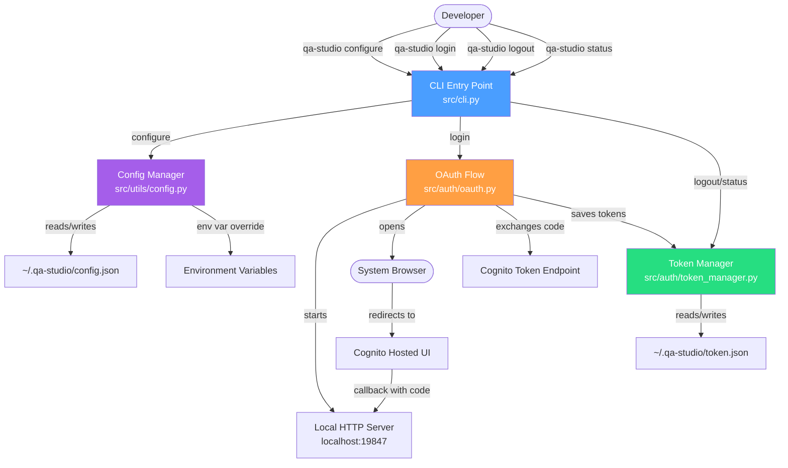
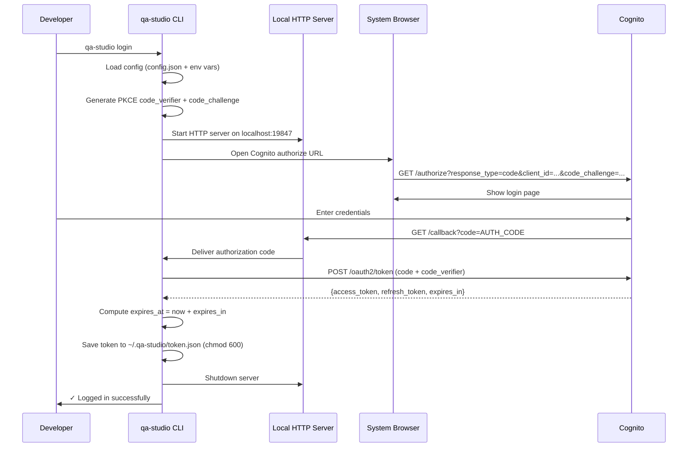
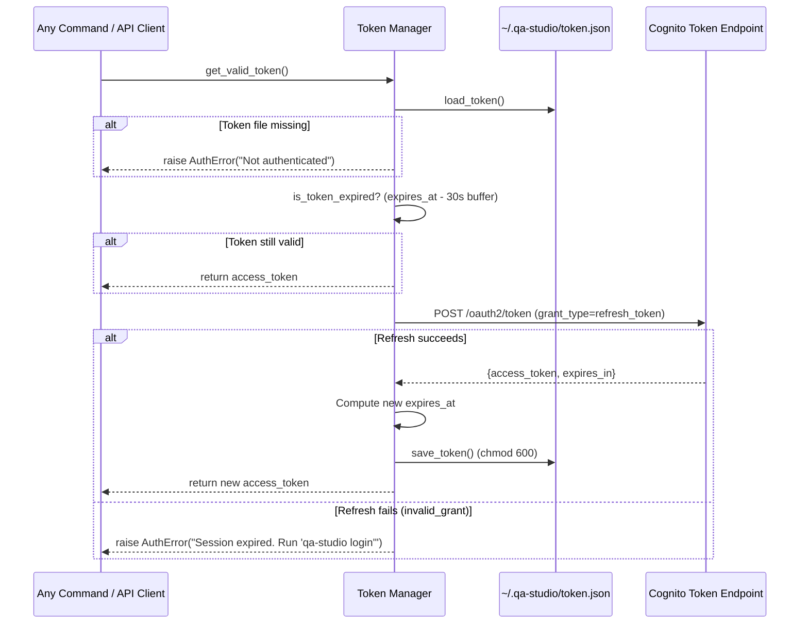

# Design Document: WP1 CLI Foundation & Auth

## Overview

This work package creates the `qa-studio-cli` Python package — a standalone CLI tool that provides OAuth browser-based authentication against AWS Cognito and token lifecycle management. The CLI exposes four commands (`configure`, `login`, `logout`, `status`) and stores configuration and tokens in `~/.qa-studio/`. It uses Click for CLI framework, Pydantic for data models, and treats `qa-studio-ci-runner` as a separate pip dependency rather than bundling it.

The design follows the patterns already established in `qa-studio-ci-runner/` (Click-based CLI, Pydantic settings, custom error hierarchy) while introducing browser-based OAuth (authorization code grant with PKCE) instead of client credentials, and file-based token persistence instead of in-memory caching.

## Architecture



## Sequence Diagrams

### OAuth Login Flow



### Token Refresh Flow (get_valid_token)



## Components and Interfaces

### Component 1: CLI Entry Point (`src/cli.py`)

**Purpose**: Click-based CLI group that registers all commands and enforces config guard.

**Interface**:
```python
import click

@click.group()
def cli() -> None:
    """QA Studio CLI — authenticate and manage QA Studio from the terminal."""
    pass

@cli.command()
def configure() -> None:
    """Interactive setup: collect API URL, Cognito domain, client ID."""

@cli.command()
def login() -> None:
    """Start browser-based OAuth flow and store tokens."""

@cli.command()
def logout() -> None:
    """Delete stored tokens."""

@cli.command()
def status() -> None:
    """Show current authentication state."""
```

**Responsibilities**:
- Register commands under the `qa-studio` entry point
- Enforce config existence guard on `login`, `logout`, `status` (not on `configure`)
- Delegate to `oauth`, `token_manager`, and `config` modules
- Format user-facing output (✓/✗ prefixed messages)

### Component 2: OAuth Flow (`src/auth/oauth.py`)

**Purpose**: Implements browser-based OAuth authorization code grant with PKCE against Cognito.

**Interface**:
```python
from pydantic import BaseModel

class TokenResponse(BaseModel):
    access_token: str
    refresh_token: str
    expires_at: int  # Unix timestamp
    token_type: str

def start_oauth_flow(cognito_domain: str, client_id: str) -> TokenResponse:
    """
    Full OAuth flow: start server, open browser, capture code, exchange tokens.
    
    Raises:
        AuthError: If flow fails or times out.
    """

def exchange_code_for_tokens(
    code: str,
    code_verifier: str,
    cognito_domain: str,
    client_id: str
) -> TokenResponse:
    """Exchange authorization code + PKCE verifier for tokens."""

def generate_pkce_pair() -> tuple[str, str]:
    """Generate (code_verifier, code_challenge) for PKCE."""

def open_browser(url: str) -> None:
    """Open system browser to the given URL."""
```

**Responsibilities**:
- Generate PKCE code_verifier and code_challenge (S256)
- Start a temporary HTTP server on `localhost:19847` to receive the callback
- Open the system browser to Cognito's `/authorize` endpoint
- Capture the authorization code from the callback
- Exchange the code for tokens via Cognito's `/oauth2/token` endpoint
- Return a validated `TokenResponse` Pydantic model
- Shut down the local server after callback (or on timeout)

### Component 3: Token Manager (`src/auth/token_manager.py`)

**Purpose**: Persist, load, validate, refresh, and delete tokens from `~/.qa-studio/token.json`.

**Interface**:
```python
from pydantic import BaseModel

class TokenData(BaseModel):
    access_token: str
    refresh_token: str
    expires_at: int
    token_type: str

def save_token(token_data: TokenData) -> None:
    """Save token to ~/.qa-studio/token.json with chmod 600."""

def load_token() -> TokenData | None:
    """Load token from file. Returns None if missing."""

def is_token_expired(token_data: TokenData) -> bool:
    """True if expires_at - 30s buffer < now."""

def refresh_access_token(
    refresh_token: str,
    cognito_domain: str,
    client_id: str
) -> TokenData:
    """
    Refresh via Cognito token endpoint.
    Raises AuthError on invalid_grant.
    """

def delete_token() -> None:
    """Delete token file if it exists."""

def get_valid_token() -> str:
    """
    Single entry point for all token consumers.
    Load → check expiry → refresh if needed → return access_token.
    Raises AuthError if not authenticated or refresh fails.
    """
```

**Responsibilities**:
- File I/O with correct permissions (0o600)
- Create `~/.qa-studio/` directory if missing
- 30-second expiry buffer to avoid mid-request expiration
- Transparent refresh: callers only call `get_valid_token()`
- Raise `AuthError` with actionable messages

### Component 4: Config Manager (`src/utils/config.py`)

**Purpose**: Manage persistent configuration in `~/.qa-studio/config.json` with environment variable overrides.

**Interface**:
```python
from pydantic import BaseModel, field_validator

class CLIConfig(BaseModel):
    api_url: str
    cognito_domain: str
    client_id: str

    @field_validator("api_url", "cognito_domain")
    @classmethod
    def validate_url(cls, v: str) -> str:
        """Validate URL format (must start with https://)."""
        ...

def load_config() -> CLIConfig:
    """
    Load config: file values overlaid with env vars.
    Raises ConfigError if file missing and no env vars.
    """

def save_config(config: CLIConfig) -> None:
    """Save config to ~/.qa-studio/config.json with chmod 600."""

def config_exists() -> bool:
    """Check if config file exists."""

def get_config_value(key: str) -> str:
    """Get single config value (env var > file)."""
```

**Responsibilities**:
- Validate URL format (must be HTTPS)
- Require `client_id` (no default)
- Environment variable override: `QA_STUDIO_API_URL`, `QA_STUDIO_COGNITO_DOMAIN`, `QA_STUDIO_CLIENT_ID`
- File permissions 0o600
- Create `~/.qa-studio/` directory if missing


## Data Models

All data models use Pydantic v2 (consistent with `qa-studio-ci-runner` which already uses `pydantic>=2.5.0`).

### TokenData

```python
from pydantic import BaseModel, Field

class TokenData(BaseModel):
    """Persisted token data in ~/.qa-studio/token.json."""
    access_token: str = Field(..., description="JWT access token from Cognito")
    refresh_token: str = Field(..., description="Refresh token for obtaining new access tokens")
    expires_at: int = Field(..., description="Unix timestamp when access_token expires")
    token_type: str = Field(default="Bearer", description="Token type, always Bearer")
```

**Validation Rules**:
- `access_token` and `refresh_token` must be non-empty strings
- `expires_at` must be a positive integer (Unix timestamp)
- `token_type` defaults to `"Bearer"`

### CLIConfig

```python
from pydantic import BaseModel, Field, field_validator

class CLIConfig(BaseModel):
    """Persisted CLI configuration in ~/.qa-studio/config.json."""
    api_url: str = Field(..., description="QA Studio API base URL")
    cognito_domain: str = Field(..., description="Cognito hosted UI domain")
    client_id: str = Field(..., description="Cognito app client ID (public)")

    @field_validator("api_url", "cognito_domain")
    @classmethod
    def validate_https_url(cls, v: str) -> str:
        if not v.startswith("https://"):
            raise ValueError("URL must start with https://")
        return v.rstrip("/")
```

**Validation Rules**:
- `api_url` and `cognito_domain` must be HTTPS URLs
- `client_id` is required, no default
- Trailing slashes stripped from URLs

### AuthError

```python
class AuthError(Exception):
    """Raised when authentication fails or tokens are invalid."""
    def __init__(self, message: str):
        super().__init__(message)
        self.message = message

class ConfigError(Exception):
    """Raised when configuration is missing or invalid."""
    def __init__(self, message: str):
        super().__init__(message)
        self.message = message
```

## Key Functions with Formal Specifications

### Function 1: `get_valid_token()`

```python
def get_valid_token() -> str:
    """Single entry point for all token consumers."""
```

**Preconditions:**
- `~/.qa-studio/config.json` exists and is valid
- `~/.qa-studio/token.json` may or may not exist

**Postconditions:**
- Returns a valid (non-expired) `access_token` string
- If token was refreshed, `~/.qa-studio/token.json` is updated on disk
- Raises `AuthError("Not authenticated. Run 'qa-studio login'.")` if no token file
- Raises `AuthError("Session expired. Run 'qa-studio login' to re-authenticate.")` if refresh fails

**Algorithm:**
```python
def get_valid_token() -> str:
    token_data = load_token()
    if token_data is None:
        raise AuthError("Not authenticated. Run 'qa-studio login'.")

    if not is_token_expired(token_data):
        return token_data.access_token

    # Token expired — attempt refresh
    config = load_config()
    try:
        new_token = refresh_access_token(
            refresh_token=token_data.refresh_token,
            cognito_domain=config.cognito_domain,
            client_id=config.client_id,
        )
        save_token(new_token)
        return new_token.access_token
    except AuthError:
        raise AuthError("Session expired. Run 'qa-studio login' to re-authenticate.")
```

### Function 2: `start_oauth_flow()`

```python
def start_oauth_flow(cognito_domain: str, client_id: str) -> TokenResponse:
    """Full browser-based OAuth authorization code grant with PKCE."""
```

**Preconditions:**
- `cognito_domain` is a valid HTTPS URL
- `client_id` is a non-empty string
- Port 19847 is available on localhost
- A system browser is available

**Postconditions:**
- Returns `TokenResponse` with valid tokens
- Local HTTP server is shut down (even on error)
- Raises `AuthError` if flow times out (120s) or token exchange fails

**Algorithm:**
```python
import hashlib
import base64
import secrets
import time
import webbrowser
from http.server import HTTPServer, BaseHTTPRequestHandler
from urllib.parse import urlencode, urlparse, parse_qs
import threading
import requests

CALLBACK_PORT = 19847
CALLBACK_PATH = "/callback"
FLOW_TIMEOUT_SECONDS = 120

def generate_pkce_pair() -> tuple[str, str]:
    """Generate PKCE code_verifier and code_challenge (S256)."""
    code_verifier = secrets.token_urlsafe(64)
    digest = hashlib.sha256(code_verifier.encode("ascii")).digest()
    code_challenge = base64.urlsafe_b64encode(digest).rstrip(b"=").decode("ascii")
    return code_verifier, code_challenge

def start_oauth_flow(cognito_domain: str, client_id: str) -> TokenResponse:
    code_verifier, code_challenge = generate_pkce_pair()

    # Mutable container for the authorization code captured by the callback handler
    auth_result: dict = {}

    class CallbackHandler(BaseHTTPRequestHandler):
        def do_GET(self):
            parsed = urlparse(self.path)
            if parsed.path == CALLBACK_PATH:
                params = parse_qs(parsed.query)
                if "code" in params:
                    auth_result["code"] = params["code"][0]
                    self.send_response(200)
                    self.end_headers()
                    self.wfile.write(b"Login successful. You can close this tab.")
                elif "error" in params:
                    auth_result["error"] = params.get("error_description", params["error"])[0]
                    self.send_response(400)
                    self.end_headers()
                    self.wfile.write(b"Login failed.")

        def log_message(self, format, *args):
            pass  # Suppress HTTP server logs

    server = HTTPServer(("localhost", CALLBACK_PORT), CallbackHandler)
    server_thread = threading.Thread(target=server.handle_request, daemon=True)
    server_thread.start()

    # Build authorize URL
    authorize_url = f"{cognito_domain}/oauth2/authorize?" + urlencode({
        "response_type": "code",
        "client_id": client_id,
        "redirect_uri": f"http://localhost:{CALLBACK_PORT}{CALLBACK_PATH}",
        "scope": "openid profile email",
        "code_challenge": code_challenge,
        "code_challenge_method": "S256",
    })

    webbrowser.open(authorize_url)

    # Wait for callback
    server_thread.join(timeout=FLOW_TIMEOUT_SECONDS)
    server.server_close()

    if "error" in auth_result:
        raise AuthError(f"OAuth flow failed: {auth_result['error']}")
    if "code" not in auth_result:
        raise AuthError("OAuth flow timed out. No authorization code received.")

    # Exchange code for tokens
    return exchange_code_for_tokens(
        code=auth_result["code"],
        code_verifier=code_verifier,
        cognito_domain=cognito_domain,
        client_id=client_id,
    )


def exchange_code_for_tokens(
    code: str,
    code_verifier: str,
    cognito_domain: str,
    client_id: str,
) -> TokenResponse:
    token_url = f"{cognito_domain}/oauth2/token"
    response = requests.post(
        token_url,
        data={
            "grant_type": "authorization_code",
            "client_id": client_id,
            "code": code,
            "redirect_uri": f"http://localhost:{CALLBACK_PORT}{CALLBACK_PATH}",
            "code_verifier": code_verifier,
        },
        headers={"Content-Type": "application/x-www-form-urlencoded"},
    )

    if response.status_code != 200:
        raise AuthError(f"Token exchange failed: {response.status_code} - {response.text}")

    data = response.json()
    return TokenResponse(
        access_token=data["access_token"],
        refresh_token=data["refresh_token"],
        expires_at=int(time.time()) + data["expires_in"],
        token_type=data.get("token_type", "Bearer"),
    )
```

### Function 3: `save_token()` / `load_token()`

```python
def save_token(token_data: TokenData) -> None:
    """Persist token to disk with secure permissions."""

def load_token() -> TokenData | None:
    """Load token from disk, return None if missing."""
```

**Preconditions (save):**
- `token_data` is a valid `TokenData` instance

**Postconditions (save):**
- `~/.qa-studio/token.json` exists with permissions 0o600
- `~/.qa-studio/` directory created if missing
- File contains JSON-serialized `TokenData`

**Postconditions (load):**
- Returns `TokenData` if file exists and is valid JSON
- Returns `None` if file does not exist
- Raises `AuthError` if file exists but contains invalid data

**Algorithm:**
```python
import json
import os
from pathlib import Path

QA_STUDIO_DIR = Path.home() / ".qa-studio"
TOKEN_FILE = QA_STUDIO_DIR / "token.json"

def save_token(token_data: TokenData) -> None:
    QA_STUDIO_DIR.mkdir(parents=True, exist_ok=True)
    TOKEN_FILE.write_text(token_data.model_dump_json(indent=2))
    os.chmod(TOKEN_FILE, 0o600)

def load_token() -> TokenData | None:
    if not TOKEN_FILE.exists():
        return None
    try:
        data = json.loads(TOKEN_FILE.read_text())
        return TokenData(**data)
    except (json.JSONDecodeError, Exception) as e:
        raise AuthError(f"Corrupt token file: {e}")

def is_token_expired(token_data: TokenData) -> bool:
    """Check expiry with 30-second buffer."""
    return int(time.time()) >= (token_data.expires_at - 30)

def delete_token() -> None:
    if TOKEN_FILE.exists():
        TOKEN_FILE.unlink()
```

### Function 4: `load_config()` / `save_config()`

```python
def load_config() -> CLIConfig:
    """Load config with env var overrides."""

def save_config(config: CLIConfig) -> None:
    """Persist config to disk."""
```

**Preconditions (load):**
- Either `~/.qa-studio/config.json` exists OR all env vars are set

**Postconditions (load):**
- Returns validated `CLIConfig`
- Env vars override file values: `QA_STUDIO_API_URL`, `QA_STUDIO_COGNITO_DOMAIN`, `QA_STUDIO_CLIENT_ID`
- Raises `ConfigError` if neither file nor env vars provide required values

**Algorithm:**
```python
import json
import os
from pathlib import Path

CONFIG_FILE = QA_STUDIO_DIR / "config.json"

ENV_VAR_MAP = {
    "api_url": "QA_STUDIO_API_URL",
    "cognito_domain": "QA_STUDIO_COGNITO_DOMAIN",
    "client_id": "QA_STUDIO_CLIENT_ID",
}

def load_config() -> CLIConfig:
    file_data = {}
    if CONFIG_FILE.exists():
        file_data = json.loads(CONFIG_FILE.read_text())

    # Overlay env vars
    for field, env_var in ENV_VAR_MAP.items():
        env_value = os.environ.get(env_var)
        if env_value:
            file_data[field] = env_value

    if not file_data:
        raise ConfigError("Configuration not found. Run 'qa-studio configure' first.")

    try:
        return CLIConfig(**file_data)
    except Exception as e:
        raise ConfigError(f"Invalid configuration: {e}")

def save_config(config: CLIConfig) -> None:
    QA_STUDIO_DIR.mkdir(parents=True, exist_ok=True)
    CONFIG_FILE.write_text(config.model_dump_json(indent=2))
    os.chmod(CONFIG_FILE, 0o600)

def config_exists() -> bool:
    return CONFIG_FILE.exists()

def get_config_value(key: str) -> str:
    env_var = ENV_VAR_MAP.get(key)
    if env_var:
        env_value = os.environ.get(env_var)
        if env_value:
            return env_value
    config = load_config()
    return getattr(config, key)
```


## Example Usage

### Configure

```python
# Interactive flow in src/cli.py
@cli.command()
def configure():
    """Collect and persist environment-specific settings."""
    click.echo("\nQA Studio CLI Configuration")
    click.echo("───────────────────────────")

    api_url = click.prompt("API URL", default="https://api.qa-studio.com")
    cognito_domain = click.prompt("Cognito Domain", default="https://auth.qa-studio.com")
    client_id = click.prompt("Cognito Client ID")  # No default — required

    config = CLIConfig(api_url=api_url, cognito_domain=cognito_domain, client_id=client_id)
    save_config(config)
    click.echo(f"\n✓ Configuration saved to {CONFIG_FILE}")
```

### Login

```python
@cli.command()
@require_config  # Decorator that checks config_exists()
def login():
    """Start browser-based OAuth flow."""
    config = load_config()
    click.echo("Opening browser for authentication...")

    token_response = start_oauth_flow(
        cognito_domain=config.cognito_domain,
        client_id=config.client_id,
    )
    save_token(token_response)
    click.echo(f"✓ Logged in successfully")
    click.echo(f"Token saved to {TOKEN_FILE}")
```

### Status

```python
@cli.command()
@require_config
def status():
    """Show current authentication state."""
    try:
        token = get_valid_token()  # Triggers refresh if needed
        token_data = load_token()
        expires = datetime.fromtimestamp(token_data.expires_at).strftime("%Y-%m-%d %H:%M:%S")
        click.echo(f"✓ Authenticated")
        click.echo(f"Token expires: {expires}")
    except AuthError as e:
        click.echo(f"✗ {e.message}")
```

### Logout

```python
@cli.command()
@require_config
def logout():
    """Delete stored tokens."""
    delete_token()
    click.echo("✓ Logged out successfully")
```

### Config Guard Decorator

```python
import functools

def require_config(fn):
    """Click command decorator that guards on config existence."""
    @functools.wraps(fn)
    def wrapper(*args, **kwargs):
        if not config_exists():
            click.echo("Configuration not found. Run 'qa-studio configure' first.")
            raise SystemExit(1)
        return fn(*args, **kwargs)
    return wrapper
```

### setup.py

```python
from setuptools import setup, find_packages

with open("requirements.txt") as f:
    requirements = f.read().splitlines()

setup(
    name="qa-studio-cli",
    version="0.1.0",
    author="QA Studio Team",
    description="QA Studio CLI — authenticate and manage QA Studio from the terminal",
    packages=find_packages(),
    install_requires=requirements,
    python_requires=">=3.11",
    entry_points={
        "console_scripts": [
            "qa-studio=src.cli:cli",
        ],
    },
)
```

### requirements.txt

```
click>=8.1.7
requests>=2.31.0
pydantic>=2.5.0
```

## Correctness Properties

*A property is a characteristic or behavior that should hold true across all valid executions of a system — essentially, a formal statement about what the system should do. Properties serve as the bridge between human-readable specifications and machine-verifiable correctness guarantees.*

### Property 1: Token persistence round-trip

*For any* valid `TokenData` instance, saving it via `save_token()` followed by `load_token()` shall produce a `TokenData` equal to the original instance.

**Validates: Requirements 4.1, 4.3**

### Property 2: Config persistence round-trip

*For any* valid `CLIConfig` instance, saving it via `save_config()` followed by `load_config()` (with no env vars set) shall produce a `CLIConfig` equal to the original instance.

**Validates: Requirements 2.2, 2.4**

### Property 3: File permissions invariant

*For any* valid `TokenData` or `CLIConfig` instance, after calling `save_token()` or `save_config()`, the written file shall have permissions `0o600`.

**Validates: Requirements 2.2, 4.1, 8.1**

### Property 4: PKCE pair validity

*For any* generated `(code_verifier, code_challenge)` pair from `generate_pkce_pair()`, `base64url(sha256(code_verifier))` shall equal `code_challenge` (per RFC 7636 S256).

**Validates: Requirements 3.1, 8.2**

### Property 5: Expiry buffer correctness

*For any* `TokenData` and any point in time, `is_token_expired(token)` shall return `True` if and only if `current_time >= token.expires_at - 30`.

**Validates: Requirement 4.6**

### Property 6: Config env var precedence

*For any* config file content and any set of environment variables (`QA_STUDIO_API_URL`, `QA_STUDIO_COGNITO_DOMAIN`, `QA_STUDIO_CLIENT_ID`), `load_config()` shall return values from the environment variables for any field where the corresponding env var is set, regardless of the file value.

**Validates: Requirements 2.4, 2.5**

### Property 7: get_valid_token idempotency

*For any* state where a non-expired token exists on disk, calling `get_valid_token()` twice in succession (with no external changes) shall return the same access token string.

**Validates: Requirement 4.8**

### Property 8: Logout completeness

*For any* state (token file exists or not), after calling `delete_token()`, `load_token()` shall return `None`.

**Validates: Requirement 4.12**

### Property 9: Config guard enforcement

*For any* command decorated with `@require_config`, when `config_exists()` returns `False`, the command shall raise `SystemExit(1)` and not execute the command body.

**Validates: Requirements 6.1, 6.2**

### Property 10: URL validation

*For any* string that does not start with `https://`, constructing a `CLIConfig` with that string as `api_url` or `cognito_domain` shall raise a validation error.

**Validates: Requirements 2.7, 7.4, 7.5**

### Property 11: Token model validation

*For any* empty string (including whitespace-only), constructing a `TokenData` with that string as `access_token` or `refresh_token` shall raise a validation error. Additionally, *for any* non-positive integer, constructing a `TokenData` with that value as `expires_at` shall raise a validation error.

**Validates: Requirements 7.1, 7.2**

### Property 12: Trailing slash normalization

*For any* valid HTTPS URL with one or more trailing slashes, constructing a `CLIConfig` with that URL as `api_url` or `cognito_domain` shall strip all trailing slashes from the stored value.

**Validates: Requirement 2.8**

## Error Handling

### Error Scenario 1: No Configuration

**Condition**: User runs `login`, `logout`, or `status` before running `configure`
**Response**: `"Configuration not found. Run 'qa-studio configure' first."`
**Recovery**: User runs `qa-studio configure`

### Error Scenario 2: Port 19847 Already in Use

**Condition**: Another process occupies port 19847 when `login` starts the callback server
**Response**: `"Port 19847 is already in use. Close the application using it and try again."`
**Recovery**: User frees the port and retries

### Error Scenario 3: OAuth Flow Timeout

**Condition**: User doesn't complete browser authentication within 120 seconds
**Response**: `"OAuth flow timed out. No authorization code received."`
**Recovery**: User retries `qa-studio login`

### Error Scenario 4: Token Exchange Failure

**Condition**: Cognito rejects the authorization code (expired, already used, invalid)
**Response**: `"Token exchange failed: {status_code} - {error_description}"`
**Recovery**: User retries `qa-studio login`

### Error Scenario 5: Expired Refresh Token

**Condition**: `get_valid_token()` attempts refresh but Cognito returns `invalid_grant`
**Response**: `"Session expired. Run 'qa-studio login' to re-authenticate."`
**Recovery**: User runs `qa-studio login`

### Error Scenario 6: Corrupt Token File

**Condition**: `~/.qa-studio/token.json` contains invalid JSON or missing fields
**Response**: `"Corrupt token file: {parse_error}"`
**Recovery**: User runs `qa-studio login` (overwrites the file)

### Error Scenario 7: Invalid Config Values

**Condition**: User enters non-HTTPS URL during `configure`
**Response**: Pydantic validation error: `"URL must start with https://"`
**Recovery**: User re-enters the value (Click re-prompts)

### Error Scenario 8: No Browser Available

**Condition**: `webbrowser.open()` fails (headless server, SSH session)
**Response**: `"Could not open browser. Open this URL manually:\n{authorize_url}"`
**Recovery**: User opens the URL manually in any browser

## Testing Strategy

### Unit Testing Approach

Target: ≥70% coverage across all modules.

**Token Manager tests** (`tests/test_token_manager.py`):
- `save_token` → file created with correct JSON and permissions 0o600
- `load_token` → returns `TokenData` for valid file, `None` for missing file
- `load_token` → raises `AuthError` for corrupt file
- `is_token_expired` → returns `True`/`False` based on current time vs `expires_at - 30`
- `delete_token` → file removed, idempotent on missing file
- `get_valid_token` → returns cached token when not expired
- `get_valid_token` → refreshes and saves when expired
- `get_valid_token` → raises `AuthError` when no token file
- `get_valid_token` → raises `AuthError` when refresh fails

**Config Manager tests** (`tests/test_config.py`):
- `save_config` → file created with correct JSON and permissions 0o600
- `load_config` → returns `CLIConfig` for valid file
- `load_config` → env vars override file values
- `load_config` → raises `ConfigError` when nothing available
- `config_exists` → `True`/`False` based on file presence
- `CLIConfig` validation → rejects non-HTTPS URLs
- `CLIConfig` validation → strips trailing slashes

**OAuth Flow tests** (`tests/test_oauth.py`):
- `generate_pkce_pair` → verifier is 64+ chars, challenge matches SHA256(verifier)
- `exchange_code_for_tokens` → returns `TokenResponse` on 200
- `exchange_code_for_tokens` → raises `AuthError` on non-200
- `start_oauth_flow` → integration test with mocked server/browser

**CLI Command tests** (`tests/test_cli.py`):
- `configure` → prompts for values, saves config
- `login` → calls `start_oauth_flow`, saves token
- `logout` → calls `delete_token`
- `status` → shows authenticated/not authenticated/expired
- Config guard → blocks commands when config missing

### Property-Based Testing Approach

**Property Test Library**: `hypothesis`

- **Token round-trip**: Generate arbitrary `TokenData` instances → `save_token` then `load_token` returns equal data
- **PKCE pair validity**: Generate random verifiers → verify `SHA256(verifier) == challenge`
- **Config round-trip**: Generate arbitrary `CLIConfig` instances → `save_config` then `load_config` returns equal data
- **Expiry check monotonicity**: For any two timestamps `t1 < t2`, if `is_token_expired` at `t1` is `True`, then it's also `True` at `t2`

### Integration Testing Approach

Manual integration tests (documented in README):
1. `pip install -e ./qa-studio-cli` → installs without errors
2. `qa-studio configure` → creates `~/.qa-studio/config.json`
3. `qa-studio login` → opens browser, completes OAuth, saves token
4. `qa-studio status` → shows `✓ Authenticated`
5. `qa-studio logout` → removes token
6. `qa-studio status` → shows `✗ Not authenticated`

## Security Considerations

1. **Token file permissions**: Always `0o600` — only the owner can read/write. Enforced in `save_token()` and `save_config()`.

2. **PKCE**: Authorization code grant uses PKCE (S256) to prevent authorization code interception. The CLI is a public client (no client secret).

3. **No secrets in config**: `config.json` stores only the public client ID, API URL, and Cognito domain. No secrets are persisted in clear text.

4. **Localhost-only callback**: The OAuth callback server binds to `localhost:19847` only — not `0.0.0.0`. This prevents external access.

5. **Token refresh over re-auth**: `get_valid_token()` transparently refreshes tokens to minimize how often the user must re-authenticate via browser.

6. **Sensitive error sanitization**: Error messages from Cognito are not blindly forwarded to the user. Token values are never logged or displayed.

7. **Short-lived callback server**: The HTTP server handles exactly one request and shuts down. It does not persist beyond the OAuth flow.

## Performance Considerations

- The local HTTP server is single-threaded and handles exactly one request — no concurrency concerns.
- Token refresh adds one HTTP round-trip (~200-500ms) only when the access token is expired. The 30-second buffer avoids mid-request expiration.
- Config and token files are small JSON (<1KB). File I/O is negligible.

## Dependencies

| Package | Version | Purpose |
|---------|---------|---------|
| `click` | >=8.1.7 | CLI framework (consistent with `qa-studio-ci-runner`) |
| `requests` | >=2.31.0 | HTTP client for Cognito token endpoint |
| `pydantic` | >=2.5.0 | Data models and validation (consistent with `qa-studio-ci-runner`) |

**System dependency**: `qa-studio-ci-runner` is installed separately via `pip install -e ./qa-studio-ci-runner`. It is NOT bundled in the CLI package. The CLI will invoke it in later work packages (WP2).

**Python version**: >=3.11 (uses `X | Y` union syntax, `tomllib` stdlib availability).

## File Structure

```
qa-studio-cli/
├── setup.py
├── README.md
├── requirements.txt
├── requirements-dev.txt
├── src/
│   ├── __init__.py
│   ├── cli.py                  # Click group + commands
│   ├── auth/
│   │   ├── __init__.py
│   │   ├── oauth.py            # Browser-based OAuth + PKCE
│   │   └── token_manager.py    # Token persistence + refresh
│   ├── models/
│   │   ├── __init__.py
│   │   ├── token.py            # TokenData, TokenResponse
│   │   ├── config.py           # CLIConfig
│   │   └── errors.py           # AuthError, ConfigError
│   └── utils/
│       ├── __init__.py
│       └── config.py           # Config file I/O + env var overlay
└── tests/
    ├── __init__.py
    ├── conftest.py             # Shared fixtures (tmp dirs, mock tokens)
    ├── test_token_manager.py
    ├── test_config.py
    ├── test_oauth.py
    └── test_cli.py
```
