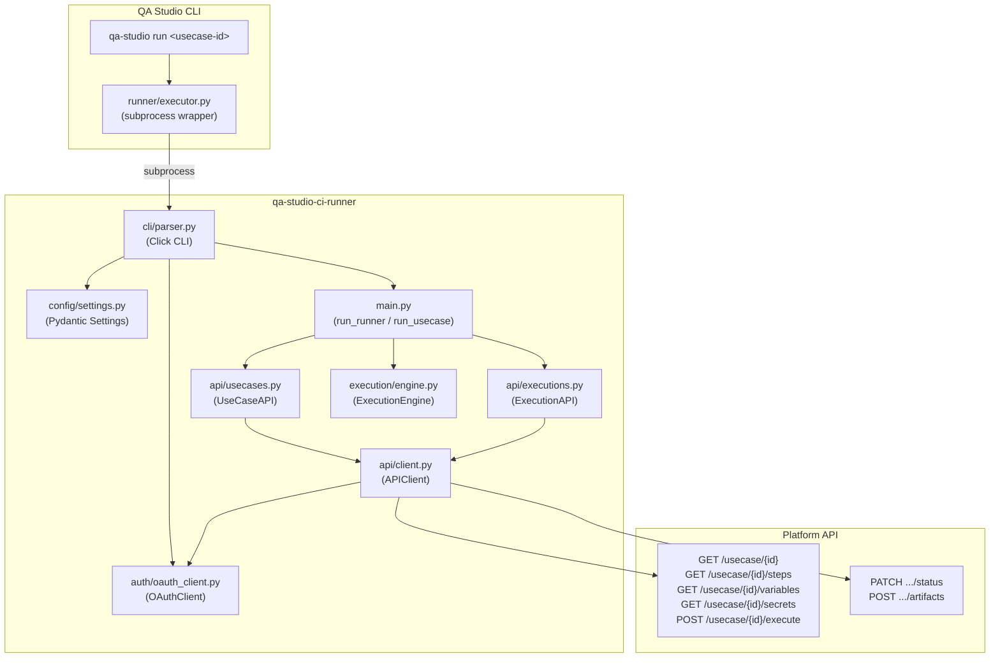
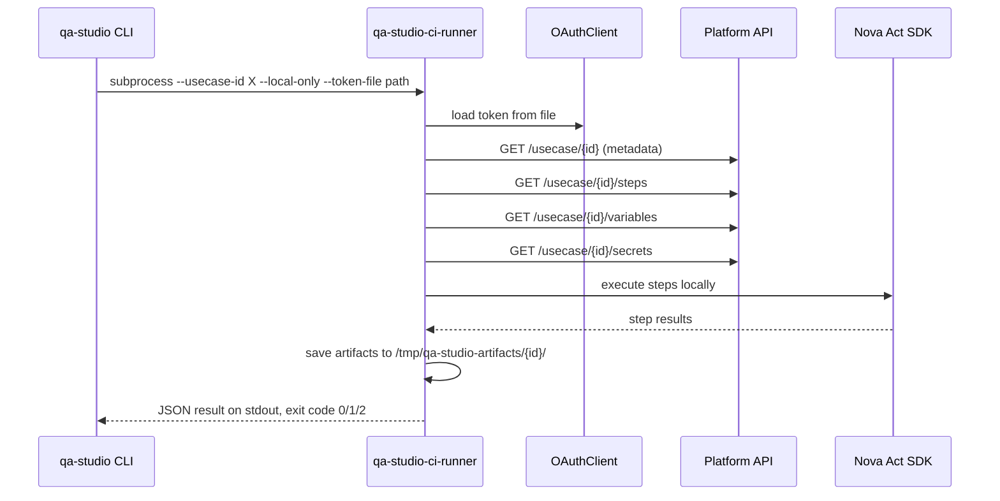
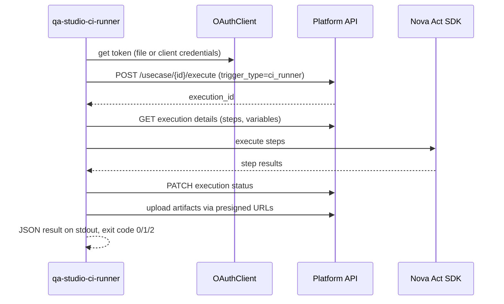

# Design Document: WP2 Runner Integration

## Overview

This design enhances the existing `qa-studio-ci-runner` to support three new capabilities:

1. **Single use case execution** via `--usecase-id` (mutually exclusive with `--suite-id`)
2. **Local-only mode** via `--local-only` (skip execution records, S3 uploads, status updates)
3. **Token file authentication** via `--token-file` (alternative to OAuth client credentials)

Additionally, a CLI wrapper module (`qa-studio-cli/src/runner/executor.py`) invokes the runner as a subprocess so that `qa-studio run` can execute tests seamlessly.

The design preserves full backward compatibility with existing suite-based CI/CD execution.

## Architecture



### Execution Flow: Local-Only Mode



### Execution Flow: Remote Mode



### Design Decisions

1. **Mutually exclusive flags over subcommands**: `--suite-id` and `--usecase-id` are mutually exclusive Click options rather than subcommands. This preserves backward compatibility — existing CI/CD pipelines using `--suite-id` continue to work unchanged.

2. **Token file re-read on every call**: When using `--token-file`, `get_access_token()` re-reads the file on each invocation rather than caching. This allows the QA Studio CLI's token manager to refresh tokens externally while the runner is executing.

3. **Settings made partially optional**: When `--token-file` is provided, the `Settings` model must not require `oauth_client_id`, `oauth_client_secret`, or `oauth_token_endpoint`. A new `from_env_optional_auth()` class method handles this.

4. **Local artifacts directory convention**: `/tmp/qa-studio-artifacts/<usecase-id>/` is a fixed convention. This keeps artifacts predictable for the CLI wrapper to locate and display.

5. **URL override preserves path**: `--base-url` replaces only the origin (scheme + host + port) of the use case's starting URL, preserving path and query parameters. This matches the existing suite execution behavior.


## Components and Interfaces

### 1. CLI Parser (`qa-studio-ci-runner/src/cli/parser.py`)

**Changes**: Make `--suite-id` optional, add `--usecase-id`, `--local-only`, `--token-file`.

```python
@click.command()
@click.option('--suite-id', default=None, help='Test suite ID to execute')
@click.option('--usecase-id', default=None, help='Single use case ID to execute')
@click.option('--local-only', is_flag=True, default=False, help='Local-only execution (no remote records)')
@click.option('--token-file', default=None, help='Path to JSON token file')
# ... existing options unchanged ...
```

**Validation rules** (enforced in `main()`):
- Exactly one of `--suite-id` or `--usecase-id` must be provided
- `--local-only` requires `--usecase-id`

**Routing**:
- `--suite-id` → `run_runner()` (existing)
- `--usecase-id` → `run_usecase()` (new)
- `--token-file` passed to both paths

### 2. OAuthClient (`qa-studio-ci-runner/src/auth/oauth_client.py`)

**Changes**: Support token file as alternative to client credentials.

```python
class OAuthClient:
    def __init__(
        self,
        client_id: str = None,
        client_secret: str = None,
        token_endpoint: str = None,
        token_file: str = None,
    ):
        if token_file:
            self._token_file_path = Path(token_file).expanduser()
            self._use_token_file = True
            # Validate file exists and has access_token on init
            self._read_token_file()
        elif client_id and client_secret and token_endpoint:
            self._use_token_file = False
            self.client_id = client_id
            self.client_secret = client_secret
            self.token_endpoint = token_endpoint
        else:
            raise AuthenticationError(
                "Either --token-file or OAUTH_CLIENT_ID/OAUTH_CLIENT_SECRET/"
                "OAUTH_TOKEN_ENDPOINT environment variables are required"
            )

    def get_access_token(self) -> str:
        if self._use_token_file:
            return self._read_token_file()
        # existing client credentials flow unchanged
        ...

    def _read_token_file(self) -> str:
        if not self._token_file_path.exists():
            raise AuthenticationError(f"Token file not found: {self._token_file_path}")
        data = json.loads(self._token_file_path.read_text())
        token = data.get('access_token')
        if not token:
            raise AuthenticationError(
                f"Token file does not contain a valid 'access_token' field: {self._token_file_path}"
            )
        return token
```

### 3. Settings (`qa-studio-ci-runner/src/config/settings.py`)

**Changes**: Add `from_env_optional_auth()` for token-file mode where OAuth env vars are not required.

```python
class Settings(BaseModel):
    oauth_client_id: Optional[str] = None
    oauth_client_secret: Optional[str] = None
    oauth_token_endpoint: Optional[str] = None
    api_endpoint: str
    log_level: str = "INFO"

    @classmethod
    def from_env(cls) -> 'Settings':
        """Load settings — all OAuth fields required (existing behavior)."""
        ...

    @classmethod
    def from_env_optional_auth(cls) -> 'Settings':
        """Load settings — OAuth fields optional (token-file mode)."""
        return cls(
            oauth_client_id=os.environ.get('OAUTH_CLIENT_ID'),
            oauth_client_secret=os.environ.get('OAUTH_CLIENT_SECRET'),
            oauth_token_endpoint=os.environ.get('OAUTH_TOKEN_ENDPOINT'),
            api_endpoint=os.environ['API_ENDPOINT'],
            log_level=os.environ.get('LOG_LEVEL', 'INFO'),
        )
```

### 4. UseCaseAPI (`qa-studio-ci-runner/src/api/usecases.py`) — NEW

```python
class UseCaseAPI:
    def __init__(self, client: APIClient): ...

    def get_usecase(self, usecase_id: str) -> dict:
        """GET /usecase/{usecase_id}"""

    def get_steps(self, usecase_id: str) -> list:
        """GET /usecase/{usecase_id}/steps → returns list of step dicts"""

    def get_variables(self, usecase_id: str) -> dict:
        """GET /usecase/{usecase_id}/variables → returns key-value dict"""

    def get_secrets(self, usecase_id: str) -> list:
        """GET /usecase/{usecase_id}/secrets → returns list of secret dicts"""

    def create_execution(self, usecase_id: str, trigger_type: str = 'ci_runner',
                         base_url: str = None, variables: dict = None,
                         region: str = None, model_id: str = None) -> dict:
        """POST /usecase/{usecase_id}/execute → returns execution record"""
```

All methods delegate to `APIClient` and propagate `APIError` with original status code and response body.

### 5. Main Module (`qa-studio-ci-runner/src/main.py`)

**New function**: `run_usecase()` — orchestrates single use case execution.

```python
def run_usecase(
    usecase_id: str,
    local_only: bool,
    token_file: str = None,
    base_url: str = None,
    variables: dict = None,
    region: str = None,
    model_id: str = None,
    timeout: int = 3600,
) -> None:
```

**Logic**:
1. Load settings via `from_env_optional_auth()` if `token_file` provided, else `from_env()`
2. Validate AWS session
3. Create `OAuthClient` (token file or client credentials)
4. Create `APIClient`, `UseCaseAPI`
5. If `local_only`:
   - Fetch usecase metadata, steps, variables, secrets via `UseCaseAPI`
   - Apply `--base-url` override (replace origin, preserve path/query)
   - Merge `--var` overrides (CLI takes precedence)
   - Apply `--region` and `--model-id` overrides
   - Call `engine.execute_usecase_local()`
   - Print JSON result to stdout
   - Exit 0 (success) / 1 (test failure)
6. If remote:
   - Call `usecase_api.create_execution()` with overrides
   - Fetch execution details via `ExecutionAPI`
   - Execute with tracking (status updates, artifact uploads)
   - Print JSON result to stdout
   - Exit 0 (success) / 1 (test failure)
7. On unexpected error: exit 2

**Existing `run_runner()`**: Modified to accept optional `token_file` parameter. When provided, uses token file auth instead of client credentials.

### 6. ExecutionEngine (`qa-studio-ci-runner/src/execution/engine.py`)

**New method**: `execute_usecase_local()`

```python
def execute_usecase_local(
    self,
    usecase_id: str,
    usecase_name: str,
    starting_url: str,
    steps: list,
    variables: dict,
    secrets: list,
    region: str,
    model_id: str,
) -> dict:
    """
    Execute use case locally without remote state management.

    Returns:
        {
            "status": "success" | "failed",
            "usecaseId": str,
            "usecaseName": str,
            "duration": float,
            "steps": [{"stepId": str, "status": str, "duration": float, ...}],
            "artifacts": {"video": str, "logs": str}
        }
    """
```

This method:
- Creates `/tmp/qa-studio-artifacts/<usecase-id>/` directory
- Executes steps sequentially using Nova Act SDK
- Stops on first failure
- Stores video recording and logs locally
- Returns result dict (no API calls for status/artifacts)

**Constructor change**: `ExecutionEngine` needs a lighter constructor for local-only mode (no `execution_api` or `suite_execution_id` required). We'll make these optional with defaults of `None`.

### 7. CLI Wrapper (`qa-studio-cli/src/runner/executor.py`) — NEW

```python
def execute_local(
    usecase_id: str,
    base_url: str = None,
    variables: dict = None,
) -> dict:
    """
    Invoke runner as subprocess for local execution.

    Uses token from ~/.qa-studio/token.json.
    Returns parsed JSON result from stdout.
    Raises RuntimeError on non-zero exit.
    """
```

Builds command: `python -m qa_studio_ci_runner --usecase-id <id> --local-only --token-file ~/.qa-studio/token.json [--base-url ...] [--var k=v ...]`

### 8. URL Override Utility

**New helper function** in `qa-studio-ci-runner/src/utils/url.py`:

```python
from urllib.parse import urlparse, urlunparse

def apply_base_url_override(original_url: str, base_url: str) -> str:
    """
    Replace the origin of original_url with base_url, preserving path and query.

    Example:
        apply_base_url_override(
            "https://staging.example.com/login?foo=bar",
            "http://localhost:3000"
        ) → "http://localhost:3000/login?foo=bar"
    """
    original = urlparse(original_url)
    override = urlparse(base_url)
    return urlunparse((
        override.scheme,
        override.netloc,
        original.path,
        original.params,
        original.query,
        original.fragment,
    ))
```


## Data Models

All data models are defined using Pydantic, consistent with the existing codebase conventions.

### Settings (Modified)

```python
class Settings(BaseModel):
    """Application settings. OAuth fields optional when using token-file auth."""
    oauth_client_id: Optional[str] = None
    oauth_client_secret: Optional[str] = None
    oauth_token_endpoint: Optional[str] = None
    api_endpoint: str = Field(..., description="Platform API base URL")
    log_level: str = Field(default="INFO", description="Logging level")
```

### UseCaseMetadata (New)

```python
class UseCaseMetadata(BaseModel):
    """Use case definition fetched from the platform API."""
    id: str
    name: str
    starting_url: str
    executing_region: str
    model_id: Optional[str] = None
```

### UseCaseStep (New)

```python
class UseCaseStep(BaseModel):
    """A single step within a use case."""
    step_id: str
    step_type: str
    instruction: str
    sort: int
    expected_value: Optional[str] = None
    capture_variable: Optional[str] = None
    operator: Optional[str] = None
```

### LocalExecutionResult (New)

```python
class LocalExecutionResult(BaseModel):
    """Result of a local-only use case execution. Serialized as JSON to stdout."""
    status: str  # "success" | "failed"
    usecase_id: str = Field(alias="usecaseId")
    usecase_name: str = Field(alias="usecaseName")
    duration: float  # seconds
    steps: list[StepResultDetail]
    artifacts: ArtifactPaths

    class Config:
        populate_by_name = True

class StepResultDetail(BaseModel):
    step_id: str = Field(alias="stepId")
    status: str  # "success" | "failed"
    duration: float
    error: Optional[str] = None

    class Config:
        populate_by_name = True

class ArtifactPaths(BaseModel):
    video: Optional[str] = None
    logs: Optional[str] = None
```

### RemoteExecutionResult (New)

```python
class RemoteExecutionResult(BaseModel):
    """Result of a remote use case execution. Serialized as JSON to stdout."""
    status: str  # "success" | "failed"
    usecase_id: str = Field(alias="usecaseId")
    usecase_name: str = Field(alias="usecaseName")
    execution_id: str = Field(alias="executionId")
    duration: float
    steps: list[StepResultDetail]

    class Config:
        populate_by_name = True
```

### TokenFileData (New)

```python
class TokenFileData(BaseModel):
    """Schema for the token file read by --token-file."""
    access_token: str
    refresh_token: Optional[str] = None
    expires_at: Optional[int] = None
    token_type: str = "Bearer"
```

### API Response Models

All JSON returned from the API uses camelCase (per project convention). The Pydantic models above use `alias` fields to serialize to camelCase for stdout output, while internal Python code uses snake_case.

### OAuth Scopes Used

The runner uses these existing scopes (all plural, per convention):
- `api/usecases.read` — fetch use case metadata, steps, variables, secrets
- `api/usecases.execute` — create execution records via POST
- `api/executions.read` — fetch execution details
- `api/executions.write` — update execution status, upload artifacts
- `api/suite.read` — fetch test suite definitions (suite mode only)
- `api/suite.write` — execute test suites (suite mode only)


## Correctness Properties

*A property is a characteristic or behavior that should hold true across all valid executions of a system — essentially, a formal statement about what the system should do. Properties serve as the bridge between human-readable specifications and machine-verifiable correctness guarantees.*

### Property 1: Local-only mode makes no remote state changes

*For any* use case executed in local-only mode, the runner shall make zero API calls to create execution records, update execution status, or upload artifacts to S3. Only read calls (GET usecase, steps, variables, secrets) are permitted.

**Validates: Requirements 2.4, 2.6, 2.7**

### Property 2: Exit code reflects execution outcome

*For any* execution result (local-only or remote), the exit code shall be 0 when status is "success", 1 when status is "failed" (test failure), and 2 when an unexpected exception occurs. This mapping is consistent across all execution modes.

**Validates: Requirements 2.9, 2.10, 2.11, 3.6, 3.7, 3.8, 9.5**

### Property 3: Execution result JSON contains all required fields

*For any* completed execution (local-only or remote), the JSON output to stdout shall contain the fields: `status`, `usecaseId`, `usecaseName`, `duration`, and `steps`. For local-only mode, it shall additionally contain `artifacts` with `video` and `logs` paths. For remote mode, it shall additionally contain `executionId`.

**Validates: Requirements 2.8, 3.9, 7.5**

### Property 4: Local artifacts stored at convention path

*For any* use case ID executed in local-only mode, artifacts shall be stored in the directory `/tmp/qa-studio-artifacts/<usecase-id>/`. The directory shall be created if it does not exist.

**Validates: Requirements 2.5, 7.6**

### Property 5: Token file authentication reads from file without client credentials flow

*For any* valid token file containing an `access_token` field, when the OAuthClient is initialized with that token file path, `get_access_token()` shall return the token from the file and shall not make any HTTP requests to the token endpoint.

**Validates: Requirements 4.2, 4.3**

### Property 6: Invalid token file raises descriptive error

*For any* file path that does not exist, initializing OAuthClient with that path shall raise an `AuthenticationError` whose message contains the file path. *For any* JSON file that does not contain an `access_token` field, initializing OAuthClient shall raise an `AuthenticationError` with a descriptive message.

**Validates: Requirements 4.5, 4.6**

### Property 7: Token file re-read on each access

*For any* token file, if the file content changes between two calls to `get_access_token()`, the second call shall return the updated token value (not a cached value).

**Validates: Requirements 4.7**

### Property 8: Settings does not require OAuth env vars in token-file mode

*For any* environment where `API_ENDPOINT` is set but `OAUTH_CLIENT_ID`, `OAUTH_CLIENT_SECRET`, and `OAUTH_TOKEN_ENDPOINT` are not set, `Settings.from_env_optional_auth()` shall succeed and return a valid Settings instance with `api_endpoint` populated and OAuth fields as None.

**Validates: Requirements 4.4**

### Property 9: UseCaseAPI propagates API errors

*For any* API response with status code >= 400, the UseCaseAPI methods shall raise an `APIError` whose `status_code` matches the response status code and whose `response` contains the response body.

**Validates: Requirements 5.7**

### Property 10: URL override preserves path and query

*For any* original URL with a path and query string, and *for any* base URL override, `apply_base_url_override(original, override)` shall produce a URL with the override's scheme and host but the original's path, query parameters, and fragment.

**Validates: Requirements 6.1**

### Property 11: Variable merge with CLI precedence

*For any* set of use case variables and *for any* set of CLI variable overrides, the merged result shall contain all keys from both sets, and for any key present in both, the CLI override value shall take precedence.

**Validates: Requirements 6.2**

### Property 12: Step failure stops execution and sets failed status

*For any* ordered sequence of steps where step N fails, the execution result status shall be "failed", steps 1..N shall have results, and steps N+1..end shall not be executed.

**Validates: Requirements 7.3, 7.4**

### Property 13: CLI wrapper forwards all overrides to subprocess

*For any* base URL and *for any* set of variable overrides passed to the CLI wrapper, the constructed subprocess command shall contain `--base-url <value>` and `--var <key>=<value>` for each override.

**Validates: Requirements 8.4, 8.5**

### Property 14: CLI wrapper result handling

*For any* subprocess that exits with code 0 and produces valid JSON on stdout, the CLI wrapper shall return the parsed dict. *For any* subprocess that exits with a non-zero code, the CLI wrapper shall raise a `RuntimeError` whose message contains the stderr output.

**Validates: Requirements 8.6, 8.7**


## Error Handling

### Authentication Errors

| Scenario | Error Type | Exit Code | Message |
|----------|-----------|-----------|---------|
| Token file not found | `AuthenticationError` | 2 | "Token file not found: {path}" |
| Token file missing `access_token` | `AuthenticationError` | 2 | "Token file does not contain a valid 'access_token' field: {path}" |
| Token file invalid JSON | `AuthenticationError` | 2 | "Failed to parse token file: {path}" |
| No token file and no OAuth env vars | `AuthenticationError` | 2 | "Either --token-file or OAUTH_CLIENT_ID/OAUTH_CLIENT_SECRET/OAUTH_TOKEN_ENDPOINT environment variables are required" |
| Client credentials auth failure | `AuthenticationError` | 2 | "OAuth authentication failed: {status} - {body}" |

### CLI Validation Errors

| Scenario | Behavior |
|----------|----------|
| Neither `--suite-id` nor `--usecase-id` | Click error: "Either --suite-id or --usecase-id is required" |
| Both `--suite-id` and `--usecase-id` | Click error: "Cannot use both --suite-id and --usecase-id" |
| `--local-only` without `--usecase-id` | Click error: "--local-only requires --usecase-id" |
| `--var` not in `key=value` format | Click error: "Variable must be in key=value format: {var}" |

### API Errors

| Scenario | Error Type | Exit Code |
|----------|-----------|-----------|
| Use case not found (404) | `APIError` | 2 |
| Unauthorized (401) | `APIError` | 2 |
| Forbidden (403) | `APIError` | 2 |
| Server error (5xx) | `APIError` | 2 |
| Network timeout | `requests.ConnectionError` | 2 |

### Execution Errors

| Scenario | Exit Code | Behavior |
|----------|-----------|----------|
| All steps pass | 0 | JSON result with status "success" |
| Any step fails | 1 | JSON result with status "failed", execution stops at failed step |
| Nova Act SDK error | 2 | Error logged, no JSON output |
| AWS session invalid | 2 | Error logged before execution starts |

### Error Message Sanitization

All error messages pass through `sanitize_error_message()` (existing utility) to strip sensitive data (tokens, secrets, email addresses) before logging or output.

## Testing Strategy

### Property-Based Testing

**Library**: [Hypothesis](https://hypothesis.readthedocs.io/) (Python property-based testing)

**Configuration**: Minimum 100 examples per property test.

Each property test must be tagged with a comment referencing the design property:

```python
# Feature: wp2-runner-integration, Property 10: URL override preserves path and query
@given(
    original_url=st.from_regex(r'https?://[a-z]+\.[a-z]+/[a-z/]+(\?[a-z]+=\w+)?', fullmatch=True),
    base_url=st.from_regex(r'https?://[a-z]+(\.[a-z]+)?(:\d{1,5})?', fullmatch=True),
)
@settings(max_examples=100)
def test_url_override_preserves_path_and_query(original_url, base_url):
    result = apply_base_url_override(original_url, base_url)
    original_parsed = urlparse(original_url)
    result_parsed = urlparse(result)
    base_parsed = urlparse(base_url)
    assert result_parsed.scheme == base_parsed.scheme
    assert result_parsed.netloc == base_parsed.netloc
    assert result_parsed.path == original_parsed.path
    assert result_parsed.query == original_parsed.query
```

**Property tests to implement** (one test per property):

| Property | Test File | Key Generators |
|----------|-----------|----------------|
| P1: No remote calls in local-only | `tests/test_local_only_mode.py` | Random usecase IDs, mock API client |
| P2: Exit code mapping | `tests/test_exit_codes.py` | Random execution results with varying statuses |
| P3: JSON output fields | `tests/test_output_format.py` | Random usecase metadata, step results |
| P4: Local artifacts path | `tests/test_local_artifacts.py` | Random UUID usecase IDs |
| P5: Token file auth | `tests/test_token_file_auth.py` | Random token strings, temp files |
| P6: Invalid token file errors | `tests/test_token_file_auth.py` | Random file paths, random JSON without access_token |
| P7: Token file re-read | `tests/test_token_file_auth.py` | Pairs of random token strings |
| P8: Settings optional auth | `tests/test_settings.py` | Random API endpoint URLs |
| P9: API error propagation | `tests/test_usecase_api.py` | Random HTTP status codes >= 400, random response bodies |
| P10: URL override | `tests/test_url_override.py` | Random URLs with paths and query params |
| P11: Variable merge | `tests/test_variable_merge.py` | Random dicts of variables |
| P12: Step failure stops execution | `tests/test_execution_engine.py` | Random step sequences with failure at random position |
| P13: CLI wrapper forwards overrides | `tests/test_cli_wrapper.py` | Random base URLs, random variable dicts |
| P14: CLI wrapper result handling | `tests/test_cli_wrapper.py` | Random JSON payloads, random stderr strings |

### Unit Tests

Unit tests cover specific examples, edge cases, and integration points not covered by property tests:

**CLI Parser** (`tests/test_parser.py`):
- Neither flag provided → error
- Both flags provided → error
- `--local-only` without `--usecase-id` → error
- `--suite-id` only → routes to `run_runner`
- `--usecase-id` only → routes to `run_usecase`
- `--usecase-id` + `--local-only` → routes to `run_usecase` with local_only=True

**OAuthClient** (`tests/test_oauth_client.py`):
- Token file mode: valid file returns token
- Token file mode: file not found raises AuthenticationError
- Token file mode: missing access_token raises AuthenticationError
- Token file mode: invalid JSON raises AuthenticationError
- Client credentials mode: successful auth
- Client credentials mode: 401 response raises AuthenticationError
- No auth configured raises AuthenticationError

**UseCaseAPI** (`tests/test_usecase_api.py`):
- `get_usecase()` calls correct endpoint
- `get_steps()` calls correct endpoint
- `get_variables()` calls correct endpoint
- `get_secrets()` calls correct endpoint
- `create_execution()` calls POST with trigger_type

**Main module** (`tests/test_main.py`):
- `run_usecase()` local-only: fetches data, executes locally, outputs JSON
- `run_usecase()` remote: creates execution, executes with tracking
- `run_usecase()` with token file: uses token file auth
- `run_runner()` with token file: uses token file auth
- `run_runner()` without token file: uses client credentials (backward compat)

**CLI Wrapper** (`tests/test_executor.py`):
- Command construction with all flags
- Command construction with no optional flags
- Successful execution returns parsed JSON
- Failed execution raises RuntimeError

### Test Coverage Target

Aim for ≥70% unit test coverage across all modified and new files. Property tests provide additional coverage through randomized input exploration.

### End-to-End Tests

An E2E test script validates the full flow against a real (or mocked) API:

1. **Local-only E2E**: `python -m qa_studio_ci_runner --usecase-id <test-id> --local-only --token-file <path>` → verify JSON output, exit code 0, artifacts in `/tmp/`
2. **Remote E2E**: `python -m qa_studio_ci_runner --usecase-id <test-id> --token-file <path>` → verify execution record created, artifacts uploaded, status updated
3. **Suite backward compat E2E**: `python -m qa_studio_ci_runner --suite-id <test-id>` → verify existing behavior unchanged
4. **Token file with suite E2E**: `python -m qa_studio_ci_runner --suite-id <test-id> --token-file <path>` → verify token file auth works with suite mode

