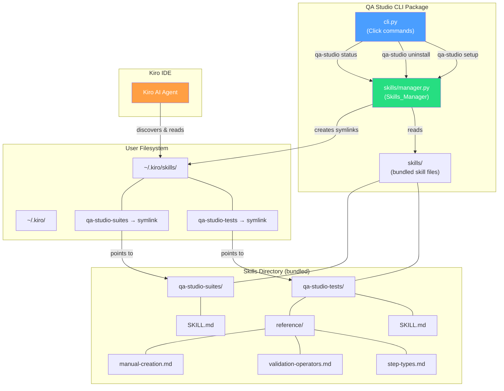
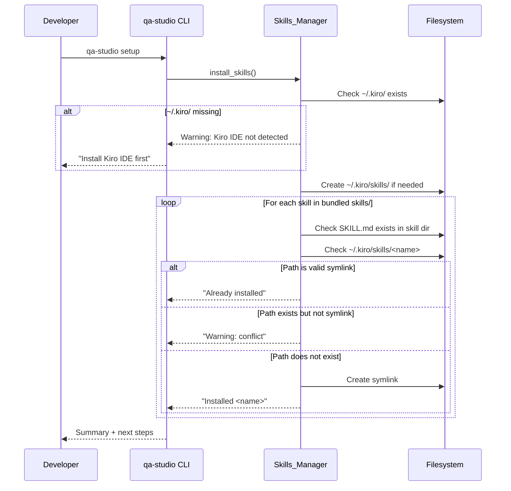

# Design Document: WP3 Agent Skills

## Overview

This work package creates Kiro IDE Agent Skills for the QA Studio CLI and implements skill lifecycle management. It delivers two skill directories (`qa-studio-tests`, `qa-studio-suites`) containing markdown instruction files that guide the Kiro AI agent on test creation, execution, and suite management. A `Skills_Manager` module handles installing skills as symlinks from the CLI package into `~/.kiro/skills/`, and three CLI commands (`setup`, `uninstall`, enhanced `status`) expose this functionality.

The design follows the existing CLI patterns (Click commands, Pydantic models, `pathlib.Path` for filesystem ops) and Agent Skills best practices (progressive disclosure, concise SKILL.md files, third-person descriptions with trigger keywords, reference files for detailed content).

## Architecture



### Skill Installation Flow



### Design Decisions

1. **Symlinks over file copies**: Symlinks ensure skills stay in sync with the installed CLI package version. When the user upgrades `qa-studio-cli`, the symlinks automatically point to updated skill content. No re-setup needed.

2. **Skills bundled as package data**: Skills ship inside the Python package via `setup.py` `package_data`. This avoids a separate installation step and ensures skills are always available where the CLI is installed.

3. **Skills_Manager as a separate module**: Encapsulating all symlink logic in `skills/manager.py` keeps CLI commands thin and enables shared logic between `setup`, `uninstall`, and `status`. This follows the existing pattern where `auth/token_manager.py` encapsulates token logic.

4. **Pydantic model for skill status**: A `SkillStatus` model provides typed, consistent status reporting across commands. This follows the project convention of Pydantic for all data models.

5. **Progressive disclosure in skills**: Main SKILL.md files stay under 500 lines with concise instructions. Detailed content (step types, operators, manual creation) lives in `reference/` subdirectories. This optimizes token usage — Kiro only loads what it needs.

6. **No `__init__.py` in skills directory**: The `skills/` directory contains markdown files, not Python modules. It sits alongside `qa_studio_cli/` in the package root and is included via `package_data` in `setup.py`.


## Components and Interfaces

### Component 1: Skills Manager (`qa_studio_cli/skills/manager.py`)

**Purpose**: Encapsulates all skill discovery, installation, uninstallation, and status checking logic. Single source of truth for skill filesystem operations.

**Interface**:
```python
from pathlib import Path
from qa_studio_cli.models.skills import SkillInfo, SkillStatus

KIRO_DIR = Path.home() / ".kiro"
KIRO_SKILLS_DIR = KIRO_DIR / "skills"

def get_skills_directory() -> Path:
    """Resolve the path to the bundled skills/ directory relative to this package.
    
    Returns:
        Absolute path to qa-studio-cli/skills/
    """

def list_available_skills() -> list[SkillInfo]:
    """Scan the bundled skills directory for subdirectories containing SKILL.md.
    
    Returns:
        List of SkillInfo with name and path for each discovered skill.
    """

def check_skill_status(skill: SkillInfo) -> SkillStatus:
    """Check installation status of a single skill.
    
    Returns:
        SkillStatus with state: 'installed', 'not_installed', or 'conflict'
    """

def check_all_skills_status() -> list[SkillStatus]:
    """Check installation status of all available skills.
    
    Returns:
        List of SkillStatus for each available skill.
    """

def is_kiro_installed() -> bool:
    """Check if ~/.kiro/ directory exists."""

def install_skills() -> list[SkillStatus]:
    """Install all available skills as symlinks into ~/.kiro/skills/.
    
    Creates ~/.kiro/skills/ if it doesn't exist.
    Skips already-installed skills and conflict paths.
    
    Returns:
        List of SkillStatus with outcome for each skill.
    
    Raises:
        No exceptions — OS errors are caught per-skill and reported in status.
    """

def uninstall_skills() -> list[SkillStatus]:
    """Remove all skill symlinks from ~/.kiro/skills/.
    
    Only removes symlinks, never deletes regular files/directories.
    
    Returns:
        List of SkillStatus with outcome for each skill.
    """
```

**Responsibilities**:
- Resolve bundled skills directory path using `Path(__file__).resolve().parent.parent / "skills"`
- Discover skills by scanning for directories containing `SKILL.md`
- Create/remove symlinks using `pathlib.Path.symlink_to()` and `Path.unlink()`
- Report per-skill status without raising exceptions (errors captured in status objects)
- Use `pathlib.Path` exclusively for all filesystem operations

### Component 2: CLI Commands (additions to `qa_studio_cli/cli.py`)

**Purpose**: Expose skill management via `qa-studio setup`, `qa-studio uninstall`, and enhanced `qa-studio status`.

**Interface**:
```python
@cli.command()
def setup() -> None:
    """Install QA Studio skills for Kiro IDE."""

@cli.command()
def uninstall() -> None:
    """Remove QA Studio skills from Kiro IDE."""

@cli.command()
@require_config
def status() -> None:
    """Show authentication and skills status."""
```

**Responsibilities**:
- `setup`: Check Kiro installation, delegate to `install_skills()`, display results and next-step guidance
- `uninstall`: Delegate to `uninstall_skills()`, display results
- `status`: Show auth status (existing), then show skills status section with checkmark/cross indicators
- Format user-facing output consistently with existing CLI style (✓/✗ prefixes)

### Component 3: Skill Content Files

**Purpose**: Markdown instruction files that guide the Kiro AI agent.

**Files**:

| File | Purpose | Max Lines |
|------|---------|-----------|
| `skills/qa-studio-tests/SKILL.md` | Test creation, execution, management | 500 |
| `skills/qa-studio-tests/reference/step-types.md` | All 7 step types with examples | — |
| `skills/qa-studio-tests/reference/validation-operators.md` | All operators with examples | — |
| `skills/qa-studio-tests/reference/manual-creation.md` | Step-by-step manual test creation | — |
| `skills/qa-studio-suites/SKILL.md` | Suite management | 500 |

**Content Principles**:
- YAML frontmatter with `name` and `description` (third person, trigger keywords, negative cases)
- Concrete CLI command examples with realistic placeholders
- Progressive disclosure: main file links to reference files
- Only QA Studio-specific knowledge (no general concepts)
- Forward slashes in all paths
- Reference only existing or planned CLI commands (WP4)

### Component 4: Package Configuration (`setup.py`)

**Purpose**: Include skills as package data so they ship with `pip install`.

**Changes**:
```python
setup(
    ...
    packages=find_packages(),
    package_dir={'': '.'},
    package_data={
        '': ['skills/**/*.md'],
    },
    include_package_data=True,
    ...
)
```

Since `skills/` is not a Python package (no `__init__.py`), we use the root package `''` with a glob pattern to include all markdown files under `skills/`.

### Component 5: Pydantic Models (`qa_studio_cli/models/skills.py`)

**Purpose**: Typed data models for skill information and status reporting.

See Data Models section below.

## Data Models

All data models use Pydantic v2, consistent with the existing codebase.

### SkillInfo

```python
from pydantic import BaseModel, Field
from pathlib import Path

class SkillInfo(BaseModel):
    """Metadata about a bundled skill discovered in the skills directory."""
    name: str = Field(..., description="Skill directory name (e.g. 'qa-studio-tests')")
    path: Path = Field(..., description="Absolute path to the skill directory in the package")

    model_config = {"arbitrary_types_allowed": True}
```

### SkillStatus

```python
from enum import Enum

class SkillState(str, Enum):
    """Possible installation states for a skill."""
    INSTALLED = "installed"
    NOT_INSTALLED = "not_installed"
    CONFLICT = "conflict"
    INSTALL_FAILED = "install_failed"
    REMOVED = "removed"
    SKIPPED = "skipped"

class SkillStatus(BaseModel):
    """Installation status of a single skill."""
    name: str = Field(..., description="Skill name")
    state: SkillState = Field(..., description="Current installation state")
    message: str = Field(default="", description="Human-readable status message")
```

### SkillFrontmatter

```python
class SkillFrontmatter(BaseModel):
    """YAML frontmatter parsed from a SKILL.md file."""
    name: str = Field(..., min_length=1, description="Skill name matching directory name")
    description: str = Field(..., min_length=1, description="Third-person skill description")
```

### Directory Structure

```
qa-studio-cli/
├── qa_studio_cli/
│   ├── __init__.py
│   ├── cli.py                          # Modified: add setup, uninstall, enhance status
│   ├── auth/
│   │   ├── __init__.py
│   │   ├── oauth.py
│   │   └── token_manager.py
│   ├── models/
│   │   ├── __init__.py
│   │   ├── config.py
│   │   ├── errors.py
│   │   ├── token.py
│   │   └── skills.py                   # NEW: SkillInfo, SkillStatus, SkillFrontmatter
│   ├── runner/
│   │   ├── __init__.py
│   │   └── executor.py
│   ├── skills/                          # NEW: Skills_Manager module
│   │   ├── __init__.py
│   │   └── manager.py
│   └── utils/
│       ├── __init__.py
│       └── config.py
├── skills/                              # NEW: Bundled skill content (not a Python package)
│   ├── qa-studio-tests/
│   │   ├── SKILL.md
│   │   └── reference/
│   │       ├── step-types.md
│   │       ├── validation-operators.md
│   │       └── manual-creation.md
│   └── qa-studio-suites/
│       └── SKILL.md
├── tests/
│   ├── __init__.py
│   ├── conftest.py
│   ├── test_skills_manager.py           # NEW: Skills_Manager unit + property tests
│   ├── test_skills_cli.py               # NEW: CLI command tests with CliRunner
│   └── test_skill_content.py            # NEW: Skill file validation tests
├── setup.py                             # Modified: add package_data for skills/
├── requirements.txt
└── requirements-dev.txt
```

## Correctness Properties

*A property is a characteristic or behavior that should hold true across all valid executions of a system — essentially, a formal statement about what the system should do. Properties serve as the bridge between human-readable specifications and machine-verifiable correctness guarantees.*

### Property 1: SKILL.md files stay under 500 lines

*For any* SKILL.md file in the bundled skills directory, the file shall contain fewer than 500 lines.

**Validates: Requirements 1.5, 10.7**

### Property 2: Reference files over 100 lines include a table of contents

*For any* reference file in any skill's `reference/` subdirectory that exceeds 100 lines, the file shall contain a table of contents section within the first 10 lines.

**Validates: Requirements 2.4**

### Property 3: Install creates correct symlinks for all skills

*For any* set of skill directories in the bundled skills directory where each contains a `SKILL.md` file, after calling `install_skills()` with a valid `~/.kiro/` directory present, each skill shall have a symlink at `~/.kiro/skills/<skill-name>` pointing to the corresponding bundled skill directory.

**Validates: Requirements 5.3, 5.4, 8.5**

### Property 4: Install is idempotent

*For any* state where all skills are already correctly installed (symlinks exist and point to correct targets), calling `install_skills()` again shall not modify any symlinks and shall report all skills as already installed.

**Validates: Requirements 5.5**

### Property 5: Uninstall removes all skill symlinks

*For any* set of installed skill symlinks at `~/.kiro/skills/<skill-name>`, after calling `uninstall_skills()`, none of those symlink paths shall exist.

**Validates: Requirements 6.2, 8.6**

### Property 6: Uninstall preserves non-symlink paths

*For any* path at `~/.kiro/skills/<skill-name>` that is a regular file or directory (not a symlink), calling `uninstall_skills()` shall leave that path unchanged.

**Validates: Requirements 6.5**

### Property 7: Install then uninstall round-trip

*For any* valid `~/.kiro/` directory, calling `install_skills()` followed by `uninstall_skills()` shall result in no skill symlinks remaining at `~/.kiro/skills/`.

**Validates: Requirements 5.4, 6.2**

### Property 8: Skill discovery matches directory structure

*For any* skills directory containing N subdirectories that each contain a `SKILL.md` file, `list_available_skills()` shall return exactly N `SkillInfo` items, and the set of returned names shall equal the set of subdirectory names.

**Validates: Requirements 8.3**

### Property 9: Status check reflects filesystem state

*For any* skill and *for any* filesystem state at `~/.kiro/skills/<skill-name>` (symlink to correct target, symlink to wrong target, regular directory, or non-existent), `check_skill_status()` shall return the correct `SkillState`: `INSTALLED` for valid symlink, `CONFLICT` for non-symlink path, and `NOT_INSTALLED` for non-existent path.

**Validates: Requirements 8.4**

### Property 10: No backslashes in skill file paths

*For any* markdown file in the bundled skills directory (SKILL.md and reference files), the file content shall not contain backslash characters in file paths or relative links.

**Validates: Requirements 9.6**

### Property 11: All SKILL.md files have valid YAML frontmatter

*For any* SKILL.md file in the bundled skills directory, parsing the YAML frontmatter shall produce a valid object with non-empty `name` and `description` string fields.

**Validates: Requirements 10.6**

## Error Handling

### Error Scenario 1: Kiro IDE Not Installed

**Condition**: User runs `qa-studio setup` but `~/.kiro/` directory does not exist
**Response**: `"⚠️  Kiro IDE not detected (~/.kiro/ not found)\n   Install Kiro IDE first, then run this command again"`
**Recovery**: User installs Kiro IDE, then re-runs `qa-studio setup`

### Error Scenario 2: Symlink Conflict

**Condition**: A regular file or directory exists at `~/.kiro/skills/<skill-name>` (not a symlink)
**Response**: `"⚠️  <skill-name> exists but is not a symlink — skipped"`
**Recovery**: User manually removes or renames the conflicting path, then re-runs `qa-studio setup`

### Error Scenario 3: OS Error During Symlink Creation

**Condition**: `Path.symlink_to()` raises `OSError` (permissions, filesystem limitations, etc.)
**Response**: `"✗ Failed to install <skill-name>: <error message>"`
**Behavior**: Manager continues with remaining skills (does not abort)
**Recovery**: User resolves the OS-level issue and re-runs `qa-studio setup`

### Error Scenario 4: Bundled Skills Directory Missing

**Condition**: The `skills/` directory is not found relative to the package installation (corrupted install)
**Response**: `"Skills directory not found. Reinstall qa-studio-cli."`
**Recovery**: User reinstalls the package via `pip install --force-reinstall qa-studio-cli`

### Error Scenario 5: No Skills to Uninstall

**Condition**: User runs `qa-studio uninstall` but no skill symlinks exist
**Response**: `"No skills to remove"`
**Recovery**: None needed — informational message

### Error Scenario 6: Configuration Missing for Status

**Condition**: User runs `qa-studio status` without running `qa-studio configure` first
**Response**: `"Configuration not found. Run 'qa-studio configure' first."` (existing behavior from `@require_config`)
**Recovery**: User runs `qa-studio configure`

## Testing Strategy

### Property-Based Testing

**Library**: [Hypothesis](https://hypothesis.readthedocs.io/) (already in `requirements-dev.txt`)

**Configuration**: Minimum 100 examples per property test.

Each property test is tagged with a comment referencing the design property:

```python
# Feature: wp3-agent-skills, Property 3: Install creates correct symlinks for all skills
@given(skill_names=st.lists(st.from_regex(r'[a-z][a-z0-9\-]{2,20}', fullmatch=True), min_size=1, max_size=5, unique=True))
@settings(max_examples=100)
def test_install_creates_symlinks_for_all_skills(skill_names, tmp_path):
    ...
```

**Property tests to implement** (one test per property):

| Property | Test File | Key Generators / Approach |
|----------|-----------|---------------------------|
| P1: SKILL.md under 500 lines | `test_skill_content.py` | Iterate all SKILL.md files in bundled skills/ |
| P2: Reference TOC for >100 lines | `test_skill_content.py` | Iterate all reference files |
| P3: Install creates symlinks | `test_skills_manager.py` | Random skill names, temp directories |
| P4: Install idempotency | `test_skills_manager.py` | Random skill names, install twice |
| P5: Uninstall removes symlinks | `test_skills_manager.py` | Random skill names, install then uninstall |
| P6: Uninstall preserves non-symlinks | `test_skills_manager.py` | Random skill names with regular dirs at target |
| P7: Install/uninstall round-trip | `test_skills_manager.py` | Random skill names |
| P8: Skill discovery | `test_skills_manager.py` | Random directory structures with/without SKILL.md |
| P9: Status check correctness | `test_skills_manager.py` | Random filesystem states |
| P10: No backslashes in paths | `test_skill_content.py` | Iterate all markdown files |
| P11: Valid YAML frontmatter | `test_skill_content.py` | Iterate all SKILL.md files |

### Unit Tests

Unit tests cover specific examples, edge cases, and CLI integration:

**Skills Manager** (`tests/test_skills_manager.py`):
- `get_skills_directory()` returns existing path containing skill subdirectories
- `list_available_skills()` returns correct skills from bundled directory
- `list_available_skills()` ignores directories without SKILL.md
- `check_skill_status()` returns INSTALLED for valid symlink
- `check_skill_status()` returns NOT_INSTALLED for missing path
- `check_skill_status()` returns CONFLICT for regular directory
- `install_skills()` creates `~/.kiro/skills/` directory
- `install_skills()` skips already-installed skills
- `install_skills()` warns on conflict paths
- `install_skills()` handles OS errors gracefully per-skill
- `install_skills()` returns empty when `~/.kiro/` missing (after warning)
- `uninstall_skills()` removes only symlinks
- `uninstall_skills()` skips non-symlink paths
- `uninstall_skills()` handles no-skills-to-remove scenario
- `is_kiro_installed()` returns True/False based on `~/.kiro/` existence

**CLI Commands** (`tests/test_skills_cli.py`):
- `qa-studio setup` with Kiro installed → installs skills, shows count
- `qa-studio setup` without Kiro → shows warning
- `qa-studio setup` with all skills already installed → shows "already installed"
- `qa-studio uninstall` with installed skills → removes, shows count
- `qa-studio uninstall` with no skills → shows "no skills to remove"
- `qa-studio status` with auth + skills installed → shows ✓ for each
- `qa-studio status` with auth + skills not installed → shows ✗ and guidance
- `qa-studio status` without config → shows config error (existing behavior preserved)

**Skill Content Validation** (`tests/test_skill_content.py`):
- `qa-studio-tests/SKILL.md` has valid frontmatter with correct name
- `qa-studio-tests/SKILL.md` contains required sections (prerequisites, creating tests, executing, managing, error handling)
- `qa-studio-tests/SKILL.md` contains links to all three reference files
- `qa-studio-tests/SKILL.md` references `qa-studio status` in prerequisites
- `qa-studio-suites/SKILL.md` has valid frontmatter with correct name
- `qa-studio-suites/SKILL.md` contains required sections
- `qa-studio-suites/SKILL.md` references `qa-studio status`
- `step-types.md` documents all 7 step types
- `validation-operators.md` documents all operators
- `manual-creation.md` contains step-by-step guide sections
- All reference files >100 lines have table of contents

### Test Coverage Target

Aim for ≥70% unit test coverage across `skills/manager.py`, the new CLI commands, and `models/skills.py`. Property tests provide additional coverage through randomized input exploration.

### Test Fixtures

```python
# conftest.py additions

@pytest.fixture
def tmp_kiro_dir(tmp_path):
    """Provide a temporary ~/.kiro/ directory."""
    kiro_dir = tmp_path / ".kiro"
    kiro_dir.mkdir()
    return kiro_dir

@pytest.fixture
def tmp_skills_source(tmp_path):
    """Create a temporary bundled skills directory with SKILL.md files."""
    skills_dir = tmp_path / "skills"
    for name in ["qa-studio-tests", "qa-studio-suites"]:
        skill_dir = skills_dir / name
        skill_dir.mkdir(parents=True)
        (skill_dir / "SKILL.md").write_text("---\nname: {}\ndescription: Test skill\n---\n".format(name))
    return skills_dir
```

All filesystem tests use `tmp_path` and monkeypatching to avoid touching the real `~/.kiro/` directory. The `monkeypatch` fixture patches `KIRO_DIR`, `KIRO_SKILLS_DIR`, and `get_skills_directory()` to use temporary paths.
