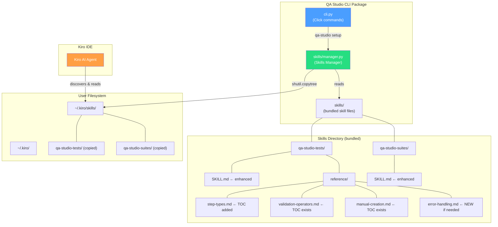

# Design Document: WP3 Agent Skills Improvements

## Overview

This work package improves the existing WP3 Agent Skills for the QA Studio CLI based on Anthropic best practices for Agent Skills authoring. The changes are primarily content-driven (enhancing SKILL.md files and reference files) with one infrastructure change already implemented (file copies instead of symlinks in the Skills Manager).

The improvements fall into three categories:

1. **Skill content enhancements** (Requirements 1–7, 9–10): Richer descriptions with trigger keywords, concrete examples, decision trees, feedback loops, improved prerequisites, better error handling, reference file TOCs, updated validation checklists, and line limit compliance.
2. **Infrastructure fix** (Requirement 8): Skills Manager already uses `shutil.copytree` instead of symlinks — no code changes needed, only test verification.
3. **Testing** (Requirement 11): New tests validating skill content structure and Skills Manager copy behavior.

No new Python modules or CLI commands are introduced. The existing `manager.py`, `cli.py`, and Pydantic models remain unchanged. All work targets the markdown skill files and the test suite.

## Architecture

The architecture remains identical to the original WP3 design. The key change is that the Skills Manager now uses `shutil.copytree` instead of `Path.symlink_to()`, which is already implemented.



### Design Decisions

1. **Content changes only in SKILL.md files**: New sections (Examples, Decision Tree, Feedback Loop, improved Prerequisites, enhanced Error Handling) are added directly to the existing SKILL.md files. If any SKILL.md exceeds 500 lines, overflow content moves to a new reference file.

2. **Reference file TOC enhancement**: `step-types.md` gets a descriptive TOC (type name + brief purpose). `validation-operators.md` and `manual-creation.md` already have TOCs — they'll be verified and enhanced if needed.

3. **No new reference files unless line limit forces it**: We keep content in the main SKILL.md where possible. Only if the 500-line limit is exceeded do we extract sections to `reference/` files. Based on current line counts (~130 lines for tests, ~130 for suites), there's room for the new sections.

4. **Skills Manager unchanged**: The `manager.py` already uses `shutil.copytree` for install and `shutil.rmtree` for uninstall, with stale symlink cleanup. No code changes needed — only test coverage to verify the behavior.

5. **Test file organization**: New content validation tests go in a new `test_skill_content.py` file. Existing `test_skills_manager.py` gets additional tests for copy-specific behavior verification.

## Components and Interfaces

### Component 1: Enhanced SKILL.md for `qa-studio-tests`

**Current state**: ~130 lines with Prerequisites, Creating Tests, Executing Tests, Managing Tests, Step Types summary, Validation Operators summary, Error Handling.

**Changes**:
- **Frontmatter `description`**: Add trigger keywords: "UI automation", "browser testing", "end-to-end tests", "E2E testing", "web application testing", "Nova Act"
- **Prerequisites section**: Add expected output for `qa-studio status` (authenticated and not-authenticated states), fallback instruction for `qa-studio setup`
- **New "Choosing the Right Approach" section**: Decision tree covering AI-generated vs manual creation vs editing, based on developer intent
- **New "Examples" section**: At least 3 concrete examples with full CLI commands and expected output descriptions (from-journey creation, local execution, variable overrides)
- **New "Test Creation Workflow" section**: Iterative feedback loop (create → review → test → evaluate → refine → deploy) with journey refinement tips
- **Enhanced Error Handling section**: At least 5 error scenarios with exact messages, causes, and recovery commands (auth failure, test not found, execution failure, Nova Act region error, journey generation issues)

**Line budget**: ~130 current + ~250 new content ≈ 380 lines. Under 500 limit.

### Component 2: Enhanced SKILL.md for `qa-studio-suites`

**Current state**: ~130 lines with Prerequisites, Creating Suites, Adding Tests, Executing, Scheduling, Managing, Error Handling.

**Changes**:
- **Frontmatter `description`**: Add trigger keywords: "batch testing", "regression suite", "CI/CD tests"
- **Prerequisites section**: Add expected output for `qa-studio status`, fallback instruction for `qa-studio setup`
- **New "Examples" section**: At least 2 concrete examples with full CLI commands and expected output descriptions
- **Enhanced Error Handling section**: At least 4 error scenarios (auth failure, suite not found, test not found when adding, invalid cron)

**Line budget**: ~130 current + ~100 new content ≈ 230 lines. Well under 500 limit.

### Component 3: Reference File TOC Updates

**`step-types.md`** (~290 lines): Replace the current minimal TOC with descriptive entries including step type name and brief purpose for each of the 7 step types.

**`validation-operators.md`** (~250 lines): Already has a TOC grouped by category. Verify it meets the requirement (descriptive entries grouped by string/number/boolean).

**`manual-creation.md`** (~230 lines): Already has a detailed TOC. No changes needed.

### Component 4: Validation Checklist

A validation checklist section added to the `qa-studio-tests` SKILL.md or as a reference file, covering:
- SKILL_File quality checks (frontmatter, description, line limit, examples, prerequisites, error handling, feedback loop)
- Progressive disclosure checks (concise main file, reference files, links, TOCs, decision tree)
- Kiro integration checks (discoverability, CLI commands, examples syntax, common issues, file copies)

### Component 5: Test Suite Additions

**New file `tests/test_skill_content.py`**: Validates skill content structure:
- Frontmatter contains required trigger keywords
- Required sections exist in each SKILL.md
- Reference files >100 lines have TOCs
- All SKILL.md files under 500 lines

**Updates to `tests/test_skills_manager.py`**: Additional assertions verifying:
- `install_skills()` creates real directories (not symlinks)
- `uninstall_skills()` removes copied directories and cleans up stale symlinks

## Data Models

No new data models are introduced. The existing models from WP3 remain unchanged:

- `SkillInfo`: Metadata about a bundled skill (name, path)
- `SkillState`: Enum of installation states (INSTALLED, NOT_INSTALLED, CONFLICT, INSTALL_FAILED, REMOVED, SKIPPED)
- `SkillStatus`: Installation status of a single skill (name, state, message)
- `SkillFrontmatter`: Parsed YAML frontmatter (name, description)

All models are defined in `qa_studio_cli/models/skills.py` using Pydantic v2.


## Correctness Properties

*A property is a characteristic or behavior that should hold true across all valid executions of a system — essentially, a formal statement about what the system should do. Properties serve as the bridge between human-readable specifications and machine-verifiable correctness guarantees.*

### Property 1: Frontmatter contains all required trigger keywords

*For any* SKILL.md file in the bundled skills directory, the parsed YAML frontmatter `description` field shall contain every trigger keyword defined for that skill. For `qa-studio-tests`: "UI automation", "browser testing", "end-to-end tests", "E2E testing", "web application testing", "Nova Act", plus all pre-existing keywords. For `qa-studio-suites`: "batch testing", "regression suite", "CI/CD tests", plus all pre-existing keywords.

**Validates: Requirements 1.1, 1.2, 1.3**

### Property 2: Reference files over 100 lines have a TOC with anchor links in the first 15 lines

*For any* markdown file in any skill's `reference/` subdirectory that exceeds 100 lines, the first 15 lines shall contain at least one markdown anchor link matching the pattern `[text](#anchor)`.

**Validates: Requirements 7.1, 7.2**

### Property 3: Install creates real directories, not symlinks

*For any* set of bundled skills (directories containing a `SKILL.md`), after calling `install_skills()` with a valid `~/.kiro/` directory, each installed skill path at `~/.kiro/skills/<skill-name>` shall be a real directory (not a symlink) containing a `SKILL.md` file.

**Validates: Requirements 8.1, 8.2, 8.3**

### Property 4: Status check reflects filesystem state

*For any* skill and *for any* filesystem state at `~/.kiro/skills/<skill-name>` — real directory with `SKILL.md`, directory without `SKILL.md`, symlink, or non-existent — `check_skill_status()` shall return `INSTALLED` only when a real directory with `SKILL.md` exists, `CONFLICT` when a path exists but is not a valid skill, and `NOT_INSTALLED` when the path does not exist.

**Validates: Requirements 8.3**

### Property 5: Uninstall removes installed skills and stale symlinks

*For any* skill target path that is either a directory containing `SKILL.md` or a stale symlink, after calling `uninstall_skills()`, that path shall no longer exist.

**Validates: Requirements 8.4, 8.5**

### Property 6: Uninstall preserves non-skill paths

*For any* path at `~/.kiro/skills/<skill-name>` that is a regular directory without `SKILL.md` (and not a symlink), calling `uninstall_skills()` shall leave that path unchanged.

**Validates: Requirements 8.6**

### Property 7: Install then uninstall round-trip

*For any* valid `~/.kiro/` directory, calling `install_skills()` followed by `uninstall_skills()` shall result in no skill directories remaining at `~/.kiro/skills/` for any of the bundled skill names.

**Validates: Requirements 8.1, 8.4**

### Property 8: SKILL.md files under 500 lines

*For any* SKILL.md file in the bundled skills directory, the total line count shall be strictly less than 500.

**Validates: Requirements 10.1, 10.2**

## Error Handling

No new error handling logic is introduced in Python code. The Skills Manager error handling from WP3 remains unchanged:

| Scenario | Condition | Response | Recovery |
|----------|-----------|----------|----------|
| Kiro IDE not installed | `~/.kiro/` missing | Warning message, empty result list | Install Kiro IDE, re-run `qa-studio setup` |
| Path conflict | Non-skill directory exists at target | CONFLICT status, skill skipped | Manually remove conflicting path |
| OS error during copy | `shutil.copytree` raises `OSError` | INSTALL_FAILED status per-skill, continues with others | Resolve OS issue, re-run setup |
| No skills to uninstall | No installed skills found | NOT_INSTALLED status for all | Informational, no action needed |
| Bundled skills dir missing | Corrupted package install | Empty skills list | Reinstall `qa-studio-cli` |

The SKILL.md files themselves document error handling guidance for the Kiro agent (see Requirements 6.1–6.5). These are content additions, not code changes.

## Testing Strategy

### Property-Based Testing

**Library**: [Hypothesis](https://hypothesis.readthedocs.io/) — already available in the project's dev dependencies.

**Configuration**: Minimum 100 examples per property test.

Each property test is tagged with a comment referencing the design property:

```python
# Feature: wp3-improvements, Property 3: Install creates real directories, not symlinks
@given(skill_names=st.lists(
    st.from_regex(r'[a-z][a-z0-9\-]{2,20}', fullmatch=True),
    min_size=1, max_size=5, unique=True
))
@settings(max_examples=100)
def test_install_creates_real_directories(skill_names, tmp_path):
    ...
```

**Property tests to implement** (one test per property):

| Property | Test File | Approach |
|----------|-----------|----------|
| P1: Frontmatter trigger keywords | `test_skill_content.py` | Parse all SKILL.md frontmatter, check required keywords per skill |
| P2: Reference TOC with anchors | `test_skill_content.py` | Iterate reference files >100 lines, check first 15 lines for anchor links |
| P3: Install creates real dirs | `test_skills_manager.py` | Generate random skill names, run install, assert `is_dir()` and `not is_symlink()` |
| P4: Status check correctness | `test_skills_manager.py` | Generate random filesystem states (dir+SKILL.md, dir-only, symlink, missing), verify status |
| P5: Uninstall removes skills+symlinks | `test_skills_manager.py` | Install skills + create symlinks, run uninstall, verify paths gone |
| P6: Uninstall preserves non-skills | `test_skills_manager.py` | Create dirs without SKILL.md, run uninstall, verify dirs remain |
| P7: Install/uninstall round-trip | `test_skills_manager.py` | Generate random skill names, install then uninstall, verify clean state |
| P8: SKILL.md under 500 lines | `test_skill_content.py` | Count lines in all SKILL.md files |

### Unit Tests

Unit tests cover specific examples, edge cases, and content validation:

**Skill Content Validation** (`tests/test_skill_content.py`):
- `qa-studio-tests` SKILL.md contains "Examples" section header
- `qa-studio-tests` SKILL.md contains "Choosing the Right Approach" section header
- `qa-studio-tests` SKILL.md contains "Test Creation Workflow" section header
- `qa-studio-tests` SKILL.md Examples section has at least 3 examples with CLI commands
- `qa-studio-tests` SKILL.md has `--from-journey` example with journey description and expected output
- `qa-studio-tests` SKILL.md has local execution example with `--base-url` and `--var` flags
- `qa-studio-tests` SKILL.md error handling has at least 5 error scenarios
- `qa-studio-tests` SKILL.md error handling covers: auth failure, test not found, execution failure, Nova Act region, journey generation
- `qa-studio-tests` SKILL.md prerequisites shows `qa-studio status` expected output
- `qa-studio-tests` SKILL.md prerequisites includes `qa-studio setup` fallback
- `qa-studio-suites` SKILL.md contains "Examples" section header
- `qa-studio-suites` SKILL.md Examples section has at least 2 examples with CLI commands
- `qa-studio-suites` SKILL.md error handling has at least 4 error scenarios
- `qa-studio-suites` SKILL.md error handling covers: auth failure, suite not found, test not found, invalid cron
- `qa-studio-suites` SKILL.md prerequisites shows `qa-studio status` expected output
- `step-types.md` TOC has descriptive entries for all 7 step types
- `validation-operators.md` TOC is grouped by string/number/boolean categories

**Skills Manager** (`tests/test_skills_manager.py`) — additions to existing tests:
- `install_skills()` creates real directories, not symlinks (explicit `assert not .is_symlink()`)
- `install_skills()` copies SKILL.md and reference subdirectories
- `uninstall_skills()` removes copied directories via `shutil.rmtree`
- `uninstall_skills()` cleans up stale symlinks from previous versions
- `uninstall_skills()` skips directories without SKILL.md (existing test, verify still passes)

### Test Coverage Target

Aim for ≥70% unit test coverage across the skill content validation and Skills Manager modules. Property tests provide additional coverage through randomized input exploration.

### Existing Test Fixtures

The existing `conftest.py` already provides:
- `tmp_kiro_dir`: Temporary `~/.kiro/` directory
- `tmp_skills_source`: Temporary bundled skills directory with SKILL.md files

These fixtures are sufficient for the new tests. No new fixtures are needed.
