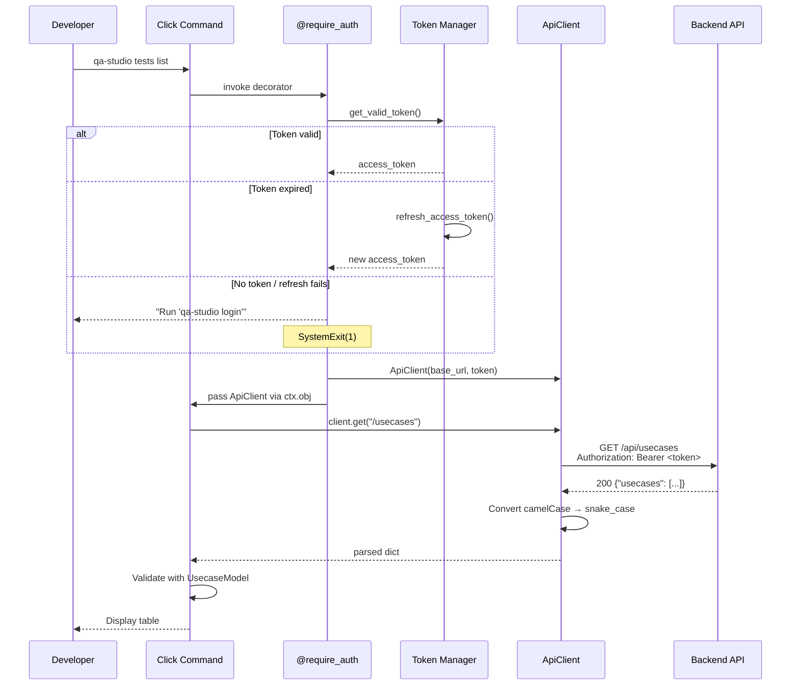

# Design Document: WP4 API Wrapper Commands

## Overview

This work package adds API wrapper commands to the QA Studio CLI, enabling test (usecase) and suite management directly from the terminal. It introduces three new modules:

1. **API Client** (`qa_studio_cli/api/client.py`) — authenticated HTTP client with camelCase↔snake_case conversion and structured error handling
2. **Tests Commands** (`qa_studio_cli/commands/tests.py`) — Click command group for `qa-studio tests {list,get,create,delete}`
3. **Suites Commands** (`qa_studio_cli/commands/suites.py`) — Click command group for `qa-studio suites {list,get,create,add-tests,remove-test,run}`

The design builds on existing patterns: Click for CLI, Pydantic v2 for models, `token_manager.get_valid_token()` for auth, and `config.load_config()` for base URL resolution. The API client is a thin wrapper around `requests` that handles token injection, error mapping, and JSON key conversion — no external HTTP client libraries beyond `requests`.

### Key Design Decisions

1. **Single API client class** rather than per-resource clients. The backend API is small enough that one class with `get()`, `post()`, `delete()` methods keeps things simple without premature abstraction.

2. **`require_auth` decorator** centralizes config loading, token validation, and API client instantiation. Commands receive a ready-to-use `ApiClient` via Click context, eliminating duplicated auth boilerplate.

3. **Pydantic `alias_generator`** for camelCase↔snake_case. The API returns camelCase JSON (per steering rule `02_api-design.md`), but Python code uses snake_case. Pydantic's `alias_generator=to_camel` with `populate_by_name=True` handles this at the model boundary — no manual key conversion needed.

4. **Separate command groups** (`tests`, `suites`) registered on the main CLI group. This follows Click best practices for organizing related commands and keeps `cli.py` thin.

## Architecture

```mermaid
graph TD
    User([Developer]) -->|"qa-studio tests list"| CLI[CLI Entry Point<br/>cli.py]
    User -->|"qa-studio suites run <id>"| CLI

    CLI -->|registers| TestsGrp[Tests Command Group<br/>commands/tests.py]
    CLI -->|registers| SuitesGrp[Suites Command Group<br/>commands/suites.py]

    TestsGrp -->|@require_auth| AuthDec[require_auth Decorator<br/>api/client.py]
    SuitesGrp -->|@require_auth| AuthDec

    AuthDec -->|loads config| ConfigMgr[Config Manager<br/>utils/config.py]
    AuthDec -->|gets token| TokenMgr[Token Manager<br/>auth/token_manager.py]
    AuthDec -->|creates| ApiClient[ApiClient<br/>api/client.py]

    ApiClient -->|GET/POST/DELETE| API[QA Studio Backend API]
    ApiClient -->|raises| ApiError[ApiError<br/>models/errors.py]
    ApiClient -->|validates with| Models[Pydantic Models<br/>models/api.py]

    style CLI fill:#4a9eff,color:#fff
    style ApiClient fill:#ff9f43,color:#fff
    style AuthDec fill:#26de81,color:#fff
    style Models fill:#a55eea,color:#fff
```

### Request Flow Sequence



## Components and Interfaces

### Component 1: ApiClient (`qa_studio_cli/api/client.py`)

**Purpose**: Authenticated HTTP client for the QA Studio backend API.

**Interface**:
```python
import requests
from qa_studio_cli.models.errors import ApiError, AuthError

class ApiClient:
    """Authenticated HTTP client for QA Studio API."""

    def __init__(self, base_url: str, access_token: str):
        self.base_url = base_url.rstrip("/")
        self.access_token = access_token

    def get(self, path: str, params: dict | None = None) -> dict:
        """Send authenticated GET request. Returns parsed JSON."""

    def post(self, path: str, json_body: dict | None = None) -> dict:
        """Send authenticated POST request. Returns parsed JSON."""

    def delete(self, path: str) -> dict | None:
        """Send authenticated DELETE request. Returns parsed JSON or None for 204."""

    def _request(self, method: str, path: str, **kwargs) -> requests.Response:
        """Internal: send request with auth headers, raise ApiError on failure."""

    def _handle_error(self, response: requests.Response) -> None:
        """Map HTTP status codes to ApiError with actionable messages."""
```

**Responsibilities**:
- Set `Authorization: Bearer <token>` and `Content-Type: application/json` on every request
- Map error status codes: 401 → "session expired, run login", 403 → "insufficient permissions", 404 → "resource not found", other → include status code and message
- Return parsed JSON body for 2xx responses
- Return `None` for 204 No Content responses

**Key implementation detail**: The client does NOT do camelCase→snake_case conversion itself. That happens at the Pydantic model layer via `alias_generator`. The client returns raw parsed JSON dicts. This keeps the client simple and testable.

### Component 2: require_auth Decorator (`qa_studio_cli/api/client.py`)

**Purpose**: Reusable decorator that ensures authentication before any API command.

**Interface**:
```python
import functools
import click
from qa_studio_cli.utils.config import load_config, config_exists
from qa_studio_cli.auth.token_manager import get_valid_token
from qa_studio_cli.models.errors import AuthError, ConfigError

def require_auth(fn):
    """Decorator: load config, get token, create ApiClient, pass via ctx.obj."""
    @functools.wraps(fn)
    @click.pass_context
    def wrapper(ctx, *args, **kwargs):
        if not config_exists():
            click.echo("Configuration not found. Run 'qa-studio configure' first.", err=True)
            raise SystemExit(1)
        try:
            config = load_config()
            token = get_valid_token()
        except ConfigError as e:
            click.echo(f"Configuration error: {e.message}", err=True)
            raise SystemExit(1)
        except AuthError as e:
            click.echo(f"{e.message}", err=True)
            raise SystemExit(1)
        ctx.ensure_object(dict)
        ctx.obj["client"] = ApiClient(base_url=config.api_url, access_token=token)
        return ctx.invoke(fn, *args, **kwargs)
    return wrapper
```

**Responsibilities**:
- Check config exists → error with "run configure" if missing
- Load config and get valid token → error with "run login" if auth fails
- Create `ApiClient` and attach to Click context
- All error messages go to stderr

### Component 3: Tests Command Group (`qa_studio_cli/commands/tests.py`)

**Purpose**: Click command group for test/usecase management.

**Commands**:

| Command | Verb | API Path | Scope |
|---------|------|----------|-------|
| `tests list` | GET | `/usecases` | `api/usecases.read` |
| `tests get <id>` | GET | `/usecase/<id>` | `api/usecases.read` |
| `tests create --from-journey` | POST | `/generate-usecase` + `/import` | `api/usecases.write` |
| `tests delete <id>` | DELETE | `/usecase/<id>` | `api/usecases.write` |

**Note on API paths**: The backend uses `/usecases` (plural) for list and `/usecase` (singular) for single-resource operations. This is the existing API convention — the CLI must match it exactly.

**Interface**:
```python
@click.group()
def tests():
    """Manage tests (usecases)."""
    pass

@tests.command("list")
@require_auth
@click.pass_context
def list_tests(ctx):
    """List all tests."""

@tests.command("get")
@require_auth
@click.argument("id")
@click.pass_context
def get_test(ctx, id):
    """Get test details."""

@tests.command("create")
@require_auth
@click.option("--from-journey", is_flag=True, required=True)
@click.pass_context
def create_test(ctx, from_journey):
    """Create a test from a user journey description."""

@tests.command("delete")
@require_auth
@click.argument("id")
@click.option("--yes", "-y", is_flag=True, help="Skip confirmation prompt")
@click.pass_context
def delete_test(ctx, id, yes):
    """Delete a test."""
```

### Component 4: Suites Command Group (`qa_studio_cli/commands/suites.py`)

**Purpose**: Click command group for test suite management.

**Commands**:

| Command | Verb | API Path | Scope |
|---------|------|----------|-------|
| `suites list` | GET | `/test-suites` | `api/suite.read` |
| `suites get <id>` | GET | `/test-suites/<id>` | `api/suite.read` |
| `suites create` | POST | `/test-suites` | `api/suite.write` |
| `suites add-tests <suite-id> <ids...>` | POST | `/test-suites/<id>/usecases` | `api/suite.write` |
| `suites remove-test <suite-id> <id>` | DELETE | `/test-suites/<id>/usecases/<id>` | `api/suite.write` |
| `suites run <suite-id>` | POST | `/test-suites/<id>/execute` | `api/suite.write` + `api/executions.write` |

**Interface**:
```python
@click.group()
def suites():
    """Manage test suites."""
    pass

@suites.command("list")
@require_auth
@click.pass_context
def list_suites(ctx):
    """List all test suites."""

@suites.command("get")
@require_auth
@click.argument("id")
@click.pass_context
def get_suite(ctx, id):
    """Get suite details."""

@suites.command("create")
@require_auth
@click.option("--name", required=True, help="Suite name")
@click.option("--description", required=True, help="Suite description")
@click.option("--tags", multiple=True, help="Tags (repeatable)")
@click.pass_context
def create_suite(ctx, name, description, tags):
    """Create a new test suite."""

@suites.command("add-tests")
@require_auth
@click.argument("suite_id")
@click.argument("usecase_ids", nargs=-1, required=True)
@click.pass_context
def add_tests(ctx, suite_id, usecase_ids):
    """Add tests to a suite."""

@suites.command("remove-test")
@require_auth
@click.argument("suite_id")
@click.argument("usecase_id")
@click.pass_context
def remove_test(ctx, suite_id, usecase_id):
    """Remove a test from a suite."""

@suites.command("run")
@require_auth
@click.argument("suite_id")
@click.option("--base-url", help="Base URL override")
@click.option("--var", "variables", multiple=True, help="Variable override KEY=VALUE (repeatable)")
@click.option("--region", help="AWS region override")
@click.option("--model-id", help="Bedrock model ID override")
@click.pass_context
def run_suite(ctx, suite_id, base_url, variables, region, model_id):
    """Execute a test suite via the API."""
```

### Component 5: CLI Registration (`qa_studio_cli/cli.py` changes)

The main CLI entry point registers the new command groups:

```python
from qa_studio_cli.commands.tests import tests
from qa_studio_cli.commands.suites import suites

cli.add_command(tests)
cli.add_command(suites)
```

## Data Models

All models use Pydantic v2 with `alias_generator=to_camel` for automatic camelCase↔snake_case conversion. Models are defined in `qa_studio_cli/models/api.py`.

### UsecaseModel

```python
from pydantic import BaseModel, ConfigDict
from pydantic.alias_generators import to_camel
from typing import Optional

class UsecaseModel(BaseModel):
    """A test/usecase as returned by the API."""
    model_config = ConfigDict(alias_generator=to_camel, populate_by_name=True)

    id: str
    name: str
    description: str = ""
    starting_url: str = ""
    active: bool = False
    tags: list[str] = []
    created_at: str = ""
    executing_region: str = ""
    model_id: str = ""
```

**Note**: The backend stores usecase fields in snake_case in DynamoDB and the `create_response` utility serializes them as-is. However, the `list_usecases` endpoint wraps results in `{"usecases": [...]}` and `get_usecase` returns the item directly. The `UsecaseModel` uses `alias_generator=to_camel` with `populate_by_name=True` so it can accept both snake_case (from DynamoDB-style responses) and camelCase keys.

### SuiteModel

```python
class SuiteModel(BaseModel):
    """A test suite as returned by the API."""
    model_config = ConfigDict(alias_generator=to_camel, populate_by_name=True)

    id: str
    name: str
    description: str = ""
    tags: list[str] = []
    created_at: str = ""
    created_by: str = ""
    total_usecases: int = 0
```

### ApiError (addition to `qa_studio_cli/models/errors.py`)

```python
class ApiError(Exception):
    """Raised when the backend API returns a non-success HTTP status code."""

    def __init__(self, status_code: int, message: str, error_code: str | None = None):
        super().__init__(message)
        self.status_code = status_code
        self.message = message
        self.error_code = error_code

    def __str__(self) -> str:
        if self.error_code:
            return f"[{self.status_code}] {self.message} ({self.error_code})"
        return f"[{self.status_code}] {self.message}"
```

### SuiteExecutionResponse

```python
class SuiteExecutionResponse(BaseModel):
    """Response from suite execution endpoint."""
    model_config = ConfigDict(alias_generator=to_camel, populate_by_name=True)

    suite_execution_id: str
    suite_id: str
    status: str
    created_at: str
    execution_ids: list[dict] = []
```

### GenerateUsecaseResponse

```python
class GenerateUsecaseResponse(BaseModel):
    """Response from generate-usecase endpoint."""
    model_config = ConfigDict(alias_generator=to_camel, populate_by_name=True)

    success: bool
    usecase_data: str = ""
    message: str = ""
```

### ImportUsecaseResponse

```python
class ImportUsecaseResponse(BaseModel):
    """Response from import endpoint."""
    model_config = ConfigDict(alias_generator=to_camel, populate_by_name=True)

    success: bool
    usecase_id: str = ""
    message: str = ""
```

### New File Structure

```
qa-studio-cli/
├── qa_studio_cli/
│   ├── api/                    # NEW
│   │   ├── __init__.py
│   │   └── client.py           # ApiClient + require_auth
│   ├── commands/               # NEW
│   │   ├── __init__.py
│   │   ├── tests.py            # tests command group
│   │   └── suites.py           # suites command group
│   ├── models/
│   │   ├── api.py              # NEW: UsecaseModel, SuiteModel, response models
│   │   └── errors.py           # MODIFIED: add ApiError
│   └── cli.py                  # MODIFIED: register tests + suites groups
├── tests/
│   ├── test_api_client.py      # NEW
│   ├── test_api_models.py      # NEW
│   ├── test_tests_commands.py  # NEW
│   └── test_suites_commands.py # NEW
```

## Correctness Properties

*A property is a characteristic or behavior that should hold true across all valid executions of a system — essentially, a formal statement about what the system should do. Properties serve as the bridge between human-readable specifications and machine-verifiable correctness guarantees.*

### Property 1: Auth headers on every request

*For any* access token string and any request path, every outgoing HTTP request from `ApiClient` shall include an `Authorization: Bearer <token>` header and a `Content-Type: application/json` header.

**Validates: Requirements 1.2**

### Property 2: 2xx responses return parsed JSON

*For any* valid JSON response body and any HTTP status code in the range 200–299 (excluding 204), `ApiClient._request()` shall return a response whose `.json()` matches the original body.

**Validates: Requirements 1.6**

### Property 3: Non-2xx status codes raise ApiError with code and message

*For any* HTTP status code outside the 2xx range (excluding 401, 403, 404 which have specific messages) and any error message string, `ApiClient._handle_error()` shall raise an `ApiError` whose `status_code` attribute equals the HTTP status code and whose `message` attribute contains the error message.

**Validates: Requirements 1.10**

### Property 4: ApiError string representation

*For any* integer status code and any non-empty message string, `str(ApiError(status_code, message))` shall contain both the status code and the message.

**Validates: Requirements 13.2**

### Property 5: camelCase to snake_case model round-trip

*For any* valid `UsecaseModel` instance, serializing it to a camelCase JSON dict (via `model_dump(by_alias=True)`) and then parsing that dict back into a `UsecaseModel` shall produce an instance equal to the original. The same holds for `SuiteModel`.

**Validates: Requirements 2.1, 2.2, 2.3**

### Property 6: Invalid API responses raise validation errors

*For any* JSON dict that is missing the required `id` field, attempting to construct a `UsecaseModel` or `SuiteModel` from it shall raise a Pydantic `ValidationError`.

**Validates: Requirements 2.4**

### Property 7: List output contains all resource identifiers

*For any* non-empty list of `UsecaseModel` instances, the CLI output of `tests list` shall contain every test's `name` and `id`. Similarly, *for any* non-empty list of `SuiteModel` instances, the CLI output of `suites list` shall contain every suite's `name`, `id`, and `total_usecases`.

**Validates: Requirements 3.2, 7.2**

### Property 8: Detail output contains all specified fields

*For any* `UsecaseModel` with non-empty field values, the CLI output of `tests get` shall contain the test's name, description, starting_url, active status, executing_region, model_id, tags, and created_at. Similarly, *for any* `SuiteModel` with non-empty field values, the CLI output of `suites get` shall contain the suite's name, description, tags, total_usecases, created_by, and created_at.

**Validates: Requirements 4.2, 8.2**

### Property 9: ApiError propagation to stderr with exit code 1

*For any* command decorated with `@require_auth`, when the `ApiClient` raises an `ApiError`, the CLI shall write the error message to stderr and exit with status code 1.

**Validates: Requirements 3.4, 13.3**

### Property 10: Suite run override flags map to request body

*For any* combination of `--base-url`, `--var KEY=VALUE`, `--region`, and `--model-id` flags, the POST request body sent to `/test-suites/<id>/execute` shall contain the corresponding fields (`base_url`, `variables`, `region`, `model_id`) with the provided values, and `trigger_type` shall always be `ci_runner`.

**Validates: Requirements 12.2**

### Property 11: Empty/whitespace suite name rejected client-side

*For any* string composed entirely of whitespace (including the empty string), running `suites create --name <that string>` shall display a validation error and exit with a non-zero status code without making any API call.

**Validates: Requirements 9.4**

## Error Handling

### Error Scenario 1: No Configuration

**Condition**: User runs any API command (`tests list`, `suites get`, etc.) before running `qa-studio configure`
**Response**: `"Configuration not found. Run 'qa-studio configure' first."` (stderr, exit 1)
**Recovery**: User runs `qa-studio configure`

### Error Scenario 2: Not Authenticated

**Condition**: User runs an API command but has no token file or token is expired and refresh fails
**Response**: `"Not authenticated. Run 'qa-studio login'."` or `"Session expired. Run 'qa-studio login' to re-authenticate."` (stderr, exit 1)
**Recovery**: User runs `qa-studio login`

### Error Scenario 3: API Returns 401

**Condition**: Backend rejects the access token (e.g. token revoked server-side)
**Response**: `"[401] Session expired. Run 'qa-studio login'."` (stderr, exit 1)
**Recovery**: User runs `qa-studio login`

### Error Scenario 4: API Returns 403

**Condition**: Token lacks required OAuth scope for the endpoint
**Response**: `"[403] Insufficient permissions."` (stderr, exit 1)
**Recovery**: User needs appropriate scopes granted to their Cognito user/client

### Error Scenario 5: API Returns 404

**Condition**: Requested resource (test or suite) does not exist
**Response**: `"[404] Resource not found."` (stderr, exit 1)
**Recovery**: User verifies the ID and retries

### Error Scenario 6: API Returns 500 or Other Server Error

**Condition**: Backend encounters an internal error
**Response**: `"[500] Internal server error"` (stderr, exit 1)
**Recovery**: User retries; if persistent, check backend logs

### Error Scenario 7: Network Error

**Condition**: `requests` raises a `ConnectionError` or `Timeout`
**Response**: `"Connection error: <details>"` (stderr, exit 1)
**Recovery**: User checks network connectivity and API URL in config

### Error Scenario 8: Generate Usecase Fails

**Condition**: Bedrock AI generation fails (rate limit, timeout, invalid output)
**Response**: `"[502] <error message from API>"` (stderr, exit 1)
**Recovery**: User retries; for rate limits, wait and retry

### Error Scenario 9: Suite Has No Usecases

**Condition**: User runs `suites run` on an empty suite
**Response**: `"[400] Test suite contains no usecases"` (stderr, exit 1)
**Recovery**: User adds tests to the suite first

### Error Scenario 10: Unresolved Variables

**Condition**: Suite execution fails because usecase variables are not fully resolved
**Response**: `"[400] Unresolved variables: <details>"` (stderr, exit 1)
**Recovery**: User provides missing variables via `--var KEY=VALUE` flags

### Error Scenario 11: Delete Without Confirmation

**Condition**: User runs `tests delete <id>` and answers "no" to the confirmation prompt
**Response**: `"Aborted."` (exit 0, no API call made)
**Recovery**: None needed — intentional cancellation

## Testing Strategy

### Property-Based Testing

**Library**: [Hypothesis](https://hypothesis.readthedocs.io/) — already used in the project (see `lambdas/endpoints/.hypothesis/`).

**Configuration**: Minimum 100 examples per property test via `@settings(max_examples=100)`.

Each property test is tagged with a comment referencing the design property:

```python
# Feature: wp4-api-commands, Property 5: camelCase to snake_case model round-trip
@given(
    name=st.text(min_size=1, max_size=50),
    id=st.uuids().map(str),
    description=st.text(max_size=200),
)
@settings(max_examples=100)
def test_usecase_model_camel_round_trip(name, id, description):
    ...
```

**Property tests to implement** (one test per property):

| Property | Test File | Key Generators / Approach |
|----------|-----------|---------------------------|
| P1: Auth headers | `test_api_client.py` | Random tokens, random paths; mock `requests.request`; assert headers |
| P2: 2xx returns JSON | `test_api_client.py` | Random JSON dicts, random 2xx codes; mock response |
| P3: Non-2xx raises ApiError | `test_api_client.py` | Random non-2xx codes (excl 401/403/404), random messages |
| P4: ApiError str | `test_api_models.py` | Random ints, random strings |
| P5: Model round-trip | `test_api_models.py` | Random UsecaseModel/SuiteModel fields |
| P6: Invalid response raises | `test_api_models.py` | Random dicts missing `id` field |
| P7: List output completeness | `test_tests_commands.py` / `test_suites_commands.py` | Random model lists; CliRunner; assert output contains fields |
| P8: Detail output completeness | `test_tests_commands.py` / `test_suites_commands.py` | Random model instances; CliRunner |
| P9: ApiError propagation | `test_tests_commands.py` | Random ApiError; CliRunner; assert stderr + exit code |
| P10: Override flags | `test_suites_commands.py` | Random flag combinations; mock client; assert request body |
| P11: Empty name rejected | `test_suites_commands.py` | Whitespace strings; CliRunner; assert no API call |

### Unit Tests

Unit tests cover specific examples, edge cases, and integration points. All HTTP requests are mocked using `unittest.mock.patch` — no real network calls.

**API Client** (`tests/test_api_client.py`):
- `ApiClient.get()` sends GET with correct URL and headers
- `ApiClient.post()` sends POST with JSON body
- `ApiClient.delete()` sends DELETE, returns None for 204
- `_handle_error()` maps 401 → "session expired" message
- `_handle_error()` maps 403 → "insufficient permissions" message
- `_handle_error()` maps 404 → "resource not found" message
- `_handle_error()` maps 500 → includes status code and body message
- `ApiClient` handles `requests.ConnectionError` gracefully
- `require_auth` creates ApiClient when config and token exist
- `require_auth` exits with message when config missing
- `require_auth` exits with message when token missing/expired

**API Models** (`tests/test_api_models.py`):
- `UsecaseModel` accepts camelCase JSON and exposes snake_case fields
- `UsecaseModel` accepts snake_case JSON (populate_by_name)
- `SuiteModel` accepts camelCase JSON and exposes snake_case fields
- `ApiError.__str__()` includes status code and message
- `ApiError.__str__()` includes error_code when present
- `UsecaseModel` has all required fields (id, name, description, etc.)
- `SuiteModel` has all required fields (id, name, description, etc.)

**Tests Commands** (`tests/test_tests_commands.py`):
- `tests list` displays table with names and IDs
- `tests list` shows "no tests found" for empty response
- `tests list` shows error and exits 1 on API failure
- `tests get <id>` displays all test fields
- `tests get <id>` shows "not found" on 404
- `tests create --from-journey` prompts for all inputs and calls generate + import
- `tests create --from-journey` shows error on generation failure
- `tests delete <id>` prompts for confirmation
- `tests delete <id> --yes` skips confirmation
- `tests delete <id>` shows "not found" on 404

**Suites Commands** (`tests/test_suites_commands.py`):
- `suites list` displays table with names, IDs, and totals
- `suites list` shows "no suites found" for empty response
- `suites get <id>` displays all suite fields
- `suites get <id>` shows "not found" on 404
- `suites create --name --description` sends POST and displays result
- `suites create` with empty name shows validation error
- `suites create --tags` sends tags array
- `suites add-tests` sends POST with usecase IDs
- `suites add-tests` shows "not found" on 404
- `suites remove-test` sends DELETE and shows confirmation
- `suites remove-test` shows "not found" on 404
- `suites run` sends POST with trigger_type=ci_runner
- `suites run --base-url --var --region --model-id` includes overrides in body
- `suites run` shows error on empty suite (400)
- `suites run` shows error on unresolved variables (400)

### Test Coverage Target

≥70% line coverage across `qa_studio_cli/api/` and `qa_studio_cli/commands/` modules. Property tests provide additional coverage through randomized input exploration.

### Test Fixtures

```python
# tests/conftest.py additions

@pytest.fixture
def mock_api_client():
    """Provide a mock ApiClient for command tests."""
    with patch("qa_studio_cli.api.client.ApiClient") as mock:
        yield mock.return_value

@pytest.fixture
def cli_runner():
    """Provide a Click CliRunner for command tests."""
    return CliRunner()

@pytest.fixture
def auth_context(mock_api_client):
    """Patch require_auth to inject mock client without real auth."""
    # Patches config_exists, load_config, get_valid_token
    ...
```

All tests use `unittest.mock.patch` to mock `requests.request` (for API client tests) or the `ApiClient` methods (for command tests). No real HTTP calls are made.
