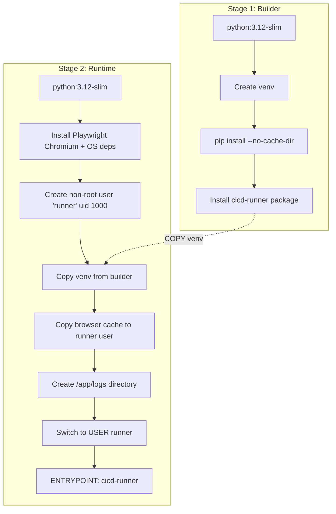
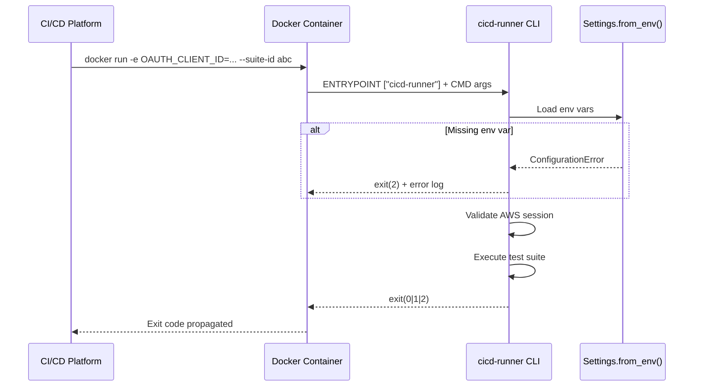

# Design Document: WP5 Docker Container

## Overview

This design packages the existing CI/CD test runner (Python CLI at `cicd-runner/`) as a Docker container. The container bundles the runner code, all Python dependencies, the Nova Act SDK, and a pre-installed headless Chromium browser into a single portable image that can be executed in any CI/CD platform (GitHub Actions, GitLab CI, Jenkins).

The design follows established patterns from the existing `worker/Dockerfile` (multi-stage build, non-root user, venv) and the Nova Act SDK template Dockerfile (Playwright Chromium installation, browser cache copy to non-root user). The key challenge is combining these patterns while keeping the image size under 2GB (target ~500MB).

### Key Design Goals

- Produce a self-contained Docker image with zero runtime downloads
- Follow security best practices (non-root execution, no secrets baked in)
- Minimize image size through multi-stage builds and cache cleanup
- Provide a clean CLI entrypoint that passes arguments directly to the runner
- Work identically across GitHub Actions, GitLab CI, and Jenkins

## Architecture

The Dockerfile uses a two-stage build pattern:



### Build Flow

1. **Builder stage**: Installs Python dependencies into a venv with `NOVA_ACT_SKIP_PLAYWRIGHT_INSTALL=true` to avoid downloading Chromium during pip install. Installs the `cicd-runner` package in editable-like mode so the `cicd-runner` console script is created in the venv.

2. **Runtime stage**: Starts fresh from `python:3.12-slim`. Installs Playwright Chromium and its OS-level dependencies (as root). Creates the `runner` user (uid 1000). Copies the venv from the builder stage. Copies the Playwright browser cache from `/root/.cache/ms-playwright` to `/home/runner/.cache/ms-playwright`. Sets the entrypoint to the `cicd-runner` CLI command.

### Runtime Flow



## Components and Interfaces

### 1. Dockerfile (`cicd-runner/Dockerfile`)

The primary deliverable. Two-stage build producing the final container image.

**Builder stage responsibilities:**
- Base: `python:3.12-slim`
- Set `NOVA_ACT_SKIP_PLAYWRIGHT_INSTALL=true`
- Create Python venv at `/app/.venv`
- Install dependencies from `requirements.txt` with `--no-cache-dir`
- Copy source code and install package via `pip install .`

**Runtime stage responsibilities:**
- Base: `python:3.12-slim`
- Install Playwright Chromium + OS deps via `python -m playwright install --with-deps chromium`
- Clean apt lists (`rm -rf /var/lib/apt/lists/*`)
- Create `runner` user (uid 1000)
- Copy venv from builder (`/app/.venv`)
- Copy Playwright browser cache from root to runner user
- Create `/app/logs` with runner ownership
- Set env vars: `NOVA_ACT_SKIP_PLAYWRIGHT_INSTALL=true`, `PYTHONUNBUFFERED=1`
- Set `ENTRYPOINT ["cicd-runner"]`

**Interface:** CLI arguments passed as Docker CMD, environment variables injected by CI/CD platform.

### 2. Dockerignore (`cicd-runner/.dockerignore`)

Excludes development artifacts from the build context to speed up builds and reduce image size.

**Excluded patterns:**
- `venv/` — local virtual environment
- `__pycache__/` — Python bytecode cache
- `.pytest_cache/` — pytest cache
- `.hypothesis/` — Hypothesis test data
- `htmlcov/` — coverage reports
- `tests/` — test files (not needed at runtime)
- `.env`, `.env.example` — local env files (secrets must not be baked in)
- `.coverage` — coverage data
- `*.egg-info/` — build metadata
- `.git/` — version control

### 3. README Updates (`cicd-runner/README.md`)

New sections documenting Docker build, run, and CI/CD integration.

**New sections:**
- Docker Build instructions
- Docker Run with environment variables
- CI/CD integration examples (GitHub Actions, GitLab CI, Jenkins)
- Environment variable reference table
- Minimum resource requirements

### 4. Existing Components (Unchanged)

These existing components are used as-is inside the container:

| Component | Path | Role |
|-----------|------|------|
| CLI Parser | `src/cli/parser.py` | Click-based CLI, entrypoint `cicd-runner` |
| Settings | `src/config/settings.py` | Pydantic model, loads from env vars, exits code 2 on missing |
| Main Runner | `src/main.py` | Orchestrates auth, API calls, execution, exit codes |
| OAuth Client | `src/auth/oauth_client.py` | Client credentials flow |
| API Client | `src/api/client.py` | REST API communication |

## Data Models

No new data models are introduced. The container uses the existing Pydantic `Settings` model for configuration validation:

```python
class Settings(BaseModel):
    oauth_client_id: str       # from OAUTH_CLIENT_ID
    oauth_client_secret: str   # from OAUTH_CLIENT_SECRET
    oauth_token_endpoint: str  # from OAUTH_TOKEN_ENDPOINT (must be HTTPS)
    api_endpoint: str          # from API_ENDPOINT (must be HTTPS)
    log_level: str = "INFO"    # from LOG_LEVEL (optional)
```

AWS credentials (`AWS_ACCESS_KEY_ID`, `AWS_SECRET_ACCESS_KEY`, `AWS_SESSION_TOKEN`) are read directly by `boto3` from the environment — no custom model needed.

### Container Configuration Matrix

| Variable | Required | Source | Validated By |
|----------|----------|--------|-------------|
| `OAUTH_CLIENT_ID` | Yes | CI/CD secrets | `Settings.from_env()` |
| `OAUTH_CLIENT_SECRET` | Yes | CI/CD secrets | `Settings.from_env()` |
| `OAUTH_TOKEN_ENDPOINT` | Yes | CI/CD secrets | `Settings.from_env()` (HTTPS check) |
| `API_ENDPOINT` | Yes | CI/CD config | `Settings.from_env()` (HTTPS check) |
| `AWS_ACCESS_KEY_ID` | Conditional | CI/CD secrets or IAM role | `boto3` STS call |
| `AWS_SECRET_ACCESS_KEY` | Conditional | CI/CD secrets or IAM role | `boto3` STS call |
| `AWS_SESSION_TOKEN` | Optional | CI/CD secrets | `boto3` STS call |
| `NOVA_ACT_SKIP_PLAYWRIGHT_INSTALL` | Set in image | Dockerfile | N/A (baked in) |


## Correctness Properties

*A property is a characteristic or behavior that should hold true across all valid executions of a system — essentially, a formal statement about what the system should do. Properties serve as the bridge between human-readable specifications and machine-verifiable correctness guarantees.*

This feature is primarily an infrastructure/packaging concern (Dockerfile, .dockerignore, README). Most acceptance criteria are structural checks on file contents or container integration tests, which are best validated as specific examples rather than universally quantified properties.

Two criteria are amenable to property-based testing:

### Property 1: CLI argument passthrough

*For any* valid CLI argument string, when passed as Docker CMD arguments to the container, the arguments shall be forwarded unchanged to the `cicd-runner` CLI entrypoint.

**Validates: Requirements 4.2**

### Property 2: Missing required env var produces exit code 2 with identifying message

*For any* single required environment variable (`OAUTH_CLIENT_ID`, `OAUTH_CLIENT_SECRET`, `OAUTH_TOKEN_ENDPOINT`, `API_ENDPOINT`), when that variable is omitted while all others are present, the runner shall exit with code 2 and the error message shall contain the name of the missing variable.

**Validates: Requirements 5.6**

## Error Handling

### Build-Time Errors

| Error | Cause | Mitigation |
|-------|-------|------------|
| `pip install` fails | Network issue or incompatible dependency | Retry build; pin all dependency versions in `requirements.txt` |
| `playwright install --with-deps chromium` fails | Missing OS packages or network issue | The `--with-deps` flag installs OS dependencies automatically; retry on network failure |
| COPY from builder fails | Venv path mismatch between stages | Both stages use `/app/.venv` consistently |

### Runtime Errors

| Error | Exit Code | Cause | Handling |
|-------|-----------|-------|----------|
| Missing required env var | 2 | CI/CD platform didn't inject secret | `Settings.from_env()` raises `ConfigurationError` with variable name; `run_runner` catches and exits 2 |
| Invalid URL format (non-HTTPS) | 2 | Misconfigured `OAUTH_TOKEN_ENDPOINT` or `API_ENDPOINT` | Pydantic `field_validator` rejects non-HTTPS URLs |
| No AWS credentials | 2 | Missing `AWS_ACCESS_KEY_ID`/`AWS_SECRET_ACCESS_KEY` or no IAM role | `validate_aws_session()` calls STS, raises `RunnerError` |
| OAuth authentication failure | 2 | Wrong client ID/secret or expired credentials | `OAuthClient.get_access_token()` raises `AuthenticationError` |
| Playwright browser missing/corrupt | 2 | Image built incorrectly or layer corruption | Nova Act SDK fails to launch browser; caught by top-level exception handler |
| Test failures | 1 | One or more use cases failed | `determine_exit_code()` returns 1 |
| All tests pass | 0 | Success | `determine_exit_code()` returns 0 |

### Permission Errors

The non-root `runner` user (uid 1000) needs:
- Read + execute on `/app/.venv` — ensured by `COPY --chown=runner:runner`
- Read + execute on Playwright browser cache — ensured by `cp -r` + `chown` in Dockerfile
- Write on `/app/logs` — ensured by `mkdir -p /app/logs && chown runner:runner /app/logs`

If a CI/CD platform mounts volumes as root, the runner user may not have write access. This is documented in the README as a known limitation with a workaround (`--user` flag or volume permissions).

## Testing Strategy

### Dual Testing Approach

This feature requires both unit tests and property-based tests, though the balance skews heavily toward example-based tests given the infrastructure nature of the work.

### Unit Tests (Example-Based)

Unit tests verify specific structural requirements and container behaviors:

**Dockerfile structure tests** (parse Dockerfile as text):
- Multi-stage build: two `FROM` statements with named stages
- Builder uses `python:3.12-slim`
- Runtime uses `python:3.12-slim`
- Builder sets `NOVA_ACT_SKIP_PLAYWRIGHT_INSTALL=true` before pip install
- Builder uses `pip install --no-cache-dir`
- Runtime installs Playwright Chromium with `--with-deps`
- Playwright install happens before `USER` directive
- Browser cache copied from root to runner user
- `useradd -m -u 1000 runner` present
- `USER runner` set in runtime stage
- `ENTRYPOINT` uses `cicd-runner`
- `rm -rf /var/lib/apt/lists/*` present
- Runtime sets `NOVA_ACT_SKIP_PLAYWRIGHT_INSTALL=true`

**.dockerignore tests** (parse file content):
- File exists at `cicd-runner/.dockerignore`
- Contains all required exclusion patterns: `venv/`, `__pycache__/`, `.pytest_cache/`, `.hypothesis/`, `htmlcov/`, `tests/`, `.env`, `.env.example`, `.coverage`, `*.egg-info/`

**README tests** (parse file content):
- Contains Docker build section with `docker build` command
- Contains Docker run section with environment variables
- Contains GitHub Actions example
- Contains GitLab CI example
- Contains Jenkins example
- Documents all required environment variables
- Documents minimum resource requirements

**Container integration tests** (require built image):
- `docker run <image> --help` exits with code 0 and shows usage text
- `docker run <image> id` shows uid 1000 (runner user)
- `docker run <image> which cicd-runner` finds the CLI on PATH
- `docker run <image> test -x <chromium-path>` confirms browser is executable
- `docker run <image> touch /app/logs/test.log` confirms write access
- Running without required env vars exits with code 2
- Image size is under 2GB

### Property-Based Tests

Property-based tests use `hypothesis` (already in dev dependencies based on `.hypothesis/` directory presence).

Each test runs minimum 100 iterations.

**Property 1 test**: Generate random valid CLI argument combinations (from the set of known flags: `--suite-id`, `--base-url`, `--var`, `--region`, `--model-id`, `--verbose`, `--timeout`). Run the container with `--help` appended (to avoid actual execution) and verify the entrypoint receives the arguments. Since we can't easily introspect Docker argument forwarding without execution, this property is better tested at the CLI level: generate random argument strings, invoke the Click CLI parser, and verify it parses them correctly.
- Tag: **Feature: wp5-docker-container, Property 1: CLI argument passthrough**

**Property 2 test**: For each required environment variable, generate random valid values for all other required vars, omit the target var, call `Settings.from_env()`, and verify it raises `ConfigurationError` containing the missing variable name.
- Tag: **Feature: wp5-docker-container, Property 2: Missing required env var produces exit code 2 with identifying message**

### Test Configuration

- Property-based testing library: `hypothesis` (Python)
- Minimum iterations: 100 per property test
- Container integration tests: require Docker daemon, run as separate test suite
- Unit tests for file content: no Docker required, fast execution
