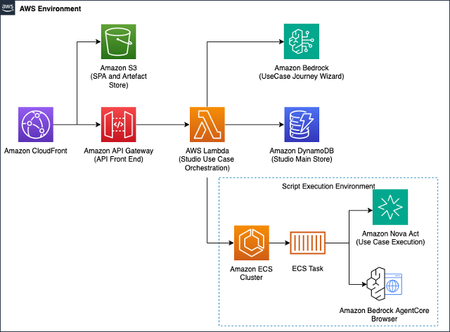

# Amazon Nova Act QA Studio

A reference solution for automated web application testing with Amazon Nova Act. Provides a web interface to define test steps in natural language, run them with Nova Act browser automation, and review results with video recordings, screenshots, and logs.

## Features

- Define test steps in natural language through a web interface
- Execute tests with Amazon Nova Act browser automation
- Review results with video recordings, screenshots, and detailed logs
- Watch browser sessions in real-time using Amazon Bedrock AgentCore Browser Tool
- Generate test cases from user journey descriptions using Amazon Bedrock
- Create reusable test templates with configurable variables
- Group tests into suites for batch execution
- Import and export test cases as JSON
- Schedule recurring test runs
- Manage users and control access with Amazon Cognito authentication
- Create OAuth 2.0 clients for API access and CI/CD integration

## Architecture

Serverless architecture on AWS:

- **Frontend**: React application with AWS Cloudscape Design System hosted on Amazon S3 and Amazon CloudFront
- **API Layer**: Amazon API Gateway with AWS Lambda functions
- **Authentication**: Amazon Cognito with AWS Amplify SDK for secure user management
- **Data Storage**: Amazon DynamoDB with single-table design
- **Runtime**: Amazon ECS with AWS Fargate running Nova Act SDK
- **Test Execution**: Amazon Nova Act performs browser automation and test validation
- **Browser**: Amazon Bedrock AgentCore Browser Tool for a fully managed remote browser
- **Queue System**: Amazon SQS for reliable execution orchestration
- **Scheduling**: Amazon EventBridge Scheduler for automated executions
- **Artifact Storage**: Amazon S3 for videos, screenshots, and logs

<p align="center">
  
</p>

## Repository Structure

```
├── bin/              # CDK app entry point
├── docs/             # Documentation and architecture diagrams
├── frontend/         # React web application
├── lambdas/          # Python Lambda function handlers
├── lib/              # CDK stack definitions
├── scripts/          # Release and utility scripts
├── testcases/        # Sample test case definitions
└── worker/           # Nova Act test execution engine
```

## Getting Started

### Prerequisites

- AWS CLI configured with appropriate permissions: https://docs.aws.amazon.com/cli/latest/userguide/getting-started-install.html
- Node.js 18+ and npm: https://nodejs.org/en/download
- Python 3.11+: https://www.python.org/downloads/
- Docker or Podman

### Setup

#### 1. Clone the repository and install dependencies:

```bash
git clone git@github.com:amazon-agi-labs/solution-nova-act-qa-studio.git
cd solution-nova-act-qa-studio
npm install
```

#### 2. Create and edit your configuration:

Copy the sample config:

```bash
cp configuration.json.sample configuration.json
```

Update the admin email (required for receiving your login credentials):

```json
{
  "adminEmail": "your-email@example.com",
}
```

> `adminEmail` is the only required configuration option. See [Configuration →](docs/configuration.md) for the full property reference, VPC setup, and advanced options.

#### 3. Deploy to AWS:

```bash
npm run deploy
```

This builds all Lambda functions, deploys all infrastructure stacks, builds and deploys the React frontend, and sends a temporary password to your admin email.

> Take note of the `frontend.CloudFrontDistributionDomain` CloudFormation output. This is the URL for the web application.

#### 4. Access the application:
   - Check your email for a temporary password from no-reply@verificationemail.com
   - Open the CloudFront distribution URL from the deployment output
   - Sign in with your admin email and temporary password
   - Set your permanent password

### Creating Your First Test

1. Sign in to the web interface using the CloudFront URL
2. Click **Create Use Case** to see several options:
   - **Interactive Wizard**: build step-by-step with a live browser. Enter a step, watch it execute in real time, and accept it when it looks right.
   - **Create from User Journey**: describe what you want to test in plain English and let AI generate the steps for you.
   - **Create Blank**: start from scratch and add steps manually.
3. Give your test a name, starting URL, and description
4. Add test steps as plain language instructions (e.g., "Click the Login button", "Verify the dashboard loads")
5. Store any credentials as secrets using secure steps. These are never included in logs or execution history.
6. Run the test and review the video recording and logs

For a full walkthrough of all features, see the [User Guide →](docs/user-guide.md). For guidance on writing effective test steps, see [Prompting Best Practices →](docs/prompting-best-practices.md).

## Documentation

- [User Guide →](docs/user-guide.md): Complete walkthrough of the QA Studio web interface
- [Prompting Best Practices →](docs/prompting-best-practices.md): Writing reliable, repeatable test steps
- [Configuration →](docs/configuration.md): Full property reference, VPC setup, and advanced options
- [Development →](docs/development.md): Commands reference, individual stack deployment, and monitoring
- [Distribution →](docs/distribution.md): Release packaging and deploying from archives
- [Frontend →](frontend/README.md): React web application setup and development
- [Worker →](worker/): Nova Act test execution engine

## Contributing

See [Contributing Guidelines](CONTRIBUTING.md) for development workflow, coding standards, and pull request process.

Review the [Code of Conduct](CODE_OF_CONDUCT.md) before contributing.

## Security

See [SECURITY.md](SECURITY.md) for information on reporting security vulnerabilities.

## License

This library is licensed under the MIT-0 License. See the [LICENSE](LICENSE) file for details.
