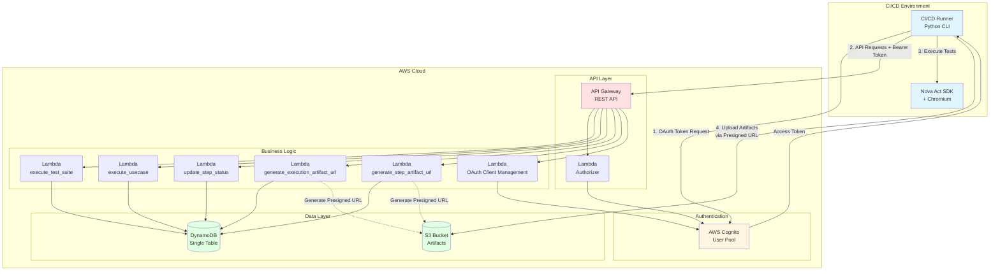
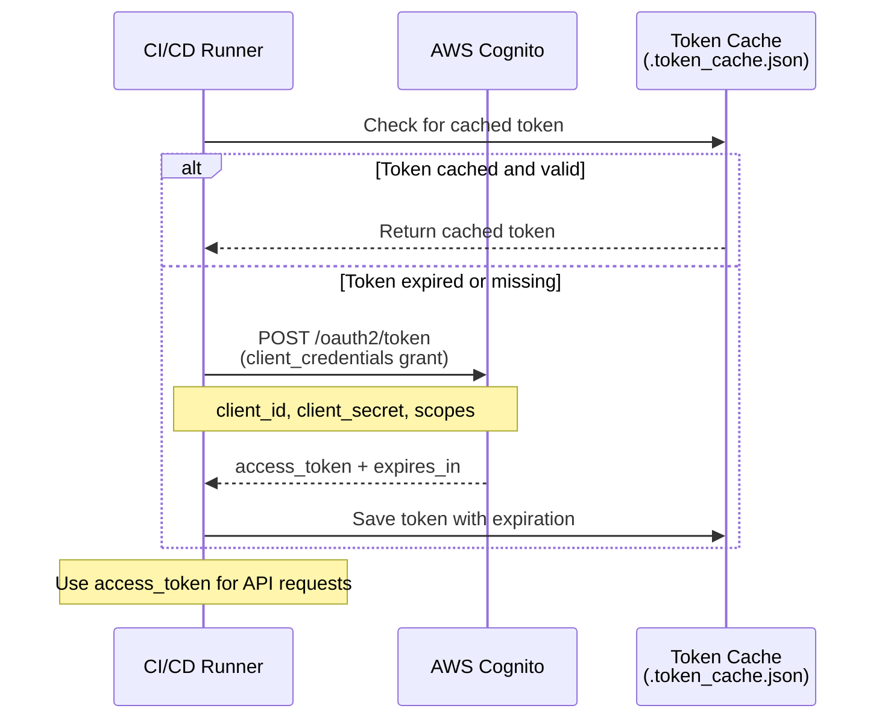
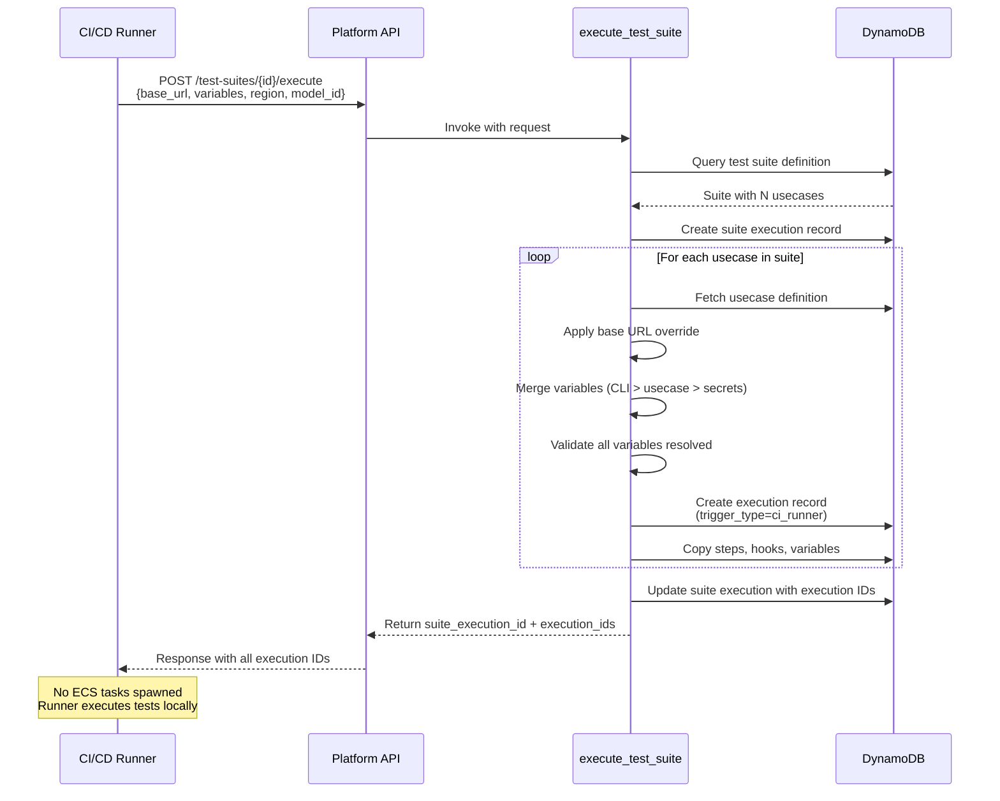
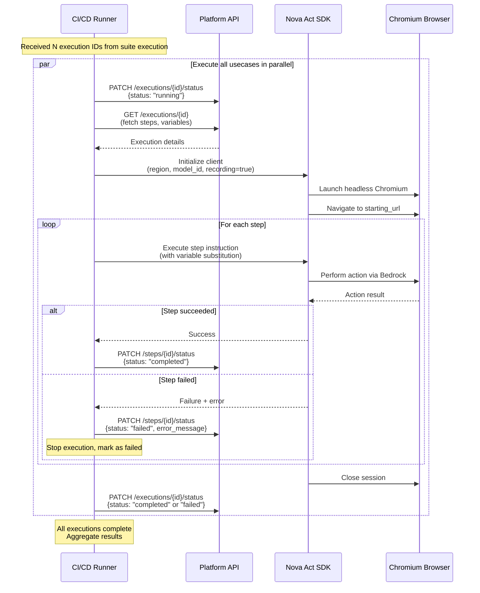
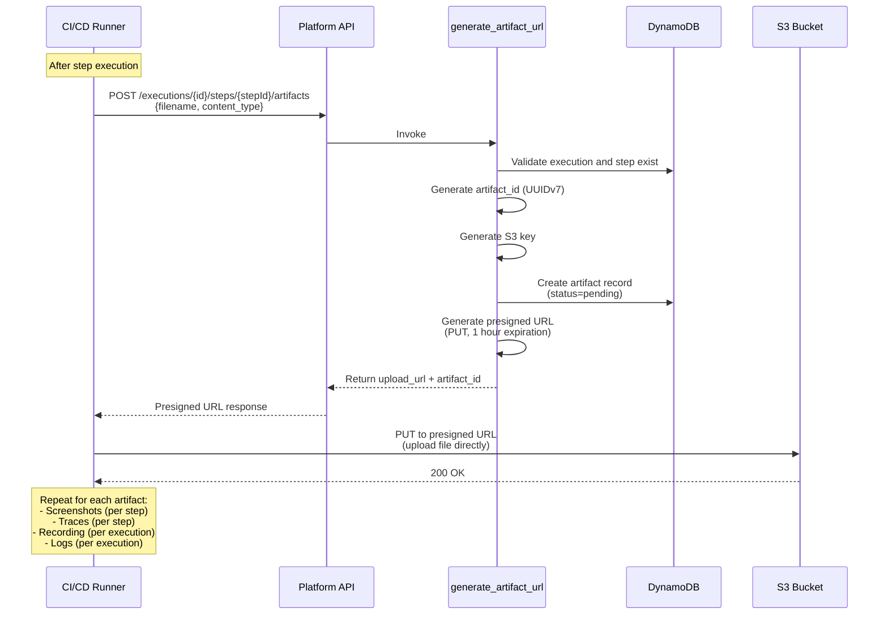
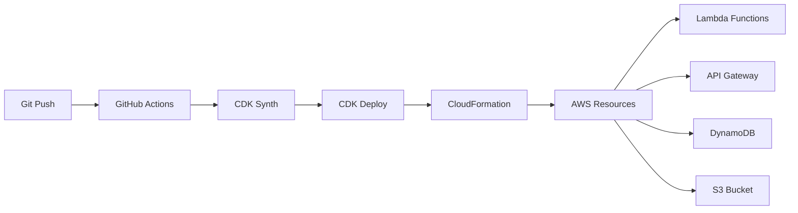

# Architecture Overview

## System Overview

Nova Act QA Studio CI/CD Runner is a distributed system that enables automated test execution in CI/CD pipelines. The system consists of a Python CLI runner that authenticates with AWS Cognito, communicates with a serverless API backend, executes tests using Nova Act SDK with bundled Chromium, and uploads artifacts directly to S3.

**Key Capabilities**:
- OAuth 2.0 client credentials authentication for machine-to-machine (M2M) access
- Test suite execution with variable overrides and base URL substitution
- Parallel test execution using asyncio
- Direct S3 artifact uploads via presigned URLs
- Real-time execution status updates
- Comprehensive execution summaries with exit codes for CI/CD integration

---

## System Components



---

## Data Flow Diagrams

### Authentication Flow



**Authentication Details**:
- **Grant Type**: OAuth 2.0 Client Credentials Flow
- **Token Endpoint**: `https://{domain}.auth.{region}.amazoncognito.com/oauth2/token`
- **Token Lifetime**: 1 hour (3600 seconds)
- **Token Caching**: Tokens cached locally to avoid unnecessary authentication requests
- **Token Refresh**: Automatic refresh when token expires (5-minute buffer)

---

### Test Suite Execution Flow



**Key Points**:
- All execution records created in a single API call
- Overrides applied at record creation time (not runtime)
- Variable merge precedence: CLI > usecase variables > secrets
- Fail-fast validation: All variables must be resolved before creating records
- No ECS tasks spawned when `trigger_type=ci_runner`

---

### Test Execution Flow



**Execution Characteristics**:
- **Parallel Execution**: All usecases execute simultaneously using asyncio
- **Fault Isolation**: Individual test failures don't stop other tests
- **Session Isolation**: Each test runs in a separate browser session
- **Status Reporting**: Real-time status updates throughout execution lifecycle
- **Error Handling**: Detailed error messages captured and reported

---

### Artifact Upload Flow



**Artifact Types**:
- **Execution-Level**: Recording (video/webm), Logs (text/plain)
- **Step-Level**: Screenshots (image/png), Traces (application/json)

**Upload Benefits**:
- Direct S3 upload bypasses API Gateway payload limits (6MB)
- Supports large files (videos can be gigabytes)
- Parallel uploads for better performance
- Presigned URLs expire after 1 hour for security

---

## Technology Stack

### CI/CD Runner (Python)

| Component | Technology | Purpose |
|-----------|-----------|---------|
| **Language** | Python 3.9+ | Core application language |
| **CLI Framework** | Click | Command-line argument parsing |
| **HTTP Client** | Requests | OAuth and API communication |
| **Async Runtime** | asyncio | Parallel test execution |
| **Configuration** | Pydantic | Settings validation |
| **Environment** | python-dotenv | Environment variable loading |
| **Test Execution** | Nova Act SDK | AI-powered browser automation |
| **Browser** | Chromium (bundled) | Test execution environment |
| **Testing** | pytest, hypothesis | Unit and property-based testing |

### AWS Services

| Service | Purpose | Configuration |
|---------|---------|---------------|
| **Cognito User Pool** | Authentication & authorization | OAuth 2.0 client credentials flow |
| **API Gateway** | REST API endpoint | Lambda proxy integration |
| **Lambda** | Serverless compute | Python 3.9 runtime |
| **DynamoDB** | NoSQL database | Single-table design, on-demand billing |
| **S3** | Object storage | Artifact storage with encryption |
| **CloudWatch** | Logging & monitoring | Lambda logs, custom metrics |
| **IAM** | Access control | Least-privilege roles |

### Frontend (Not in Scope)

The CI/CD runner is a backend/CLI tool. The web UI for managing test suites and viewing results is a separate component built with:
- React + TypeScript
- AWS Cloudscape Design System
- Hosted on CloudFront + S3

---

## AWS Services Used

### Amazon Cognito

**Purpose**: User and machine-to-machine (M2M) authentication

**Configuration**:
- User Pool with OAuth 2.0 support
- App clients for M2M authentication (client credentials grant)
- Custom scopes for fine-grained authorization
- Token lifetime: 1 hour

**Scopes**:
- `api/admin` - Full access to all resources
- `api/execution.write` - Create and update executions
- `api/execution.read` - Read execution data
- `api/suite.write` - Manage test suites
- `api/suite.read` - Read test suite data
- `api/oauth-clients.write` - Manage OAuth clients
- `api/oauth-clients.read` - List OAuth clients

### API Gateway

**Purpose**: HTTP API endpoint for runner communication

**Configuration**:
- REST API with Lambda proxy integration
- Cognito User Pool Authorizer
- CORS enabled for web UI
- Request validation enabled
- CloudWatch logging enabled

**Endpoints**:
- `POST /test-suites/{id}/execute` - Execute test suite
- `POST /usecase/{id}/execute` - Execute single usecase
- `PATCH /executions/{id}/status` - Update execution status
- `PATCH /executions/{id}/steps/{stepId}/status` - Update step status
- `POST /executions/{id}/artifacts` - Generate execution artifact URL
- `POST /executions/{id}/steps/{stepId}/artifacts` - Generate step artifact URL
- `POST /api/oauth-clients` - Create OAuth client
- `GET /api/oauth-clients` - List OAuth clients
- `DELETE /api/oauth-clients/{id}` - Delete OAuth client
- `POST /api/oauth-clients/{id}/rotate-secret` - Rotate client secret

### AWS Lambda

**Purpose**: Serverless compute for API business logic

**Functions**:
- `execute_test_suite` - Create suite execution and all usecase executions
- `execute_usecase` - Create single usecase execution
- `update_execution_step_status` - Update step status
- `generate_execution_artifact_url` - Generate presigned URL for execution artifacts
- `generate_step_artifact_url` - Generate presigned URL for step artifacts
- `create_oauth_client` - Create OAuth client in Cognito
- `list_oauth_clients` - List OAuth clients
- `delete_oauth_client` - Delete OAuth client
- `rotate_client_secret` - Rotate OAuth client secret

**Configuration**:
- Runtime: Python 3.9
- Memory: 256 MB (most functions), 512 MB (execution functions)
- Timeout: 30 seconds (most functions), 60 seconds (execution functions)
- Environment variables: DynamoDB table name, S3 bucket name, Cognito user pool ID

### Amazon DynamoDB

**Purpose**: NoSQL database for test definitions and execution records

**Table Design**: Single-table design with composite primary key

**Primary Key**:
- Partition Key (pk): Entity type + ID
- Sort Key (sk): Related entity type + ID

**Access Patterns**:
```
# Test Suites
pk='TEST_SUITES', sk='SUITE#{suite_id}'

# Suite Usecases
pk='SUITE#{suite_id}', sk='USECASE#{usecase_id}'

# Usecase Definitions
pk='USECASES', sk='USECASE#{usecase_id}'

# Usecase Variables
pk='USECASE#{usecase_id}', sk='USECASE_VARIABLES'

# Usecase Secrets
pk='USECASE#{usecase_id}', sk='SECRETS'

# Execution Records
pk='USECASE_EXECUTION#{usecase_id}', sk='EXECUTION#{execution_id}'

# Execution Steps
pk='EXECUTION#{execution_id}', sk='EXECUTION_STEP#{step_id}'

# Execution Variables
pk='EXECUTION#{execution_id}', sk='EXECUTION_VARIABLES'

# Artifacts
pk='EXECUTION#{execution_id}', sk='ARTIFACT#{artifact_id}'

# Suite Executions
pk='SUITE#{suite_id}', sk='SUITE_EXECUTION#{suite_execution_id}'

# OAuth Client Metadata
pk='OAUTH_CLIENTS', sk='CLIENT#{client_id}'
```

**Configuration**:
- Billing mode: On-demand (pay per request)
- Encryption: AWS managed keys
- Point-in-time recovery: Enabled
- Streams: Disabled (not needed)

### Amazon S3

**Purpose**: Object storage for test artifacts

**Bucket Structure**:
```
artifacts/
├── {usecase_id}/
│   └── executions/
│       └── {execution_id}/
│           ├── recording.webm
│           ├── logs.txt
│           └── steps/
│               └── {step_id}/
│                   ├── screenshot.png
│                   └── trace.json
```

**Configuration**:
- Encryption: Server-side encryption (AES-256)
- Versioning: Disabled
- Lifecycle policy: Transition to Glacier after 90 days (optional)
- CORS: Enabled for PUT/POST from any origin
- Public access: Blocked (presigned URLs required)

### Amazon CloudWatch

**Purpose**: Logging, monitoring, and alerting

**Logs**:
- Lambda function logs (all invocations)
- API Gateway access logs
- Error logs with stack traces

**Metrics**:
- Lambda invocation count, duration, errors
- API Gateway request count, latency, 4xx/5xx errors
- DynamoDB read/write capacity, throttles
- Custom metrics: artifact uploads, test execution duration

**Alarms** (optional):
- Lambda error rate > 5%
- API Gateway 5xx error rate > 1%
- DynamoDB throttling events

---

## Security Architecture

### Authentication & Authorization

**OAuth 2.0 Client Credentials Flow**:
1. CI/CD runner obtains client_id and client_secret from secure storage
2. Runner requests access token from Cognito token endpoint
3. Cognito validates credentials and returns JWT access token
4. Runner includes token in Authorization header for all API requests
5. API Gateway validates token with Cognito Authorizer
6. Lambda functions extract scopes from token for authorization

**Token Security**:
- Tokens expire after 1 hour
- Tokens cached locally with expiration tracking
- Automatic refresh when expired
- No refresh tokens (client credentials flow)

**Scope-Based Authorization**:
- Each endpoint requires specific scopes
- Lambda functions validate scopes before processing
- Principle of least privilege: grant only required scopes
- Users cannot grant scopes they don't possess (prevents privilege escalation)

### Data Security

**Encryption at Rest**:
- DynamoDB: AWS managed encryption keys
- S3: Server-side encryption (AES-256 or KMS)
- Secrets: AWS Secrets Manager (for usecase secrets)

**Encryption in Transit**:
- All API communication over HTTPS (TLS 1.2+)
- Cognito token endpoint over HTTPS
- S3 presigned URLs over HTTPS

**Secret Management**:
- OAuth client secrets stored in CI/CD secret management (GitHub Secrets, GitLab CI Variables, etc.)
- Usecase secrets stored in AWS Secrets Manager
- Secrets never logged or exposed in API responses
- Client secrets only shown once at creation

### Network Security

**API Gateway**:
- Public endpoint with Cognito authorization
- Rate limiting: 10,000 requests per second (default)
- Throttling: 5,000 requests per second per account
- DDoS protection via AWS Shield Standard

**Lambda**:
- No VPC configuration (accesses public AWS services)
- IAM role with least-privilege permissions
- No inbound network access

**S3**:
- No public access (bucket policy blocks public reads)
- Presigned URLs for controlled access
- CORS configured for PUT/POST only
- Presigned URLs expire after 1 hour

### Access Control

**IAM Roles**:
- Lambda execution role: DynamoDB read/write, S3 PutObject, Cognito admin
- API Gateway role: Lambda invoke
- Separate roles per function (least privilege)

**OAuth Client Management**:
- Users can only create clients with scopes they possess
- Users can only delete/rotate clients they created (unless admin)
- Admin users can manage all clients

**Artifact Access**:
- Presigned URLs required for upload
- URLs expire after 1 hour
- URLs only allow PUT operation (not GET or DELETE)
- Content-Type enforced in presigned URL

### Audit & Compliance

**Logging**:
- All API requests logged to CloudWatch
- User identity (email or client_id) logged for each request
- OAuth client creation/deletion logged
- Artifact uploads logged (without presigned URL)

**Monitoring**:
- CloudWatch alarms for suspicious activity
- Failed authentication attempts tracked
- Rate limiting violations logged

**Compliance**:
- GDPR: User data can be deleted on request
- SOC 2: Audit logs retained for 1 year
- HIPAA: Not applicable (no PHI stored)

---

## Scalability Considerations

### Horizontal Scaling

**CI/CD Runner**:
- Stateless design: each runner instance is independent
- No shared state between runners
- Can run unlimited parallel runners in different CI/CD jobs
- Token caching per runner instance (no shared cache)

**Lambda Functions**:
- Auto-scaling: AWS manages concurrency automatically
- Default concurrency limit: 1,000 per region
- Can request increase to 10,000+ if needed
- Cold start mitigation: Provisioned concurrency (optional)

**API Gateway**:
- Auto-scaling: handles up to 10,000 requests per second
- No configuration required
- Regional endpoint (can add CloudFront for global distribution)

### Vertical Scaling

**Lambda Memory**:
- Current: 256 MB (most functions), 512 MB (execution functions)
- Can increase to 10 GB if needed
- CPU scales proportionally with memory

**DynamoDB**:
- On-demand billing: auto-scales to handle any load
- No capacity planning required
- Can switch to provisioned capacity for cost optimization

**S3**:
- Unlimited storage capacity
- Automatic scaling for throughput
- No configuration required

### Performance Optimization

**Parallel Execution**:
- Runner executes all usecases in parallel using asyncio
- Limited only by system resources (CPU, memory, network)
- Typical suite: 5-10 usecases complete in 2-5 minutes

**Token Caching**:
- Tokens cached locally to avoid repeated authentication
- Reduces latency by ~200ms per API call
- Cache invalidation on expiration (automatic)

**Direct S3 Upload**:
- Artifacts uploaded directly to S3 (not through Lambda)
- Bypasses API Gateway payload limits
- Parallel uploads for multiple artifacts
- Typical upload: 10 MB video in 2-5 seconds

**DynamoDB Query Optimization**:
- Single-table design minimizes queries
- Composite keys enable efficient queries
- No scans (all queries use primary key or GSI)
- Batch operations for multiple items

### Capacity Planning

**Expected Load**:
- 100 test suites per day
- 10 usecases per suite (average)
- 1,000 executions per day
- 10,000 artifacts per day

**DynamoDB Capacity**:
- On-demand billing: no capacity planning required
- Estimated cost: $5-10 per month for 1,000 executions/day

**S3 Storage**:
- 10 MB per execution (average)
- 10 GB per day
- 300 GB per month
- Lifecycle policy: transition to Glacier after 90 days

**Lambda Invocations**:
- 1,000 executions/day × 10 API calls = 10,000 invocations/day
- Well within free tier (1 million invocations/month)

### Bottlenecks & Mitigation

**Potential Bottlenecks**:
1. **Nova Act SDK**: Limited by Bedrock API rate limits
   - Mitigation: Request rate limit increase from AWS
2. **DynamoDB Hot Partitions**: High write rate to single partition
   - Mitigation: Use UUIDv7 for execution IDs (time-ordered, distributed)
3. **S3 Upload Bandwidth**: Limited by runner network
   - Mitigation: Compress artifacts before upload
4. **Lambda Cold Starts**: 1-2 second delay on first invocation
   - Mitigation: Provisioned concurrency for critical functions

---

## Deployment Architecture

### Infrastructure as Code

**CDK (Cloud Development Kit)**:
- All infrastructure defined in TypeScript CDK
- Version controlled in Git
- Automated deployment via CI/CD pipeline

**Stacks**:
- `AuthStack`: Cognito User Pool, OAuth clients
- `ApiStack`: API Gateway, Lambda functions
- `DataStack`: DynamoDB table, S3 bucket
- `MonitoringStack`: CloudWatch alarms, dashboards

### Deployment Process



**Deployment Steps**:
1. Developer pushes code to Git
2. GitHub Actions triggers CI/CD pipeline
3. CDK synthesizes CloudFormation template
4. CDK deploys stack to AWS
5. CloudFormation creates/updates resources
6. Lambda functions deployed with new code
7. API Gateway updated with new endpoints
8. Smoke tests run to verify deployment

### Environment Strategy

**Environments**:
- **Development**: Isolated environment for testing
- **Staging**: Pre-production environment for QA
- **Production**: Live environment for end users

**Environment Isolation**:
- Separate AWS accounts per environment (recommended)
- Separate Cognito user pools per environment
- Separate DynamoDB tables per environment
- Separate S3 buckets per environment

**Configuration Management**:
- Environment-specific configuration in CDK context
- Secrets stored in AWS Secrets Manager
- Environment variables injected at deployment time

### Rollback Strategy

**Automated Rollback**:
- CloudFormation automatic rollback on failure
- Lambda versions and aliases for blue/green deployment
- API Gateway stages for canary deployment

**Manual Rollback**:
- Revert Git commit and redeploy
- CloudFormation stack rollback to previous version
- Lambda function rollback to previous version

---

## Monitoring & Observability

### CloudWatch Dashboards

**Runner Dashboard**:
- Test execution count (per day)
- Test success rate (passed / total)
- Average execution duration
- Artifact upload count
- Error rate

**API Dashboard**:
- Request count (per endpoint)
- Latency (p50, p95, p99)
- Error rate (4xx, 5xx)
- Throttling events

**Infrastructure Dashboard**:
- Lambda invocation count, duration, errors
- DynamoDB read/write capacity, throttles
- S3 storage size, request count
- Cognito authentication count

### Alarms

**Critical Alarms** (PagerDuty):
- API Gateway 5xx error rate > 5%
- Lambda error rate > 10%
- DynamoDB throttling events > 100/minute

**Warning Alarms** (Email):
- API Gateway 4xx error rate > 20%
- Lambda duration > 10 seconds
- S3 storage > 1 TB

### Logging Strategy

**Structured Logging**:
- All logs in JSON format
- Include request ID, user identity, timestamp
- Include execution context (suite_id, execution_id)

**Log Levels**:
- DEBUG: Detailed execution flow
- INFO: Normal operations (execution started, completed)
- WARNING: Recoverable errors (artifact upload failed)
- ERROR: Unrecoverable errors (execution failed)

**Log Retention**:
- CloudWatch Logs: 30 days
- S3 archive: 1 year (optional)

### Tracing

**AWS X-Ray** (optional):
- End-to-end request tracing
- Service map visualization
- Performance bottleneck identification
- Error root cause analysis

---

## Disaster Recovery

### Backup Strategy

**DynamoDB**:
- Point-in-time recovery enabled (35 days)
- On-demand backups before major changes
- Cross-region replication (optional)

**S3**:
- Versioning disabled (artifacts are immutable)
- Cross-region replication (optional)
- Lifecycle policy: transition to Glacier after 90 days

**Cognito**:
- User pool configuration exported to Git
- OAuth clients backed up to DynamoDB (metadata)
- No automated backup (recreate from IaC)

### Recovery Procedures

**Data Loss**:
1. Restore DynamoDB from point-in-time recovery
2. Restore S3 from cross-region replica (if enabled)
3. Verify data integrity with smoke tests

**Service Outage**:
1. Check AWS Service Health Dashboard
2. Failover to secondary region (if configured)
3. Notify users of outage and ETA

**Security Incident**:
1. Rotate all OAuth client secrets
2. Revoke compromised tokens
3. Review CloudWatch logs for suspicious activity
4. Patch vulnerabilities and redeploy

### RTO & RPO

**Recovery Time Objective (RTO)**: 4 hours
- Time to restore service after disaster

**Recovery Point Objective (RPO)**: 1 hour
- Maximum acceptable data loss

**Strategies**:
- Multi-region deployment (reduces RTO to minutes)
- Continuous backup (reduces RPO to seconds)
- Automated failover (reduces RTO to seconds)

---

## Future Enhancements

### Planned Features

1. **Parallel Execution Control**
   - Configurable concurrency limit
   - Sequential execution mode for resource-constrained environments

2. **Artifact Retention Policies**
   - Configurable retention period per artifact type
   - Automatic cleanup of old artifacts

3. **Test Retry Logic**
   - Automatic retry of failed tests
   - Configurable retry count and backoff

4. **Real-Time Progress Updates**
   - WebSocket connection for live execution updates
   - Progress bar in CI/CD logs

5. **Advanced Reporting**
   - HTML test reports
   - JUnit XML output for CI/CD integration
   - Trend analysis and historical data

6. **Multi-Region Support**
   - Execute tests in multiple AWS regions
   - Automatic region selection based on latency

7. **Cost Optimization**
   - Spot instances for test execution (if using ECS)
   - S3 Intelligent-Tiering for artifacts
   - DynamoDB reserved capacity for predictable workloads

### Architectural Improvements

1. **Event-Driven Architecture**
   - EventBridge for execution events
   - SNS/SQS for asynchronous processing
   - Step Functions for complex workflows

2. **Caching Layer**
   - ElastiCache for frequently accessed data
   - CloudFront for API responses (if applicable)

3. **GraphQL API**
   - AppSync for real-time subscriptions
   - Unified API for web UI and runner

4. **Observability Enhancements**
   - Distributed tracing with X-Ray
   - Custom metrics for business KPIs
   - Anomaly detection with CloudWatch Insights

---

## Conclusion

The Nova Act QA Studio CI/CD Runner is a robust, scalable, and secure system for automated test execution in CI/CD pipelines. The architecture leverages AWS serverless services for cost-effectiveness and scalability, while the Python CLI runner provides a simple and flexible interface for CI/CD integration.

**Key Strengths**:
- **Serverless**: No infrastructure to manage, auto-scaling, pay-per-use
- **Secure**: OAuth 2.0 authentication, scope-based authorization, encryption at rest and in transit
- **Scalable**: Handles unlimited parallel executions, direct S3 uploads, efficient DynamoDB queries
- **Observable**: Comprehensive logging, monitoring, and alerting
- **Maintainable**: Infrastructure as code, automated deployment, clear separation of concerns

**Next Steps**:
- Review architecture with stakeholders
- Validate security requirements with security team
- Estimate costs for expected load
- Plan deployment to staging environment
- Develop runbooks for operations team
