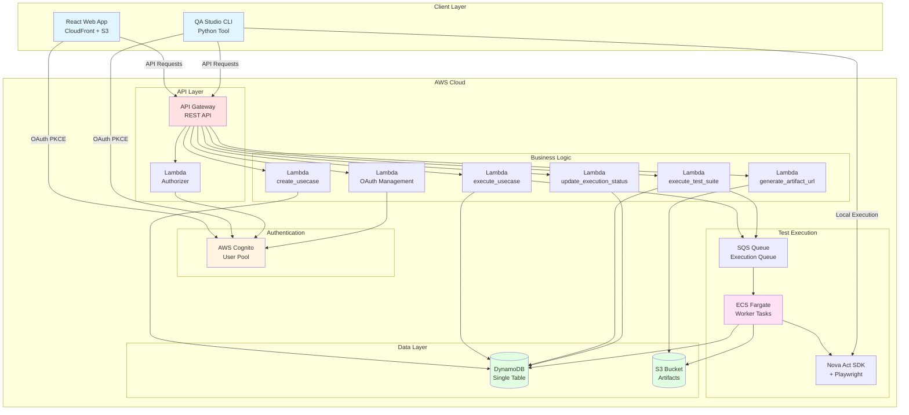
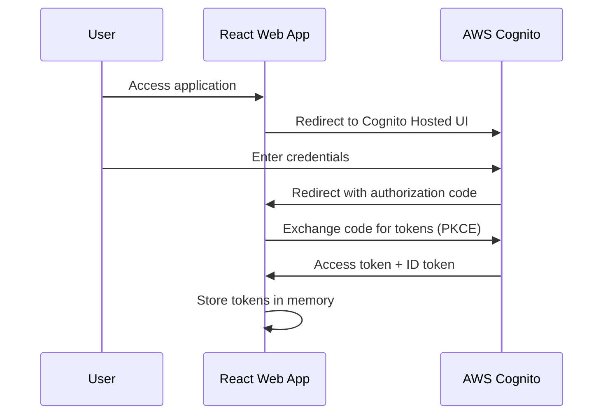
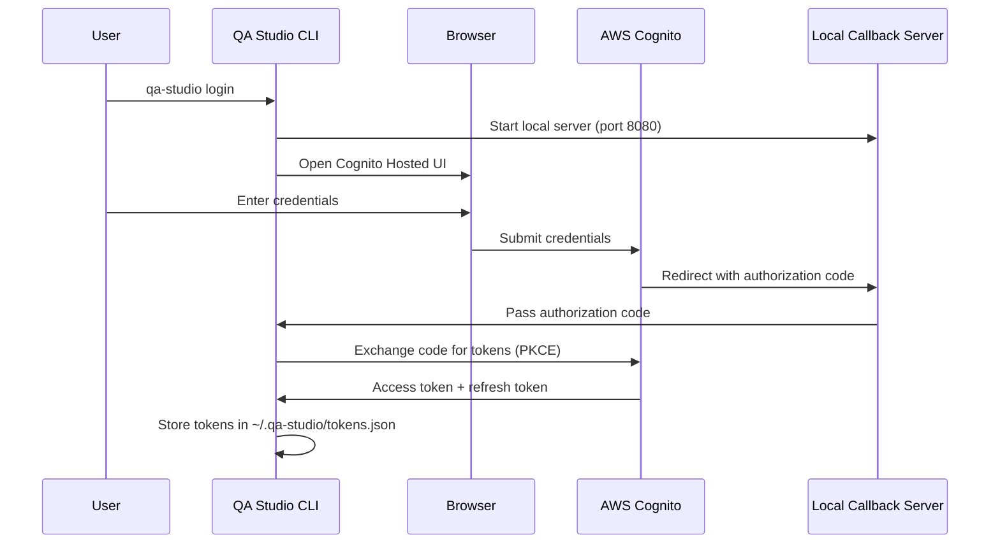
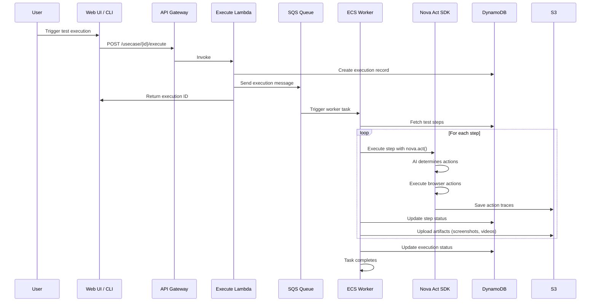
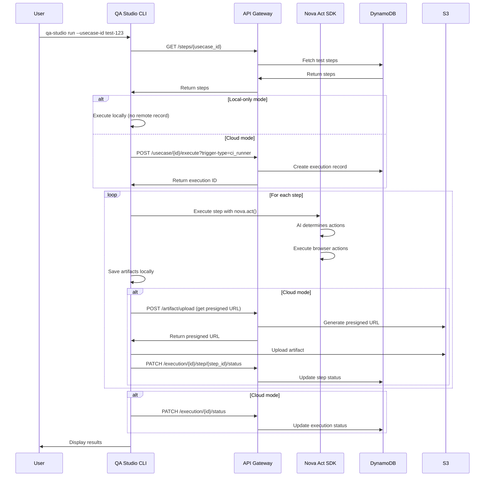

# Architecture Overview

## System Overview

QA Studio is a serverless web application for AI-powered automated testing built on Amazon Nova Act. The system consists of a React frontend, serverless API backend, ECS-based test execution workers, and a CLI tool for local development.

**Key Capabilities**:
- Natural language test creation and management
- AI-powered browser automation with Amazon Nova Act
- Interactive test wizard with live browser preview
- Test suite organization and execution
- Comprehensive artifact capture (videos, screenshots, logs, traces)
- OAuth 2.0 authentication for users and API clients
- CLI tool for local test execution and management

---

## System Components

---

## Data Flow Diagrams

### Web UI Authentication Flow

### CLI Authentication Flow

### Test Execution Flow (Cloud)

### Test Execution Flow (Local CLI)

---

## Component Details

### Frontend (React Web App)

**Technology**: React 18, TypeScript, Vite, AWS Cloudscape Design System

**Hosting**: CloudFront (CDN) + S3 (static hosting)

**Key Features**:
- Test creation and management UI
- Interactive test wizard with live browser preview
- Test suite organization
- Execution history and artifact viewing
- OAuth client management
- User management

**Authentication**: OAuth 2.0 PKCE flow via Cognito Hosted UI

### CLI Tool (QA Studio CLI)

**Technology**: Python 3.11+, Click framework

**Installation**: `pip install -e ./qa-studio-cli[runner]`

**Key Features**:
- Browser-based OAuth authentication
- Test and suite management commands
- Local test execution with Nova Act
- Configuration management
- Kiro IDE integration

**Authentication**: OAuth 2.0 PKCE flow with local callback server

### API Layer

**Technology**: Amazon API Gateway (REST API) + AWS Lambda (Python 3.11)

**Authentication**: 
- Lambda authorizer validates JWT tokens from Cognito
- Scope-based authorization (e.g., `api/usecase.read`, `api/usecase.write`)

**Key Endpoints**:
- `/usecases` - Test management (CRUD)
- `/steps` - Test step management
- `/suites` - Test suite management
- `/executions` - Execution management and triggering
- `/oauth-clients` - OAuth client management
- `/artifacts` - Artifact URL generation

### Test Execution (ECS Workers)

**Technology**: Amazon ECS with Fargate, Python 3.11, Nova Act SDK, Playwright

**Trigger**: SQS messages from execute_usecase or execute_test_suite Lambdas

**Execution Flow**:
1. Receive execution message from SQS
2. Fetch test steps from DynamoDB
3. Initialize Nova Act with Bedrock AgentCore Browser
4. Execute each step with `nova.act(instruction)`
5. Upload artifacts to S3 via presigned URLs
6. Update execution status in DynamoDB

**Artifacts Generated**:
- Screenshots (PNG)
- Videos (MP4)
- Action traces (JSON)
- Execution logs (text)

### Data Storage

**DynamoDB (Single Table Design)**:
- Primary Key: `pk` (partition key)
- Sort Key: `sk` (sort key)
- Access patterns optimized with GSIs

**Key Record Types**:
- `USECASE#{id}` / `METADATA` - Test metadata
- `USECASE#{id}` / `STEP#{id}` - Test steps
- `USECASE_EXECUTION#{usecase_id}` / `EXECUTION#{id}` - Execution records
- `EXECUTION#{id}` / `EXECUTION_STEP#{id}` - Execution step records
- `SUITE#{id}` / `METADATA` - Suite metadata
- `SUITE#{id}` / `USECASE#{id}` - Suite-usecase mappings

**S3 Bucket**:
- Artifacts organized by execution ID
- Presigned URLs for secure uploads
- Lifecycle policies for cost optimization

---

## Security Architecture

### Authentication

**Users (Web UI + CLI)**:
- OAuth 2.0 Authorization Code flow with PKCE
- Cognito Hosted UI for login
- Access tokens (1 hour) + refresh tokens (30 days)

**API Clients (M2M)**:
- OAuth 2.0 Client Credentials flow
- Client ID + Client Secret
- Access tokens (1 hour, no refresh)

### Authorization

**Scope-Based Access Control**:
- `api/usecase.read` - Read tests
- `api/usecase.write` - Create/update/delete tests
- `api/suite.read` - Read suites
- `api/suite.write` - Create/update/delete suites
- `api/execution.read` - Read execution results
- `api/execution.write` - Trigger executions
- `api/oauth.read` - Read OAuth clients
- `api/oauth.write` - Create/manage OAuth clients

**Lambda Authorizer**:
- Validates JWT signature
- Checks token expiration
- Extracts scopes from token
- Caches authorization decisions (5 minutes)

### Data Protection

**Encryption at Rest**:
- DynamoDB: AWS-managed encryption
- S3: AES-256 encryption
- Secrets Manager: AWS-managed encryption

**Encryption in Transit**:
- TLS 1.2+ for all API communication
- HTTPS-only CloudFront distribution

**Secret Management**:
- Test secrets stored in AWS Secrets Manager
- Referenced by secret key in test steps
- Retrieved at execution time only

---

## Scalability & Performance

### API Layer
- API Gateway: Auto-scales to handle request volume
- Lambda: Concurrent execution limit (default 1000)
- DynamoDB: On-demand capacity mode

### Test Execution
- ECS: Auto-scales based on SQS queue depth
- Parallel execution: Multiple workers process tests simultaneously
- SQS: Buffers execution requests during high load

### Artifact Storage
- S3: Unlimited storage capacity
- CloudFront: Global CDN for fast artifact access
- Presigned URLs: Direct uploads bypass API Gateway limits

---

## Monitoring & Observability

### CloudWatch Logs
- API Gateway access logs
- Lambda function logs
- ECS task logs
- Worker execution logs

### CloudWatch Metrics
- API request count and latency
- Lambda invocation count and duration
- ECS task count and CPU/memory usage
- SQS queue depth and message age

### X-Ray Tracing
- End-to-end request tracing
- Service map visualization
- Performance bottleneck identification

---

## Cost Optimization

### Compute
- Lambda: Pay per invocation (sub-second billing)
- ECS Fargate: Pay per task execution time
- API Gateway: Pay per request

### Storage
- S3: Lifecycle policies to transition old artifacts to Glacier
- DynamoDB: On-demand pricing for variable workloads

### Data Transfer
- CloudFront: Reduced data transfer costs
- S3 presigned URLs: Direct uploads avoid API Gateway costs

---

## Disaster Recovery

### Backup Strategy
- DynamoDB: Point-in-time recovery enabled
- S3: Versioning enabled for critical artifacts
- CloudFormation: Infrastructure as code for rapid rebuild

### High Availability
- Multi-AZ deployment for all services
- CloudFront: Global edge locations
- API Gateway: Built-in redundancy

---

## Future Enhancements

- Step caching for faster test execution
- Test result analytics and trends
- Scheduled test execution
- Slack/email notifications
- Test result comparison
- Performance testing support
